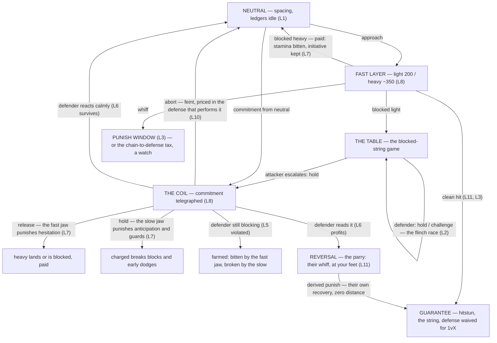

# Combat decision log

What was decided, why, and what is still open. Newest entries at the top.

This file records **reasoning**, not implementation. Code and Blueprints are the
authority on how things work and what the numbers currently are; entries here explain
why the shape is what it is, and stay true even after the code moves on. An entry is
never rewritten to match new code — a reversal gets a new entry that supersedes it.

Append an entry whenever a gameplay or combat choice is made that a future reader could
reasonably second-guess.

**The bar, raised 2026-08-11: does this record something the code cannot?** In practice that
means **what was rejected, and the mechanism by which it failed** — because code contains only
the winner. "We built an authored `IFrameSeconds` inside a longer dodge and dropped it", "we
authored per-branch commit rates and the windup rate carried through the release and halved the
light's active window", "we raised letting stamina go negative and rejected it": none of that is
recoverable from a codebase, and every one of them is a proposal somebody will make again.

If an entry would be equally true as a header comment, **write the header comment instead** —
code cannot drift from itself. Audited on the day this bar was set: 9 of the first 27 entries
cleared it; the rest explained the current design, which the codebase does better.

***Narrowed 2026-08-21 to WHAT only.*** That rule sent *rationale* into header comments as well,
and the comment debloat pass reversed that half: comments carry what a symbol is, does and
requires, and never why. So an entry stating what something does still belongs in the header — but
an entry explaining a choice, a rejected alternative or a failure belongs here and nowhere else,
and moving it into a comment is now a `comment-check` failure rather than a preference.

**How to read this file.** The sections above the first dated entry — **known traps**, the
**tuning map**, **what has been superseded**, **retired item numbers**, **retired names** and the
**symbol index** — are the working part, and they are short on purpose. The dated entries below are
an archive. Read the working sections when starting a slice; grep the entries when you want to know
*why* something is the shape it is. Do not read it front to back.

**Two of those sections answer the two questions anyone actually arrives with.** *"I am starting
slice X, what bites"* is the traps section, indexed by trigger. *"I am about to change symbol Y, what
was decided about it"* is the symbol index, and until 2026-08-14 there was nothing for it — you had
to already know which entry to grep.

**On the fact that it only grows.** Reviewed 2026-08-11 and kept deliberately. **The growth is
proportionate, not pathological** — a codebase accumulates decisions as it accumulates code, and
a file recording the ones worth keeping grows alongside it. A decision log that stopped growing
would mean the project had stopped being built. What has to stay bounded is the *working*
sections above, not the archive.

Compacting superseded entries was considered and rejected: supersessions are essentially always
*partial* — each kills one claim inside an entry whose other claims are still live — so stubbing
them would destroy current reasoning to save bytes nobody pays for. *(True of all seven when this
was decided 2026-08-11, and of all 38 as of 2026-08-14.)* The archive is reached by search, not
by reading, so its length costs approximately nothing, and git already holds anything that did
get removed. Length is not the risk here; **a stale claim that does not announce itself is**,
which is what the table below exists for.

---

## What has been superseded

A new entry says what it supersedes. The old entry does not say it has been gutted — so reading
one directly can hand you a dead number with full confidence. Check here before trusting any
dated entry. Add a row whenever an entry supersedes part of an older one.

**Sorted by the superseded entry's date**, so the check is a scan down one column to the date of
whatever you are reading rather than a search of the whole table. An entry with no row is clean;
an entry with several has been gutted several times, and they will be adjacent. *(Sorted 2026-08-14,
at 37 rows — it had been in the order rows were added, which is the order the corrections happened
and not the order anyone reads in. Keep it sorted when adding.)*

| This entry | …has a claim that is now wrong | Corrected by |
|---|---|---|
| 2026-08-09 — Ability input is routed by gameplay tag | block and parry will share one button | 2026-08-10 — The four questions gating defense |
| 2026-08-09 — Documentation: a decision log, not per-system design docs | "header comments in this codebase already carry local rationale well", so local rationale belongs in them | 2026-08-21 — Comments carry WHAT and HOW; WHY moves to Docs/ (the entry's primary claim survives untouched — per-system design docs are still rejected. Only the half sending *rationale* into header comments reversed: comments now carry what a symbol is, does and requires, and never why) |
| 2026-08-09 — One ability with three branches | `GA_LightAttack` is kept on disk as a fallback | 2026-08-10 — The `GA_LightAttack` fallback is removed |
| 2026-08-10 — Costs are paid, not required | exhaustion lasts a flat 4 s (`ExhaustionSeconds`) | 2026-08-10 — Exhaustion ends at full |
| 2026-08-10 — Exhaustion ends at full | recovery speed is one number, so `StaminaRegenPerSecond` *is* the exhaustion duration | 2026-08-14 — Exhaustion recovers at its own rate (the rate is split; exhaustion still ends at Max and nowhere else, so the entry's actual claim survives — what changed is which number sets how long it takes) |
| 2026-08-10 — Facing is camera-relative | locomotion ships from `SwordAndShieldAnimV1`, and mixing packs must be avoided | 2026-08-11 — V3 becomes the base stance (V1 reads as permanently guarding, and V1 has no `Hit`/`Death` clips so mixing was never avoidable) |
| 2026-08-10 — Facing is camera-relative | the stock ABP plays a forward run while strafing | corrected **inline** in that same entry — nothing was decided on it, so it was a factual error rather than a reversal |
| 2026-08-10 — Jumping is taxed in recovery | the jump's tail is half the defensive pause | 2026-08-10 — The defensive regen pause is 0.5 s |
| 2026-08-10 — No dodging in the air | once buffering exists the refusal should become a defer | 2026-08-11 — The input buffer remembers a press |
| 2026-08-10 — Sword and shield, rolls for every evade | every evade is a roll | 2026-08-10 — The evade is a dash, not a roll |
| 2026-08-10 — Sword and shield, rolls for every evade | the library has "no shield mesh at all" | **Never superseded by an entry — corrected in `Docs/Animation-Library.md`**, which records both the mesh (`Shield_Heater`) and why it was missed: it carries no `SM_` prefix, so a prefix-filtered search returned nothing. Found still uncorrected here by the 2026-08-12 audit. |
| 2026-08-10 — The dodge is 0.4 s, judged before it had an animation | if the rate reads fast-forwarded, the lever is "trimming the sections" | 2026-08-10 — Animations play whole (same day, and it names this as the advice it supersedes; the row was never added). The rule is now also in `CLAUDE.md`: fit the clip to the duration, change the duration if it feels wrong. |
| 2026-08-10 — The four questions gating defense | only *block* can cancel an attack's startup | 2026-08-10 — Costs are paid, not required |
| 2026-08-11 — Death cancels what exhaustion lets finish | *"a ragdoll, because inert and dead look identical... the directional `Death_<DIR>` clips belong to item 11 — and it is behind `bRagdollOnDeath` so that slice can switch it off"* — the ragdoll filed as a placeholder **for** those clips | 2026-08-24 — Death-full's presentation goes to physics and a state. The ragdoll **is** the treatment, given an impulse along the killer-to-victim bearing; the eight directional clips were never used. The flag stays, now as a tuning switch rather than a stand-in |
| 2026-08-11 — Dodge travel ships at the clips' authored distance | displacement comes from the montage's root motion, corrected per direction by MeasuredTravelCm | 2026-08-13 — The dodge stops reading displacement off its clips (both the scales and the measurements are deleted; all eight directions travel DodgeTargetDistanceCm) |
| 2026-08-11 — Dodge travel ships at the clips' authored distance | reach is unmeasurable because the trace follows `hand_r` and nobody knows where that socket is at the impact frame | 2026-08-12 — A hitbox is authored, not traced (reach is `MaxReachCm`, an authored number, so the dodge-versus-reach comparison is now simply readable) |
| 2026-08-11 — Dodge travel ships at the clips' authored distance | the eight directions agree, so one uniform scale is the right shape and no per-direction data is needed | 2026-08-11 — V3 becomes the base stance (true of V1's clips, false of V3's: spread 90.6 uu) |
| 2026-08-11 — PvP is the destination | *actually networking* is the final frontier, held with a stretch-goal mentality, and the prototype is not a failure if netcode proves too hard — verified-good was assumed reachable locally | 2026-08-15 — Netcode precedes Interplay (one local human makes the second player remote, so netcode is a prerequisite for the feel verdict; the kill-question is front-loaded into emulation instead of fallen back on) |
| 2026-08-11 — PvP is the destination | 14 network-unaware `SetTimer` sites | corrected **inline** in that same entry — the real figure is **2**; the count swept in Epic template code, debug timers, and one that must stay local |
| 2026-08-11 — PvP is the destination | `CLAUDE.md` still lists netcode as out of scope "and that stands" | corrected **inline** in that same entry, within the hour — the user withdrew the scope call once it was restated back to them |
| 2026-08-11 — The light is reactable at 250 ms | facing snaps on movement input and turns smoothly at rest | 2026-08-12 — Facing becomes one rate (one derived rate in all states, plus an idle rate) |
| 2026-08-11 — The light is reactable at 250 ms | prefer scaling root motion over code-driven movement; code is the exception to pay for knowingly | 2026-08-12 — Root motion scaling is not enough control (play says a multiplier only amplifies the animator's curve; the netcode reason survives and is answered by GAS root motion *sources*, not by hand-rolled movement) |
| 2026-08-11 — The training dummy gets the sword too | the blade's length is an authored number, `BladeLengthCm` | 2026-08-12 — A hitbox is authored, not traced (the *principle* survives and is why it generalised: authored beat mesh-derived, then authored volumes beat authored blades) |
| 2026-08-12 — A hitbox is authored, not traced | the hover is "cosmetic, filed rather than fixed" and shared by every *root-motion* montage | 2026-08-12 — The hover was six centimetres of mesh offset (it is shared by every pose, root motion irrelevant, and it is fixed) |
| 2026-08-12 — Attack displacement is two scales | displacement is two multipliers on the clip's root motion, and a branch can only differentiate the travel its clip performs after commit | 2026-08-12 — Lunge is two authored distances (both scales are deleted; displacement is authored in centimetres and the clip contributes nothing, so what a branch can differentiate no longer depends on the clip at all) |
| 2026-08-12 — Lunge is two authored distances | Lunge added two distances and **zero** timing values, because the boundaries it needed already existed — recorded as a virtue | 2026-08-13 — The gate is per tick, and lunge duration is a designed quantity (play found the lunge simultaneously too slow and too far, which is one fact: `ReleaseSeconds` was setting a movement feel) |
| 2026-08-12 — Lunge is two authored distances | `CoilTurnRateDegrees` is "600, the user's value" | **Not superseded — confirmed 2026-08-14 by reading the CDO.** `BP_PlayerCharacter` overrides the C++ 300 with **600**, so the entry was right and the code default was the misleading half. Kept as a row because the flag that stood here for a day is worth leaving visible: a C++ default disagreeing with an entry is not evidence the entry is wrong, and this is the case that demonstrates it. |
| 2026-08-12 — Lunge is two authored distances | reading facing during `PrepareRootMotion` "should replay correctly under prediction" is mechanism-level reasoning "since nothing here has run two machines" | 2026-08-15 — Two machines run for the first time. **The entry's conclusion stands and only its premise is stale**: two machines have now run, and that session was observational with no client input, so prediction replay is still unmeasured. Treat the reasoning as reasoning. |
| 2026-08-12 — Root motion scaling is not enough control | the likely answer is that Lunge takes `RootMotionScale` to 0 and owns displacement outright | 2026-08-12 — Lunge is two authored distances (taking the scale to 0 does **not** work: animation root motion suppresses root motion sources whether or not it is scaled, so the character stops moving entirely. The montage must carry no root motion) |
| 2026-08-12 — The attack montage hovers because it is bound to the wrong skeleton | the whole entry — the skeleton was never the cause | 2026-08-12 — The hover was six centimetres of mesh offset |
| 2026-08-12 — The facing unlock is asymmetrical with the lock | facing fades into and out of its lock, over 50 ms in and half of recovery out | 2026-08-12 — The real cause was an engine default (the fades were deleted the same day: any value below full authority disables the snap, so chained attacks never caught the camera) |
| 2026-08-12 — Two facing-fade bugs | the chained-attack sluggishness was caused by the fade suppressing the snap | 2026-08-12 — The real cause was an engine default (`bAllowPhysicsRotationDuringAnimRootMotion`; removing the fade did not move the bug) |
| 2026-08-13 — Target Lock | the aim half corrects by the *minimum sufficient angle*, never a snap to centre | 2026-08-13 — Target Lock's rotational half aims the lunge (minimum-sufficient was measured against the damage wedge and is therefore always zero; the deadzone that replaced it protected leading, which this game does not have) |
| 2026-08-13 — Target Lock | the aim half is **post-commit only**, because the windup is where the player steers | 2026-08-13 — Target Lock's rotational half aims the lunge (homing runs *through* the windup at the existing turn rate and stops at commit — the player's authority moves from facing to target selection, which is why the wedge is read from the camera) |
| 2026-08-13 — Target Lock | the clamp shortens the authored distance before the lunge starts | 2026-08-13 — The gate is per tick (pre-shortening bakes in a prediction; a retreating target became unreachable, which is worse than no system at all) |
| 2026-08-13 — Target Lock's rotational half aims the lunge | a 12.9° camera error arriving at commit as 0.0° is offered as the mechanism working | 2026-08-14 — The homing wedge follows the ladder (the measurement is real and unchanged, but it was taken on a light, where branch 0's wedge is the correct one — it says nothing about the heavy or charged, which is how the defect passed a play-verification) |
| 2026-08-13 — Target Lock's rotational half aims the lunge | reach is authored per branch — "author it longer in reach than the damage wedge", roughly this branch's lunge plus its damage reach | 2026-08-14 — Aim assist reach is derived (reach is no longer authorable at all; the struct has no reach field. Travel plus damage reach plus one shared `AimAssistMarginCm`, so the *estimate* in that entry was right and hand-authoring it was the mistake) |
| 2026-08-13 — Target Lock's rotational half aims the lunge | the wedge is per branch and *is* the contract — "aim inside it and the body ends at 0 degrees of error", authored per tier | 2026-08-14 — The homing wedge follows the ladder (it was per branch only at commit, while homing ran every tier on branch 0's; the heavy's and charged's values did nothing and had never been observed. The contract is real *after* this fix, not before it) |
| 2026-08-13 — The gate is per tick, and lunge duration is a designed quantity | the per-tick gate is the whole answer to a lunge arriving at a body — it "can only ever subtract travel", so the authored distance is the only ceiling needed | 2026-08-14 — The lunge stops on a hit (a pause is not a stop: the gate reopens when the body stops existing, so a killed target is slid through. The gate's own reasoning survives untouched — this is a second mechanism, not a correction to it) |
| 2026-08-14 — Aim assist reach is derived | the margin is 200, "signed off but unfelt" | **Played the same day and settled at 100**, giving reaches of 550/650/750. No entry supersedes it — the derivation and the margin's meaning are unchanged, only the number. `GA_Attack`'s CDO is authoritative; treat the 200 in that entry as a dated measurement. |
| 2026-08-14 — Block survives contact with play | `REFUSED` "now names the offending tags", offered as a fixed instrument | 2026-08-14 — The refusal trace lied about the tag doing the refusing (it named tags it merely *matched a parent of*, so it accused `State.Blocking.Committed` on every refusal thrown during any block — the feature was real, the tag set it printed was not. Fixed the same day by reversing the `Filter` direction; **the fix is unexercised in play**) |
| 2026-08-14 — Blockstun is the guard break's counterpart | blockstun "refuses offense and parry while leaving movement, dodging and the guard itself alone" | 2026-08-15 — Blockstun disables offense and never defense (the user's rule: **blockstun and parry never know about each other**. The parry clause was wrong from the spec's beginning and the code never implemented it — `GA_Attack` is and always was the only carrier of `State.Blockstun`. Everything else in that entry stands) |
| 2026-08-14 — Exhaustion recovers at its own rate | *"the attribute set cannot be written through the toolset ... so there is no automated path to a non-full bar"* | 2026-08-15 for the drain (`ETDDebugDefendMode` spends unattended), and 2026-08-27 for the claim's absolute form — `UAbilitySystemComponent::SetNumericAttributeBase` is public `UE_API`, so a direct setter is a build rather than an impossibility. The rate arithmetic the entry exists for is untouched |
| 2026-08-14 — The homing wedge follows the ladder | the three authored numbers are live placeholders to be authored by feel, and reaches must be kept non-decreasing by hand | 2026-08-14 — Aim assist reach is derived (same day: reach stopped being authored, so there is nothing to feel out per branch and monotonicity became unrepresentable. Only the margin is a feel number now) |
| 2026-08-14 — The lunge stops on a hit | the ~117 / ~175 / ~233 cm client-overtravel bounds are "bounded arithmetic, since nothing has ever run two machines" | 2026-08-15 — Two machines run for the first time. **Same shape as the row above**: the bounds are still arithmetic rather than measurement, because V2 drove no client input and tested nothing under latency. Only the premise clause is out of date. |
| 2026-08-15 — Netcode precedes Interplay | cites "the felt-table preamble" for why final feel waits on the megaslice | 2026-08-18 — The felt-numbers table is retired (the preamble's argument survives and is restated in that entry; only its location is gone) |
| 2026-08-15 — The Tuning Rig | the felt-numbers table takes provenance from the rig's log | 2026-08-18 — The felt-numbers table is retired (the table no longer exists; the rig instead *generates* the Interplay worklist, which is what it was approximating by hand) |
| 2026-08-16 — Knockback is a spacing reset | hard knockdown is **the charged's** distinction — "the charged's knockdown is hard, with fewer get-up options" | 2026-08-19 — Knockdown's plan session (the heavy also knocks down hard; the grade rule restates as *committed single hits knock down hard, the string's volume finisher normal*. Ruled at the plan's review; ships with Knockdown) |
| 2026-08-16 — Knockback is a spacing reset | the blocked hit is an active per-swing lateral deflection with no re-centring — written as the primary reading, with a surviving-offset alternative flagged | 2026-08-16 — The blocked reading, corrected by the veto it asked for (both readings were wrong: full centring identical to a clean hit, smaller backward distance — one mechanism, two authored spacings) |
| 2026-08-16 — Light String's plan session | the chain-on-whiff cost to the light's whiff-punish window is "named and accepted; Interplay judges it" | 2026-08-16 — Knockback is a spacing reset (the long-recovery redesign *converts* the window into the delay-and-bait game rather than accepting its loss; Interplay still judges the result) |
| 2026-08-16 — Light String's plan session | the buffer extension is **kept on probation** — "I will trust the vision for now, but it should be revisited once the game is more mature" — and the per-attack input window's vastness is deferred with it | **Both settled 2026-09-02, the probation having run its course.** The extension is **dropped outright**, not narrowed to chain-eligible attacks as the entry's third option proposed: the designer felt it as stray attacks arriving 1057–1163 ms after the press, and ruled that a false positive costs far more than a false negative. The window went from 1067 ms to 400. What the entry deferred was also **mis-stated** — it reads as deferring the whole window, and the knob the designer meant did not exist until that day; `ChainOpenDurationSeconds` carries the deferral now. |
| 2026-08-16 — Light String's plan session | the attacker's dial is "roughly 480–1350 ms", the chain-out span plus the link window after it | **Roughly 283–683 ms as of 2026-09-02**: the link window is retired and the chain span closes inside recovery. The delay-and-bait argument survives — still continuous, still a line — with about 30% less room to delay. |
| 2026-08-18 — A parry makes them whiff at your feet | a whiffed parry "pays a **defensive** lockout", and the parry is refused only while blocking, exhausted and inside the post-dodge gap | 2026-08-19 — Parry recovery commits you, then the lockout (two widenings the same day: the whiff's tail refuses **every** ability and holds the movement lock, and the commitment starts at the *press* rather than at window close, so the window refuses everything too. The pricing symmetry and the floor derivation are untouched — only what the price *buys* changed) |
| 2026-08-18 — A parry makes them whiff at your feet | the catch leaves the attacker at **zero centimetres**, the whiff-punish maximizer | 2026-08-28 — partially. The whiff is still manufactured at zero by `StopLunge`; a 93 cm recoil then carries them back over the lockout. Immaterial to whether a punish lands — a light reaches 550 — but they no longer *stand* at zero |
| 2026-08-18 — A parry makes them whiff at your feet | the post-dodge gap is "a derived ~150 ms" that stops a predictive dodge chaining into a parry covering the charged | 2026-08-25 — The windups move as a pair (the derivation was `charged − DodgeSeconds − light arrival` and it never closed the case, release not being instantaneous; `DodgeRecoverySeconds` retires to 0 and the chain stands as priced RPS) |
| 2026-08-18 — A parry makes them whiff at your feet | the reward is **derived** — the parried attacker rides their own attack into recovery, and an authored form exists only if play demands compensation | 2026-08-19 — Knockdown's plan session (the rework, locked at review: a catch **ends** the attack — its release was staying live against bystanders — and inflicts `State.ParryLockout`, duration derived as the swing's remaining planned total, so the per-tier punish survives inside the new structure. Ships with Knockdown's sub-slice E) |
| 2026-08-18 — The bespoke windup pass deprecates the coil | "the surviving invariant: the parry window must be ≥ the longest authored `ReleaseSeconds`" | 2026-08-19 — Knockdown's plan session (the floor retires with the parry rework — it bought tell-timing sufficiency, a forgiveness guarantee rather than correctness, at the price of capping every release; the designer's prior-art argument. The window keeps only the anti-option-select ceiling; the tuning-map row updates when the rework ships) |
| 2026-08-18 — The bespoke windup pass deprecates the coil | the blend windows are stated against the coil's start — "350 ms light→heavy (0.150 → 0.500)" | 2026-08-25 — The windups move as a pair (reactability is measured from the **light's arrival** at 200, not the coil's start at 150; every coil-referenced window was 50 ms wide of the mark) |
| 2026-08-18 — The ladder re-poles: rapid heavy | the heavy arrives at 350 and "that shortening is the point rather than a side effect" | 2026-08-25 — The windups move as a pair (400 now, partly walking the shortening back: at a 150 ms window the heavy sat below the reaction figure outright, and 200 puts it exactly on it. The fast/slow poling the entry argues for survives) |
| 2026-08-19 — Knockdown's plan session | `KnockdownSpacingCm` 450 is justified as "a full light's coverage of separation" | 2026-08-20 — measured against the ladder: the light covers **410**, so 450 is *past* its full coverage and the light must walk the last 40 cm. The heavy (510) and charged (610) lunge it. The three-way split is intended and now recorded in the tuning map as a five-number coupling |
| 2026-08-19 — Knockdown's plan session | the parry lockout's duration is **derived** as the swing's remaining planned total, "so the per-tier punish survives inside the new structure" | 2026-08-20 — The parry lockout is authored (it never survived: a catch only lands once the hitbox is live, so the windup always cancelled out and what remained was `Release + Recovery` — 0.75 / 0.65 / 0.75 across the ladder, measured at light **0.736** n=14 and heavy **0.636** n=15. The derivation retired in favour of an authored `ParryLockoutSeconds` per branch and swing, seeded at those values; `ParryLockoutFloorSeconds` retired unused) |
| 2026-08-19 — The instrument finding: one refusal now shadows the other | the shadowing is "a finding rather than laziness", an accepted property to assert around | 2026-08-19 — `State.Parrying` marks the window, not the ability that opens it (same day, on the designer's question: it was a **defect**, not a property. The tag rode in GA_Parry's ActivationOwnedTags and re-scoped itself when the ability began outliving the window. The superseded subsection is left standing deliberately — its reasoning is the trap it describes) |
| 2026-08-19 — The parry recovery commits you | *“the two parry tails forbid very different things and are both recoveries”* reads as though parry has **two** recoveries | 2026-08-24 — it never did, and the phrasing went stale the same day it was written. The two tails shared `State.ParryRecovery` until that session split them; the half that *refuses parry only* became **`State.DodgeRecovery`** and stopped being a parry state at all. Parry has exactly one recovery, the whiff's. A success has none — only Grace's 150 ms tail, which aids rather than restricts. Misread once, by an assistant, straight off this sentence |
| 2026-08-19 — The parry recovery commits you | `State.ParryLockout` is reserved and unused, pending the derived reward proving under-authored | 2026-08-19 — Knockdown's plan session (proven as predicted: the reservation resolves and the tag goes live as the parried attacker's state, with Knockdown's sub-slice E) |
| 2026-08-22 — The get-up attack is authored in Cascadeur | the designer's polish precedes F shipping — the plan's gate, and the ship-with-the-polished-clip-or-not-at-all bundle rule that rode on it | 2026-08-24 — The verification bar (F ships on the rough, which meets functionality-plus-legibility; the polish is Polish's work; the authoring route and the endpoint argument are untouched) |
| 2026-08-24 — The flinch is a state, not a montage | **"a state is not rate-fitted to a duration"**, so a 1.333 s clip against a 0.55 s stun is not a fitting problem | 2026-08-25 — The stun tells are positioned by stun progress (true of a state that merely plays; the tell is now held at rate zero and its playhead written each update, which fits *and* restarts it without the state re-entering. The rest of that entry stands) |
| 2026-08-24 — The parry handed movement back | the structural fix "was declined rather than missed", and **two** hand-orderings hold the hazard shut | 2026-08-24 — The parry lockout stops sharing the movement bool (same day, on the designer's call: its first step was taken, so one hand-ordering is gone and the decline now covers only the ability-side residue) |
| 2026-08-24 — The parry handed movement back | the tooling finding — `AssetTools`' `exists`, `is_dirty`, `get_asset_class` and named `save_assets` "now answer *Asset does not exist*", read as a regression against the 2026-08-21 bullet | **Not a regression, and the wrapper was never the variable.** Isolated at closedown the same day to **PIE being up**: all four answer correctly the moment it stops, and `EditorAssetLibrary.does_asset_exist` behaves identically through `run-in-editor.py` — `False` for five paths including the loaded level, `True` for all five with PIE stopped. The 08-21 bullet stands, the named save was never broken, and the empty-list save that carried the level-save trap was never necessary. Corrected form in `Docs/Working-In-Unreal.md` |
| 2026-08-24 — The parry lockout stops sharing the movement bool | *"verified by compile and by inspection, not by play"* | Confirmed in play by the designer the same day, so the change is proven rather than merely reasoned. **Nothing automated changed** — `SetAbilityMovementLocked` still has no instrument, and the trap's standing-record clause stands untouched |
| 2026-08-25 — The get-up roll aims itself | the roll **snaps** to its heading at activation | 2026-08-25 — The get-up roll turns into its heading (same day: a snap gives an observer a static pose to re-read, where a turn gives motion to track, so the heading reads earlier. Possible only once the travel direction stopped being derived from facing every tick) |
| 2026-08-25 — The knockdown fall parks at 0.6 | the asset ceiling: *"0.45 s is all the natural-speed motion this clip contains"* and *"duration and landing speed cannot both be had from this asset at a constant rate"* | 2026-08-28 — The fall's cushion goes to the engine's own time-stretch curve (true of a **constant rate**, not of the asset — `AM_Knockdown`'s own `TimeStretchCurve` holds the fall at **1.000x** while the gather and cushion absorb the compression, and the parked 0.6 carry settled at **0.5**) |
| 2026-08-25 — The knockdown fall stops being a snap | `KnockdownFallSeconds` at **0.9** fitting the **whole** clip, and *"fall lands inside lockout"* comparing **`want=`** against `lockout=` | 2026-08-25 — The fall's carry and its clip stop being one number (same day: the clip's last 0.10 s is a settle, so fitting all of it spent the settle as travel. Carry is now 0.8 against a 0.8 portion, and the guard reads `played / rate`, which the carry no longer bounds. The raise itself and its reasoning stand) |
| 2026-08-25 — The knockdown fall's remaining fault is its time curve | the values it shipped: carry **0.45** with `KnockdownFallClipStartSeconds` at **0.35** | 2026-08-25 — The knockdown fall parks at 0.6 (same day, the designer calling a halt: the offset alone trades the gather for a longer flat tail, so it ships at 0.0 and the carry returns to 0.6. **The entry's findings all stand** — the cushion, the flat-before-landing, the 0.45 s ceiling — only its shipped values moved) |
| 2026-08-25 — The stun tells are positioned by stun progress | the sequence player is held at **rate zero**, called "load-bearing and not merely tidy" | 2026-08-28 — The recoil ships, and the rate-zero hold had never worked. `SetPlayRate(0)` was refused every frame from the day it shipped; the rate was 1.0 throughout. The mechanism the entry describes is now true for the first time, and the entry is right about why it matters |
| 2026-09-01 — Escalation blends out of all three lights, and the spin is the easy one | the 1 ms elapsed shortfall under populated sockets is the fixture's, and the elapsed bands would want re-deriving rather than the code fixing | 2026-09-02 — Every position authors its tiers, the hand-off goes inertial, and the blend-out boundary was in play time all along |

---

## Known traps, indexed by what sets them off

Latent defects and unverified assumptions in code that **already exists**, each filed against
the slice that makes it bite. Re-read this when starting that slice, not at session start — a
flat list read once is forgotten by the time it matters. That re-read is a step in `CLAUDE.md`'s
working loop rather than a request made here, because asking politely did not work: a trap
discharged during Attack Swap sat filed for a day and was found by a documentation audit.

These are not design questions. Nothing here needs play to settle; they need checking.

**Discharge a trap in the same commit that fixes it.** This section is the most load-bearing part
of the file and the only one with no natural expiry: a trap fixed by someone not reading this file
stays here and misdirects the next person, which is worse than never having filed it. Say what
discharged it and keep anything from it that is still true. Removing a trap silently is the one
edit here that cannot be reviewed, because nothing is left to review.

**Whenever a heavy ends on its contact — *the wall clock's blended-out heavy.*** Filed 2026-09-03
from the canary, run `0903-164116`, `tier-heavy`: the third of eight heavies ended at its hit, at
0.417 s of its 1.050, with its montage reporting `OnBlendOut pos=0.0000 playing=0` on the contact
tick and its release-end notify reading `pos=-1.0000` after it; the other seven ran their full
total. Never seen on the fixed clock, where every heavy in every run ends at 1.050, and not seen
in the canary run before it; **0 of 40 in five wall-clock reruns the same hour**, every one ending
between 1.049 and 1.060, so the odds stand at 1 in 48. The evidence is the slice; the cause is not
established, and nothing was changed for it. The weekly canary keeps sampling it. Read a wall-clock
heavy that ends short as this until an entry says otherwise.

**Whenever the matrix is read as covering a mechanic — *what Phase 2 did not reach.*** Filed
2026-09-03, narrowed the same day by the designer's rulings. The full real-time matrix ran the same
day (rulings entry) and runs on the designer's weekly schedule rather than at closedowns. The height band below the attacker is
**discharged by ruling**: symmetric by construction, not worth a probe. The parry lockout of chained
heavy and charged cells (1/1, 1/2, 2/1, 2/2) needs a second scripted pawn and **goes to Netcode's
brief**. Jump as a get-up option was **already covered**, `knockdown-getup-held-normal` holding jump
and asserting the stand; the filing was wrong. What remains filed here: the four chained cells, and
No row is red for the game as of the rulings entry: the Phase 2 entry's two reds and the airborne
buffering were fixed the same day. A red in the matrix is a regression until an entry says otherwise.

**~~Whenever a green matrix is read as coverage — *the audit rebuilt the loop and added none.*~~ —
DISCHARGED 2026-09-03**, the same day, by Phase 2's fifty scripted rows: every mechanic the list
below names has a row. Filed 2026-09-03 at the end of Phase 1. The mechanism is new — fixed clock, scripted player,
mutations, golden traces, a universal set — and **the 38 rows are the same 38 as before**. Every
mechanic the audit plan's §5 named is still unasserted: the nine tier cells (H2,
H3, C2 and C3 have never been asserted on release timing at all), the eight dodge directions and
i-frames, held get-up inputs, acceptance in hitstun / blockstun / parry lockout, block and parry
facing, movement locks, the eleven boundary probes, the two-attacker rows, the geometry edges.
**The trap is that the loop now looks thorough.** Read §5 before believing it covers a mechanic.

**~~Two reds stand undiagnosed and block a push as correctness items~~ — DISCHARGED 2026-09-03**,
both instrument-side: `dodge-cycle`'s extra `DODGE RECOVERY` lines were the checker counting the
`END` variant, and `knockdown-getup-attack`'s 1.300 was the band reading a total that lands 0 to
+3 f over by frame quantisation, now `BAND_ELAPSED_MAX` 0.050. Filed 2026-09-03 at Phase 1's end as
`dodge-cycle`'s three `DODGE RECOVERY` lines against a retired gap and a `DodgeRecoverySeconds` of
0, and `knockdown-getup-attack`'s 1.300 total on 2 of 8 samples against [1.250, 1.285].

**Before clearing the master's `compatibleSkeletons` entry — it is the only one left, and it is
load-bearing.** Filed 2026-08-24 from the skeleton audit, **narrowed the same day when Skeleton
Merge shipped**. The original claim — that SwordShield's list carried the knockdown get-ups — is
**discharged**: `AM_Rise`, `AM_KipUp` and `AM_RiseHard` are on `SK_Master` now, with the clips they
play, so no cross-skeleton hop is involved in a get-up at all. What replaces it is smaller and
sharper. `SKM_Manny` is on the master, **79 assets the game plays are still on SwordShield's
skeleton** — every attack, dodge, parry and knockdown montage, the locomotion and block blend
spaces, and `ABP_Manny_PostProcess` — and they reach the mesh through **one entry**: the master
lists SwordShield. **Clear it and combat loses its animation while the state machine keeps running.**
The tell is unchanged, and there is now an instrument for it: `Montage_Play`'s return is logged as
`played=` on the `KNOCKDOWN MONTAGE` and `PARRY MONTAGE` trace lines, and a refusal raises an
ungated warning naming the skeleton as the likely cause. **Pruning the 1023 unused vendor clips is
what would remove the entry**; nothing else does.

**Sockets: discharged 2026-08-24 by the merge**, and evicted to that day's entry with the master's twelve enumerated there. **The correction outlives it**: the recorded reason those sets were unmeasurable was wrong — a mesh *was* bound, but `get_all_socket_names()` resolves through the **mesh's** skeleton, so every one answered with SwordShield's six. Corrected in `Docs/Animation-Library.md`.

**Each trap is trigger, live claim, and status.** The arguments and the evidence live in the dated
entries; the hunts that produced them live in git. *(Compressed 2026-08-14 from 534 lines, which
was long enough that the section asking most to be re-read had become the hardest to. No trap was
removed. Two general-form lessons that lived only here — the assumed control, and measuring travel
against an assumed position — moved to `Docs/Working-In-Unreal.md`, where the rest of that family
already lives.)*

---

**Death's coverage trap: discharged 2026-08-24**, and evicted to that day's entry. **The lesson outlives it**: `bVelChange` does not change the impulse number, it changes what the number *means*, so the observable had to be the settle distance rather than the input — a magnitude alone would not have caught the failure that matters.

**The flinch state is covered by precedent rather than owed.** The loop has never asserted an
*animation state* for anything, blockstun included — it asserts the mechanic that drives one, and
`s4-string` already asserts hitstun's spans at 0.550 ±20 ms. A state that fails to enter is the same
class of invisible failure as a montage that fails to play, and the `played=` field is the shape a
fix would take if it is ever wanted.

**Before the next documentation audit — *nothing mechanical compares two docs for contradicting
instructions.*** None of `docs-check`'s checks does this. The 2026-08-21 audit
found three by hand: `Closing-Down` instructed the exact `save_assets` call `Working-In-Unreal`
says creates the stale-override trap, and that call sat in a third place inside `Working-In-Unreal`
itself; `Toolset-Snapshot.tsv` told you to diff the registry "at session start" after that trigger
had moved. A cross-doc token index catches the shape — the same tool call named in two files with
different advice — but the one built that day compared occurrences *between* documents and was
blind to two occurrences *within* one, which is how the third instance survived it. **The
always-read duplication check is not this**: identical text is the easy case, and contradicting
text shares no shingles at all.

**Whenever a belief is corrected mid-session — *the correction lands in one doc while the doc that
acted on the wrong belief keeps it.*** Filed 2026-08-27. On 2026-08-24 an assistant twice concluded
blockstun had no tell: `find Content -iname "*lockstun*"` matches no asset, because a Locomotion
**state** has none to match. The designer corrected it and the lesson went into
`Docs/Working-In-Unreal.md`. **The Polish brief, written the same day from the uncorrected belief,
kept it** — *"one is built and one remains"*, plus build instructions for a state that had existed
since 2026-08-15 — and it survived four days, a closedown audit, and its own citation: the commit
it named for deleting `AM_Blockstun`, `eb658ee`, is titled *"Blockstun becomes a state"*. **The cost
is that it then misled the session that picked Polish up**, which is what a brief exists to avoid.
**The general form: a correction is not filed until every doc that acted on the error has been
checked**, and the likeliest one is whatever was written the same day. The cheap sweep is grepping
the wrong belief's *subject* across `Docs/` before writing the correction down. Nothing mechanical
catches it — the trap above is why.

**Before the reach/travel/spacing pass — *reach, travel and the placed spacing are one felt
quantity and none of them is authored yet.*** The oldest live trap, filed at Attack Swap and
re-shaped three times since. **Everything mechanical about it is discharged; what remains is
design.** The clamp works, hit detection works, and the ladder connects at the placed 200 cm —
re-measured 2026-08-14 with damage in exact multiples and `TARGET release` at 118.7 / 117.1 /
123.0 cm against the 124 the geometry predicts. What is open is **what the authored distances
should be**, given the clamp is what decides them at close range and two tiers still play the
light's clip. **The pass has a home as of 2026-08-18: the Tuning Rig's greening** (the
hypothesis-dataset entry), golded at Interplay.

Two withdrawn readings, recorded so nobody re-derives them: the *overshoot* this trap described
before 2026-08-13 cannot occur now, and the *"branch lunge clamped 200 → 0 every time"* reading
that replaced it was an instrument fault, not a finding. Both are in the dated entries.

**~~Before tuning `ParryStaminaReward` — the +25 has never been observed landing~~ — DISCHARGED 2026-08-18**, same day, by the designer pointing out that the parrier can simply be made to spend first. **Evicted to that day's entry**, which carries the arithmetic and the fixture. The obstacle was real — a parry costs no stamina, so an unattended parrier's bar never leaves 100 and the clamp eats the reward — but the conclusion drawn from it, that no fixture *could* drain a parrier, was wrong.

**The general lesson, which is why this stays after discharging: "no fixture can produce X" is a
claim about imagination, not about the fixture set.** The knobs were all present; nobody had
composed two of them. The arithmetic that makes it work is worth keeping — raising a guard costs 10
and holding drains 10/s, so four seconds spends 50, while regen at 40/s refills past the clamp
threshold about 1.1 s after the guard drops. **The parry therefore has to be tapped immediately
after the release**, which is why the fixture drops the guard and presses a frame later rather than
in the same frame.

**`s5-parry` still asserts the clamp rather than the magnitude**, deliberately — its parrier never
spends, so its samples are legitimately 0.0, and the two scenarios assert different halves.

**~~Whenever a scenario needs the attacker dummy to defend — `BP_TrainingDummy_C_0` cannot~~ —
DISCHARGED 2026-08-18** by re-placing the actor, in the same package that filed it. The silence it
exploited is now instrumented, which is the part worth keeping.

What it was: the placed attacker held stale per-instance overrides from before its Blueprint
authored them — `defaultAbilities` reading **`[GA_Attack]`** against a CDO carrying four, and
`debugDefendBlockInputTag` / `debugDefendDodgeInputTag` both **None**. It could attack and nothing
else. Found while building `s5-cancel`, which pressed block on schedule and produced no block
input, no refusal and no warning of any kind.

**Two findings survive the fix.** *New properties inherit correctly; only ones that existed at
serialization time go stale* — `debugDefendParryInputTag`, added the same day, read `InputTag.Parry`
off the CDO without trouble while its two older siblings read None. The damage is always confined
to the past, which is exactly what hides it: the thing you just added works. And *`set_properties`
on an `EditDefaultsOnly` property of an instance is refused* — re-tested 2026-08-18, still
refused — so delete-and-re-place stays the only route, and **it moves the actor's internal name**:
the attacker is `BP_TrainingDummy_C_2` now, `_C_0` from 2026-08-14, `_C_1` before that. Any doc
naming it is a snapshot, so check with `find_actors` rather than trusting one.

**The prevention is `ATDCombatCharacter::WarnOnStaleInstanceOverrides`**, run at `BeginPlay`. It
compares the instance against its own CDO and emits an ungated `LogTDCombatTiming` warning naming
the property, both values and the remedy. **It deliberately cannot repair anything** — the values
are unwritable from there, and a silent repair would hide the divergence from the person who has to
act on it. **Proven by making it fire**, the defender's dodge tag cleared on purpose and the warning
naming it precisely. The exhaustive version is a whole-instance diff against the CDO, scriptable
through `ProgrammaticToolset`; the re-placed attacker returns **zero** value overrides across 164
properties, against three before.

**Blockstun's clip: discharged 2026-08-25**, and evicted to that day's entry. **The two corrections outlive it**: an earlier filing named clips that carry the same bad root-motion pair but are *not* what the state plays — **clip identity is read off the sequence player, never guessed from a name** — and the claim that it could not be saved from any scripting surface was wrong, the route being in `Docs/Working-In-Unreal.md` with C++ never needed.

**The stun tells: discharged 2026-08-25** by positioning both playheads from stun progress instead of playing them at a rate — see the dated entry. Only a string's first hit used to be told, because the tell is a state entered on a cached bool and a hit landing inside a running stun re-enters nothing.

**Whenever a tier montage, a cell or a hand-off blend changes — *nothing in the loop sees a
hand-off's look.*** Filed 2026-09-02, **narrowed 2026-09-03**: the first half, that no row throws a
heavy or charged from light 2 or light 3, was discharged by Phase 2's `tier-cells`, which throws all
nine cells from the player's own presses and asserts each on release timing, total, escalation,
commit and montage. What stands: the look has no assertion by the 2026-09-01 ruling; the chart's
roughness figure (`Tools/ClipScan/ue_chart_ab.py`) is the standing instrument for it, run by hand,
and a hand-off that regresses silently passes every row.

**Whenever a Release Window notify is moved — *the socket's entry and release do not follow, and
nothing says so.*** Filed 2026-09-01. `EntrySeconds` is derived as `notify - window`, but it is
stored rather than computed, so authoring a notify desynchronises it silently. **The failure is a
play-rate distortion, not an error**: the runway becomes `notify - stale entry`, and the hold rate
is that over the window. Measured across three heavies whose notifies had been re-authored — rates
of 0.88, 0.57 and 0.49 against an intended 1.000 — and the designer's independent read ranked their
severity in exactly that order, from *"behaves as expected"* through *"slight hitch"* to *"the
rewind is still there"*. **A distortion this size reads as a blend fault**, which is what it was
mistaken for through several rounds of tuning the wrong variable. **Three are live as of 2026-09-03** —
swing 1 by 55.7 ms, swing 2 by 40.0, the get-up attack by 35.2 — found by the new loop's
engine-warning check on its first run. **The ungated warning had been saying so all along** and
nothing read it, the checker's slice keeping the trace and dropping every engine line. Values,
reason and the re-derivation are in `Tools/RegressionCheck/log-allowlist.txt`, where they are
allowlisted rather than fixed. Re-derive after every notify edit. **A notify closer to the clip's start than the window forces a negative entry**, clamped to
0, which costs runway and leaves the rate under 1 — and enters the clip at its rest pose, which is
what made the first H1 read poorly. **The re-derivation is scripted** *(2026-09-02)*:
`Tools/AnimPipeline/ue_fit_tier_montages.py` places the window from its JSON and
`Tools/ValuesSnapshot/ue_seed_cells.py`'s overrides write the cell's entry and release from the same
numbers; a notify moved by hand in the editor still needs both re-run.

**~~Whenever a tier socket's clip is chosen — *recovery is paced against whatever montage is playing,
and the elapsed bands were derived against the light's.*~~ — DISCHARGED 2026-09-02.** The shortfall
was the code, not the bands: an authored `BlendOutTriggerTime` was modelled as a fixed montage
position while the engine scales it by the play rate. **Evicted to that day's entry**, which carries
the measurement and the corrected model. **The lesson that outlives it**: the expectation was that
the *bands* would want re-deriving, and it was the model underneath them that was wrong — a shortfall
*below* an authored floor is the direction frame quantisation cannot explain, so rule the code out
before assuming the band.

**~~Whenever `s5-parry`'s lockout band is trusted — *it never covered the string ender.*~~ —
DISCHARGED 2026-09-03** by `parry-lockout-light`, which blocks the first two lights and parries the
ender: its lockout is announced and ends at the authored 0.9725, 2 of 2. Filed 2026-08-28. `BAND_PARRY_LOCKOUT_LIGHT` is [0.725, 0.775], which admits the branches' 0.75 and excludes
`string_swings[1]`'s authored **0.9725**. Every earlier run passed because the fixture caught swing 0
and a string ender was never parried; an isolated fixture reaches it and the assertion reads
*"outside [0.725,0.775]s: 0.973"*. **Not widened, deliberately** — patching a band to green is what
this project forbids, and the right fix is a per-tier assertion rather than one range stretched over
a spread it was never derived against.

**Whenever any of the three tells is changed — *no instrument **we built** can see it, and the loop never could.*** **Corrected 2026-08-28: the engine's own log could see it all along.** `SetPlayRate(0)` was refused every frame from the day the tells shipped, logging *"value is not dynamic"* 3,207 to 14,294 times per session, and nobody read the log for anything but combat tags — through a full audit of this subsystem included. **Before trusting any "no instrument" claim, grep the raw log for warnings, not just for trace tags.** Filed 2026-08-25; **widened 2026-08-27 to three when the parry recoil joined hitstun and blockstun**, built the same way and equally invisible. One thing did improve: `GetParryLockoutTellTime()` is `BlueprintPure`, so a *sampled* tell time is scriptable from Python during PIE — it was watched climbing 0.025 → 0.322 across a live lockout. **That proves the character's half, never the anim graph's**; whether the clip draws still needs an eye or a screenshot. `HITSTUN` and `BLOCKSTUN` already fire per hit and their spans are asserted by `s4-string` and `s4-block`, so **every existing assertion stays green whether the tell draws or not** — what changed is cosmetic by construction and the loop asserts mechanics. The chain is verified structurally as far as the compile (the binding persists in `ABP_Combat.uasset`; `ValidateFunctionRef` raises no error, and that error is exactly what an unresolvable reference produces), and **confirmed in play the same day** — the designer judged both tells correct, which nothing but a running `UTDAnimTellTools::DriveTell` produces. **That confirmation does not transfer.** It was a person looking once; the cheapest standing instrument would be an anim-side trace, which is graph work nobody has costed. A silent regression here — a rebind lost to a recompile, a renamed function — would look exactly like nothing, and every scenario would still print green. **Widened 2026-08-28 to the pacing curve**: `HitstunTellPacingCurve` is optional and **null means linear**, so losing the reference does not warn, does not fail, and restores the exact skating it was authored to remove. `C_KnockbackPacing` is derived against it and would then be pacing the capsule against a clip that no longer moves when it thinks it does. **Check the wiring, not just the spans** — `s4-string` stays 7/7 either way.

**Whenever an authored duration is asserted against a log — *the value it lands on is partly the test machine's frame rate.*** The release window closes on the first tick at or past its deadline, so every ability's total carries the distance from that deadline to the next tick: nil at 60 fps where 150 ms is exactly nine frames, +17 ms at 30. **`s6-getup` is where this bit first** — one sample in twelve past an elapsed ceiling, read as a flake until the sweep showed it scaling with frame time. Weakened rather than discharged by the 2026-08-25 fix: the overrun no longer *grows* without bound and the damaging span never exceeds its authored length, but a band derived on one machine still encodes that machine's frame time. **Re-derive an elapsed band from measurement on the machine that will run it**, and treat a single sample past a ceiling as a question about frame time before a question about combat.

**Before the charged or heavy gets its own clip** — *the coil is a freeze, measured rather than
predicted.* `rate=0.049` to `0.097` across ~40 throws, mean ~0.072: the montage advances at 5–10%
speed for the whole coil. Nothing is broken by it and no warning fires. **It is the concrete
argument for bespoke clips** — a longer clip with a later damage point is the only thing that gives
the coil somewhere to live. The 2× spread between throws is itself the diagnosis; see the
2026-08-12 entry.

**Whenever the light's `HoldUntilSeconds` changes** — *`TurnRateDegrees` is derived from it and
nothing enforces the link.* 180° ÷ the light's commit time is the slowest rate that always brings
facing round before the wedge freezes. Move the commit and the guarantee lapses **silently** —
attacks start committing partway through a turn, invisible without the `FACING LOCK` trace, and
measured at 71% of flick-attacks landing outside their own wedge before it was found. Recompute
both together.

That value has **three** dependents now: where the tiers become distinguishable, how long the base
lunge runs, and the turn rate. The first two are derived in code and safe. **The turn rate is the
one still copied by hand.**

**Whenever an attack montage is swapped, or any new ability drives a root motion source** —
*animation root motion suppresses root motion sources completely, and scaling it to zero does not
help.* `PerformMovement` guards on `if (HasAnimRootMotion())`, which stays true whatever
`SetAnimRootMotionTranslationScale` is set to. So a montage carrying root motion produces **zero**
lunge, not a doubled one. `AM_Attack` plays the `_IP` clip for this reason.

Worth a trap rather than a comment because **the failure is silent and the obvious remedy is the
wrong one** — zeroing the animation's contribution is what everyone tries first and it produces a
character that does not move at all. **Enforced in code:** `StartAttackMontage` logs an ungated
warning when the montage has root motion and a lunge distance is non-zero. Trust the warning over
this paragraph.

**Confirmed 2026-08-14 rather than assumed:** `AM_Attack`'s only segment is the `_IP` clip
(0.967 s, play rate 1). The `_RM` form is *also* an asset-registry dependency, which read as
suspicious and is not — the montage was built on `_RM` at `6bfbb73` and swapped to `_IP` by the
Lunge slice at `9e4743b`, and the import outlived the swap. **Stale residue, nothing live points
at it**, and no readable property on the montage does either. It will drop itself the next time
the montage is edited and saved for any reason; it is not worth a resave of its own.

**Chain-to-defense is live today and is a watch, not a defect** *(filed 2026-08-18 at the parry
plan)*. A whiffed chain-eligible light can chain-press and cancel the new swing into a defensive
action inside its [0, 150) startup, converting ~950 ms of whiff exposure into ~500 ms plus 10
stamina, a guard commitment, and initiative handed over. It bends recovery-as-the-punish-window
into "the punish, or the defensive-cancel tax" — a favourable RPS position rather than an escape,
answerable by the flinch race and by heavy-on-block. Accepted eyes-open per the 08-16 whiff-chain
precedent, **same recorded fallback: a contact gate on chain-out kills both behaviours in one
condition.** Interplay judges; do not fix on paper.

**~~Before Interplay's buffer subslice — *the buffer extension lets you queue an attack ahead
through a heavy or charged, and nobody chose that.*~~ — DISCHARGED 2026-09-02** by dropping the
extension outright. **Evicted to the 2026-09-02 entry**, which carries the measurements, the
designer's reasoning and what the original filing missed: light 3 had the identical property, was
never named here, and at 1.18 s beat the heavy this trap did name. **The lesson that outlives it**:
the trap was reviewed at length and reasoned about correctly for the case it named, but nobody
measured it, and the widest case went unrecorded for two weeks.

**Whenever a `UPROPERTY` is renamed — *Blueprint-authored values are orphaned, and the properties
cheapest to verify are exactly the ones that cannot break.*** Filed 2026-08-24, from the knockdown
vocabulary rename, found by the designer in play rather than by any check.

Renaming a reflected property drops whatever a Blueprint stored against the old name; the value
falls back to the C++ default. **The trap is the verification, not the rename.** Seven knockdown
timing properties were read off `BP_PlayerCharacter`'s CDO after the rename and all seven were
correct — because every one already equalled its C++ default, so losing an override landed on the
same number. That proved nothing, and it was generalised into a claim about the whole rename.

**What actually broke was the authored data**: `KnockdownType` on every branch and swing of the day
(today `FTDAttackCell::KnockdownType`), authored in `GA_Attack` as heavy **Hard**, charged **Hard**, ender
**Normal**, all three silently reverted to **None**. Nothing in the game knocked down. Restored by
writing both arrays whole and restarting; verified back through Python rather than the toolset that
wrote them.

**The general form, which is why this stays filed: a rename audit must enumerate the properties
whose values *differ* from their defaults, which is the opposite of the set that is cheap to
check.** A property matching its default is invulnerable to the rename and tells you nothing; a
property someone authored is the only kind that can break. **Struct members inside arrays are where
authored data hides** — they do not appear in a CDO property listing the way scalars do, and both
casualties here were array elements.

**Whenever an ability overrides `ActivateAbility` without calling its immediate `Super` — *it
inherits none of that base's per-activation resets, and nothing will tell you which ones
mattered.*** Filed 2026-08-24, from the parry-disables-chaining defect; the dated entry has the
hunt.

Two classes do this today and both are deliberate. `UTDChargedAttackAbility` calls
`UTDGameplayAbility::ActivateAbility` because the melee base traces immediately while the branch,
and so the trace radius, is unknown until commit. `UTDGetUpAttackAbility` calls the same grandparent
because the base lunges and plays at rate 1. **Both skip `bParried = false`, and only one of them
noticed** — the get-up attack sets it explicitly, the charged did not, and a parry silently ended
chaining for the rest of the session.

**The hazard is any state whose lifetime is a *swing* living on an instance whose lifetime is a
*pawn*.** Attack abilities are `InstancedPerActor`, so one object serves every swing a character
ever throws; a flag left standing outlives the thing it described. The compiler is no help — a
skipped reset is a call that was never made, not a call that failed.

**The check when adding a bypass, or a field:** diff the bypassed base's `ActivateAbility` against
the override and account for **every** line, separating deliberate behavioural differences from
state hygiene that should have been carried across. `bParried` was the only reset dropped in the
charged case; the base's other three actions were intentional.

**Whenever a new ability takes `bLocksMovement`, or an existing holder learns to overlap another —
*the lock is a bool, and two holders cannot share it.*** Filed 2026-08-24, from the parry-cancel
defect; the dated entry has the mechanism. `bAbilityMovementLocked` on `ATheDreamCharacter` is a
plain bool, and `UTDGameplayAbility::EndAbility` releases it guarded on the per-instance
`bTookMovementLock` — *"did **I** take this"*, which is the right question only while one ability
holds the lock at a time. Whichever holder ends first hands movement back for both.

**Four abilities hold it today** — `GA_Attack`, `GA_Dodge`, `GA_Parry` and `GA_GetUpAttack`, each
CDO-verified 2026-08-24; `GA_Block` deliberately takes none and `GA_Jump` authors no displacement.
**The lock has two caller classes, not three**: abilities, paired around their own lifetime, and the
on-hit waiver, which is a release with no matching take. **The parry lockout left on 2026-08-24** —
it is a replicated state like hitstun, the guard break and knockdown, and now joins them in
`ATDCombatCharacter::IsMovementLocked`'s OR instead of writing the shared bool. That discharged half
of this trap: the ordering in `UTDMeleeAttackAbility`'s catch path stopped being load-bearing, and a
latent release-side instance went with it — `ClearParryLockoutState` used to hand movement back to
whatever else was holding it, reachable only once the lockout stopped refusing every activation.

**What is still live is overlap between two *abilities*, prevented by hand in one place and not the
lock**: the dodge and the parry both cancel `Ability.Attack` in `CancelAbilitiesWithTag`, so GAS ends
the attack in `PreActivate` before the new holder takes it. **A fifth ability holder that does
neither reopens this**, and its symptom is free movement during someone else's commitment — which
points at that ability, never at the lock.

**The rest of the structural fix stays declined 2026-08-24**, not overlooked. A count over the
remaining callers fails outright: the waiver releases without ever having taken, so one attack
produces two decrements against one increment and the underflow either strands movement or, clamped,
restores the bug silently. An owner-set composes and is the shape to reach for **when a holder
appears that cannot be hand-ordered** — or when Netcode reaches this, `bAbilityMovementLocked` being
owed a replicated form for a separate reason, which the four ORed states already have.

**Nothing automated will catch a recurrence.** `SetAbilityMovementLocked` does not log, no scenario
asserts the lock, and `s5-cancel` cancels into the *guard* rather than a parry — so the only
instrument that ever touches it is the on-hit waiver's single `MOVE UNLOCK` line, which this hazard
does not pass through. The symptom is free movement rather than a refusal, so it surfaces in play or
not at all: **this trap is the standing record.**

**Whenever an ability's input binding is changed** — *`IA_Attack` carries an `InputTriggerDown`,
which holds the action Triggered every frame the button is down.* Nothing spams today only because
the C++ binds `Started` and `Completed`. Rebinding to `ETriggerEvent::Triggered` — an
ordinary-looking change — gives a per-frame activation attempt, refusal trace and buffer churn for
as long as the button is held. **The asset and the binding have to be read together; neither is
wrong alone.**

**Unexplained, filed 2026-08-12 — *one burst of per-frame activation attempts that never
reproduced.*** `REFUSED … airborne` on **15 consecutive frames**, where every other refusal in the
project sits 110–210 ms apart. Two explanations were killed by evidence and no third is offered.
**Not a correctness problem** — every refusal was the correct answer. What it costs is instrument
trust, since a per-frame event drowns low-frequency ones inside any capped `GetLogEntries` window.
The `REFUSED` line now carries the avatar's name, which is what would identify it next time.

**Whenever `LungeStandoffCm` or any branch's `MaxReachCm` moves** — *the two are coupled and
nothing enforces it.* The attacker finishes at `84 + LungeStandoffCm` centre-to-centre, so the
attack lands only while `LungeStandoffCm < MaxReachCm`. Above that the clamp **causes** whiffs by
parking the attacker outside the hitbox it just aimed, silently, looking exactly like a
hit-detection fault. Today's margin is wide (40 against 150) and the realistic way to break it is
tuning reach *down* during the re-author. **Standoff is per ability and reach is per branch**,
which is the asymmetry that makes it easy to miss.

**Whenever `LungeStandoffCm` is tuned — *it is also the spacing of every linked exchange.*** One
number, two jobs, and the second is the one nobody thinks of while tuning it: it is judged on the
slide it was authored to fix and felt as how far apart people stand while trading. **Milder since
2026-08-14**, when the lunge began stopping on a hit — a *connecting* chain now breathes, because
final spacing depends on where in the release window the hitbox caught them. What it still pins is
an exchange in which nothing connects.

**~~Before Stun — a guard break stuns abilities and nothing else~~ — DISCHARGED 2026-08-20**, both
halves, by Knockdown's sub-slices A and B in the commit that closed it. Filed 2026-08-14 as a
deferral rather than a defect: `State.GuardBroken` refused every GameplayAbility from the shared
base, but **`Jump()` did not check it and movement was not locked**, so a broken guard could walk
*and* jump away from the punish window the break exists to create.

**Both halves needed different fixes, which is why it stayed one trap.** Movement: `IsMovementLocked()`
became virtual and `ATDCombatCharacter` now ORs in hitstun and the guard break. Jump: it stopped
being a hand-gated call and became `UTDJumpAbility`, so it inherits the base's refusals like
everything else. Blockstun is deliberately still excluded from the movement lock — a guard that
*fails* costs everything, a guard that *works* costs only initiative.

**Its prediction came true and is the part worth keeping.** The trap noted that `Jump()` already
restated four lockouts by hand and that its own comment called it *"the only place that can be
forgotten"* — and it was forgotten, for six days, by exactly the mechanism named. **A rule enforced
in a place the shared base cannot see is a rule with an expiry date.** The five restated checks are
gone; the one non-permission thing `Jump()` still does (dropping the guard) is all that remains in
the override.

Covered by `s6-stand`'s lockout refusals and by the full matrix; the guard-break-specific movement
assertion the sub-slice promised is **still owed** — see the knockdown coverage trap below.

**Whenever a stationary fixture must stay in an exchange — *a knocked-down dummy parks itself out
of the game, and only a human hides it.*** Filed 2026-08-20, mitigated the same day, kept because
the general form will recur.

A knockdown carries its victim to `KnockdownSpacingCm` (450) while the light's covered range is
410 — deliberate, and the tuning map explains why — so **a body that does not walk is 40 cm outside
anything the ladder can reach, permanently.** Measured before the fix: the auto-parrier sat at a
**median 507 cm** from its attacker across 365 commits, drifting past 900, while a human in the same
role sat at ~120 cm throughout. A human walks back in without thinking about it; a fixture never
does, so its first knockdown ends its participation for the rest of the session.

**What it looked like was a defence failing**, not a pawn leaving: `s5-parry` opened 73 windows and
caught 0–1, which reads exactly like a broken parry. The same designer parried **15 of 15**.

**Mitigated** by `EndKnockdown` calling `ReturnToDebugAutoAttackHome` at the **stand boundary** — the
only safe moment, since the dodger's on-press hook would teleport a parrier mid-swing and hitstun's
end never fires for a graded hit. Knockdowns per minute went from 4 to 13 with it in.

**Not discharged, because the seed cause is untouched.** The drift is a *feedback* term: the sweep
misses, a hit lands, the body is carried out, so the sweep misses more. Re-homing breaks the loop
but does not raise the base catch rate, and `s5-parry` has **not been re-measured** since. The
standing options are the phase-locked parry mode (successes) beside the co-prime sweep
(`s5-parry-whiff`, whiffs), or simply a longer run.

**The general form, which is why this stays filed: any assertion about a stationary defender is an
assertion about a pawn that is still in reach, and nothing checks that it is.**


**~~When the knockdown montages land — the get-up options are built, and none of them is
tested~~ — DISCHARGED 2026-08-24** by eight scenarios, one fixture each: `s6-dodge` (7/7, n=8),
`s6-kipup` (6/6, n=9), `s6-block` (4/4, n=8), `s6-hard-stand` (4/4, n=9), and the four
`s6-exhausted*` (5/5, 5/5, 5/5, 4/4). Each option gets its own scenario because one whose assertions
depend on which `DebugGetUpMode` ran passes vacuously on the mode it was not given.

**What the discharge does not cover, and was filed separately**: the exhaustion **exception's regen
half** — the refusals are verified, the ledger is not, because nothing prints it inside a down-span.
*(That one was itself discharged the same day by `s6-exhaust-regen`, below — the ledger was never the
measurement.)*
And the `-block` and `-kipup` samples are **n=2 and n=1** presses made while the tag was up; the
fixture cannot hold a defender exhausted, since a get-up that succeeds refills the bar. The n=0 gate
is what stops that degrading silently.

**Kept from the original filing, because the reasoning still governs.** Filed 2026-08-20 at the end of the A–F run; **deliberately deferred the same day, with the debt
acknowledged**: *"I'm gonna hold off on the testing options until they are tied to animations
because it's a bit hard to eyeball the results without them. I acknowledge this inherits testing
debt, but we'll get there."*

**The trigger is the animations, not "the next sitting"** — a trigger nobody reaches is how debt
goes quiet. Sub-slice H's montages are what makes these observable by eye; until then a tester sees
a character standing still, unable to act, with nothing showing why.

`s6-knockdown`, `s6-hard` and `s6-stand` cover the state machine: types, the 2.5 s total, the 0.5 s
rise, floor invincibility across 13 knockdowns, and the lockout boundary via refusals. **What they do
not touch is sub-slice D.** The dodge get-up, the kip-up, the block get-up and every exhaustion
refusal are written, compiled, armed on their CDOs — and have never run. The neutral stand is the
lone exception, because the jump fixture happens to exercise it.

**No fixture reaches the rest**: `DebugGetUpMode` (`Wait` / `DodgeGetUp` / `BlockGetUp` /
`AttackGetUp` / `StandGetUp`) was specified in the plan and **not built** — only `bDebugPeriodicJump`
was. Pressing dodge or block on a schedule is not equivalent, because those inputs fire outside the
down-state too and the log cannot tell a get-up from an ordinary dodge without the mode saying which
was intended.

**Specifically untested:** that `GA_Dodge` from the floor is i-framed and costs 50; that hard type
turns it into a kip-up travelling ≈0; that hard **refuses** the directional dodge and the free
stand; that `GA_Block` comes up guarded from activation; that exhaustion refuses block, dodge and
kip-up while leaving the get-up attack and the wait.

**Discharged 2026-08-24: death wins outright over knockdown, observed.** The designer produced it by
hand after three sessions of fixtures never did — taking three lights, blocking two of the next
three, then letting the third cycle finish them. Blocking is what did it: it shifted the arithmetic
so the seventh *landing* hit fell on `swing=2`, the string's ender, instead of a first swing. Every
light deals 15 against 100 health, so an unblocked run always kills on hit 7 and enders are hits 3
and 6 — **the lethal swing was structurally never a graded one**, which is why it had never fired.

The evidence carries its own control. At `[16.016] ACTIVATE swing=2`, `[16.227] DEATH`, `[16.227]
DAMAGED damage=15 health=0.0` — **and no `KNOCKDOWN` line**, where that same `swing=2` produced
`KNOCKDOWN type=normal` four other times in the same session. `DEATH` also logs *before* `DAMAGED` at
an identical timestamp, which is death resolving synchronously inside the attribute change before
`TDMeleeAttackAbility` reaches its knockdown branch; `EnterKnockdown` then returns early on `bDead`.

**Death *while* knocked down remains unreachable and always was** — floor invincibility forbids
damage down there, `s6-knockdown` asserts zero `DAMAGED` across every knockdown, and no
damage-over-time or non-attack damage source exists. The trap only ever meant one contact that would
do both. **A search for the graded killing blow by damage value cannot find it**: grading is
per-cell through `KnockdownType`, and the ender deals the same 15 as any other light.

**~~Still owed, and now blocked on instrumentation rather than on effort: the guard break's own
movement assertion.~~ — DISCHARGED 2026-09-03** by `lock-guard-break`: the held move displaces
0.1 cm through the stun against its control and walks within 6 f of `GUARD END`. Sub-slice B promised an `s2-*` asserting zero movement during break stun. It
was **not built by Knockdown's ship** — said plainly, because the slice closed around it. `s6-stand`
covers the *jump* half through lockout refusals, and the *walking* half has no assertion because
**nothing in the loop measures a defender's displacement during a stun**: `DODGE END`'s `dist=`
belongs to the dodge, and `HOME RESET`'s `moved=` fires at a stand boundary a stun never reaches.
**The mechanic is verified; what is missing is loop coverage** *(2026-08-24 — the designer tested it
by hand, "had to get a bit creative", and **you cannot move while guard broken**)*. That moves this
from unverified to human-verified, the same standing the airborne carry held.

**The test, stated plainly: can a player walk out of their own guard break?** Hold a movement input,
break the guard, assert no movement for the stun's 1.0 s — **and that the same held input moves them
the instant it ends.** The control is the whole test: these dummies never move anyway, so *"did not
move while stunned"* alone measures an inert pawn and calls it a lock.

**The fixture, designed by the designer and recorded so it is not re-derived: single heavies, no
chaining, against `HoldBlock`.** Two blocked heavies at 50 stamina damage break a full guard; a
blocked hit never knocks down, so the break's window is not also a knockdown's; and no chaining
leaves the stun room to breathe before the next attack. **Lights are the wrong tool** — the string's
ender knocks down, and a knockdown locks movement for its own reasons.

**One correction to the reasoning behind it, and it makes the design more right rather than less.**
Blockstun does **not** lock movement: `IsMovementLocked()` is `bInHitstun || bGuardBroken ||
bKnockedDown`, and the spec has blockstun *"disabling offense and nothing else"*. What reads as being
stuck in blockstun is the **guard's speed cap** — the guard stays up throughout, so the defender
moves at `BlockingMaxWalkSpeed` against a normal 500. So the contaminants are the knockdown and
hitstun, not blockstun.

**Still blocked on one knob.** Nothing presses a direction — the fixtures press attack, block, dodge,
parry, jump and every get-up option, and nothing walks — and nothing samples position across an
arbitrary window: `DODGE END`'s `dist=` belongs to the dodge, `HOME RESET`'s `moved=` to a teleport,
`KNOCKBACK`'s `spacing=` to a destination. **One knob and one line discharge three assertions**,
`IsMovementLocked()` covering guard break, hitstun and knockdown alike.

**~~Before trusting `s6-getup`, or shipping the get-up attack — the scenario reads 4/7 and none of
the three reds is the ability failing~~ — DISCHARGED 2026-08-24**, filed 2026-08-22, all three reds
closed that day. The contamination was the user playing inside a measured session — unattended,
every `by=attack` rise names the configured `_C_1`, which is why the matrix row says run it
unattended. The riser's landed hit is **`bDebugHomeAtStand` teleporting it into range
mid-release** — real geometry at the placed 150 cm, fixture-timed, so it proves the volume math and
says nothing about unaided range; that question is the reach/travel/spacing trap's, homed at the
Tuning Rig's greening. The total's under-run was answered in the subclass: `UTDGetUpAttackAbility`
derives its release rate from the remaining window at the measured `RELEASE BEGIN` (its `RELEASE`
line prints `remaining=`), where the base and charged keep the authored-length formula the s1 bands
were calibrated with. **7/7 on the rough**, totals n=4 in band, the rate adapting per swing.


**~~Before trusting the exhaustion exception — nothing prints the stamina ledger while a character is
down~~ — DISCHARGED 2026-08-24**, same day, by `s6-exhaust-regen`. **The premise was true and
irrelevant: the ledger was never the measurement.** If a knockdown suppressed an exhausted player's
regen, every `EXHAUSTED` → `EXHAUSTION END` span containing one would run longer by that knockdown's
duration — and both endpoints print, so the span is measurable and the prediction is arithmetic.
**The knockdown's contribution shows up as time that fails to appear.**

**Measured: 6 spans, each with a full knockdown inside, worst deviation 7 ms** from
`StaminaRegenPauseSeconds` + `MaxStamina ÷ ExhaustedStaminaRegenPerSecond` + the guard-break stun
where a break caused it — 0.5 + 4.0 + 1.0 = 5.5 s. Inverting the band to what suppression would
predict puts every span **exactly 2.500 s** off, which is precisely the down-span, so the assertion
is measuring the right quantity rather than passing by slack. Confirmed independently by the
designer watching it in play.

**The general lesson, which is why this stays: I looked for the measurement I expected instead of
the one available.** Same shape as searching for a blockstun *montage* and concluding there was no
animation. Ask what the quantity would *do* to something already logged before concluding it needs
new instrumentation.

*(Original filing follows, kept because its reasoning about what the endpoints cannot separate is
correct and still worth knowing.)* Filed 2026-08-24 while building sub-slice D's scenarios. Knockdown's plan promised the
exception as *"the stamina ledger rises during the down-span -- the exception observable in one
assertion"*, and it is **not observable**: `EXHAUSTED` and `EXHAUSTION END` bracket the state from
*outside* the down-span, and both the regen pause and the guard-break stun sit between them, so the
endpoints cannot separate *regen ran while down* from *regen ran after standing*. Measured on one
cycle: exhausted 6.732, floored ~7.2, rose 9.233, `EXHAUSTION END` **12.245** -- three seconds after
standing, consistent with either reading.

**The refusal half is verified and the regen half is not.** `s6-exhausted`, `-kipup` and `-block`
show an exhausted downed player's dodge, kip-up and block presses producing **zero** rises (n=3, 1
and 2 presses made while the tag was up), and `s6-exhausted-attack` shows the get-up attack rising
**5 of 5**. What no scenario reaches is whether being down is the one lockout that does not deny an
exhausted player their regen.

**The discharge is a stamina reading inside the down-span** -- a new trace line, so a code change
rather than a checker change, which is why this is filed rather than fixed. Until then the
`s6-exhausted*` family deliberately asserts nothing about the ledger.


**~~`s5-parry-reward` cannot be trusted as fixtured~~ — DISCHARGED 2026-08-24**, same day, by rebuilding the
fixture from human timing rather than retuning it blind. **6 of 6 catches, every one crediting exactly 25**,
against the 1-in-20 the blind versions managed. The derivation is in `Debug-Instruments.md`; what follows is
kept because the obstacle it describes is real and recurs.

Filed 2026-08-24. Knockdown post-dates the scenario: at taps 3 the ender floors the parrier and a
pre-block landing in the lockout is refused (`REFUSED GA_Block: knocked down (lockout)`), so that cycle
spends nothing and its success credits 0; at taps 1 a delayed guard spends short and a success
credited 20. The reward paid exactly 25 both times the bar sat under the clamp, and **the user
verified it in play the same day** — the red is the fixture's timers, out of sync with the
knockdown-era exchange. Until the timers are retuned its FAIL is expected output — **and it stays in
the suite reporting FAIL every run, which is the cost**: a suite with a known-failing member teaches
you to skim, and skimming is how the next real failure gets missed.

**It is a retune, not a redesign** *(assessed 2026-08-24)*. At **taps 1** the interference disappears
outright — only swing 0 fires and the light branch's knockdown type is `None`, so nothing floors the
parrier and no pre-block lands in a lockout. What remains is arithmetic: the bar must sit **under
75** at the catch or the clamp trims the reward, and the observed `gained=20` means it sat at 80.
Raising a guard costs 10 and holding drains 10/s, so `DebugParryPreBlockSeconds` wants lengthening —
and the parry must still land immediately after the guard drops, since regen at 40/s crosses back
over 75 in about a second. Change the fixture, never the band.


**`REFUSED` prints undeduped under a parry lockout** *(observed 2026-08-24, filed not chased)*: 64
`parry lockout` refusals in one ~75 s run, bursts of 11 inside 80 ms — the half-second per-reason
dedup did not apply on that path. Every assertion around it was green; the cost is log volume.


**Whenever the knockdown carry or the airborne path changes — *no fixture reaches an airborne
knockdown.*** Filed 2026-08-24, owed from Knockdown's plan at sub-slice G. The ruling is that an
airborne victim is floored mid-air with the Z axis left to gravity, no ground snap, and the
structural fix is `IgnoreZAccumulate` on the shared root motion source — an Override source
overrides *velocity*, gravity included, so any pinned Z hangs the body for the source's duration.
**Lightly exercised, never at height** — corrected 2026-08-24, the designer pointing out that
`bDebugPeriodicJump` is exactly the scheduled-airborne knob, and that airborne interactions were
audited this way before, catching knockback still authoring Z and producing air combos. **The knob
exists, `s6-stand` already uses it, and the path has fired**: three `airborne=1` knockdowns across
422 logged, every one reading `z=96.1` at entry against `z=98.2` at the stand.

**All three pass the test, and the test is the right one** — `KNOCKDOWN` carries `z=` and `airborne=`,
`KNOCKDOWN STAND` carries `z=`, and **equal heights across a carry mean the body hung**. They are not
equal, so gravity kept the vertical and `IgnoreZAccumulate` held.

**Discharged 2026-08-24 by `s6-airborne`**, which is the fixture that was missing —
`bDebugPeriodicJump` at 1.3 s against a 3.0 s attack cycle, deliberately non-aliasing so hits sweep
the jump arc. **Measured at height**: a victim floored at `z=181.0` against a floor of `z=98.2` and
standing back at `98.2` — an **82.8 cm fall**, four times the 20 cm the scenario requires before it
will treat a sample as testing anything.

**What the scenario keeps from this trap.** The height bar runs *before* the hang check, because a
body 2 cm off the deck has nothing to fall and can neither hang nor be seen not to — which is what
the three pre-existing samples were. And the floor is the **lowest** grounded stand of the same run,
never the highest: the level has raised geometry, a stand occasionally happens on it, and taking the
maximum shifted the reference 41 cm and failed a correct run.

**Still thin: n=1 at height.** Airborne knockdowns run about **1 in 20**, so a short run reads zero
and the n=0 gate fails rather than passing vacuously. Budget minutes.


**Whenever a second attacker becomes possible — *knockdown's 1vX half has never been observed
either.*** Filed 2026-08-20, owed from Knockdown's plan and **discharged in the same sitting as the
Parry Grace second-attacker trap**, which is blocked on exactly the same thing.

Three items, all unproducible with one attacker: a **meaty loop** run against a riser by someone
other than the person who floored them; a **second attacker hitting a body mid-rise**, which is the
only way to test that floor invincibility ends per-body rather than per-attacker; and the **parried
swing's bystander deadness** — sub-slice E kills a caught swing's hitbox for *everyone*, and in a
1v1 there is nobody to prove it on.

**One of the three did get observed, by accident.** The designer's own session produced a meaty:
stand at 125.892, next heavy landing at 126.383 — 0.49 s later, auto-rise into a waiting attack, no
press, guaranteed hit, and it killed them. That is the vortex the design accepts and Interplay
judges, seen once from the receiving end. It is not the 1vX case, because the same attacker did it.

**Death versus knockdown: discharged 2026-08-24, observed.** Cross-referenced to the montage trap
above rather than restated, so it keeps one home.

**Whenever reach or travel move — *the string's connect inequality is unenforced.*** The
fixed-destination knockback (2026-08-16, discharging the old two-number budget fear) reduced the
connect condition to one comparison: `HitSpacingCm` must sit inside the chain hit's covered range —
measured **150 against 410** (base lunge 100 + branch lunge 200 + reach 150 − standoff 40). Nothing
enforces it in code, and the pending clip re-author moves exactly these numbers. The clamp
direction is load-bearing: knockback never pulls a defender *inward*, so `spacing=191` against an
authored 150 is the guard working rather than a fault.

**Before Combat AI — *AI focus does not drive an attack's target.*** Measured 2026-08-18 while
building `s4-360`: aim-assist selection is an independent system — `ROTATE` provably chose one body
while `TARGET commit` picked the other at −89.3° — so an AI that wants to steer its attacks needs a
mechanism that does not exist. Related, same session: **a 360° wedge has no bearing test**
(`FTDAttackHitbox::OverlapsCapsule` short-circuits on `ArcDegrees >= 360`), so facing can never
constrain swing 3. **Invalidated by** any change to `FindAimAssistTarget`'s selection rule or to
swing 3's `arcDegrees`.

**Whenever a second attacker becomes possible — *the half of Parry Grace that matters most has
never been observed.*** Filed 2026-08-19 with Grace, and **owed from plan time rather than
discovered**: the package promised scenarios for the observable half and a trap for the rest, then
shipped the scenarios and forgot the trap.

**What is verified**, by `s5-parry` against real logs: the tail exists on every window catch, its
span is 0.150 ±25 ms, exactly one tail per `by=window` success, and it never re-arms — no tail from
a `by=grace` catch, none overlapping.

**What is not:** that Grace *actually catches a second hit*, which is the entire reason it exists.
No fixture can produce two hits inside 150 ms — the tightest interval available is the 250 ms
string tap, and the chain gap is 500 ms — so every `PARRY SUCCESS` observed so far reads
`by=window` and **the `by=grace` path has never once executed.** The reward, the plant, the string
loss and the stamina credit are all unexercised on that path even though the code treats both
identically.

**Also unverified: that Grace gates no input**, including a fresh parry. The ruling is explicit —
*"it is there to aid, not restrict, and it should never be a punishment"* — but confirming it needs
a parry press landing inside a 150 ms tail, which the fixture cannot reliably time either.

**The cheapest discharge is a second attacker**, which nothing in the project can spawn today; the
1vX exercise of the on-hit waiver is blocked on exactly the same thing and should be discharged in
the same sitting. Failing that, a debug knob that fires two overlapping hits would do it, and would
serve both.

**Before ranged, DoTs, or anything that damages without inflicting a lockout — *three parry rules
are currently indistinguishable, and one exception is unreachable.*** Filed 2026-08-19, owner
**Interplay**, with Knockdown as the likelier first tripwire.

A whiffed parry's recovery ends when an attacker inflicts punishment, hooked as **"any lockout
overrides a recovery"** — the schema's own consequence rather than an enumeration, so knockdown and
future ability effects join by calling `OverrideParryRecovery`. The designer explicitly declined to
narrow it to hitstun.

**What cannot be told apart today:** there is exactly one damage path in the project and it always
pairs with a lockout, so *"ends on a lockout"*, *"ends on damage"* and *"ends on anything that
flinches"* are the same rule against the current game. The first source of damage without a lockout
picks between them silently.

**The idea that was raised and withdrawn, kept because it will be raised again:** a per-attack
**flinch** property, separate from damage and from lockouts — every attack inflicting a lockout also
flinches, not every flinch inflicts one, not every damaging attack flinches. The designer withdrew
it the same evening on the grounds that flinch already has durations and is itself an authored
lockout, and that ranged behaviour is undecided. *"I don't know what will happen to players when
they are hit by ranged attacks yet."*

**And the unreachable exception travels with it:** death is the sole exception to "parry is sacred",
and nothing can damage you through an open parry window — so a DoT is the only way to die inside
one. `ETDParryCloseReason::Death` has never executed. Both go live together.

**Before authoring any new attack montage — *a wide Release Window can end the attack the instant
it opens.*** Filed 2026-08-16, having cost two wrong fixes and several PIE cycles to find; the
symptom in play was only *"light 2's release feels short"*.

UE begins a montage's automatic blend-out when the remaining position falls below
`BlendOutTriggerTime × PlayRate`. The release phase sets play rate to `windowLen ÷ ReleaseSeconds`,
so a **wide authored window forces a high rate, which inflates the blend-out trigger until it
swallows the rest of the clip** — the ability then ends on `OnBlendOut` a frame or two into its own
release window, skipping the rest of the release *and all of its recovery*. `AM_Attack_S2`'s 0.871 s
window gave a 5.808× rate, a 1.452-unit trigger reach against 1.478 remaining, and it fired one
frame later. The swing ran 214 ms instead of 950 and was completely unpunishable.

**The condition to check per montage:** `BlendOutTriggerTime × (windowLen ÷ ReleaseSeconds)` must
stay comfortably under `length − windowStart − windowLen`. The other three montages clear it by
2.6–3.1×; S2 cleared by 1.02×, which is to say not at all.

***Generalised 2026-08-18, having cost a wrong fix: the binding rate is the fastest phase, and it
is not always the release.*** The boundary is recomputed against **whatever rate is current**, so
the release-rate form above is only the binding case when release is the fastest phase. On a clip
whose strike lands late the **windup** is faster — windup rate is `ReleaseStartSeconds ÷ 0.200`,
and a strike at 45% of a 1.5 s clip gives **3.344×**, putting the boundary at
`1.500 − 0.25 × 3.344 = 0.664` — *before* the release window at 0.6688. The window never opens at
all. **The general form:** for every phase, `length − BlendTime × thatPhaseRate` must stay beyond
the montage position the phase needs to reach.

**Two things this cost, both worth copying.** An assistant read `AM_Attack_S2`'s explicit
`BlendOutTriggerTime = 0.05` as stale residue from the previous clip and reset it to `-1`; it was
load-bearing for the *new* clip too, for a different reason. **An explicit trigger is not
rate-immune** *(corrected 2026-09-02 — the engine compares it in play time, so the boundary is
`length − trigger × rate` either way; measured on the heavies' recoveries, see that entry)*. It
fixes a fast-windup clip because it is *smaller* than the 0.25 s blend-out it replaces, which moves
the boundary later at every rate. And the symptom reproduced the original exactly: the swing ran **214 ms**, and the
drift warning read `Release Window opened at 0.0000`, which is the second sentinel to recognise
alongside `pos=-1.0000`.

**Two things that make it nastier than it sounds.** `BlendOutTriggerTime = -1` does **not** mean
"no trigger" — it means *default to `BlendOut.GetBlendTime()`*, so setting it explicitly to the
same value writes what was already there and reads exactly like a write that did not land. And the
orphaned `RELEASE END` fires against a dead montage, logging `pos=-1.0000 rate=-1.000`, which is
the sentinel to recognise. Fixed on S2 with `BlendOutTriggerTime = 0.05`; **that value is specific
to that clip and means nothing for another.**

**Still owed: an ungated warning** on `LogTDCombatTiming` when the product approaches the remaining
clip. Offered three times this session and never written — it is squarely in that family's remit
("authored data that has silently stopped fitting the clip"), and it is the thing that would have
named this in one PIE run instead of several.

**Whenever an ability's root motion carries a character off a ledge** — *the ground→air handoff was
never diagnosed, only removed from the dodge.* Filed 2026-08-14, graduated out of `CLAUDE.md`'s Done
section by the eviction rule. Dodging off the ramp once gave *"a different behavior every single
time — some kept coasting, some lost their momentum"*, worst being a left dodge falling forward at
90°. Air control was killed by experiment and the surviving hypothesis — a velocity handoff at the
transition — **was never confirmed**; the dodge's rewrite onto authored displacement removed the
mechanism rather than explaining it.

**So the same window still exists for attack lunges and nobody has looked.** Attacks deliberately
keep running when a lunge carries them off a ledge, which is exactly the case the dodge failed. The
untried lead is `RelativeRotation.Yaw = -90` on the mesh, the most likely source of an exact
ninety-degree error anywhere in this codebase.

**Whenever `MaxWalkSpeed` changes** — *it is coupled to the blendspace's top row and nothing
enforces the link.* `BS_SwordShield_Locomotion` places its run samples at Speed 500 because
`MaxWalkSpeed` is 500. Change one and the character tops out partway up the blend, playing a
permanent half-walk at full speed, with no error anywhere.

500 was inherited from Epic's template and **has never been measured** against what the `Run` clips
are authored for. The `_RM` variants encode the authored displacement, so this stays measurable
rather than a matter of taste.

**Observed 2026-08-15, and the coupling turns out to have never been correct** — this trap warned
against *breaking* the link, and the link was mis-set from the start. The V3 run clips are not
authored for 500, so at full speed the character outran its own stride: the user's *"airport moving
sidewalk"*. Note the direction is the **opposite** of the half-walk this trap predicted, because
nobody changed `MaxWalkSpeed`; the sample value was simply never the clips' true speed.

**Compensated rather than solved**, by eye: `rateScale` **1.3** on the run row and **1.15** on walk,
the latter keeping the rate curve linear from idle's 1.0 rather than kinking at the midpoint.
**The clips' authored speed is still unmeasured** — the honest number comes from the `_RM` variants'
root motion. **The route is cheaper than this trap says** *(Python, 2026-08-28)*: a scratch blendspace
and *Analyse All* are not needed, because `AnimationLibrary.get_bone_pose_for_time(seq, "root", t, False)`
reads the root track directly and cumulative travel falls out of sampling it. That is how the dash, fall
and stagger clips were measured that day; nobody has pointed it at the locomotion set, which is why the
claim itself still stands.

**And the structural fact that decides which knob works, which cost an hour to find:** at
`MaxWalkSpeed` you are pinned at **100% of the top sample**, so moving samples cannot add foot
motion there — only `rateScale` or travelling slower can. Sample position is the dial at *partial*
weight, which is why it fixed the guard blendspace at 125 and could not fix this. It is also why
`axisToScaleAnimation` did nothing and was reverted.

**Before tuning blockstun, or the charged's stamina damage — *the charged's `BlockstunSeconds` is
dead as the ladder is currently tuned.*** Filed 2026-08-14 with blockstun. Its stamina damage is 100
against a 100 bar, so it empties *any* guard rather than merely a full one; a guard that empties
breaks; and a break supersedes blockstun. So a charged cell's `BlockstunSeconds` can never apply, and the
0.6 authored there has never done anything.

**Now guarded rather than merely filed** *(2026-08-15)*: `regression-check.sh`'s `s2-charged`
asserts that `BLOCKSTUN` never fires at all, verified against a full session that produced zero such
lines. **So the trap can no longer go stale silently** — if that assertion starts failing, the ladder
has been retuned and this paragraph is what explains why.

**Not a defect and deliberately left authored**, because the number that kills it is a tuning value
rather than a law: drop the charged's stamina damage below 100, or raise `MaxStamina`, and the value
silently comes alive at whatever it was left at. **It is the same coupling that makes "charged heavy
breaks block" true without a special case**, seen from the other side — which is why both belong in
the same head when either moves.

**Whenever dodge direction or the input buffer changes — *the loop cannot see a directional
dodge at all.*** Filed 2026-08-16 with the dodge-cancel fix, as the deferral half of the
loop-coverage rule; the user tests this one by hand.

`s3` is the only dodge scenario and its dodger is a **stationary** dummy on `PeriodicDodge`, so
every sample it produces is legitimately `Bw`. **A regression that pinned dodges to backward would
pass `s3` with full marks** — which is exactly the bug that shipped on 2026-08-12 and lived three
days. Nothing in the matrix presses a direction, nothing cancels an attack into a dodge, and
nothing exercises the buffer's heading at all.

**What is therefore untested:** that held input reaches a dodge cancelling an attack; that a
buffered dodge uses its press-time heading rather than whatever is held when it surfaces; and that
a neutral press still resolves `Bw` now that the heading is recorded rather than read live. That
last one is the regression risk of the fix itself — `MoveAction`'s `Completed` binding is the only
thing writing the zero that clears a stale heading.

**Whenever the dodge's clip fit or `AM_Dodge`'s blend-out moves — *one direction in eight is
asserted, and whether the tail draws is asserted by nothing.*** Filed 2026-08-28 with
`DodgeClipSeconds`, as the coverage half of that change. `s3` now asserts `fitLen` is exactly
**0.667** and not the 0.833 section, which catches a silent revert to fitting the whole clip — but
its dodger is the same stationary dummy the trap above describes, so **every sample is `Bw`** and
the other seven sections could be fitted to anything without the loop noticing. **The larger gap is
that the tail is animation-side**: the trace prints the rate the montage was *started* at and
nothing observes the montage still drawing after the ability ends, so a blend-out returned to 0.05
would delete the settle entirely and **`s3` would still print 8/8**. Same family as the stun tells,
and the same instrument — an eye, or a screenshot. The designer judged it in play the day it
shipped; **that confirmation does not transfer to the next change.**


**~~Whenever the get-up input path changes — *no scenario can press during the lockout, because the
fixture is clamped out of it.*~~ — DISCHARGED 2026-09-03** by the player pawn pressing: `edge-lockout-end`
taps 87 f into the lockout and the rise comes `by=attack` at the window's 90 f open, and the
`knockdown-getup-held*` rows hold from 30 f. The same row found the held-input defect in the Phase 2
entry. Filed 2026-08-28 with the resume fix. `DebugGetUpDelaySeconds` is
`ClampMin="0.0"` and the press fires at `KnockdownLockoutEndsAt + delay`, so **every scripted get-up
presses inside the window and none can press before it** — which is precisely the case that was
broken: a press refused during the lockout and then never retried. `s6-block` passes on the path that
always worked. **Reaching it needs the clamp relaxed to allow a negative delay**, one meta change and
a rebuild, plus a scenario asserting `RISE by=block` from a press made before the window. Until then
the guarded rise's only reachable route is verified by a human and by nothing else. **And the dummy
cannot stand in**: `HoldBlock` drives the tag directly where a player drives Enhanced Input, and that
difference is what made this defect invisible for a session.

**Whenever a knockdown curve is edited — *both are normalised over fall plus settle, and the arc is
keyed in path fractions the pacing decides.*** Filed 2026-08-28. `C_KnockdownArc` is authored against
*time* and written through `C_KnockdownCarry` into path fractions, so **editing the pacing silently
re-times the arc** and editing `KnockdownFallSeconds` or `KnockdownCarrySettleSeconds` re-times both.
Neither curve can be judged alone: the composite is the only thing that has a shape. The derivation
script is in the 2026-08-28 composite entry; re-run it rather than dragging keys. **And the arc is a
*correction*, not the motion** — it is the difference between the body's intended path and what the
clip already supplies, so a change to `AM_Knockdown`'s stretch curve or blend-in invalidates it too.

**~~Whenever the knockdown arc's height is authored above about 41 cm — *it is silently clipped.*~~
WITHDRAWN 2026-08-28, the day it was filed.** The arc now authors 47.4 cm and the capsule delivers
47.4. The reading came from two coarse samples of an arc whose apex sat at 57% of its flight, plus a
control that agreed by luck — and the lift was computed across *two actors*, floor from the attacker
and peak from the victim. **There is no ceiling.** Kept rather than deleted because the claim was
reported to the designer and acted on.

**Whenever the knockdown arc or its slide pacing changes — *nothing in the loop sees the height, and
the airborne guard rests on one sample.*** Filed 2026-08-28 with the arc. `s6-knockdown` asserts the
fall lands inside its lockout and `s4-string` proves the arc stayed off the knockback, but **no
assertion anywhere reads the apex**: `KNOCKDOWN` prints `z=` at entry only, so a `PathOffsetCurve`
silently unwired, zeroed or replaced would leave every scenario green and the body sliding flat. The
63.9 cm measured on the day came from sampling actor Z across 140 PIE polls, which is not a loop
check and was not made one. **And the guard that keeps an airborne victim on gravity is confirmed by
`s6-airborne` at n=1** — *n=4 per run since 2026-09-03, `knockdown-airborne` jumping the frame the
heavy begins every other rep* — — the scenario is rare by design, roughly one airborne knockdown per three
minutes, so a regression there would likely surface as a scenario that merely fails to observe
anything rather than as a red assertion. **Two curves now share one time base by construction**: the
arc is sampled at the fraction the time-mapping curve returns, so editing the pacing moves the arc's
timing too, and the apex's position in *time* is not where its key sits in *path*.

**Before wiring either lunge strength curve — *both assets that exist break the contract their own
socket documents.*** Filed 2026-08-28, found while surveying curve sockets for the knockdown fall.
`LungeStrengthCurve` scales **per-tick speed**, so distance is `LungeDistanceCm` times the curve's
**mean** — the header says so and says an ease-out from 2 to 0 keeps it while one falling from 1 to 0
halves it. The two authored assets are both the second kind:

| asset | shape | mean | distance if wired in today |
|---|---|---|---|
| `C_Lunge_Base` | linear 0.5 → 1.0 | **0.750** | **75%** of authored |
| `C_Lunge_Attack` | flat 0.80, dropping to 0.20 over the last tenth | **0.770** | **77%** of authored |

**Harmless today and only today**: `GA_Attack`'s `LungeStrengthCurve` and `KnockbackTimeMappingCurve`
both read null, nothing references either asset, and every lunge travels its authored distance. The
failure on wiring one in is **silent** — no warning, no error, just every lunge landing short, which
reads as a reach or spacing bug and would be chased there. **Renormalise before wiring, or author a
replacement**; the fix is to divide the curve through by its own mean.

**And there are three curve contracts in this project, not two** — the mistake is confusing them.
Strength curves (`LungeStrengthCurve`, `FTDRootMotionSource_FacingForce::StrengthOverTime`) scale
velocity and must average 1.0. Time-mapping curves (`KnockbackTimeMappingCurve`,
`KnockdownFallTimeMappingCurve`) *are* the progress and must run monotonically (0,0) to (1,1), with
the endpoint pinned whatever they do. A montage's `TimeStretchCurve` is a third and acts on the
animation rather than the capsule. `KnockbackTimeMappingCurve`'s header states the first distinction
correctly and is the one to copy.

**Before duplicating any montage — *the copy inherits notifies you cannot see.*** Filed 2026-08-15,
and it is the sharper half of what `AM_Blockstun` taught. Cloning `AM_Attack` carried its **Release
Window** across; `notifies` is unreadable through the toolset, so nothing available to an assistant
could detect it, and **the user found it by eye in the editor**. The hazard is specific:
`UAnimNotifyState_MeleeWindow` emits `RELEASE BEGIN`/`END`, which `s1-light`/`s1-heavy`/`s1-charged`
assert press→release timing against — so a stray window on an unrelated montage **poisons the
regression checker while reading as a timing bug**, which is the worst possible disguise.
**The detector is no longer a candidate** *(2026-08-27)*: `unreal.AnimationLibrary.get_animation_notify_events`
reads any montage's notifies from Python, with `get_animation_notify_event_names` and
`get_anim_notify_event_trigger_time` / `_duration` beside it. Measured on `AM_Attack`: **one event,
`MeleeWindow`**. So the blindness that made this trap undetectable is gone; **the rule against
cloning an attack montage stands**, because a checked copy is still a copy of the wrong thing.
See `Working-In-Unreal.md`.

**Never clone an attack montage to make a non-attack one.** The general rule is that duplication is
only safe from a source whose notifies you actively want, and that a montage the toolset reports as
healthy has been checked on the properties it can read — never on the ones it cannot. *Length, by
contrast, is fine: opening the montage recomputes `sequenceLength` unaided (0.867 on open, no edit
needed), so that half of the trap discharged the moment a human opened it.*

**`AM_Blockstun` was deleted the same day**, with the user's approval — it carried the inherited
window and nothing referenced it. The lesson above is the whole of what it produced, and that was
its job. **Blockstun's animation does not use a montage at all now**; see the decision below.

**Whenever the aim-assist reach derivation changes — *it must stay monotonic across the ladder.***
Made unrepresentable 2026-08-14 (reach is derived, so a later branch cannot express less), but only
by the current formula: a shrinking wedge drops a target already locked mid-hold, so any change to
the derivation re-opens it.

**`InputBufferSeconds` is a watch, not a re-check — left at 0.20 deliberately.** No value is simply
correct: a buffer long enough never to drop a tap during a swing queues an attack most of a swing
ahead. Its aim-staleness half closed 2026-08-18 (facing never consults the stored heading), and the
chain-tap case is the buffer extension's (2026-08-16). What re-opens it: a dropped input in normal
play. **Read the `BUFFER` trace first** — `expired` is a window question; no line at all means the
press never reached the character. Measured under deliberately abusive tapping: 13 of 88 dropped,
all expiring 256–306 ms after press.

---

### Multiplayer — filed against **Netcode** (the slice gained a name and a roster position 2026-08-15)

**Two machines have now run** *(2026-08-15, V2 recon; see the dated entry)*. What that changes is
narrow and worth stating exactly: a listen server and a client connect, replicate and stay up, and
the four replicated bools all reach the client. **Nothing below is discharged by it** — every trap
here is about behaviour under latency or under a client acting, and V2 involved neither. It was
observational, with no input driven on the client at all.

**Three new instrument constraints bind anyone working here.** The MCP toolset sees only the server
world (`UEDPIE_0_`), so client state is unreachable except through the client's own log, which exists
only in separate-process mode as `Saved/Logs/TheDream_2.log`. The combat trace reaches a client for
six tags out of twenty-four. And a two-player log **interleaves two worlds on different clocks**, so
no log-based measurement — the regression checker included — is valid against one.

**Loose gameplay tags do not replicate, and this is a PvP project.** `AddLooseGameplayTag` is local
to the machine that calls it. Where the caller is authority-only — anything driven by an attribute
delegate — clients never see the state, and their own `CanActivateAbility` passes a check the
server already failed. Use a replicated property whose `OnRep` applies the tag locally, following
`bDead` / `bExhausted`. **Decide on the server, apply everywhere.**

**Aim assist reads a loose tag across that boundary, which is the same defect deciding geometry
rather than permission.** `UTDDodgeAbility` applies `IFrameTag` loosely. Damage gets away with it
because `HandleTraceHit` is authority-gated; `FindAimAssistTarget` runs on **both** machines, so an
attacking client cannot see a remote opponent's `State.Dodging` and would steer onto a target the
server skips — the attack points two different ways.

**The lunge stop has the same shape and is stated rather than solved.** The gate is safe across the
boundary because it is *geometric*: both machines run the same sweep against replicated positions.
A stop is not — it is driven by a fact only the server has, so an owning client keeps travelling
until a correction arrives. Bounded at ~117 cm light / ~175 heavy / ~233 charged at the earliest
possible hit, and far less in practice. `FRootMotionSource::UpdateStateFrom` is the channel the
engine intends for it.

**The on-hit waiver's trigger is server-only knowledge, so a client cannot predict the freedom it
grants** *(filed 2026-08-18 with the waiver)*. Landing a hit is decided in `HandleTraceHit` behind
an authority gate; the waiver drops `State.Attacking.Committed` there, and that is a **loose tag**,
so on a client the commitment marker stays up until a correction arrives. The owning player has
watched their attack connect and their block, dodge or parry is still being refused locally —
the same family as the aim-assist asymmetry, and the same fix: decide on the server, replicate the
*decision*, apply everywhere. Single-player correct today.

**The cancel-vs-commit race sits exactly on the 150 ms boundary and wants measuring, not solving
yet.** A defensive action cancels an attack's startup and never its commitment, so a press landing
either side of `HoldUntilSeconds` produces opposite outcomes — and with a round trip in it, the two
machines can disagree about which side it landed on. It belongs to the **tempo measurement**'s
`PktLag` probes rather than to a prediction fix: the question is first how wide the disagreement
band is at 40/80/120 ms, and `s5-cancel` is the single-player control it should be read against.

**The parry window joins i-frames in the lag-compensation ledger, and it is the tighter of the
two.** A 300 ms negation window is shorter than the dodge's 400 ms of invulnerability and carries
the same shape of problem: a client parries at T, the server learns at T+RTT/2, and an attack
resolving inside that gap ignores a parry the player watched land. It is worse here than for the
dodge in one specific way — the parry is a **read**, so a swallowed one is not merely a lost
defence but a correct call the game denied, which is the "I dodged that!" complaint aimed at the
mechanic least able to absorb it.

**I-frames have no lag compensation, and the dodge is 400 ms of invulnerability.** A client dodges
at T, the server learns at T+RTT/2, and an attack resolving inside that gap ignores a dodge the
player has watched begin. This is the "I dodged that!" complaint and this design can least afford
it — i-frames last exactly as long as the dodge, with no vulnerable tail to absorb disagreement.
Also unsolved: **no prediction windows** despite every ability being `LocalPredicted`, and **2**
network-unaware `SetTimer` sites — `TDChargedAttackAbility`'s checkpoint and `TDDodgeAbility`'s
duration. Those two are one problem: **the dodge timer *is* the i-frame lag compensation.**

**The ASC's client path is written and *still* unverified, now for a documented reason.** Slice B's
three filed traps are discharged — `ATDPlayerState`'s net update frequency raised, the character
re-resolving its ASC in `OnRep_PlayerState` as well as `PossessedBy`, `PlayerStateClass` set. A
client has now existed *(2026-08-15)*, but **whether `OnRep_PlayerState` fired still cannot be
observed**: it logs nothing, the toolset cannot see the client world, and the debug HUD cannot
discriminate because `UTDAttributeSet`'s constructor initialises Health and Stamina to 100 — so the
**unresolved fallback set reads identically to the resolved one**. That last point is the trap:
full bars on a client look like success and prove nothing. **One trace line in
`InitialiseAbilitySystem`, naming the resolved ASC and its owner, settles this in a single run.**

**Two local-state exceptions, recorded as knowing rather than as oversights.** `FacingTurnScale`
and `bAbilityMovementLocked` are plain floats and bools on the character, not replicated
properties, which does not meet this project's own rule. Neither is a teardown:
`SetAbilityFacingLocked` is the correct API either way, and what a networked version changes is who
calls it. Still owed — replicate the *decision* (this attack is in its lock phase) and let each
machine run its own fade, rather than putting a per-frame float on the wire.

**Whenever the acceptance window, a lockout's duration or a get-up option changes — *the defensive
half of input acceptance has no scenario, and three `s8` rows were last run against a superseded
build.*** Filed 2026-09-02, **deliberately in place of writing those rows**, because the loop itself
is next in the roster and adding to it first would be building on the thing about to be audited.

**~~What is untested.~~ — DISCHARGED 2026-09-03** by `input-accept-hitstun`, `-blockstun`,
`-lockout`, `edge-hitstun-accept` and the `knockdown-getup-*` rows. The acceptance model governs
presses during **hitstun, blockstun and parry lockout** exactly as it governs attack recovery — one expiry site, changed once, so the defensive
half came free and is therefore unexercised. No row asserts that a press early in a stun is
discarded and one inside the window fires. The designer's read is that hitstun and blockstun are
short enough for this to be healthy and that **knockdown was the case worth worrying about**; that
one is answered by the get-up change, which is built and smoke-tested but has **no scenario either** —
one hard knockdown rising twice on a held guard is not coverage of four options, a priority order,
or the exhaustion interaction that resolves the sharpest case without consulting priority at all.

**What is stale.** `s8-chain-late`, `s8-stale` and `s8-discard` last ran before the release-edge fix
and before the tier assertions existed. `s8-chain-early` and `s8-chain-closed` were re-run after and
are current. **A row that passed against a build with a known defect is not evidence** — the tier
gap is the proof, since all six passed while a 58 ms tap committed charged.

**What play covered instead, and what that is worth.** A 54-commit audit of the designer's own
session found no tier mismatch beyond the sub-frame boundary, no stray attacks and no orphaned
string advances. **It is weaker than it looks**: the audit read the same session the designer
felt, so it inherits whatever that sitting happened not to try, and the two observations are not
independent. It had 6 parries and almost nothing in hitstun — the exact surface this trap names.

**The standing risk is not that any of this is broken.** It is that the next change here will be
judged against a loop with a known hole in the half nobody exercised, and a green run will read as
coverage. Re-run the three before trusting them; write the defensive rows when the audit says what
shape they should take.

**Before Interplay rules on defensive options — *a whiffed light cannot be defended out of, but
chaining into a new one and cancelling that can, and the second route is hidden.*** Filed
2026-09-02 by the designer, from the description rather than from play; **not a defect, and
deliberately not fixed here.**

**The mechanism, read off the code rather than inferred.** `State.Attacking.Committed` sits in
`ActivationBlockedTags` on the defensive abilities, and `CommitAttack` applies it at the branch's
`HoldUntilSeconds` — *"Past this point the attack can no longer be cancelled into a defensive
action."* Commit always precedes the release window (light 0.150 against 0.200, heavy 0.350 against
0.400, charged 0.750 against 0.800), so **every attack's cancel window is spent before you can know
you whiffed**. The get-up attack alone has none at all: `SetCommitted(true)` runs in its activation.
A whiffed light therefore refuses defence from 0.150 to 0.950, **800 ms**.

**What makes the light different is not a longer window but a fresh one.** Chaining starts a new
swing whose commit has not happened, so the tech is: whiff, chain at the chain-out span, then cancel
the successor. **Holding is both the escalation input and the stay-cancellable input** — each
checkpoint reschedules to the next branch's `HoldUntilSeconds`, so a held press stays uncommitted to
**0.750** and the cancel can be taken at leisure. That is the designer's objection: *"This feels
dirty, and I don't love it"*, against games where gating defence behind an offensive cancel *"were
sometimes viewed as prohibitively hostile to new players."*

**No punish window survives option 1, and the reason is easy to miss.** A guard is a held state, so
an attacker who opens defence at the chain span's start is still guarding through everything after
it — the 267 ms locked span the chain window's close creates is not locked for them. An earlier
claim in this session that a defender's hit landing in 0.683–0.950 would be guaranteed is **wrong**
for that reason.

**Three options, each given as all nine cells by the designer. Jump follows the three defensive
options in every one of them** *(2026-09-02)*; "defence cancel" below means block, dodge, parry and
jump.

| | L1 | H1 | C1 | L2 | H2 | C2 | L3 | H3 | C3 |
|---|---|---|---|---|---|---|---|---|---|
| **1** — level the field | **gains** defence during its chain-out | — | — | **gains** defence during its chain-out | — | — | — | — | — |
| **2** — give the tech a floor | — | — | — | **loses** | **loses** | — | **loses** | **loses** | — |
| **3** — half measure | **gains** defence during its chain-out | — | — | — | — | — | **loses** | **loses** | — |

**Read against the tech, in the designer's terms: option 1 makes it fully redundant; option 2 makes
it weaker but mandatory; option 3 is half and half** — redundant for light 1, weaker but mandatory
for light 2. Option 1 makes L1 and L2 the first attacks in the game safe on whiff against a
reacting attacker. Option 2 reduces to *at chained positions, only the charged tier is
defence-cancellable*, and leaves neutral play untouched. Option 3's gradient is the point: *"new
players would know to only ever throw out L1 if they're fishing for a stray hit and then hit confirm
on reaction, while better players would learn they could also look to fish with L2, but it's
riskier."*

**The option-2 escalation, as given and not sharpened**: *"if this were not enough of a restriction,
we could go further still and say you need to reach C2 first before you can defense cancel"* — which
is what the table above encodes, the 0.350 heavy checkpoint being where the restriction bites.

**A fourth was pitched and rejected**: a contact gate on chain-out, this file's own recorded fallback
for the neighbouring trap. *"Valid but a bit heavy-handed and comes at the cost of depth"* (the
designer, 2026-09-02).

**Two reasons it waits.** The neighbouring trap already rules *"Interplay judges; do not fix on
paper"*, and this was reacted to as a description rather than executed in play. And **the tech's cost
changed under the same session that filed this**: the chain span went from 467 ms to 200 ms, so
whatever is judged must be judged against the shipped window, not the one the objection formed
against. The designer's own read on the precedent, after it was checked: the *"first hit safe on
block"* wording superseded 2026-08-16 is about **block, not whiff**, so *"the precedent does not
apply here after all, which weakens the case for Option 3"* — and no option is recorded as preferred.
---

---

## Tuning map — a verdict comes back, which knob moves

**The right-hand column is the point.** Each row is a place where the obvious-looking fix is
the wrong one, usually because it would quietly make the animation the balance authority or
silently shrink a window under a later retune. Read the row before reaching for a number.

The *questions* — does the ladder feel right, is the dodge too safe — are the user's and are
kept in their own notes. What belongs here is only what to move once a verdict arrives.

**Every row is a warning with a reason, never a lock** *(2026-08-25, the designer)*. A row
opening *"nothing, without re-deriving it"* says the value carries a relationship you would be
breaking, not that you may not touch it — and **a value moving between derived and authored is
itself a legitimate outcome**, in either direction, because a design can change such that a
relationship stops holding. Record the re-classification and rewrite the row. Where the column
reads *"nothing"* flatly it is reporting that no knob exists any more, which is a fact rather
than a refusal.

| Feels wrong | Move this | **Not** this |
|---|---|---|
| The knockdown reads flat, or lacks impact | **`C_KnockdownArc`**, the Z of its path offset — **authored against *time* as two half-parabolas and mapped back through the pacing curve**, so the keys sit at uneven path fractions by construction; the lift is `BODY_APEX` in `Tools/AnimPipeline/ue_knockdown_curves.py`. Regenerate rather than dragging keys | `KnockdownFallSeconds`. It moves the whole event including the animation, and the arc's shape is authored in path fractions, so a duration change rescales the arc rather than reshaping it. Also **not** an impulse or `LaunchCharacter` — 2026-08-16 and `StartLunge`'s header rule both out, the second on netcode grounds. |
| The landing has no weight, or eases in | **The arc's descent shape**, and check it composed rather than in isolation: the slide's ease-out slows the path fraction near the end, so a descent that looks steep in path space still decelerates in time. **Linear keys** — cubic auto tangents flatten toward a final key and that alone reinstates the cushion | The montage's stretch curve. Its tail is the clip's last 6 cm against the capsule's arc, so it ramps for consistency and cannot carry the impact. |
| Hitstun's feet skate through the stagger | **`HitstunTellPacingCurve`**, regenerated with the carry by `Tools/AnimPipeline/ue_hitstun_curves.py`. `ComputeTellTime` was linear, so the whole portion scaled by one factor and the stepping could not run at its own speed unless the absorb did too | Re-pacing the capsule alone. It was already tracking the clip faithfully; the clip itself was 24% fast. **And never author either curve alone** — the carry is derived against the tell's mapping. |
| Hitstun's feet slide, or the stagger plays standing still | **`KnockbackDurationSeconds`** and **`C_KnockbackPacing`**, regenerated by `Tools/AnimPipeline/ue_knockback_curve.py` from the stagger clip's own root travel. The carry must move when the feet do; it ran 0.2 s against a 0.55 s stun whose clip peaks at 0.509 | Stretching it on the shared path. **Blocked hits use the same function** and blockstun is 0.350, so a shared 0.45 carries a blocked defender 100 ms past regaining control. `KnockbackBlockedDurationSeconds` exists for exactly that. |
| The knockdown snaps or vibrates at the landing | **The arc's press into the floor**, `PRESS_CM` 4.0 in the derivation. Clearing `IgnoreZAccumulate` to get the arc means the source owns Z and holds the capsule at its entry height; releasing it makes the movement component find the floor and pay in one frame. Commanding downward keeps it on collision so there is nothing to pay | Shortening the carry, or tuning the pacing. The snap is 1.37 cm and one frame — it is a handoff fault, not a timing one, and it is invisible to every instrument here except bone charting under dilation. |
| The knockdown's landing has no follow-through, or inertia evaporates | **`KnockdownCarrySettleSeconds`** — the carry outlives the fall and the extra span is a skid decaying to zero. Purely cosmetic: the victim is invincible and the destination is unchanged, so this moves only *when* the spacing is reached | A longer pacing tail alone. The tail is bounded by the carry's duration, so while the carry ended with the fall no curve shape could put horizontal where there was no time. |
| The knockdown's arc reads too pronounced, or too weak | **`BODY_APEX` in `Tools/AnimPipeline/ue_knockdown_curves.py`**, then re-run it — the rungs 15/25/35 sit at 1.48/1.87/2.24 g. **Check what the height is compensating for first**: it carried the sense of force while the landing had none, and reading as excessive is what happened when the skid took that job back | Treating it as centimetres. It is monotonic and stable but uncalibrated in absolute terms — 35 measures +34.1 and 15 measures +18.3. Chart the pelvis if an absolute figure is needed. |
| The body's height is not what was authored | **`BODY_APEX` in the composite derivation**, which is the *body's* lift — the capsule's offset is derived from it and larger; the derivation is the script's | Tuning the capsule arc directly. Every apex authored before 2026-08-28 was a capsule number the body never matched; the animation was cancelling roughly a third of it. Chart the pelvis, not the actor. |
| The knockdown's path reads as a U rather than an arc | **`C_KnockdownCarry`** — it is **linear to contact on purpose**, because constant horizontal speed is what makes a trajectory a parabola. Easing it spends the horizontal before the apex and leaves the descent nowhere to go but down; measured at 85%/15% before, 58%/42% after | Steepening the arc to compensate. The descent was already accelerating; the fault was the horizontal, and adding vertical only sharpens the U. **Judge the composition, never the two curves separately** — each looks correct alone in both states. |
| Any change to either knockdown curve | **Re-derive the other.** The arc's keys are authored against time and mapped through the pacing, so a pacing edit silently re-times the arc | Editing one and looking. The shape lives only in the composition and no single curve shows it. |
| Dodge reads fast-forwarded | **`DodgeClipSeconds`** (2026-08-28) — how much of the section is fitted, the rate following from it. `DodgeSeconds` moves the whole dodge and is mechanical, so it is the wrong knob for a look | Trimming the **section in the asset**, still, and the animator's midpoint is still not the design. **This row named the clip as the wrong answer outright until 2026-08-28**, its stated reason being that the baseline had not been felt; it had by then, and the seam is authored where the clip's own travel stops rather than at a midpoint. |
| The dodge snaps to idle rather than settling | **`AM_Dodge`'s blend-out**, 0.10. A montage's blend-out time is the *whole* budget for anything playing after an ability ends — GAS stops it with `Montage_Stop(BlendOut.GetBlendTime())` and the montage advances while it fades | Lengthening it past the tail. At 0.10 the montage reaches zero weight as the section ends; longer and it advances into the next direction's section, whose chaining nothing has read. **Derived from `DodgeClipSeconds`** — move one and re-derive the other. |
| Dodge travels too far or short | `DodgeTargetDistanceCm` — one number, every direction, as of 2026-08-13 | The play rate, and **not `AnimRootMotionTranslationScale`**, which this row named until 2026-08-14 and which now does nothing at all: the dash clips carry `bEnableRootMotion = false`, so there is no animation root motion left to scale. Rate changes *duration*, never *distance* — a faster dash covers the same ground in less time. |
| Dodge is too safe | A recovery window in **absolute** time, i-frames derived as `DodgeSeconds - RecoverySeconds` | A *fraction* of the dodge. What makes recovery punishable is how it compares to an attack's startup, and a fraction shrinks the punish window below usable whenever the dodge is retuned faster. |
| An attack is too reactable, or not enough | That tier's **`ReleaseAtSeconds`**. The window is its arrival minus the **light's** — the defender's read is *"no light landed"*, available at 200 ms | `CoilEndSeconds` or where the coil starts. Reactability is still measured from the **tell** rather than the press, but the tell is the light's non-arrival and not the coil — which is why deprecating the coil touches none of this arithmetic. Corrected 2026-08-25; the coil-referenced form overstated every window by 50 ms |
| A swing's follow-through drags, or its recovery reads sluggish | The cell's `RecoverySeconds` for *how long*. For *how fast it plays*, the montage's `BlendOutTriggerTime` = `length − window end − RecoverySeconds`, which lands recovery at rate 1.0 *(2026-09-02; `Tools/AnimPipeline/ue_fit_tier_montages.py` sets it)* | The clip's length, or any play rate. `RecoverySeconds` is the punish window and moving it retimes play; the trigger is the clip-side fit and moving it retimes only the look. The boundary moves with the rate whether or not a trigger is authored, so the fit holds at 1.0 and nowhere else. |
| The snap-to-camera pop reads badly | **Nothing — the snap is gone.** Facing is one smooth rate in both states as of 2026-08-12 | *(This row used to forbid always-smooth on the grounds that it sends dodges sideways. That was wrong: a dodge resolves its direction relative to facing and travels relative to the same facing, so lag cancels. Disproven in play.)* |
| Attacks do not land where the player aimed | `TurnRateDegrees`, and read `FACING LOCK`'s **`err` beside its `camDelta`** — err alone answers only "is the body aligned with the camera *now*". A large err with a small camDelta is an aim bug; a large err on a still-moving camera is a flick finished after commit, which is user error and settled *(2026-08-18)* | The wedge's `ArcDegrees`. Widening the arc to cover a facing that arrived late hides an aim bug behind a bigger hitbox, and does it in every direction at once. |
| `TurnRateDegrees` feels too fast or slow | Nothing, without re-deriving it. It is 180° ÷ the light's `HoldUntilSeconds`, the slowest rate that always arrives before the wedge freezes | Lowering it for feel. Below the derived value there are flicks the character cannot finish, and the attack silently points somewhere the player did not aim — which is what 500 was doing to 71% of flick-attacks. |
| The character spins on the spot like a prop while standing around | `IdleTurnRateDegrees`, freely — it cannot affect aim, because the fast rate resumes at the press and the whole windup runs on it | `TurnRateDegrees`. The three rates exist separately so this complaint has somewhere safe to go; answering it with the derived rate trades a cosmetic problem for a hit-detection one. |
| A held heavy or charged tracks too hard, or feels too committed, once it coils | `CoilTurnRateDegrees`, freely and at **any** value including zero — the coil is after the aim guarantee is discharged, so everything it governs is tracking rather than aiming. It is a **power** value even so: it is exactly how far a held attack may be redirected *after* the defender has been told it is coming | `TurnRateDegrees`, and not the coil's length either. The light never reaches this rate at all — it commits where the coil would start — so a complaint about the *light* turning wrong is never this row. |
| An action feels like it turns too slowly to start | Whether `IsIdle()` is wrongly returning true for it — every ability and every buffered press should already exclude it | `IdleTurnRateDegrees`. Raising it to fix one action's start hides a classification bug and drags the idle look back toward the pop it was added to remove. |
| The flinch reads too fast, too slow, or stops mid-stagger | `HitstunTellPortionSeconds` — how much of the clip the tell spends. Raising it speeds the tell up, because the same span covers more clip | The clip's play rate, which is **held at zero on purpose** and is not a dial: the playhead is written from stun progress every update, so a rate would be added on top by the tick record and drift the position a frame's worth per frame. Nor `HitstunSeconds` — that is the mechanic the tell is fitted to, and moving it retimes the string guarantee. |
| The block reaction reads too fast or too slow | `BlockstunTellPortionSeconds`, same arithmetic | The same two. Note the tell already runs **below** 1.0 for heavy and get-up blockstun, so "too slow" there is the portion being short, not the clip being wrong. |
| Either portion is moved | Nothing, without re-measuring. Both sit on a **measured** seam in the clip — hitstun's on the last frame before its largest single event, blockstun's on the trough before its return-to-guard — and a value chosen by eye lands mid-motion, which reads as a cut rather than an end | Assuming the seams transfer to a different clip. They are properties of these two clips; swapping either animation means measuring again, not carrying the number across. |
| A blocked hit concedes too much or too little ground | `BlockedSpacingCm`, notably smaller than the clean hit's spacing by design | The guard in `GetKnockbackSpacingCm`. It exists to stop a *clean* hit taking spacing on top of the knockdown that replaces it, and gating it on anything but `bBlocked` silently removes the reset from a whole tier — which is the defect it caused once already. |
| A blocked **heavy** should shove harder than a blocked light | Nothing today — `HitSpacingCm` and `BlockedSpacingCm` are per-**ability**, so one pair covers every tier of `GA_Attack` and a blocked heavy concedes exactly the light's 225. Moving them into `FTDAttackBranch` is the fix and follows the pattern the stun values already use | Raising the shared `BlockedSpacingCm` to suit the heavy. It moves the light by the same amount, and the light's blocked spacing is what the string's cadence was felt against. |
| Feet slide during locomotion | `MaxWalkSpeed`, set from the `_RM` clips' measured displacement | The animation's rate. 500 came from Epic's template and was never measured; derive the speed from the clip rather than scaling the clip to an unchosen number. |
| An action feels unresponsive at low stamina | Nothing — find what is gating it | Adding or restoring a cost gate. Costs are paid, never required; if an input silently does nothing, `CostGameplayEffectClass` or `CommitAbility` has crept back in. |
| Exhaustion feels too long or short | `ExhaustedStaminaRegenPerSecond`, since recovery *is* the duration. Separate from the normal rate as of 2026-08-14 | A duration knob, and no longer `StaminaRegenPerSecond` — that governs normal play only, and moving it to retune exhaustion now changes dodge cadence instead. `ExhaustionSeconds` stays deleted: splitting the *rate* keeps the property that killed it, because exhaustion still ends at Max and nowhere else. |
| An attack slides past a target after killing it | Nothing — the lunge stops outright on a hit against a viable target, as of 2026-08-14 | `LungeStandoffCm`. The gate *pauses* while a body is in the way and resumes when one is not, so a corpse losing its capsule is not a case any standoff distance can express. Lowering it to hide the slide shortens every lunge that never hit anything. |
| A tier assists onto targets it should not, or misses ones it should catch | That branch's `AimAssistWedge` — live from its escalation onward as of 2026-08-14, so it is finally observable | Branch 0's wedge, unless the complaint is about the *light* or about the span before the first boundary. That one governs every tier until escalation, so widening it to fix the charged silently widens all three in the one span that must be indistinguishable. |
| Aim assist locks on from too far, or gives up too early | `AimAssistMarginCm` — one number for every tier, meaning "how far past my hit range assist still selects" | A per-branch reach. There isn't one: reach is derived from that branch's travel and damage reach, so it follows a lunge retune automatically. Re-authoring it by hand is what produced two values that had never done anything. |
| Assist reaching further than an attack can hit feels wrong | Nothing — that gap **is** the design | Shrinking the margin to zero. A wedge matching hit range turns lock-on into a free rangefinder and makes assist answer whether you were in range, which is the one thing Target Lock forbids it. |
| The drawn aim wedge does not match the tier being thrown | Nothing — it follows the ladder now. Read `AIM WEDGE` in the trace rather than judging the radius | Your eyes. Wedge sizes cannot be read out of a viewport; that is exactly how two never-observed values got authored and committed. |
| An input still feels dropped, with buffering on | `InputBufferSeconds` — but read the `BUFFER` trace first and find out whether it was stored, fired or expired | The attack's own timings. A press that expired unfired is a question about the window; moving `ReleaseAtSeconds` to compensate tunes the ladder around an input problem and hides it. |
| An attack reaches too far or not far enough | The branch's `MaxReachCm` | The animation, the clip choice, or the play rate. Reach stopped being a property of the art on 2026-08-12; if a swing looks like it should reach further than it does, that is an argument for changing the number *or* the clip, and only the number is balance. |
| An attack hits things beside you that it visibly missed | `ArcDegrees`, or skew `ArcCentreDegrees` toward the side the blade crosses | `MaxReachCm`. Narrowing reach to fix a coverage problem shortens the attack everywhere to fix it in one direction. |
| Attacks feel like they clip through you at point blank | `MinReachCm` — but expect it to feel worse | Nothing else. A hole at the centre is authorable and is almost always wrong: the attacker's own body is already there, so the case is rarer than it seems. |
| The facing freeze reads abruptly going *in* | **Nothing — the freeze is a hard lock by design.** `FacingLockFadeSeconds` was the answer here for one day and is deleted; see retired names | A fade that scales rotation authority, which is what that property was. Any value below full authority disabled the snap branch that then existed, so the fade did not soften the handoff, it replaced the whole lock with smooth turning. |
| An ability's direction can be steered when it should be committed | `SetAbilityFacingLocked(true)` for its duration | `bAllowPhysicsRotationDuringAnimRootMotion`. Turning it back off fixes one ability by re-breaking every other, which is how the dodge got a committed direction it never declared. |
| Control returning after a swing reads abruptly | Where the lock *ends* — it now runs to `EndAbility`, and the idle rate handles the catch-up gently when nothing else is happening | An interp on the rotation rate. It was the obvious fix and turned out to be unnecessary twice over: the two rates already cover both cases, and the failure modes that killed the original fade were artifacts of a snap branch that no longer exists. |
| An attack is too punishable, or not punishable enough | The branch's `RecoverySeconds`, in absolute seconds — it *is* the punish window | The clip, its length, or any play rate. Recovery stopped being a property of the animation on 2026-08-12; the montage is warped to fit the number, never consulted about it. |
| A charged's gather reads as a snap, or as a smear that never settles | That montage's **blend-in time** *(2026-09-02)*. It is the inertial blend's duration, the window affords it, and the roughness of the rendered hand falls monotonically across 0.10, 0.20 and 0.30 on all three cells — C1 264 → 115 → 38, C2 185 → 70 → 45, C3 116 → 61 → 43 cm/s per bin — which is why the charged ship at 0.30 and the heavies, whose runway is 0.25 s, stay at 0.10 | The cell's `EntrySeconds` or the window. Those move *what* is blended into, not how the blend closes; and never the heavies' blend-in past their runway, or the cock arrives after the commit. |
| Recovery does not last what it is authored to | Whether something else set the montage rate after `RELEASE OFF` — the trace prints the derived rate and the blend-out boundary it solved for | A correction factor on `RecoverySeconds`. The boundary is `length − trigger × rate` whether the trigger is authored or defaults to the blend-out's duration *(2026-09-02; before that an authored one was modelled as a fixed position and recovery ended `trigger × (rate − 1)` early)*; `ComputeRecoveryPlayRate` solves for it and any residual error is a different bug. |
| An attack does not close enough ground | `UTDMeleeAttackAbility::LungeDistanceCm`, the base lunge every tier shares | The clip, and **not** a branch's value if the complaint is about the whole ladder. The base lunge is the only displacement that exists before the tiers can be told apart. |
| One *tier* does not lunge far enough | That branch's `LungeDistanceCm`, which runs from the commit checkpoint to the end of the release window | The base lunge. Raising that to lengthen one tier lengthens all three, and does it in the one span a defender must not be able to read a tier from. |
| The lunge jerks or stalls at the commit boundary | The **ratio** between the two distances. Speed is `Distance ÷ Duration`, so the seam is continuous when `D_branch = D_base × (T_branch ÷ T_base)` — today 1.333× | Either distance alone. Each one sets a speed, and it is the mismatch between them that is felt; changing one without the other moves the discontinuity rather than removing it. |
| A lunge travels a different distance than it is authored | Whether the montage plays an in-place (`_IP`) clip, and whether a strength curve averages 1.0 | The distance. Animation root motion suppresses root motion sources outright, so a montage with root motion produces *no* lunge at all, and a curve whose mean is not 1 scales the distance silently. Both are settings, not tuning. |
| The character floats, sinks, or its feet do not meet the ground | The mesh component's relative Z, which must be the negative of `InitCapsuleSize`'s half-height | Anything in the animations. Clip settings, root motion, root lock and skeletons were all investigated and all innocent; the offset is static and visible in the level viewport with nothing playing. Check it there before opening a single animation. |
| Feet look right while moving but wrong during attacks | The same mesh Z — a discrepancy that only shows inside montages is foot IK masking it everywhere else | The montage or the clip. `ABP_Combat`'s Control Rig silently absorbs a constant offset, so "only montages are wrong" means "only montages lack the correction". |
| Blocking feels too cheap to hold | `BlockDrainPerSecond`. It is how fast a guard converts into risk, and raising it makes blocking more committal without ever taking the option away | The stamina damages. Those decide how many hits a guard survives, which is the attacker's side of the exchange; moving them to tax a *held* guard changes what every tier does on block to fix how long one can be held. |
| A guard survives too many hits, or too few | That branch's `StaminaDamage` | `BlockDrainPerSecond`, and **never the charged's value alone** without re-checking it against Max stamina. The charged breaks a full guard because its damage *equals the bar*; nudging either silently repeals the spec's "charged heavy breaks block" with nothing to warn you. |
| A guard break feels too punishing or too weak | `GuardBreakStunSeconds` — it is the stun *and* the regen suppression across it, deliberately one number | Adding a separate suppression length. Authoring them apart immediately allows the pair that makes no sense: regen resuming while you are still stunned for it. |
| Blocking at zero stamina feels free | Nothing — find what broke. A blocked hit at zero must break the guard every time | Adding a floor or a minimum drain. If a hit at zero does nothing, the break has been moved onto the stamina-changed delegate, which fires only on a *change* and cannot see a hit that moves the bar from 0 to 0. |
| The guard can be feathered, or feels weightless | `MinimumBlockSeconds` — it is a commitment, and it must gate the attack or it does nothing at all | An animation blend. That was the first diagnosis offered and the user rejected it: the number lands near a blend's duration, which makes the mistake easy, but feathering is mechanical and the blend fixes only how it looks. |
| The guard feels sluggish to act out of | `MinimumBlockSeconds`, and check the `BUFFER` trace first — a refused attack should fire the *instant* the window ends | The buffer window, and never by exempting resumed guards. That exemption was tried: durations went bimodal, 250 ms pressed and 50–70 ms resumed, so feathering survived at a slower cadence. *A resume is an intended block, and all blocks are created equal.* |
| Attacking out of a held guard costs too much stamina | `BlockInitialStaminaCost`, knowing it is charged per guard and a resume is a guard | Exempting the resume. Same rule as above: a cheaper guard the player did not ask for and cannot distinguish makes the cost conditional on something invisible. |
| A guard raised too poor to pay for itself feels punishing | Nothing — that is the design. It cancels what it would have cancelled and then exhausts you | Refusing the activation. **Costs are paid, never required**, and refusing here would also silently remove the cancel, which is the half worth protecting. |
| A blocked attack is too safe, or too punishable | **Heavy and charged:** that cell's `BlockstunSeconds`, neutral being `recovery − 0.05`, so their shipped values equal each tier's own `RecoverySeconds` — 50 ms on the safe side. **The light's is derived and is not free** *(2026-08-16)*: its basis is the **chain cadence**, not its own recovery. A blocked hit lands at T+200 and the next chained hit at T+700, so blockstun must let the defender *start* a counter before T+700 while never landing one first — `400 + B > 700`, i.e. B > 300, and 0.35 is that floor plus the same 50 ms margin. **Move the cadence and this must be re-derived with it.** | That branch's `RecoverySeconds`. Recovery is the *whiff* punish window and is tuned against spacing; moving it to fix an on-block exchange retunes whiffing as a side effect. The two are only related through this comparison. And for the light specifically, **not** a free feel value — the old recovery-based basis was measuring against the wrong threat once a chain existed. |
| Blocking a charged does nothing but break the guard | Nothing — the charged's blockstun is unreachable **by construction**, since its stamina damage empties any bar and a break supersedes blockstun | Raising a charged cell's `BlockstunSeconds`. It will not fire. If the charged should be blockable without breaking, that is its `StaminaDamage`, and it repeals "charged heavy breaks block" — see the trap. |
| Exhaustion is invisible until you press something | `ExhaustedMaxWalkSpeed` — a body that moves worse announces the state before a bar does | `ExhaustedStaminaRegenPerSecond`, which changes how *long* exhaustion lasts rather than whether the player can tell they are in it. Different complaint. |
| The exhausted guard drops too abruptly | Nothing, or `MinimumBlockSeconds` — the drop is at the commitment's expiry **by derivation**: you cannot block while exhausted, and all blocks are created equal | Exempting the exhausted guard from the commitment, or letting it persist while held. The first re-opens the bimodal-duration bug; the second contradicts the exhaustion lockout outright. |
| Mashed attacks feel over-forgiven, or land on the wrong target in 1vX | `ShouldExtendBufferWhileActive()` — three one-line options: keep, return false to drop it, or narrow it to chain-eligible attacks so it stops queueing through heavies. Interplay's buffer subslice owns the call | `InputBufferSeconds`. That is the global tap grace and shortening it to curb mashing also breaks buffering a heavy, which is what it exists for. And **not** the aim: a swing's direction is read at commit, so what feels like bad aim is press timing, not the wedge. |
| Chain links drop when mashing fast | Nothing — check the `BUFFER` trace first. Pressing early buys **no** cadence: chain-out fires when the span opens, not when the press arrived. A press completed before 0.283 is *meant* to expire unfired as of 2026-09-02 | Widening `InputBufferSeconds`. It is the bottom slice of the press-to-press window by construction — 0.2 back from the span's opening — so widening it moves the window's start and nothing else, and the extension that used to rescue an early tap is gone deliberately. |
| The window to chain feels too generous, or too tight | **`ChainOpenDurationSeconds`** — how long the span stays open past its opening, 0.2, and **the Interplay-deferred knob**: this is the value the 2026-08-16 "a bit vast" deferral was actually about, mis-stated at the time because it did not exist yet | `ChainOpenAfterRecoverySeconds`, which sets when the span *opens* and is the cadence — see the row below. Widening the duration past `HitstunSeconds` 0.55 also costs the string's guarantee at the slow end, which is a design trade rather than a bug (2026-09-02) but is not free. |
| The string's cadence feels wrong | **`ChainOpenAfterRecoverySeconds`, but it is derived and not free.** 0.133 comes from `cadence = 0.200 + 0.150 + ChainOpen + one frame` against a **500 ms cadence tapped by the designer**, the one number in the project measured off a human rather than chosen. Moving it moves the cadence away from that measurement, so re-derive rather than nudge — and `HitstunSeconds` must stay above the resulting gap or the string's guarantee silently stops being true | The montage rates or `RecoverySeconds`. Pressing earlier buys no cadence at all: chain-out fires when recovery opens, not when the press arrived. |
| The parry window feels too tight, or too forgiving | **Nothing, without re-deriving the ceiling** — which is now the only fence. `ParryWindowSeconds` is bounded above by the anti-option-select rule: one press must not cover two read-classes, so it stays under the fast↔charged gap, 800 − 400 = **400 ms**. 300 is legal *only because of the re-pole*; under the old ladder the ceiling was 250. **The gap itself is set by `DodgeSeconds`, not by this window** — see the rows below. **The lower fence — window ≥ the longest authored `ReleaseSeconds` — retired with Knockdown's parry rework; the argument is the 2026-08-19 entry and the superseded row.** **What the window guarantees is first contact with no prior catch**: a catch collapses the remaining cover to Grace, deliberately | Widening it toward the gap "because there is room". The room is the whole margin protecting the read from becoming an option-select, and spending it converts parry from a read into a timing test — which is the identity the entire input scheme was chosen to protect |
| A whiffed parry is punished too hard, or too cheaply | `ParryWhiffRecoverySeconds`, above its floor — a whiff timed against the **fast** layer stays locked through the charged's arrival (the spec's parry section), or reading "fast" wrongly costs nothing and the charged can never collect on it. 2026-08-19 widened what the tail buys from "you cannot defend" to "you cannot act", so it prices a harsher punish than when chosen | Adding a stamina cost to the parry. It is **time**-priced by design, and pricing it in both ledgers makes it block with extra steps — the pricing symmetry (dodge stamina, block both, parry time) is the thing being protected |
| Parries feel like they need two presses against two attackers | `ParryGraceSeconds`, and **nothing else** — the window and the recovery are both fenced. **Derived**: 150 ms is roughly the interval humans cannot beat, about seven inputs a second, which is the whole basis for calling two hits "simultaneous". Re-derive against that ceiling, never by feel — QoL math, not a balance value | Widening `ParryWindowSeconds` to cover both hits. That buys the same forgiveness by making the *read* easier, which is the one thing Grace is designed not to do — and it walks into the window's option-select ceiling |
| Dodging into a parry feels like it covers too much | **Nothing today — `DodgeRecoverySeconds` is retired to 0** (2026-08-25). It was `charged − DodgeSeconds − light arrival`, which is where its 150 came from: 750 − 400 − 200. Reinstating it means re-deriving against the current charged, and **covering every defensive option rather than parry alone** | Restoring the narrow parry-only form. It never closed the case it was built for — a charged stays parryable through its whole release, not just at release-open — and its only reliable effect was to make the chain an execution test, which is the one thing the parry scheme exists not to be |
| The fast and slow layers feel like one read, or like two unrelated ones | The **gap** between the heavy's and charged's `ReleaseAtSeconds`, moving **both** tiers — it is welded at **400 ms** by `DodgeSeconds` and sits at exactly zero slack: a dodge thrown at the latest moment that still covers the heavy has its i-frames expire exactly as the charged lands | Moving one tier alone. That breaks the dodge property immediately and silently, and it is also what keeps the parry window's ceiling where it is |
| Movement comes back too early or too late after landing a hit | **Nothing — it is derived.** The on-hit waiver returns movement at contact + *that swing's* `HitstunSeconds`. Earlier lets the attacker erode the authored spacing the fixed-destination knockback just paid for; later is dead freedom, since the victim is out of hitstun and the exchange has restarted | A separate waiver duration. Authoring it apart immediately allows the pair that makes no sense — movement returning while the victim is still stunned for it, or staying locked after they can act |
| A parried attacker gets away with too much | **Nothing — the reward is derived and already per-tier.** Recovery *is* the punish window, so a parried charged pays more than a parried light without anyone authoring it; the string reset is what compensates at the light end | A per-branch parry bonus. Raised 2026-08-18 and rejected: the derived model pays by the victim's commitment rather than by the read's difficulty, and an authored bonus exists only if play demands read-difficulty compensation |
| The charged feels unreactable, or trivially reactable | Its **`ReleaseAtSeconds`**, **authored** — checked against reaction time rather than moved by feel alone. 800 leaves 600 ms after the light's arrival, a reaction (~200) plus a full dodge (400). The arithmetic is what it was tuned *against*, not what produced it | Moving it without re-checking the **gap to the heavy**, which is the real fence and is welded at 400 (see the row below). Cut the window below a reaction plus a dodge and the slow layer stops being answerable by the defence it exists to reward |
| A knockdown holds you down too long, or lets you up too early | That type's `KnockdownLockoutSeconds*` and `KnockdownInputWindowSeconds*` **as a pair summing to the same total** — each type's split is its own dial | The total, or `KnockdownRiseSeconds`. Both types spend 2.5 s down and begin rising at 2.0 **by design**, and every derivation keyed to the total is grade-blind because of it: the exhausted player's ~62 stamina return, the netcode window. Move the split, never the sum. |
| A parried attacker recoils too far or too little | **`ParryRecoilCm`**, and it is the only knob — the push is relative, so every catch travels it whatever range the catch happened at. Read off the flinch clip's authored root motion, so moving it puts the carry and the clip out of step. Duration is the lockout's own span and is not separately tunable. **There is no ceiling**: an attack's reach is 550 cm for a light and 750 charged, and the lunge closes to a 40 cm standoff, so no recoil this produces can put an attacker out of punishing range |
| The fall looks rushed, or the knockdown reads too brief | **`KnockdownFallSeconds`** — the carry, and the rate too, since the fitted window is divided by it. **Ceiling is `KnockdownLockoutSecondsNormal`**, the shorter lockout; what must fit under it is the montage, `(played - from) / rate` | A constant rate — `AM_Knockdown`'s own `TimeStretchCurve` owns the clip's timing (2026-08-28), and the carry curves re-derive against its markers via `Tools/AnimPipeline/ue_knockdown_curves.py`, so duration and landing speed stopped being one trade. Also not `HitstunSeconds`: on a graded swing it keys only the attacker's movement return. |
| The body lands flat, or slides after visibly landing | **`KnockdownFallClipSeconds`** (the landing) and **`KnockdownFallClipStartSeconds`** (zero, which uses the whole clip; the measured commit waits in its header) | Enabling the start offset on its own. It shortens the window, which lowers the rate, which stretched the flat tail from 81 ms to 144 ms — **with one rate the two artifacts are the same knob**. **Re-measure if the clip is swapped**; every one of these numbers belongs to `AS_SwordSwordAnimV3_Death_Bw_RM`, not to knockdowns. |
| The body slides after it has visibly landed, or lands before it stops | **`KnockdownFallClipSeconds`** — where the clip's landing is, measured as the frame the pelvis stops descending; the derivation is in its header. Raise it toward the clip length to slide longer, lower it to land sooner | Fixing it with `KnockdownFallSeconds`. That moves *both* the landing and the playback rate, which is the coupling this pair exists to break — and it is why the two complaints could not be told apart while one number served both. **Re-measure if the clip is ever swapped**; the value is a property of `AS_SwordSwordAnimV3_Death_Bw_RM`, not of knockdowns. |
| The corpse flies too far, or drops like a sack | **`DeathImpulseStrength`**, freely — a **first attempt**, not derived, and `DeathImpulseLift` sets how much of it aims upward. Measured on Manny as the distance the corpse settles from where it fell: 12000 about 84 cm, 24000 about 271, **30000 about 397**, 36000 about 480. **30000 is the shipped value**, chosen 2026-08-24 to sit inside the authored spacing family — further than a knockback's 350, about a knockdown's 450 — because death is the terminal outcome and 84 cm read as less movement than a *hit* | Passing it as a velocity change. `AddImpulse`'s `bVelChange` reads the magnitude as cm/s directly and ignores mass, which fired the corpse 180 m out of the level; as a true impulse it divides by mass. Also do not read corpse position as game state — the capsule stays put, and the `Ragdoll` profile ignores `Pawn` |
| The flinch does not read, or reads as the wrong thing | The **clip in the Hitstun state**, which is a sequence player in the Locomotion machine and swappable without touching C++. `Tools/SkeletonCheck` is unrelated; the state is reached through `UTDStateMachineTools` or by hand | `HitstunSeconds`. It is derived from the string guarantee and must stay above the chain gap; a state is not rate-fitted to it anyway, so lengthening the stun buys no more animation |
| A knockdown feels escapable in the wrong way | The split again — the lockout buys refusal, the input window buys agency | `KnockdownRiseSeconds`. The rise is committed, vulnerable and unactionable whichever way it started; shortening it shrinks the meaty window that is the whole of the oki, and the clips are rate-fitted to it. |
| Re-engaging a knocked-down player feels wrong | **Nothing, without re-deriving the whole relationship.** `KnockdownSpacingCm` (450) is set against each tier's covered range — light 410, heavy 510, charged 610, each `100 base lunge + branch lunge + 150 reach − 40 standoff`. The intent is that the heavy and charged **lunge** the gap and the light **walks** it | Any one of the five numbers alone. They are one coupling written in five places with nothing enforcing it, and the margins are the same size as the gap — the light misses by 40, the heavy clears by 60. Move one and you silently change *which tiers can reach a riser at all*, which presents as "oki feels wrong" rather than as a number being wrong. |
| The forced turn after a hit reads too slow or too snappy | `ForcedFacingTurnRateDegrees`, but **re-derive first**: 180° must complete well inside the shortest hitstun a victim can actually *feel* | The ladder's minimum `HitstunSeconds`. **The basis moved on 2026-08-20 and the number did not.** It was derived against the heavy's 0.50 (floor ≈ 655); knockdown repurposed the heavy's and charged's into attacker-side oki knobs no victim ever feels, so the binding value is now the light's 0.55 and the floor is nearer 330. 720 clears both. Re-derive against the *felt* hitstun, not the smallest one in the table. |
| A graded swing's oki tempo feels wrong — the attacker gets to move too early or too late after flooring someone | That swing's `HitstunSeconds`. **On a graded swing it no longer stuns anybody** — knockdown supersedes it — so it does exactly one thing: keys the attacker's movement return through the on-hit waiver | Reading it as a victim-side duration. The heavy's and charged's are pure attacker-side tempo since 2026-08-20; the light's is still a real hitstun *and* still derived from the string guarantee, so the same property means two different things depending on the swing. |
| A crowd scatters oddly, or a knockdown sends someone the wrong way | Which **axis** that volume uses, not the distance. The string's forward knockback centres on the attacker's facing (the next hit needs its target in front); a knockdown and the get-up attack radiate along the attacker→victim bearing, so a side target flies to its own side | Unifying the two. They are two axes **by design** and the trace's `bearing=` is what tells them apart — ≈0° for a 1v1, ≈±90° for the two victims of a 360° finisher. A single axis makes one of the two volumes wrong in a way nobody sees until a crowd exists. |
| A parried attacker recovers too fast or too slow | That branch's or swing's **`ParryLockoutSeconds`** — authored since 2026-08-20, freely tunable, and the Tuning Rig's job is to give each one a reason | Any recovery or release value. It **was** derived (`planned total − elapsed at the catch`) and that is exactly what retired: a catch only lands once the hitbox is live, so the windup always cancelled and what survived was `Release + Recovery` — two ungreened placeholders plus an arbitrary remainder. Seeded at what the derivation produced (light 0.75, heavy 0.65, charged 0.75, ender 0.9725), so today's values are the old ones wearing a name. **The ordering happens to be right and was never chosen**: light punishes harder than heavy, which is what *"lights are harder to parry, so probably more punishable"* would ask for — by accident, because the heavy's recovery is 0.50 where the others are 0.60. |
| The kip-up drifts, or reads as sliding rather than planted | **Nothing — its root motion is the ruling.** `AM_KipUp` is the one clip in the project that keeps its own root motion, because nobody *chooses* the kip-up's distance and no range calculation depends on it, so visual quality wins where authored displacement would otherwise. Measured **18.9–21.1 cm** of drift, inside `s6-kipup`'s 25 cm ceiling — the ceiling is slack for that, not a travel budget | Flipping the flag pair to match every other migrated clip. That buys stationary-by-authoring at the cost of the clip's quality, for a distance nothing in the game reads. The exception is written into `Combat-Spec.md`'s displacement rule; it is not an oversight |
| An airborne target can be held in the air | **Nothing — the fix is in and it is structural.** `IgnoreZAccumulate` on the shared root motion source, so XY reaches the authored destination and gravity keeps the vertical | Re-authoring the destination's Z. An Override source overrides *velocity*, gravity included, so any pinned Z hangs an airborne body for the source's duration and `ClampVelocity` then drops them from rest — a second hit re-arms it. Verified by the `z=` and `airborne=` fields on `KNOCKDOWN` against `z=` on `KNOCKDOWN STAND`; equal heights across a carry mean the body hung. |

Add a row whenever an entry below establishes that a fix belongs in one place rather than
another. That is the reusable part of an entry; the argument around it is not.

---

## Retired item numbers

**Items were numbered 1–15 until 2026-08-12 and are named now.** The numbers were stable
identifiers that carried no meaning, so every cross-reference cost a lookup — and the traps above
had already started writing *"before block (item 7)"* on their own, which is what a scheme looks
like when it has stopped paying for itself. Names keep the property the numbers were chosen for:
**a name does not change when the order does.**

**51 references below this line still use the numbers** *(counted 2026-08-14; `item 12` leads with
nine, `item 6` and `item 9` seven each)*. Dated entries are never rewritten, so this table is how
they stay readable. Do not renumber anything to match them. The count only ever grows as old
entries are cited — treat it as a dated measurement, not a live figure.

| Entries say | Item is now | |
|---|---|---|
| item 1 | **Attack Ladder** | done |
| item 2 | **Dodge** | done |
| item 3 (and 3b, 3c) | **Sword & Shield** | done; the letters were sub-points, not items |
| item 4 | **Death** | done |
| item 5 | **Dodge Distance** | done |
| item 6 | **Attack Swap** | done |
| item 7 | **Block** | |
| item 8 | **Input Buffer** | done |
| item 9 | **Light String** | |
| item 10 | **Parry** | |
| item 11 | **Stun** | split 2026-08-15 into **Knockdown & Oki** + **Death-full**; hitstun's home is decided at Light String's plan |
| item 12 | **Recovery** | ships with Lunge as one slice |
| item 13 | **Lunge** | ships with Recovery as one slice |
| item 14 | **Structure Audit** | **widened and re-scoped 2026-08-12** — see below |
| item 15 | **Settings** | |

**Item 14 is the one row that is not a straight rename.** It was "a structural audit of what is
designer-facing"; it is now the project's structure entire, and it is triggered by the combat model
being verified good rather than holding a position in the order. One consequence for anyone
following an old reference into it: **anything deferred to item 14 on *polish* grounds is pointing
at something that is no longer a polish slice**, and needs checking rather than assuming a home.

The one known case turned out to be already resolved. **Facing interpolation** was parked against
"the polish audit, item 14" in two header comments and the tuning map, and it is **done** — see the
2026-08-12 entry on holding the lock through recovery. The lock running to `EndAbility` plus
`IdleTurnRateDegrees` covers the case an interp would have smoothed, which the commit that shipped
it says outright. Nothing is owed.

---

## Retired names

Dated entries are never rewritten, so they still name things the code has since dropped.
This table is the bridge; without it a reader greps for a name, finds nothing, and
concludes the log is wrong rather than merely old. Add a row whenever a name changes.

| Entries say | Code now |
|---|---|
| **`s1-light` … `s8-*`**, the numbered scenario ids | **`family-rule[-variant]` ids since 2026-09-03** — `tier-light`, `knockdown-getup-held-exhausted`. The bridge was each row's `legacy_id` in `scenarios.py` until the bash checker retired on 2026-09-03; the mapping is now the disposition table in that day's audit entry. |
| **`string-blocked`, `chain-early`/`-late`/`-closed`, `input-stale`/`-discard`, `knockdown-stand`, `knockdown-getup-dodge`/`-kipup`/`-block`, `knockdown-hard-no-stand`, `knockdown-exhausted-dodge`/`-kipup`/`-block`/`-attack`**, and `regression-check.sh` with its `BAND_*` constants and `--bands-check` | **Retired 2026-09-03 by the legacy-row audit.** Each row's assertions moved to a named receiving row; the disposition table in that day's audit entry is the map. The bash checker's bands became `regression_rows.py` reading `Docs/Combat-Values.tsv`, its relationships, parity and format lint `regression_preflight.py`. |
| **"coil"**, as a term for the mechanism | **Retired 2026-09-01**, moved here from `CLAUDE.md`'s vocabulary at the 2026-09-02 closedown, which kept the rule and shed the story. It named **one animation serving two or more tiers**, the slomo being how it stretched to cover them; bespoke tier clips ended the reuse. **`Coil*` symbols stay and are live** — `CoilEndSeconds`, `CoilTurnRateDegrees`, `EnterCoil` and the `COIL START` trace. Entries before that date use "coil" for the shared-clip mechanism, and the vocabulary list still carries the one-line retirement. |
| **`s[#]` scenario ids** — `s1-light`, `s4-360`, `s6-exhausted`, and the other 35 | **Renamed 2026-09-03** to `family-rule[-variant]`, the family a mechanic: `tier-light`, `string-finisher-arc`, `knockdown-exhausted-dodge`. The mapping was `legacy_id` on every entry in `Tools/RegressionCheck/scenarios.py` while the bash checker answered to the old ids; both retired on 2026-09-03 and the mapping is the disposition table in that day's audit entry. Entries before that date use the `s[#]` form throughout. `ue_s8_driver.py` retired with them, its plans moving into the `chain-*` and `input-*` entries. |
| **`StringLinkWindowSeconds`**, the **link window**, and `OpenStringLinkWindow` / `HasStringLinkWindowOpen` / `StringWindowEndsAt` | **Gone as of 2026-09-02.** The window did two jobs and only the first survives: advancing the string, now `bStringAdvancePending` marked by `MarkStringAdvancePending` on the chain-out path alone and consumed by the next activation; and keeping that advance available for 400 ms after the ability ended, which is the part that was retired. The trace line `STRING link window open ... until` is now `STRING advance marked ...` with no deadline. Entries before that date describe a fourth phase that no longer exists. |
| **the chain-out span as "the whole of recovery"** | **A two-sided span**: it opens at `ChainOpenAfterRecoverySeconds` and closes `ChainOpenDurationSeconds` later, both inside recovery. Entries up to 2026-09-02 describe it as running to the ability's end, which was true — `IsChainOutOpen` had an opening and no closing. |
| **Not scriptable at all** (`Working-In-Unreal.md` section) | **What is and is not scriptable** — retitled because most of the section refutes limits rather than asserting them, then **moved wholesale to `Docs/Unreal-Findings.md` on 2026-08-27** when the lookup half was split from the pre-read. |
| **the derived parry reward** — “rides their own attack into recovery” | **`State.ParryLockout`, with `ParryLockoutSeconds` authored per cell.** The derivation retired 2026-08-20: a catch only lands once the hitbox is live, so the windup always cancelled out and what remained was `Release + Recovery`. Entries before that date describe the derived model as current. |
| **`State.ParryLockout` “reserved, unused”** | **Live since Knockdown's sub-slice E** — the tenth replicated family member, inflicted on an attacker who has been parried, refusing everything and taking the full movement lock. Entries up to 2026-08-19 describe it as held in reserve. |
| **`Docs/Plan-Knockdown.md`** | **Gone, and its contents split three ways** — deleted on delivery 2026-08-24 as it always said it would be. The mechanics are `Docs/Combat-Spec.md`'s Stun & Knockdown section; the reasoning stayed in this file's dated entries all along; the one ruling that existed nowhere else — the dodge roll's unbuilt yaw-snap — was rehomed to the traps above before deletion. Entries citing it by sub-slice letter are describing a file that no longer exists. |
| **`Docs/Plan-Animation.md`** | **`Docs/Anim-Pipeline.md`** — the plan was deleted on delivery 2026-08-24 and its durable half became a triggered reference: the route, the measured surface, the round trip's conditional roll fix, clip assembly, and what stays deferred. The plan bookkeeping — sub-slices, order, the re-scope section — died with it. |
| **carve-out** | **exception** — which is all it ever meant. Renamed 2026-08-24 at the designer's ruling, on learning the word: session-coined 2026-08-19, never in `CLAUDE.md`'s vocabulary, and borrowed from the legal sense of an exception written into a rule. It named two unrelated ones — **the exhaustion exception** (knockdown suppresses regen, unless you are already exhausted) and **death's exception to “parry is sacred”** — and obscured both. Docs and comments only; no symbol carried it. |
| **burst** (the fixture's attack cycle) | **string** for the swings, **cycle** for the loop iteration. Renamed 2026-08-24 at the designer's ruling: *burst* was a session's word layered on top of *cycle*, which the checker's own comments already used, and it read as a mechanic while naming a fixture. It carried no combat content — whiffs chain, so a three-swing sequence is a string whether or not it connects. Confined to `Docs/Debug-Instruments.md` and the checker; **dated entries using “burst” in the ordinary English sense are untouched and mean what they say.** |
| **jail** (knockdown's first phase) | **knockdown lockout**, and `KnockdownLockoutSeconds*`. Renamed 2026-08-24 at the designer's ruling: *jail* was a session's word for a span the project's own vocabulary already names — a lockout is an input restriction someone else inflicted — and it was the one tag in that family classifying itself as nothing. It entered as a rename of the old spec's *"1.5 s default get-up"*. |
| **choice window** | **knockdown input window**, *input window* inside knockdown's own section, and `KnockdownInputWindowSeconds*`. Same ruling. Sits beside the **input buffer**, which is the thing that carries a press *through* the lockout *into* it. |
| **carry** (knockdown's displacement) | **fall**, and `KnockdownFallSeconds`. The two were coextensive — the fall montage is fitted to the carry duration, so one span wore two names. |
| **grade** (of a knockdown) | **type**, and `ETDKnockdownType` / `KnockdownType`. *Grade* implied an ordering that *type* drops; **tier** was unavailable, being the attack ladder's. |
| **the parry jail** (source comments only) | Nothing — the grouping noun is retired rather than replaced. It covered `State.Parrying` and the whiff recovery, which are named individually now. Never a misclassification: both are self-inflicted, so both were always recoveries. |
| **Knockdown & Oki** (roster item) | Split 2026-08-18 into **Knockdown** (functionality: knockdown and its types, get-up options, the get-up attack, the guard-break lockout, jump-as-ability, hitstun's movement lock, the string's terminator) and **Polish** (style over substance, carrying the bespoke windup pass). Entries naming "Knockdown & Oki" predate the split and usually mean the functionality half. |
| **Stun** (roster item) | Split 2026-08-15 into Knockdown & Oki and Death-full; those two split again 2026-08-18, see the row above. |
| `CoilPlayRate` | Derived at runtime from distance and time remaining. The authored knob is `CoilEndSeconds`. |
| `CoilCeilingSeconds` | `CoilEndSeconds` |
| `CoilStartSeconds` | `Branches[0].HoldUntilSeconds` — the coil begins exactly where the light stops being available, so it is one number, not two. |
| `WindupSeconds`, `MinHoldSeconds`, `MaxHoldSeconds` | Per-branch `HoldUntilSeconds` (the input boundary) and `ReleaseAtSeconds` (when the hitbox goes live). |
| `LogTDCoil` | `LogTDCombatTiming`, behind the `TD.DebugCombatTiming` cvar. |
| `TraceSocket`, `BladeAxisLocal`, `BladeStartCm`, `BladeLengthCm`, `BladeTraceSegments` | Deleted 2026-08-12. An attack's volume is `FTDAttackHitbox`, authored in the attacker's frame. |
| `TraceRadius` (per branch and per ability) | Deleted 2026-08-12. Reach is `MaxReachCm`; there is no thickness knob, because a wedge has no thickness. |
| `GetAttackTraceRadius()` | `GetAttackHitboxes()` |
| `AM_LightAttack_01` | **`AM_Attack`**, rebuilt on GDHBundle's skeleton 2026-08-12. One montage serves all three tiers, so the old name was always a misnomer. |
| `bAttackFacingLocked`, `SetAttackFacingLocked()` | `bAbilityFacingLocked`, `SetAbilityFacingLocked()` — the dodge uses it too. |
| `FacingLockFadeSeconds`, `FacingUnlockRecoveryFraction`, `FacingTurnScale` | Deleted 2026-08-12. Facing is a hard lock, and the smoothing these were meant to provide **proved unnecessary** rather than deferred — the lock running to `EndAbility` plus `IdleTurnRateDegrees` covers the case they would have smoothed. |
| `StationaryTurnRateDegrees` | **`TurnRateDegrees`**, renamed 2026-08-12 when facing stopped having a separate moving mode. No longer stationary-only, and no longer cosmetic — it decides where an attack points. |
| `TickBlockingMoveSpeed()` | **`TickMoveSpeedClamps()`**, renamed 2026-08-14 when exhaustion became a second speed clamp. It takes the slowest applicable cap rather than the guard's alone. |
| `bSnapFacingWhileMoving` | Never shipped. A temporary A/B switch for the facing pass, deleted with the snap branch it selected. |
| `RecoveryPlayRate` | **`FTDAttackBranch::RecoverySeconds`**, 2026-08-12. Recovery is authored as a duration per branch and its rate is derived, as windup and release already were. A rate could only set the punish window indirectly, through however long the clip's tail happened to be. |
| `ParryWhiffLockoutSeconds` | **`ParryWhiffRecoverySeconds`**, 2026-08-19. A whiffed parry is self-inflicted, so "lockout" was the wrong half of the schema. The value is unchanged at 0.60; what it *buys* widened from refusing defensive activations to refusing everything. |
| `State.ParryLockout` (the whiff tail) | **`State.ParryRecovery`**, 2026-08-19. **The old name is now RESERVED for a different meaning** — the state a *parried attacker* would carry — so an entry naming it before 08-19 means the whiff tail and one after may not. Check the date. |
| `State.ParryLockout` (the post-dodge gap) | **`State.DodgeRecovery`**, 2026-08-19. The gap shared the whiff's tag until the whiff widened to refuse everything; it kept the old narrow behaviour and took its own tag. |
| `PostDodgeParryLockoutSeconds` | **`DodgeRecoverySeconds`**, 2026-08-19, with the tag split above. Same 0.15, same derivation, same behaviour. |
| `ApplyParryLockout()`, `EndParryLockout()`, `bParryLockedOut`, `IsParryLockedOut()` | `ApplyParryRecovery()`, `EndParryRecovery()`, `bInParryRecovery`, `IsInParryRecovery()` — 2026-08-19, and each gained a `*DodgeRecovery*` sibling for the gap. |
| `FTDStringSwing`, `StringSwings` (hits 2 and 3, hit 1 on the ability's legacy fields) | **`FTDAttackPosition`, `Positions`**, 2026-09-02: three positions, hit 1 at index 0, each carrying one `FTDAttackCell` per branch and its `CoilEndSeconds`. The swing's branch-0 overrides became the light cell's values. |
| `FTDTierAnimation`, `TierAnimations` (the escalation sockets) | **`FTDAttackCell`'s `Montage`, `EntrySeconds`, `ReleaseStartSeconds`**, 2026-09-02 — every cell carries its own, the light cell entered at 0. |
| `FTDAttackBranch`'s tunables (`ReleaseSeconds`, `RecoverySeconds`, `Damage`, `StaminaDamage`, `BlockstunSeconds`, `HitstunSeconds`, `KnockdownType`, `ParryLockoutSeconds`, `Hitboxes`, `LungeDistanceCm`, `LungeDurationSeconds`, `LungeStrengthCurve`) | **The same names on `FTDAttackCell`**, 2026-09-02; the branch keeps only the ladder — `AttackTag`, `MontageSection`, `HoldUntilSeconds`, `ReleaseAtSeconds`, `bChainsIntoString`, `AimAssistWedge`. |
| `UTDChargedAttackAbility::ReleaseStartSeconds`, `::CoilEndSeconds` (hit 1's) | **`Positions[0].Cells[0].ReleaseStartSeconds`** and **`Positions[0].CoilEndSeconds`**, 2026-09-02. |

---

## Symbol index — which entries discuss this thing

**Entries are titled by insight, and insight is not what anyone searches for.** *"The gate is per
tick, and lunge duration is a designed quantity"* is a good title to read and a useless one to find
`LungeDurationSeconds` by. This table closes that gap: every project symbol, asset and property
named anywhere in the dated archive, against the dates of the entries naming it. All dates are 2026.

Use it as the *first* step of the traps grep the working loop asks for — the trap section is
indexed by trigger, this is indexed by name, and a symbol you are about to change will usually hit
both. **Added 2026-08-14, after an audit claimed `CoilTurnRateDegrees` was undocumented on the
strength of grepping the working sections; it was recorded in full in a dated entry, and only
reading the file front to back found it.** An index nobody has to read front to back is the fix.

Generated from the archive rather than maintained by hand, so it goes stale rather than wrong —
a missing row means the entry is newer than the index, never that the symbol is absent.
Current through **2026-09-04** — update the date when regenerating, and `docs-check` turns
staleness into a red row by comparing it against the newest entry. The rule for reading it is the standing one,
that **a search finding nothing proves only that the filter did not match.**

Regenerate by extracting every backticked identifier from the dated entries, keeping only those
that resolve against `Source/TheDream` or a `Content/TheDream` asset
name — that filter is what keeps vendor clip names and engine symbols out. The command lives in
this commit's message rather than here, since it is run about once a slice and is three pipelines
long.

| Symbol | Entries |
|---|---|
| `ABP_Combat` | 08-11, 08-12, 08-15, 09-02 |
| `ACharacter::SetAnimRootMotionTranslationScale` | 08-12 |
| `ACharacter` | 08-12 |
| `AGameModeBase::ChoosePlayerStart_Implementation` | 08-15 |
| `AM_Attack_S2` | 08-16, 09-01 |
| `AM_Attack_S3` | 08-16, 09-01 |
| `AM_Attack_S4` | 08-16 |
| `AM_Attack` | 08-12, 08-24, 08-27, 09-01 |
| `AM_Charged1`, `AM_Charged2`, `AM_Charged3` | 09-02 |
| `AM_Dodge` | 08-10, 08-11, 08-12, 08-13, 08-21, 08-28 |
| `AM_GetUpAttack` | 08-21, 08-22 |
| `AM_Heavy1`, `AM_Heavy2`, `AM_Heavy3` | 09-01, 09-02 |
| `AM_Knockdown` | 08-25, 08-28 |
| `AM_Parry` | 08-24 |
| `APawn::FaceRotation` | 08-12 |
| `AS_SwordAndShieldAnimV1_Defense_Hit_Fw_RM` | 08-25 |
| `AS_SwordSwordAnimV3_Death_Bw_RM` | 08-25 |
| `ATDCombatCharacter::ComputeTellTime` | 08-25 |
| `ATDCombatCharacter::GetHitstunTellTime` | 08-25 |
| `ATDCombatCharacter::Jump` | 08-12 |
| `ATDCombatCharacter::PlayKnockdownMontage` | 08-25 |
| `ATDCombatCharacter::StartRagdoll` | 08-13 |
| `ATDCombatCharacter` | 08-10, 08-12, 08-24 |
| `ATDPlayerState` | 08-11 |
| `ATheDreamCharacter::ApplyCameraCollisionExemption` | 08-13 |
| `ATheDreamCharacter` | 08-12, 08-13, 08-24 |
| `ActivateAbility` | 08-10, 08-12, 08-24 |
| `ActivationBlockedTags` | 08-10, 08-11, 08-12, 08-19 |
| `ActiveTierMontage` | 09-01, 09-02 |
| `ActorsHitThisWindow` | 08-18 |
| `AddMovementInput` | 08-12, 08-16 |
| `AimAssistMarginCm` | 08-21 |
| `AimAssistWedge` | 08-16 |
| `AirControl` | 08-13 |
| `AnimRootMotionTranslationScale` | 08-10 |
| `ApplyBlockstunState` | 08-15 |
| `ApplyDeathState` | 08-11, 08-15 |
| `ApplyDodgeRecovery` | 08-25 |
| `ApplyExhaustionState` | 08-15 |
| `ApplyKnockbackToTarget` | 08-25 |
| `ApplyModToAttribute` | 08-10 |
| `ApplyParryLockoutState` | 08-24 |
| `ApplyParryRecoil` | 08-28 |
| `BP_CombatPlayerController` | 08-15 |
| `BP_PlayerCharacter` | 08-11, 08-12, 08-15 |
| `BP_TrainingDummy` | 08-11, 08-12 |
| `BS_SwordShield_Block` | 08-14 |
| `BlendOutTriggerTime` | 08-12, 09-02 |
| `BlockCommitEndsAt` | 08-15 |
| `BlockDrainPerSecond` | 08-14 |
| `BlockInitialStaminaCost` | 08-14 |
| `BlockedSpacingCm` | 08-16, 08-25 |
| `BlockingMaxWalkSpeed` | 08-14 |
| `BlockstunEndsAt` | 08-15 |
| `BlockstunSeconds` | 08-14, 08-16, 08-18 |
| `BlockstunTellPortionSeconds` | 08-25 |
| `BlueprintPure` | 08-15 |
| `C_HitstunTellPacing` | 08-28 |
| `C_KnockbackPacing` | 08-28 |
| `C_KnockdownArc` | 08-28 |
| `C_KnockdownCarry` | 08-28 |
| `CanActivateAbility` | 08-10, 08-11 |
| `CancelAbilitiesWithTag` | 08-24 |
| `CancelAbilities` | 08-14 |
| `CancelAllAbilities` | 08-11, 08-12 |
| `ChainOpenAfterRecoverySeconds` | 08-16, 08-18, 09-02 |
| `ChainOpenDurationSeconds` | 09-02 |
| `ClampVelocity` | 08-14 |
| `ClearExhaustionState` | 08-11 |
| `ClearParryLockoutState` | 08-24 |
| `CoilEndSeconds` | 08-09, 08-12, 09-02 |
| `CoilTurnRateDegrees` | 08-12 |
| `CommitAttack` | 08-13, 08-18 |
| `CommitRate` | 08-25 |
| `ComputeRecoveryPlayRate` | 09-02 |
| `ComputeWindupPlayRate` | 09-01 |
| `CostGameplayEffectClass` | 08-10 |
| `DamageEffectClass` | 08-14 |
| `DebugAutoAttackInterval` | 08-15 |
| `DebugAutoAttackPressNow` | 09-03 |
| `DebugAutoAttackStringTaps` | 08-16 |
| `DebugAutoParryCycle` | 08-21 |
| `DebugResetForFixture` | 09-03 |
| `DebugSetHealth` | 09-03 |
| `DebugSetStamina` | 09-03 |
| `DefaultEffects` | 08-10 |
| `DisableMovement` | 08-11 |
| `DoMove` | 08-12, 08-16 |
| `DodgeClipSeconds` | 08-28 |
| `DodgeRecoverySeconds` | 08-25 |
| `DodgeSeconds` | 08-10, 08-11, 08-25, 08-28 |
| `DodgeTargetDistanceCm` | 08-11, 08-12, 08-13 |
| `DriveParryLockoutTell` | 08-27 |
| `ECC_Camera` | 08-12, 08-13 |
| `ETDDebugFacingMode` | 08-21 |
| `ETDKnockdownType` | 08-20 |
| `ETriggerEvent::Started` | 08-11 |
| `EffectOnEnd` | 08-10 |
| `EffectOnStart` | 08-10 |
| `EndAbility` | 08-12, 08-24 |
| `EndHitstun` | 08-21 |
| `EndParryLockout` | 08-21 |
| `EndParryRecovery` | 08-19 |
| `EndTask` | 08-14 |
| `EnterCoil` | 08-14, 09-01, 09-02 |
| `EnterDeath` | 08-11 |
| `EnterExhaustion` | 08-15 |
| `EnterHitstun` | 08-18 |
| `EnterKnockdown` | 08-20 |
| `EnterParryLockout` | 08-20 |
| `ExhaustedMaxWalkSpeed` | 08-14 |
| `ExhaustedStaminaRegenPerSecond` | 08-14 |
| `ExhaustedTag` | 08-11 |
| `ExhaustionSeconds` | 08-10, 08-14 |
| `ExitExhaustion` | 08-11 |
| `FCollisionShape` | 08-12 |
| `FMath::IsNearlyEqual` | 08-13 |
| `FMath::Max` | 08-15 |
| `FMath::RandRange` | 08-15 |
| `FRootMotionSource` | 08-12, 08-14 |
| `FTDAimAssistWedge` | 08-14 |
| `FTDAttackBranch::LungeDistanceCm` | 08-12 |
| `FTDAttackBranch::LungeDurationSeconds` | 08-13 |
| `FTDAttackBranch::MontageSection` | 08-18 |
| `FTDAttackBranch::RecoverySeconds` | 08-12 |
| `FTDAttackBranch::RootMotionScale` | 08-12 |
| `FTDAttackBranch` | 09-02 |
| `FTDAttackCell` | 09-02 |
| `FTDAttackHitbox` | 08-12, 08-13, 08-14 |
| `FTDAttackPosition` | 09-02 |
| `FTDRootMotionSource_FacingForce::IsWithinStandoff` | 08-14 |
| `FTDRootMotionSource_FacingForce::PrepareRootMotion` | 08-13 |
| `FTDRootMotionSource_FacingForce` | 08-12, 08-13 |
| `FTDStringSwing` | 08-16, 09-01, 09-02 |
| `FTDTierAnimation` | 09-01, 09-02 |
| `FacingLockFadeSeconds` | 08-12 |
| `FindCell` | 09-02 |
| `FindTierAnimation` | 09-01, 09-02 |
| `FinishVelocityParams` | 08-14 |
| `ForcedFacingTurnRateDegrees` | 08-20 |
| `GA_Attack` | 08-09, 08-10, 08-11, 08-12, 08-14, 08-24, 08-25 |
| `GA_Block` | 08-14, 08-24 |
| `GA_Dodge` | 08-10, 08-11, 08-13, 08-14, 08-24 |
| `GA_GetUpAttack` | 08-24 |
| `GA_Jump` | 08-20 |
| `GA_Parry` | 08-19, 08-24 |
| `GetActiveAttackMontage` | 09-01 |
| `GetActorForwardVector` | 08-12 |
| `GetAimYawDegrees` | 08-13 |
| `GetAttackParryLockoutSeconds` | 08-20 |
| `GetBlendOutStartSeconds` | 09-02 |
| `GetLastInputVector` | 08-10, 08-16 |
| `GetParryLockoutTellTime` | 08-27, 08-28 |
| `GetScriptStruct` | 08-12 |
| `GuardBreakStunSeconds` | 08-14 |
| `HandleCheckpoint` | 08-14, 09-01 |
| `HeightMaxCm` | 08-12 |
| `HeightMinCm` | 08-12 |
| `HitSpacingCm` | 08-16, 08-25 |
| `Hitboxes` | 08-12 |
| `HitstunSeconds` | 08-16, 08-18 |
| `HitstunTellPacingCurve` | 08-28 |
| `HitstunTellPortionSeconds` | 08-25 |
| `HitstunTellSerial` | 08-25 |
| `HitstunTellSpanSeconds` | 08-25 |
| `HoldSeconds` | 08-11 |
| `HoldUntilSeconds` | 08-09, 08-12, 08-18, 08-25, 09-01 |
| `IdleTurnRateDegrees` | 08-12 |
| `InitCapsuleSize` | 08-12 |
| `InitialiseAbilitySystem` | 08-11, 08-15 |
| `InputBufferSeconds` | 08-11, 08-12, 08-15, 08-16, 09-02 |
| `IsBlocking` | 08-14 |
| `IsChainOutOpen` | 08-16, 09-02 |
| `IsFacingLocked` | 08-12 |
| `IsFalling` | 08-10 |
| `IsGuardFacing` | 08-14 |
| `IsIdle` | 08-12, 08-16 |
| `IsInBlockstun` | 08-15 |
| `IsMovementLocked` | 08-20, 08-24 |
| `IsNonFinalStringLight` | 08-25 |
| `JumpRegenPauseSeconds` | 08-10 |
| `KnockbackBlockedDurationSeconds` | 08-28 |
| `KnockbackDurationSeconds` | 08-28 |
| `KnockbackTimeMappingCurve` | 08-28 |
| `KnockdownCarrySettleSeconds` | 08-28 |
| `KnockdownFallClipSeconds` | 08-25 |
| `KnockdownFallClipStartSeconds` | 08-25 |
| `KnockdownFallPathOffsetCurve` | 08-28 |
| `KnockdownFallSeconds` | 08-20, 08-25 |
| `KnockdownFallTimeMappingCurve` | 08-25, 08-28 |
| `KnockdownGetUpPriority` | 09-02 |
| `KnockdownLockoutSecondsNormal` | 08-25 |
| `KnockdownRiseSeconds` | 08-20 |
| `KnockdownRollSeconds` | 08-25, 08-28 |
| `KnockdownSpacingCm` | 08-20 |
| `LastRequestedMoveInput` | 08-16 |
| `LaunchCharacter` | 08-12 |
| `LocalPredicted` | 08-11 |
| `LogTDCombatTiming` | 08-12 |
| `LungeStandoffCm` | 08-13 |
| `MakeDisabled` | 08-14 |
| `MarkStringAdvancePending` | 09-02 — replaced `OpenStringLinkWindow` |
| `MaxReachCm` | 08-12, 08-14 |
| `MaxStamina` | 08-18 |
| `MaxWalkSpeed` | 08-11, 08-12, 08-13 |
| `MeasuredTravelCm` | 08-11, 08-12, 08-13 |
| `MinimumBlockSeconds` | 08-14, 08-18 |
| `MontageJumpToSection` | 08-18 |
| `MontageSection` | 08-09 |
| `MoveAction` | 08-16 |
| `NetExecutionPolicy` | 08-11 |
| `NetSerialize` | 08-12 |
| `OnCompleted` | 08-12 |
| `OnDestroy` | 08-14 |
| `OnRep_PlayerState` | 08-15 |
| `OnRep` | 08-11, 08-16 |
| `OverlapsCapsule` | 08-14 |
| `ParryLockoutSeconds` | 08-20, 08-28 |
| `ParryLockoutTellPortionSeconds` | 08-27 |
| `ParryRecoilCeilingCm` | 08-28 |
| `ParryRecoilCm` | 08-28 |
| `ParryWhiffRecoverySeconds` | 08-19 |
| `ParryWindowSeconds` | 08-19, 08-25 |
| `PendingActivationHoldSeconds` | 09-02 |
| `PeriodicDodge` | 08-15 |
| `PhysicalAnimationComponent` | 08-25 |
| `PhysicsRotation` | 08-12 |
| `PlayParryMontage` | 08-24 |
| `Positions` | 09-02 |
| `PreAttributeBaseChange` | 08-10 |
| `PreAttributeChange` | 08-10 |
| `PrepareRootMotion` | 08-12 |
| `PriorHoldSeconds` | 09-02 |
| `REPNOTIFY_Always` | 08-11 |
| `RecoveryPlayRate` | 08-12 |
| `RecoverySeconds` | 08-12, 08-13, 08-16, 08-18, 09-02 |
| `RegenSuppressedUntil` | 08-10 |
| `ReleaseAtSeconds` | 08-09, 08-11, 08-12, 08-25, 09-01 |
| `ReleaseSeconds` | 08-09, 08-12, 08-13, 08-18, 08-19 |
| `ReleaseStartSeconds` | 08-09, 08-10, 08-11, 08-12, 09-01, 09-02 |
| `RemoveRootMotionSourceByID` | 08-14 |
| `ResolveDodgeDirection` | 08-10, 08-12, 08-16 |
| `ResolveHits` | 08-13, 08-18 |
| `ReturnToDebugAutoAttackHome` | 08-11 |
| `RootMotionScale` | 08-12 |
| `RotationRate` | 08-10, 08-12 |
| `SKM_Manny_Simple` | 08-11 |
| `SKM_Manny` | 08-11, 08-12, 08-24 |
| `SK_Mannequin` (SwordShield) | 08-24 |
| `SK_Master` | 08-24 |
| `SetAbilityCoiling` | 09-01 |
| `SetAbilityFacingLocked` | 08-13 |
| `SetAbilityMovementLocked` | 08-24 |
| `SetActorLocation` | 08-12 |
| `SetTimer` | 08-11 |
| `ShieldMesh` | 08-11 |
| `ShouldBufferFailedInput` | 08-11, 08-14 |
| `ShouldExtendBufferWhileActive` | 08-16, 09-02 — removed 09-02 |
| `SilenceMontageTask` | 09-01 |
| `StaminaDamage` | 08-14, 08-18 |
| `StaminaRegenPauseSeconds` | 08-10, 08-14 |
| `StaminaRegenPerSecond` | 08-10, 08-14 |
| `StandoffCm` | 08-13 |
| `StartAttackMontage` | 08-13 |
| `StartLunge` | 08-14, 08-16 |
| `StartTierMontage` | 09-01, 09-02 |
| `State.Blocking.Committed` | 08-14 |
| `State.DodgeRecovery` | 08-19, 08-25 (retired to 0; machinery dormant) |
| `State.GuardBroken` | 08-14 |
| `State.Hitstun` | 08-16 |
| `State.KnockedDown` | 08-20 |
| `State.ParryLockout` | 08-19, 08-20 |
| `State.ParryRecovery` | 08-19 |
| `StopLunge` | 08-14 |
| `StopRagdoll` | 08-13 |
| `StrengthOverTime` | 08-12 |
| `StringLinkWindowSeconds` | 08-16, 09-02 — retired 09-02; see `ChainOpenDurationSeconds` |
| `StringSwings` | 08-16, 09-02 |
| `SwordShield` | 08-10, 08-11 |
| `TDChargedAttackAbility` | 08-11 |
| `TDDodgeAbility` | 08-11, 08-13 |
| `TDPlayerState` | 08-15 |
| `TargetImmunityTags` | 08-13 |
| `TheDreamEditor` (module) | 08-24 |
| `TickKnockdownGetUpFromHeldInput` | 09-02 |
| `TierAnimations` | 09-01, 09-02 |
| `TraceRadius` | 08-11, 08-12 |
| `TurnRateDegrees` | 08-12, 08-13, 08-14, 08-15, 08-18 |
| `UAbilityTask_PlayMontageAndWait` | 08-12 |
| `UAnimNotifyState_MeleeWindow` | 08-09, 09-03 |
| `UCharacterMovementComponent` | 08-12 |
| `UGameplayAbility` | 08-11 |
| `USequencePlayerLibrary::SetAccumulatedTime` | 08-25 |
| `UTDAnimTellTools` | 08-25 |
| `UTDAttributeSet` | 08-15 |
| `UTDChargedAttackAbility::GetKnockbackSpacingCm` | 08-25 |
| `UTDChargedAttackAbility` | 08-09, 08-10, 08-12 |
| `UTDCurveTools` | 08-28 |
| `UTDDodgeAbility` | 08-10 |
| `UTDGameplayAbility::CanActivateAbility` | 08-19 |
| `UTDGameplayAbility::InputTag` | 08-09 |
| `UTDGameplayAbility::StartLunge` | 08-13 |
| `UTDGameplayAbility` | 08-12, 08-14, 08-24 |
| `UTDInputTools` | 08-24, 09-03 |
| `UTDJumpAbility` | 08-20 |
| `UTDMeleeAttackAbility::HandleTraceHit` | 08-14 |
| `UTDMeleeAttackAbility::LungeDistanceCm` | 08-12 |
| `UTDMeleeAttackAbility::LungeDurationSeconds` | 08-13 |
| `UTDMeleeAttackAbility::RootMotionScale` | 08-12 |
| `UTDMeleeAttackAbility` | 08-10, 08-24 |
| `UTDParryAbility` | 08-24 |
| `UTDStateMachineTools::SetNodeUpdateFunction` | 08-25 |
| `UTDStateMachineTools` | 08-24 |
| `UTDTimeTools` | 09-03 |
| `UpdateCameraRelativeFacing` | 08-11, 08-12 |
| `UpdateStateFrom` | 08-14 |
| `WeaponMesh` | 08-11 |
| `WithNetSerializer` | 08-12 |
| `YawOffsetDegrees` | 08-13 |
| `_fixture_lints` | 09-03 |
| `_never_inward`, `gesture_outside_window`, `damaged_ledger_violations`, `clean_dodge_distances` | 09-03 |
| `animSegments` | 08-21 |
| `bAbilityFacingLocked` | 08-12 |
| `bAbilityMovementLocked` | 08-24 |
| `bAllowPhysicsRotationDuringAnimRootMotion` | 08-12 |
| `bAllowedFromKnockdown` | 08-20 |
| `bAttackCommitted` | 08-12 |
| `bBlockedWhileAirborne` | 08-10, 08-12 |
| `bBlockedWhileMovementLocked` | 08-20, 08-21, 08-24 |
| `bChainsIntoString` | 08-16 |
| `bCoiling` | 09-01 |
| `bDead` | 08-11, 08-15 |
| `bDebugAutoAttackResetPosition` | 08-11 |
| `bDebugAutoAttack` | 08-11 |
| `bDebugPeriodicJump` | 08-20 |
| `bDoCollisionTest` | 08-12 |
| `bEnableRootMotion` | 08-12, 08-13 |
| `bEnabled` | 08-14 |
| `bExhausted` | 08-11, 08-15 |
| `bGuardBroken` | 08-15 |
| `bInBlockstun` | 08-14, 08-15 |
| `bInHitstun` | 08-16 |
| `bInParryLockout` | 08-24 |
| `bInRecovery` | 08-16 |
| `bJumpRegenPauseActive` | 08-11, 08-12 |
| `bLocksMovement` | 08-12, 08-24 |
| `bOrientRotationToMovement` | 08-10 |
| `bRagdollOnDeath` | 08-11 |
| `bResumeWhileInputHeld` | 08-21 |
| `bTookMovementLock` | 08-12, 08-24 |
| `bUseControllerDesiredRotation` | 08-12 |
| `bUseControllerRotationYaw` | 08-12 |
| `compositeSections` | 08-15, 08-18, 08-28 |
| `gEComponents` | 08-10, 08-11 |
| `gen-matrix.py` | 09-03 |
| `golden/` (the accepted skeletons) | 09-03 |
| `raw_session_count` | 09-02 |
| `reach-aim-gap` | 09-03 |
| `regression-run.sh` | 09-03 |
| `regression_eval.py` | 09-03 |
| `regression_preflight.py` | 09-03 |
| `regression_rows.py` | 09-03 |
| `regression_run.py` | 09-03 |
| `scenarios.py` | 09-03 |
| `ue_chart_ab.py` | 09-02 |
| `ue_fit_tier_montages.py` | 09-02 |
| `ue_regression_runner.py` | 09-03 |
| `ue_seed_cells.py` | 09-02 |
| `wall_tick_for` | 09-03 |

## 2026-09-04 — Fathom's bootstrap leaves four consequences here

A sibling project, Fathom, was bootstrapped from this repository's scars on 2026-09-04; its own
`Docs/Decisions.md` carries the reasoning. Four things came back:

- **The field log** joins the Netcode brief, as a requirement the designer stated for both
  projects: a multiplayer session between two humans must produce a log that reaches an agent
  with nothing else running. The shape lives in Fathom's `Docs/Debug-Instruments.md`.
- **Push safety as depth.** The designer set a ruleset on `main` blocking deletions and force
  pushes; `Tools/GitHooks/pre-push` now refuses the same from this clone, installed by
  `install-hooks.sh`; and the local allow rule for pushes narrowed from any argument to the exact
  fast-forward form. The credential prompt is unchanged: the GitHub CLI installed that day
  registered no git helper, and a push still needs the designer's hand, confirmed on Fathom's
  first push the same day.
- **`Docs/Working-In-Unreal.md`'s git section** stopped saying the CLI is absent.
- **The push memory** was re-read against the verified helper facts and dated.

**Alternatives.** Leaving the push barrier as it was, which guarded pushes and not the local
destruction that costs more; the ruleset plus the hook guard both cheaply. **Reopens** if a
deliberate history rewrite is ever needed: disable the ruleset for its duration, never bypass it.

## 2026-09-03 — A half bar refills on the clock after an airborne knockdown

The at-rest tail's first run stranded a jump's regen pause by resetting a pawn mid-air, and the
death path's own comment names the class: a jump that never lands leaves regen suppressed for the
character's life, which death clears and the knockdown entry does not. The in-play case is a body
floored mid-air, whose carry is root motion. `knockdown-airborne-regen` probes it: the bar written
to 50 as the heavy begins, the jump, the knockdown entering airborne, and the bar back at max
**1.73 to 1.75 s after the stand** in three of three reps, the knockdown's half-second pause plus
50 at 40 a second, so `Landed` fires from a root-motion carry and nothing is stranded. Kept as a
row, 9 s of wall; nothing to rule.

## 2026-09-03 — The tail ends when the game is at rest, and the matrix reads 76 of 76 in 10 minutes

The ledger's next number after the swing package: 767 s of the matrix's 1281 s of game were tails,
the fixed frame counts a rep waited after its last step, authored per row at 60 to 360 because the
runner had no other signal for "finished". It has one: the gate already reads every pawn's state
tags to know when to reset, and those tags span everything an assertion reads, attacking, hitstun,
the knockdown to its stand, exhaustion to its end, death to the revive, grace, the guard. So a rep
now ends when every pawn it drives has been at rest and still for 15 f after the last step with
every hold up, or at the authored count, whichever comes first. The floor covers what no tag marks,
a buffered press expiring at 12 f and the tape samples the movement rows read after a state ends;
the cap keeps every row at worst what it was. An attacker whose loop still runs is not waited on.
Every gated row's golden was re-accepted, the rep being shorter.

**"Audit" means the subject is the material, not the foundation** *(the designer, 2026-09-03)*, in
`CLAUDE.md` from this package. The regression audit was heard as a brief to build beside the loop,
and it was a brief to change the loop itself; the sentence is what stops the next audit being heard
the same way.

### Measured

| | Before | After |
|---|---|---|
| Full matrix, fixed clock | 724 s wall, 1281 s of game, 767 s of it tails | **627 s wall, 1085 s of game, 573 s of tails** |
| Canary | 20 of 21, 370 s | **21 of 21, 348 s** |
| Assertions passing | 377 | 377 |

### What the first run found

Two holes in the rest check, each a state no tag marks. A row's teardown allowance had let an attacker's swing in flight count as rest, so a rep ended before a heavy landed and the next rep's swing was refused mid-swing; the check now ignores only the regen pause and a fixture-held guard. And a jump is airborne with no tag, so a rep ended mid-air, the reset teleported the player from the air, and the jump's regen pause never cleared, which the next rep's readout caught as an exhaustion that never ended; a pawn in the air is not at rest now. The gate's 90 s is the price of never resetting a pawn mid-state, kept.

### Verified, and what is deliberately not

Verified: the matrix and canary as above, on the same rows and assertions. Not verified: a row
whose assertion reads a line more than 15 f after its pawn is at rest, which nothing in the roster
does today and which the first red would name.

## 2026-09-03 — The loop stops waiting for the dummy, the canary earns a tick, and the checker's comments find their homes

The items left standing after the legacy audit, taken one at a time with the designer and shipped
as one package: the lock waits, the canary's wall-clock reds, the late regen, the artifact, the
retired checker's comments, a fixture lint, and the universal set's pairs.

### The swing op

A plan that began on `LOCK_ATK` idled for whatever was left of the dummy's interval, on average
half of it, every rep; the nine timer rows each opened with one empty interval. `swing` asks the
named dummy for its auto-attack now: `DebugAutoAttackPressNow` presses on the spot, refused while a
swing is live, and either restarts the loop from that press or stops it. A gated row's attacker
stops its loop, so the only swings in a rep are the ones asked for and nothing races the lock; a
lock that follows the op takes the swing the press started as its edge. A timer row's attacker
swings on the row's first frame and keeps its loop. `_player_defends` prepends the op to every plan
unless told not to; the two-attacker rows keep their timers, since the spacing between two loops
is what they measure.

Measured: the full pass fell from 897 s to 724 s of wall and from 1581 s to 1281 s of game; the time waiting for locks across the matrix is 64 s, most of it the two-attacker rows that keep their timers and the locks that wait for a hit to land after the swing they asked for. The ledger names the tail as the largest idle now, 767 s of game, and that is the next target.

### The canary's tick

Two canary rows were red by one wall-clock tick against bands built in sixtieths. **Ruled
2026-09-03: a clock-aware allowance**, on the condition that nothing which would otherwise be caught
gets through. On a wall-clock slice only, read from the run's manifest beside it, a frame-built band
widens by one tick of that run's own frame time, capped at a sixtieth; the fixed-clock matrix, the
run every closedown and push reads, keeps every band as it is. A bug the allowance could hide would
have to show only on the wall clock and by less than one tick, which is the tick itself. Each band
reports how much of the allowance it used, so a drift is seen climbing before it crosses. The
universal set's sentinel window takes the same tick. The tick is the longest single-tick gap
between the slice's timestamps plus the millisecond they round to, 8 to 17 ms on this machine.

### The late regen, explained

`knockdown-getup-exhausted-held` refilled the bar 4.016 s after the drain in its first rep and
4.433 s in the two after. Each later rep followed one that ended with the player knocked down after
its exhaustion had cleared, and a knockdown while not exhausted pauses regen until half a second
past the stand: that stand came at 8.950, the pause ran to 9.450, and the next rep drained the bar
at 9.017. The pause is a cost of acting and exhaustion is not a refund, as `TickStaminaRegen` says;
nothing the row asserts, and not a defect.

### The fixture lint

Two faults the first run of the audit's fixtures found, now refused at load by `validate()` from
the mirror: a guard pressed against the attacker's swing and released before that tier's hit
lands, and an attacker that floors on an interval shorter than the knockdown it causes. Both are
arithmetic the loop already had.

### The universal set's pairs

Reviewed against the state exits the code takes. The knockdown and death entries cancel every
ability, which prints the cancelled ends and the guard's cancelled drop, so those pairs close; the
parry window closes only by a catch, a whiff or the fixture's reset, since a hit inside it is a
catch. The one sequence a fixture produced that the table lacked was the re-floor, fixed in the
audit entry. A lethal hit during a rise is produced by no fixture and its pairing is untested.

### What the retired checker's comments carried

Every rationale in `regression-check.sh`'s comments was checked for a home in the spec, the
decision log, the tuning map or the preflight. Four had none and live here, each routed from the
symbol index by the function that now embodies it:

- **Knockback's invariant is one-sided by design.** `FinalSpacingCm = max(authored, currentAlong)`,
  so the assertion is spacing at or beyond the authored value, never equality: a hit landing beyond
  the reset keeps its distance. `_never_inward`.
- **The parry gesture trails its window's close by about a frame, structurally.** `Montage_Play`
  runs during activation and the first montage advance lands a tick later, while `until=` is
  stamped at once; measured 1 to 14 ms across 13 samples, never early. The gesture assertion
  tolerates the shared span tolerance late, and widening past it is where a marker really is
  misplaced. `gesture_outside_window`.
- **The health ledger runs per target because the attacker re-targets the nearest living pawn.**
  During a dead defender's revive window a swing can land on the other body, and one global chain
  reads two characters' health as one broken sequence; reachable whenever the attack interval
  aliases against the auto-revive. `damaged_ledger_violations`.
- **A dodge's contamination shows as lateral drift, so that is the filter.** A stationary dodge is
  purely backward; anything that touched the mover reads as `right=`. Filter on the tell, never on
  the distance hoped for, and require the full duration, since the last dodge before the stop ends
  mid-travel with zero drift. `clean_dodge_distances`.

### Measured

| | Before this package | After |
|---|---|---|
| Full matrix, fixed clock | 897 s wall, 1581 s of game | **724 s wall, 1281 s of game** |
| Time waiting for locks | 5.9 and 7.9 s per row on a three-row check | **64 s across the matrix** |
| Canary | 19 of 21, 471 s | **20 of 21, 370 s** |
| Assertions passing | 377 | 377 |

### Verified, and what is deliberately not

Verified: the matrix at 76 of 76 with every row's plan re-accepted; the canary at
20 of 21 with the allowance's use printed per band, its one red a heavy that ended on
its contact on the wall clock, filed as a trap and left standing rather than re-run into a green;
the lints by the two faults they were written for; the swing op's lock on a three-row check,
lock waiting 14 s to 1 s across the three rows and 30 s of wall to 22. Not verified: a lethal hit during a rise, above; the allowance on a machine with a
frame rate other than this one's.

## 2026-09-03 — Every legacy row is audited, the bash checker retires, and the matrix drops to 76 rows in 15 minutes

The audit's second half. The 37 rows carried over from the bash checker were never audited for
efficiency; they were 2603 s of the 3732 s matrix, and the designer's complaint was specific: rows
running long past their samples, dummy timers desynchronised against each other, and a wall-clock
canary whose membership was a fixture accident. The ruling was ruthless optimisation with no loss
— **"in a world where these tests all turn out to already be 100% optimized, nothing should
change"** — under five gates, each mechanical, each blocking.

### What the legacy rows were doing, measured on the last full matrix

| Row | Authored | Its samples had landed by | What the rest of the run was |
|---|---|---|---|
| `tier-*` | 30 s | the eighth `ABILITY END` at 22–25 s | two more swings, then up to 7.5 s of settle waiting on an attacker loop that never stopped |
| `block-light` | 150 s | **3 blocks in 9 s** | `HoldBlock` drains 10 stamina a second, so the dummy was exhausted by 9 s, took one hit, and the knockback carried it out of reach for the remaining 140 s |
| `block-heavy`, `block-charged` | 150 s | the guard breaks every 2–3 blocks | the dummy killed and revived every 21–39 s; 405 refusals in one slice |
| `attack-waiver` | 30 s | 2 dodges by 6 s | the second knockback carried the defender out of reach; 24 s of whiffs |
| `string-guarantee` | 60 s | — | a dodge timer at 1.9 s against an attack timer at 3.0 s; which presses landed inside hitstun was the phase relation of two clocks |
| `knockdown-exhausted-*` | 120 s each | 2–5 presses while exhausted | 480 s across four rows for a mechanism `knockdown-getup-exhausted-held` already held the tag up for |
| `string-cadence` | 60 s | eight chain-outs by 13 s | 47 s more of the same |
| `string-finisher-arc` | 90 s | four stands by 13 s | 80 s more |
| `knockdown-normal`, `-hard` | 60 s | four stands by 21–31 s | the rest |
| `death-revive` | 90 s | two revives by 36 s | the rest |

Six rows, `chain-*` and `input-stale`/`-discard`, were skipped on the wall clock for being
frame-authored while every timer fixture ran there whatever it measured: the canary was whatever
had no plan, not whatever holds on the wall clock.

### The dispositions, every row

| Was | Now | Disposition |
|---|---|---|
| `s1-light`, `-heavy`, `-charged` | `tier-*` | **kept**; stops on the eighth `ABILITY END`, interval 2.2 s |
| `s5-cancel` | `attack-cancel` | **kept**; stops on the fourth `BLOCK cost` |
| `s5-waiver` | `attack-waiver` | **converted**: the player is the victim, three reps; the dummy dodges out of each hit on the lock rather than twice in thirty seconds |
| `s4-string` | `string-cadence` | **kept**; stops on the eighth chain-out |
| `s4-guarantee` | `string-guarantee` | **converted**: a dodge tapped 6 f into the light's hitstun, three reps; asserts the guarantee itself, that all three swings land, which the timer fixture never did |
| `s4-block` | — | **retired**: every assertion is in `string-player-blocked` |
| `s4-360` | `string-finisher-arc` | **kept**; stops on the fourth stand |
| `s8-chain-early`, `-late`, `-closed`, `s8-discard` | — | **retired**: `edge-chain-open` (17 f chains), `edge-chain-close` (41 f chains, 42 f none), `edge-fresh-open` (45 f none, 46 f fresh); the tier assertion they alone carried, that a buffered tap commits a light, is added to every tap-only edge row |
| `s8-stale` | — | **retired**: `edge-recovery-accept` gains its probe, a tap at 30 f during the heavy's release, asserted expired |
| `s8-hold-tier` | `input-hold-tier` | **kept as it was**, 24 s |
| `s2-light`, `-heavy`, `-charged` | `block-*` | **converted**: three plans a tier — the guard from a full bar, the guard from a bar the block empties, no guard — two reps each; adds the exhaustion's arithmetic beside the break |
| `s3` | `dodge-cycle` | **converted**: two dodges from a full bar half a second apart, two reps, through the exhaustion to its end; travel, fit and direction also in `dodge-directions` |
| `s5-parry` | `parry-catch` | **kept**, scripted since Phase 2 |
| `s5-parry-reward` | — | retired in Phase 2 for `parry-reward` |
| `s5-parry-whiff` | `parry-whiff` | **kept** |
| `s6-knockdown`, `s6-hard` | `knockdown-normal`, `-hard` | **kept**; stop on the fourth stand |
| `s6-stand` | — | **retired**: `knockdown-getup-held-normal` holds jump and asserts the stand at the lockout; `edge-lockout-end` asserts `REFUSED` names the lockout on every press inside it |
| `s6-getup` | `knockdown-getup-attack` | **kept**; stops on the fourth rise. Stays a dummy fixture: the home-at-stand is what puts the riser back in reach, and "the riser's attack lands" needs that |
| `s6-dodge`, `s6-kipup` | — | **retired**: `knockdown-getup-held-normal` gains a dodge-only variant, and both held rows assert the roll or kip-up's cost, span, travel and i-frames |
| `s6-block` | — | **retired**: the held rows assert the guard is up within 0.1 s of the rise |
| `s6-hard-stand` | — | **retired**: `knockdown-getup-held` asserts hard refuses the stand by name |
| `s6-exhausted`, `-kipup`, `-block`, `-attack` | — | **retired**: `knockdown-getup-exhausted-held` holds every option exhausted on a hard knockdown; the refusal is the ability's blocked tag, read the same on either knockdown type |
| `s6-airborne` | `knockdown-airborne` | **kept** |
| `s6-exhaust-regen` | `knockdown-regen-exception` | **converted**: exhausted by a spend and by a break, knocked down inside each, four reps |
| `s7-death` | `death-revive` | **converted**: health set to one light's damage as the string begins, three reps; swings two and three land on the corpse |
| `s7-death-grade` | `death-over-knockdown` | **converted**: health 25 against full under the heavy, four reps |

Fifteen rows retired, ten converted, twelve kept with a stop condition or as they were; 76 rows
from 91.

### The gates, and what each returned

1. **Durations were cut offline first.** Every `until` condition was applied to the last full
   matrix's slice of its row, the slice cut at the line the condition fires on, and the new
   evaluator run on the cut: nine conditions, nine green, every assertion passing on the cut as on
   the whole. The conditions fire at 9–28 s into slices authored at 30–90 s.
2. **No band was deleted until both evaluators agreed on every slice.** The bash checker's rows were
   recorded over every slice in `Saved/Regression` — 270 evaluations across 37 rows, including the
   day's earlier slices that fail the current bands — and the Python evaluator rendered its rows in
   the bash format: **178 of 178 evaluations identical**, line for line, on the 22 rows that keep an
   evaluator. Tolerances were copied, not re-decided.
3. **Assertions moved, none vanished.** The table above names the receiving row for each; every
   moved assertion is a labelled row in that evaluator.
4. **Mutations.** 76 of 76 mutations turn their row red offline against the last matrix's slices;
   76 proven in the run.
5. **The assertion count.** 435 assertions passed the last matrix; **377** pass
   this one. Lower, and the gate as phrased said equal or higher: the difference is the fifteen
   retired rows, whose assertions duplicated ones elsewhere, less the 25 added. The coverage map,
   generated from each row's `covers`, shows every named mechanic asserted by at least one row.

### The loop, changed

- **A row stops on its samples.** `stop=dict(until=(tag, n), timeout=s)`; the runner flushes and
  reads the log between ticks and stops on the n-th line of the tag. Nine rows use it.
- **The settle stops waiting on the fixture.** Every dummy loop is switched off at settle — the
  timer callbacks now return early once their knob is cleared, the one C++ change — and the states a
  row's `teardown_allow` names are ignored for the dummies, so a held guard no longer costs the
  eight-second budget.
- **Frames are game time.** A plan step is due when the game time since its base reaches
  frame/60, on either clock; under the fixed step nothing changes, and on the wall clock a plan
  means what it says. `--realtime` runs the 21 rows flagged `canary`: the timer fixtures and the
  locked plans whose offsets are many frames wide.
- **One evaluator.** `regression-check.sh` is deleted; `regression_rows.py` carries every row, the
  values from the mirror, the tolerances as constants; `regression_preflight.py` carries the
  relationships, the parity and the format lint the checker's `--bands-check` used to.
- **`covers`.** Every row names the mechanics it asserts from a fixed vocabulary; `gen-matrix.py`
  renders the inverse as the coverage map in the instruments doc, checked by docs-check.

### What the first run found

- **A flooring tier at a 2.2 s interval hits the body as it rises**, and the game floors it again
  (`KNOCKDOWN … retyped  type=hard`) as the spec's knockdown section says it may: the rise is
  hittable the whole way up. Two faults on the instrument's side, neither the game's. The universal
  set's pairing model wanted a `STAND` for every `RISE` and read the legal re-floor as a rise that
  never stood; a retyped knockdown now closes the rise it interrupted. And a row measuring knockdown
  spans wants each knockdown fresh, so the heavy and charged fixtures keep the baseline 3.0 s
  interval while the light keeps 2.2 s.
- **The charged's guard was released before its hit.** The block plans released at 30 f, past the
  light's 12 f and the heavy's 24 f but short of the charged's 48 f; the charged row holds to 60 f.
- **The exhausted regen's pause runs from the end of the action that spent the bar**, not from the
  exhaustion: a dodge that empties the bar ends its exhaustion 4.9 s later, the dodge's 0.4 s plus
  the 0.5 s pause plus the 4.0 s regen, exactly as `TickStaminaRegen`'s comment says. The bash
  fixture never exhausted by a dodge, so its prediction had only the break's stun; the assertions
  anchor on the guard's stun end or the dodge's end.
- **The evaluator's field regex refused a leading plus.** The player's dodge prints `right=+0.0`
  where the dummy's fixtures never did, so the clean-travel filter found no samples until the regex
  took a sign.
- **A row run again under the same run id was sliced from its first `BEGIN`.** `save_slice` took the
  first marker in the log, so a `--run <existing>` re-run evaluated the earlier sitting's slice and
  reported it green or red unchanged; it takes the last marker now. `--resume` never hit it, running
  only rows with no slice.
- **The held get-up rows' new assertion misread its own bookkeeping**: one name for the rise's
  `stands=` and for the count of jump variants, and the jump variant detected off a `held` label it
  does not carry. Both fixed before the numbers below were taken.
- **The canary's two reds are the wall clock meeting frame-built bands**, the class the earlier
  real-time entry named. `string-cadence`'s chain latency read 177 and 179 ms on two of eight chained
  swings against a band of 125–175 ms whose ceiling is the buffer tick counted in sixtieths, and the
  band is left as it is: it is the fixed clock's number, and the canary's job is to show where the
  wall clock disagrees. `knockdown-regen-exception` carried one `RELEASE END pos=-1.0000` 42 ms after the
  settle's reset cancelled the attacker's swing; the universal set allows that sentinel within 40 ms
  of a cancelled swing, a window counted in sixtieths, and on the wall clock it landed 2 ms past it.
  Both are the same question, left for a ruling: whether the canary tolerates one wall-clock tick on
  a frame-built band, or the bands are re-derived for both clocks. Neither is changed here.
- **Every row now reports where its time went.** The `END` marker carries the ledger and the report
  totals it: on a three-row check, `block-facing` spent 5.9 s waiting for the attacker's lock and
  6.0 s in its tail against 2.1 s of plan, which is the shape of the residual waste across the
  locked rows — the next thing to shorten, as a number.

### Measured

| | Before | After |
|---|---|---|
| Rows | 91 | 76 |
| Full matrix, fixed clock | 1960 s wall, 3732 s of game | **897 s wall, 1581 s of game** |
| Legacy rows' share of game time | 2603 s | 487 s for the same mechanics |
| Real-time canary | 34 rows by accident, 19 green of 34 on its first run | 21 rows by design, **471 s wall**, 19 green |
| Assertions passing | 435 | 377 |
| Evaluators | two | one |

### Not goals

No game behaviour changed; the one C++ edit guards debug timer callbacks. No tolerance was
re-derived. No new mechanic was covered beyond moving assertions the retired rows carried. The
parry lockout of chained heavy and charged cells stays with Netcode. The goldens of every changed
row were re-accepted in this commit, the change being the row.

### Verified, and what is deliberately not

Verified: the five gates as above; the full matrix at 76 of 76 green; the canary at 19 of 21,
its two reds the wall clock's tick against frame-built tolerances, above; the unchanged rows'
skeletons reading SAME through the runner's clock change, which is the check that game-time frames
equal tick frames under the fixed step; the time ledger on a three-row run. Not verified: the canary
on a machine other than this one, and the stop condition's log read under a log rotated mid-run.

## 2026-09-03 — Four rulings land: the held input, the chained light's release, the chain window on the spec, and the wedge that spent its lunge twice

The designer ruled on the Phase 2 entry's findings the same day: fix the held input, fix the chained
totals, move the game's chain window to the spec, and make the aim wedge's gap the authored margin.
Four C++ changes, one editor-closed rebuild each time a header or a notify moved, and the rows that
found each defect are the rows that verify its fix.

### The held input

`TryActivateAbilitiesForInput` marked every spec's `InputPressed` on every buffer retry, and a press
already released had spent its release edge, so the flag stayed up and the get-up's
`IsInputHeldForAbility` read a phantom hold. The retry now passes `bMarkInputPressed` false when the
buffered press has been released; the ladder already learned its hold from
`IsPendingActivationInputHeld`. `edge-lockout-end`: a get-up attack tapped at 93 f rises at 94 f on
its own press, where it had risen at 90 or 91 on the phantom; tapped at 87 f it still rises at the
90 f open through the buffer.

### The chained light's release, which took three passes

The release rate was `WindowLength / ReleaseSeconds`, fitted as if the whole notify remained when the
begin event arrives, but the event lands on the tick after the notify's start and a chained light's
3.344x windup had spent 0.033 of the window by then: L2's release ran **7 f** and the ender's 12
against 9 and 13.35 authored. First pass: fit from the remaining window using the hand-copied
`ReleaseStartSeconds` — over-corrected to 11 f, and the trace showed why: the copies are right, the
montage's position at the *end* event is what sits past the notify's end. Second pass: the notify
sends its own end, `GetTriggerTime() + TotalDuration`, as the event's magnitude, and both readers,
the ladder and the get-up attack, fit to `WindowEnd − ActualStart`. The montage then crosses the end
at exactly 9.0 f for every 0.150 cell, and the END event still lands at 10 or 11: **detection on the
first tick at or past the end, dispatch one tick later, and a crossing on a tick boundary is a float
race between the two.** Third pass: the crossing is placed half a tick before the tick meant to carry
the event, `ReleaseSeconds − 1.5 ticks`, so the event span, which is what the trace task runs
between and therefore what "the period it deals damage" means, is the authored one. `tier-cells`
now asserts each cell's release span, −0.5 to +1 f for the ender's non-integer 13.35: **17 of 17**,
and every chained total 0 to +3 f, 11 of 11. `knockdown-getup-attack` 7 of 7 on the same fit.

### The chain window on the spec

`RecoveryStartedAt` was stamped by the release-end notify, a tick late, so the opening sat at 0.500
and a press at 0.283 expired one frame before it. It is now the authored recovery start, activation
plus `ReleaseAtSeconds` plus `ReleaseSeconds`, and both the window's edges and the buffer's expiry
carry half a tick of tolerance so the frame a deadline lands on is inside it. Measured from the
first press: **16 f expires, 17 to 41 f chain, 42 f expires** — the spec's 0.283 to 0.683 exactly,
where before the fix 17 expired, 18 and 19 raced, 41 expired and 42 chained. The consequence named
in the plan holds everywhere the buffer decides: a press exactly `InputBufferSeconds` before the
moment it can act now counts deterministically (`edge-hitstun-accept` 21 f fires, 20 expires;
`edge-recovery-accept` 53 fires against a heavy ending at 64 to 65 f, 54 still races on the tick
order of the end and the retry).

**An instrument mistake, kept because the band's comment was the trap.** The string rows' "chain
latency", RELEASE OFF to the chained ACTIVATE, went red at 116 ms after the fix and I re-based its
band to 108 to 142 ms on the reading that it measured the window's opening. It measures the tap: the
strings press at 0.500, the release now ends at 22 f, so the span is 8 to 10 f and the original
125 to 175 ms band was right. Restored, with the comment saying what it measures.

### The wedge

Homing re-selected its target every tick from the attacker's current position with a reach that
already included the base lunge, so the 100 cm base lunge was counted and then travelled: a light
landed from about **520 cm** away and aim assist named a target from **690**, a gap of 170 against
the designed 100. `FindAimAssistTarget` now takes the position the swing began at and spends the
wedge's reach by the travel since; the arc still reads from the current facing. `reach-aim-gap`:
named through 590, none from 600, a gap of about 75 against the measured land and the authored 100
against the authored 492. `reach-aim-wedge` unchanged at 15° named, 35° none.

**The full matrix on the final binary: 88 of 89 green in 1935 s**, the one red being
`attack-airborne` below. Eighteen goldens moved with the fixes and were accepted in the same commit.

### Also found on the way

- **The spec is not silent on the airborne press.** Its buffer paragraph ends "the airborne-attack
  and airborne-dodge refusals deliberately do not buffer"; the Phase 2 entry's "the spec is silent"
  was wrong, read off a truncated grep. The game stored an airborne press and expired it at 200 ms.
  **Ruled and fixed the same day**: the attack's own `ShouldBufferFailedInput` already declined
  while falling, but `GA_GetUpAttack` sits on the same input, is never blocked while airborne, and
  its base vote stored the press by proxy. It now buffers a failed press only while its owner is
  knocked down, the one state its window can act in. `attack-airborne` and a new `dodge-airborne`
  assert the spec's rule: refused while airborne, nothing stored.
- **A question that surfaced beside it, not decided here.** A get-up attack *tapped* inside the
  lockout and released before the window opens still rises at the open, carried there by the
  buffer (`edge-lockout-end`, 87 f). The knockdown section says a held option fires when the window
  opens and that releasing before it abandons the option; the buffer section says a press within
  `InputBufferSeconds` of the moment it can act counts. The two rules disagree on a tap made within
  200 ms of the open. The game follows the buffer today. **Ruled 2026-09-03: both, the buffer in every
  state and the held path added on top for knockdown.** The game is right and the spec's sentence
  now says which path "releasing abandons". One thing left to measure: the buffer holds one press,
  last wins, while the held rule ranks guard over dodge over attack; `knockdown-getup-tap-priority`
  holds block and taps attack inside the last 200 ms and reports which rises: **block, 3 of 3**, the
  held path's ranking holding over the buffered tap. **Ruled 2026-09-03: that is the design** — the
  held option wins at the open, the buffered tap only when nothing held claims it; the row asserts
  block, and the spec's knockdown section carries the sentence.
- **Cadence, ruled 2026-09-03.** Rows selected by mechanism at closedown; the full matrix and the
  real-time canary weekly on the designer's schedule with correction time, never assumed at a
  closedown or before a push. In `Docs/Closing-Down.md`.
- **Anti-aliasing, ruled 2026-09-03.** TSR and TAA both ghost under the fixed clock for up to a
  second; rather than investigate, the project renders with FXAA (`r.AntiAliasingMethod=1` in
  `Config/DefaultEngine.ini`) until Art. Neither temporal method was liked in general. **What the
  switch exposed, and a wrong explanation corrected the same hour**: the runner renders every run
  at the screen percentage in the orchestrator's manifest, **50 since Phase 1**, restoring the
  original at teardown; TSR's upsample hid it, FXAA does not, so during a run the scene shows at
  half resolution while the HUD, drawn by Slate at native, stays sharp. Outside a run nothing changed.
  A first reading blamed the engine's display-resolution default after probing the value mid-run,
  which read the runner's own setting; that config line was reverted. The designer's preference is
  to keep shading at 50% during runs, so the knob stands. The fixed-clock ghosting is likewise
  confined to runs.
- **The end matches authored, ruled 2026-09-03.** An attack ended when its montage blended out,
  0 to 3 f after `ReleaseAt + Release + Recovery` depending on where the release-end event fell, so
  an unchained light ended on any of 57 to 60 f and every acceptance edge measured against "the end"
  inherited the spread. `UTDMeleeAttackAbility::ScheduleAuthoredEnd` now arms a timer at the release
  window's close for the authored total, a millisecond early so the boundary tick ends it, and the
  montage's finish is ignored while it is armed. The first cut biased by half a tick, which on the
  wall clock is half a frame early and read as totals 1 to 4 ms under their bands in the real-time
  matrix; a millisecond is wide against float on a fixed step and narrow against a frame on a
  variable one. The elapsed band is re-derived to that rule, −0.5 to +1 f, from the 0 to +3 f the
  montage's blend-out had needed;
- **The real-time matrix ran, 2026-09-03**, the first full one: 34 legacy rows on the wall clock,
  57 frame-authored rows skipped. It read 19 green, and every red was the instrument meeting a second
  clock: the half-tick end bias above; six legacy rows that drive the dummy by frames, `chain-*` and
  `input-*`, now skipped on the wall clock with the scripted ones; and the runner's settle budget
  counted in ticks at a nominal sixtieth, which at a high frame rate gave a dead dummy less than its
  3 s revive before the readout — the phase budgets now count seconds of the clock they wait on. The
  marked rows re-read **9 of 11 green** on the wall clock; what remains is a defender still exhausted
  and guard-broken at teardown under an attacker that never stops swinging, phase luck on either
  clock, and one out-of-order timestamp in one slice, noted and not chased.
- **Stop and resume, 2026-09-03.** `regression-run.sh --stop` writes a sentinel the runner reads
  between rows; the row in progress completes, the clock and the screen percentage are restored, PIE
  ends, exit code 3. `--resume <run>` runs the rows of that run with no slice yet into the same
  directory and merges the summary; the manifest carries the editor module's timestamp and a resume
  refuses across a rebuild. Verified on a three-row run stopped during its second row and resumed
  for its third: one summary, three rows, both sittings' wall. the ladder and the get-up attack both schedule it.
  The catch accepted: up to three frames of a recovery clip's blend tail are cut, below what anyone
  sees, and the clip fits the duration by the project's own rule. Measured: 28 of 28 unchained
  lights end at 0.950 exactly; a stored press fires the tick after the end, so the actionable frame is
  58 f and a fresh press counts from 46 f, both without a race; a non-integer total lands on its
  nearest tick, the ender's 70.35 f on 70. `edge-actionable` and `edge-fresh-open` assert those edges. **Ruled 2026-09-03, "beautiful and how
  it should be"**: the frame after the end frame is the first actionable frame, a press on the end
  frame itself buffered to it; in the spec as a rule.
- Every `ReleaseStartSeconds` copy matched its notify to the millisecond; the 0.03 s warning has
  never fired for a real drift.
- Under the fixed clock the viewport ghosts for up to a second; nothing the loop reads is affected
  and the cause is not established. Filed in the instruments doc.

## 2026-09-03 — Phase 2 lands fifty scripted rows, two of them red for the game, and every edge sits one frame from a race

Phase 2 of the Regression Audit, the same day as Phase 1. The matrix is **88 rows, 50 scripted
through the player pawn**, every row with a mutation proven; 86 pass. Two are red for the game and
stand as **defect candidates awaiting the designer's ruling** — the loop's job was to find them, not
to fix them, and neither was touched.

### The two reds

**Chained lights end a frame early.** `tier-cells` throws all nine cells from the player's own
presses and reads each total against the mirror. Every position-1 cell and every chained heavy or
charged lands 0 to +3 f over its authored sum; **position 1 branch 0 ends at 0.933 against 0.950,
position 2 branch 0 at 1.167 against 1.1725**. The row asserts chained totals separately and stays
red on them.

**A buffered press that fires on the tick of its own release leaves the input held.**
`edge-lockout-end` taps the get-up attack 87 f into a hard knockdown. The press is refused through
the lockout (`knocked down (lockout)`, one line per retry tick), the tap's release lands on the 90 f
frame the input window opens, the buffer fires (`fired 33ms late, 33ms already held`) and the rise
is `by=attack`. **At the next knockdown the window opens and the player rises `on held
InputTag.Attack` with no key down**, before the rep's own press, `DebugResetForFixture` between the
two notwithstanding. Reproduced in both reps that follow such a tap. The row classifies a rise that
precedes the press as `stale` and is red on its 93 f side.

### The edges, as the game runs them

Each boundary row asserts two sides and reports the frames between; the frames are from the first
press unless said otherwise. **The chain window**: a second press at 17 f expires, 18 and 19 f are
coin flips, 20 f chains; 39 and 40 f chain, **41 f expires, 42 f chains, 43 f expires**; 44 to 46 f
expire, 47 to 49 f are coin flips, 50 f fires fresh. The opening sits at 0.500 rather than the
spec's 0.283 + 0.200 because the recovery begins a tick late (`300ms into recovery` reads at 0.667);
the 42 f chain is a press landing exactly on the swing's 0.700 frame, accepted after 0.683 has
stopped accepting. **The spec's "0.283 to 0.683" is a number to question, not a number the loop
fixed.**

**An unchained light's end is not one frame even under the fixed clock**: `elapsed` 0.950 ×2,
0.967 ×4, 0.983 ×20, 1.000 ×2 over 28 swings; the heavy's 1.067 ×2 and 1.083 ×8 against 1.050
authored. Every acceptance measured against "the swing's end" inherits it: `edge-actionable` reports
a stored press held 1 to 6 f between 54 and 59 f and firing on the press from 60 f. **And the
acceptance deadline is an exact frame multiple**, so a press exactly 12 f before the frame it could
act on is a coin flip — `edge-recovery-accept` at 54 f fired once and expired once. Same class as
the light checkpoint's race in Phase 1.

**Hitstun's acceptance** is exactly 12 f before its 33 f end: 20 f expires, 21 to 24 fire at
`HITSTUN END`, no race seen at 21. **The parry window opens on the press frame inclusive**: pressed
on the light's contact frame 13 it catches, 14 is hit. **Grace** catches a second light 6 f after
the catch and opens no second grace; second lights 12 f and further apart land. **Every cell's parry
lockout** is announced and ends within 0 to +3 f of its `ParryLockoutSeconds`, the ender's 0.9725
included.

### Geometry is measured to the body, all four ways

Reach was known (Phase 1: 150 + 42). **Arc**: probes at 150 cm hit through 44° and miss from 48°
against a 60° arc — 30 plus the 16 a radius-42 body subtends. **Height**: hits through +150 and
misses at +170 against a ±70 band — 70 plus the 88 half-height; probed above only, since a capsule
teleported into the floor is pushed out of it. **The aim wedge** names a target through 30° and not
from 35° against a 40° wedge. `reach-arc`, `reach-height` and `reach-aim-wedge` assert the far
sides and report the rest.

### What else the rows established

Movement under blockstun is free and the pushback is the larger term: walking into it shortened
the displacement by 15.9 cm over the 0.35 s stun, so `lock-blockstun-free` projects travel on the
facing. A dodge at 9 f evades the light — no `DAMAGED`, no `LUNGE STOP`, the lunge runs its 200 cm
— and the control is hit 3 of 3. All eight dodge directions travel 405 cm with exact components. A
downed player takes nothing from a heavy landing 0.3 to 1.5 s into the down, the second attacker
committing at 84 to 117 cm. An attack pressed airborne is refused each retry tick, stored, and
expires at 200 ms; the spec is silent on the buffering, so the row reports it. Dying in the air
revives and walks. The guard-broken player displaces 0.1 cm through the stun against its control
and walks within 6 f of `GUARD END`.

### What the instrument got wrong first, kept because each is a trap in its own right

A knockback carry outlives the hitstun tag, so a teleport made under it is finished by the carry —
the gate and the settle wait for zero velocity as well as for the tags. A rep whose plan ends at its
lock got no tail. The tape stopped sampling while the runner sat in its gate. A field parser rejected
`fwd=+405.0`. A dummy attacking every 3.0 s cannot host a 2.5 s knockdown plus a walk-out; the
knockdown lock rows run it at 4.5 s.

### The plan's decisions, kept here because the plan file is gone

A fixed 1/60 clock with the wall clock as canary. The player pawn is the precisely timed actor and
the dummies are periodic or inert. Every trace line names its pawn. Reps are exact counts of 3 to 5.
`scenarios.py` is the fixture authority and the matrix in `Docs/Debug-Instruments.md` is generated
from it. Every row the plan's §5 named was in scope, geometry edges included; the boundary family
reports its sides and the designer rules after. No delegation; the editor was the session's. Ids are
`family-rule[-variant]`. Golden skeletons detect change whether or not a row asserts it. String
variants are the player's own presses. No new level: placements are data, away from the ramp.
`DebugResetForFixture`, `DebugSetStamina` and `DebugSetHealth` are used only at rep boundaries and
only after the hygiene readout. Knobs are frozen for Structure Audit. A parried swing is exempt from
the release sentinel. `BAND_ELAPSED_MAX` is 0.050, three frames over the authored span.

### Not reached

The full real-time matrix (the canary families ran, and the canary's skeletons mean nothing by
construction); the height band below the attacker; the parry lockout of chained heavy and charged
cells, which no dummy can throw; jump as a get-up option (`not a get-up option` answered for
attack only). Filed as the trap below.

## 2026-09-03 — The loop gets a clock, the player gets to throw the punches, and the fixtures were the part that was wrong

Phase 1 of the Regression Audit. The bands and the invariants were sound, as the brief predicted;
what was wrong was the fixture model underneath them, and a clock nobody had tried to control.

### The clock was the unlock, and speed was the smaller half of it

`FApp::SetUseFixedTimeStep` and `SetFixedDeltaTime` are public statics that only the command line
had ever set — no console variable and no Python symbol reaches them — so `UTDTimeTools` in
`TheDreamEditor` wraps them. Under a fixed 1/60 tick, **1800 ticks is exactly 30.000 s of game time
in 15.5 s of wall**.

**The 2x is the boring half.** The prize is that a run is *repeatable*: ten `ABILITY END elapsed`
samples that spread 35 ms free-running came back **identical to the millisecond**, and consecutive
runs produce byte-identical event skeletons. That is what makes a golden-trace diff mean anything —
without it every run differs and the diff is noise.

**It also falsified the band comment it was measured against.** `BAND_ELAPSED_MIN` 0.000 argues the
overhead is nil "whenever the authored span divides evenly into the frame time", and 0.950 is
exactly 57 frames at 1/60 — yet a connecting light lands deterministically at **0.983, two frames
over**, 2 ms under the band's ceiling. In band, and one change away from not being.

### The player pawn can throw the punches, which is what the audit was called for

`APlayerController::InputKey(const FInputKeyEventArgs&)` is `ENGINE_API` and is the call the game
viewport makes, so a wrapper runs the whole shipping chain: key state, the mapping context and its
modifiers, the action's triggers, the binding. Enhanced Input's `InjectInputForAction`, the route
since 2026-08-24, enters one layer lower and **bypasses the mapping** — so every fixture built on it
proved the ability worked and nothing about whether a key reaches it.

Keys are read from `IMC_Combat` and `IMC_Default` at load rather than written as literals, so a
rebind moves the fixtures with the game.

### What the fixtures were actually doing, which is the audit's answer

The brief's standing question was which scenarios should drive the player directly. The port
answered it by breaking: **two of the six `s8` plans were timed against the authored total and the
real one is 50 ms longer.** `input-hold-tier` pressed 200 ms before the *authored* end, which is 250
ms before the *actual* end and outside `InputBufferSeconds` 0.200, so the buffer expired one tick
after the ability ended and the row measured nothing for eight reps while reporting only one heavy.
`chain-closed` and `input-discard` had the same drift. **The rows now derive their frames from the
measured total and say so**, which is the difference between a fixture and a number somebody typed.

### Three things the loop found that no scenario asserts

Each was invisible for the same reason: the checker's slice keeps the combat trace and **drops every
engine line**, so the game had been saying all three out loud.

- **Three `ReleaseStartSeconds` values are stale against their notifies** — swing 1 by 55.7 ms, swing
  2 by 40.0, the get-up attack by 35.2. The filed notify/`EntrySeconds` trap, firing for real and
  systemically. Allowlisted with its reason rather than fixed, because re-deriving changes how the
  game plays.
- **`UTDGetUpAttackAbility`'s `ACTIVATE` logged the ability instance, not the avatar** —
  `GA_GetUpAttack_C_0` where every other `ACTIVATE` carries the pawn. It had mis-attributed every
  get-up row's activations since the get-up shipped. Fixed, being D3's rule rather than a new one.
- **A whiffing light's total is 1.000 s against a connecting light's 0.983** — same run, same clock,
  same tier. `BAND_ELAPSED_MAX` is +0.035, so **the whiffing case sits outside the band the
  connecting case passes**, and no row asserts elapsed on a whiff. Not chased.

### What the loop asserts now that it could not before

Four things run on every slice whatever the row was written for: eight **universal invariants**, a
**frame ledger**, a **golden skeleton** diffed against the accepted one, and the row's
**mutations** — each of which must turn it red, because a row that could not have failed is a row
whose green means nothing. The harness found seven mutations that did not bite, which is exactly
the failure it exists to name.

`--bands-check` re-derives 36 bands from `Combat-Values.tsv` and nine relationships nothing in the
code enforces, so a retune landing in an asset can no longer leave a band asserting the old value.
A format lint reads each trace call's *arguments* — a format string cannot say which `%s` is a pawn
— so a new line without one fails preflight.

### Measured

| | |
|---|---|
| Full matrix, 38 rows | **1586 s of wall for 3000 s of game**, unattended, against ~95 min of PIE plus an agent round trip per scenario |
| Rows passing their own assertions, unchanged from the bash checker | **35 of 38** |
| Determinism | consecutive runs produce identical event skeletons |
| Trace lines that now name their pawn | **all of them**; twelve renamed, plus the get-up's `ACTIVATE` |

### Verified, and what is deliberately not

Verified: every mechanism by making it fire — the lint by inserting a nameless tag, the golden diff
by rewriting a `COMMIT` branch, the mutations by the harness itself, the matrix freshness check by
staling the region. **Not verified: Phase 2 exists only as the plan's §5** — no new coverage was
added, so every mechanic the old loop could not see is still unseen. The two standing reds and the
`pos=-1.0000` ruling are the designer's, and are in the plan's findings section.

## 2026-09-02 — Input buffering becomes an acceptance window, and two of the three defects were found in play rather than by the loop

The same day's second wave, taken from the same excursion. The designer's framing for why an
input-shaped question kept arriving during a visual slice, kept as given: *"Polishing features is
precisely when it would make intuitive sense that Interplay-shaped problems make themselves known
and, in some cases, even hinder Polish somewhat."*

### The model: acceptance, not staleness

**A press is accepted if it was made within `InputBufferSeconds` of the moment it can act, and
discarded otherwise.** The deadline is measured from the **press** and never moves. That replaces
two rules, both deleted:

- **A held button never expired**, so the buffer's reach was `hold + 0.200` — the same number meant
  different things depending on how long a finger stayed down.
- **A released press restarted the clock** at the release edge.

**The reframe is the designer's and it is what makes the deletion safe.** Under an *expiry* model,
discarding a held input is incoherent — the player is still asking. Under an *acceptance* model
nothing goes stale: a press outside the window was made when presses are not accepted, the same
shape as pressing during a knockdown's lockout rather than its input window. The project already
had that shape in two places, and this is the third.

**`N` stays at 0.200 and is the only knob**, per the designer: *"I'd rather adjust the Input Buffer
window itself as a tuning mechanism than rely on these other orbiting, unauthored mechanisms to
fill gaps we've never actually agreed need filling."* The separate `B` knob proposed earlier
collapsed into it and was never built.

**A dead band falls out and was predicted before it was measured**: `0.267 − N`, so 67 ms at
0.200, sitting between the chain window's close and the point a press can survive to the swing's
end. It is fixed now rather than papered over by hold length. The designer predicted it from the
arithmetic, which is what surfaced that the two "measured from press" proposals in play were
different dials.

### The ladder counts the hold, not the part after activation

`ReplayBufferedRelease` and its timer existed because the ladder measured from **activation**, so a
buffered tap arrived with the button already up and flattened to the shortest branch. Moving the
origin to **accumulated button-down time** makes the special case unnecessary, and it is deleted.
`PriorHoldSeconds` shifts every checkpoint earlier by what the press already spent.

**Measured before the change, on the designer's own play**: 12 presses held across an activation
boundary, **9 committed Light against total holds of 227–345 ms**. The three that came out Heavy had
pre-activation holds of 0, 17 and 0 ms — no buffering intervened — and are the control, at
comparable totals of 267–327 ms. A dummy holding 226 ms straight through committed Heavy in the
same session.

### Two defects, both mine, both invisible to six green scenarios

**A 58 ms click committed a charged.** The seeding carried *how long* the hold was and not *that it
had ended*, so an ability activating from an already-released press set `bInputHeld` optimistically
and no release edge was ever coming. The ladder climbed every rung. Found by the designer clicking
in PIE; traced from the log in one pass.

**The attacker teleported 927 cm inside light 3's release window.** Retiring the link window removed
the home reset's deferral, and the first fix checked for a running attack at *schedule* time — but a
chained swing's end handler runs in the gap **before** its successor activates, so nothing was
running to defer against. The check had to move to when the timer fires. It was contaminating
`s4-string`'s chain latency: 226 ms while it was happening, 177 ms once fixed, against a 175 ceiling.

**The shape both share is worth more than either**: *a check placed where the thing it checks is not
true yet.* One read a flag before the release edge that would clear it; the other read state before
the tick that would create it.

**And the coverage gap that let the first through**: every `s8` row asserted the **swing index** and
none asserted the **tier**, so a tap committing charged passed all six. `no tap escalated to heavy`
and `no tap escalated to charged` now sit on the chain rows, proven able to fail against the build
that had the defect.

### The get-up options: held inputs reach the floor's window

Held inputs reaching a get-up is **knockdown-specific and stays that way**. `bResumeWhileInputHeld`
is documented for held *states* and the general form *"turns a held attack button into auto-repeat"*
— an objection raised, dropped, and reinstated when the designer asked why it had gone quiet. So the
extension belongs in the knockdown's own input window, which already knows which abilities are
get-up options, and **not** in the resume flag.

**All four route through one decision point** with block's resume suppressed while down, because two
mechanisms arriving in the same frame is an implicit priority decided by tick order.

**Priority, ordered by what an unwanted selection costs across both ledgers:**

| | Stamina | Exposure |
|---|---:|---|
| Guarded rise | 15 | releasable at once |
| Dodge | 50 | committed trajectory, but i-frames — ends safe |
| Get-up attack | 0 | committed swing, punishable, guarantees no follow-up |
| Jump / stand | 0 | the default, and a default must lose to a deliberate choice |

**The attack is free on the bar and still the worst mistake**, which is why the axis is not stamina:
recorded so a later reader does not notice the zero and conclude the order is wrong. Exhaustion
already resolves the case that matters most without consulting priority at all — the three defensive
options produce no rise while `State.Exhausted` is up and the get-up attack produces one every time.
Parry is not a get-up option and holding it does nothing, which is silent but deliberate.

**Built and smoke-tested the same day.** `TickKnockdownGetUpFromHeldInput` walks
`KnockdownGetUpPriority` while the input window is open and rises on the first held option that
activates; `TickResumeHeldAbilities` is suppressed while down so there is one road rather than two
racing in a frame. **The one-shot needs no guard**: the rise clears the window, so nothing can
follow. Measured on a hard knockdown — lockout 1.500, window 0.500 — a held guard rose **1.504 s
after the knockdown, twice, at the instant the lockout ended**, against a control knockdown with
nothing held that rose `by=auto` at the window's far end. **Not a scenario**: the loop is being
audited next and this deliberately added nothing to it; the trap above names it untested.

### Verified, and what is deliberately not

Six `s8` rows on a quiet fixture: `chain-early` and `chain-closed` 6/6 including the new tier
assertions, `hold-tier` 8 light against 8 heavy, `discard` 3/3, `chain-late` and `stale` 4/4.
`s4-string` 7/7 on swings and **chain gap n=86 all within [0.455, 0.545] s** — the cadence is
untouched by any of this — with one latency sample at 177 against a 175 ceiling, 1 of 86 and
attributable to the fixture's tap timer. **The band was not moved.**

**An audit of the designer's own play**, 54 commits: every tier matched its hold except nine at
**151–158 ms against a 150 ms checkpoint**, all falling the same way. Sub-frame, systematic, and
pre-existing — a live press's checkpoint is untouched by this work. It biases toward the safer tier.
**Three of 53 buffered presses were discarded** by the new rule, which is the measured answer to
whether the acceptance window eats input in practice.

**Deferred by the designer, and the reason outranks the work**: the defensive half has no scenario,
and `chain-late`, `stale` and `discard` were last run before the release-edge fix. Rather than write
those rows now, **the whole regression loop gets an audit as the next roster item** — *"all our
existing regression tests were built before player input was known to be accessible."* Today paid
for that three times over: a fixture tap interval silently calibrated against the buffer extension,
a dummy polluting three runs because its flag is read once at BeginPlay, and assertions attributing
one pawn's commits to another. Filed as a trap above.

## 2026-09-02 — The link window is retired, the chain window gets a close, and the buffer stops outliving the swing

Found by the designer in play while reaching for all nine sockets, and taken out of roster order
deliberately: *"It's tricky to polish a system that isn't working as intended."* The Polish windup
pass — H1, C1, C2, C3 — is parked where the previous entry left it.

### Three spans were doing the work of one, and only one had ever been chosen

**The link window was never authored by a decision.** `StringLinkWindowSeconds` 0.4 arrived in
`cbbbefe`, "Sitting 1: the string's whole C++ core lands inert", bundled with the buffer extension
and armed in sitting 2. No dated entry picks it; the symbol index's 08-16 is that commit. Every
later mention treats it as pre-existing, and two of them disagree about what it is: the 08-16
fragment note has it closing *"roughly 400 ms after recovery starts"*, which would put it inside
recovery, while the delay-and-bait analysis has the attacker's dial running *"roughly 480–1350 ms"*,
which is what was built.

What it actually did: open a fourth phase **after the ability ended**, during which a press from
neutral continued the string. Measured off the designer's own session — six chain presses, every one
159–267 ms after `elapsed 0.955`, a full natural end. Total span in which a press did not produce a
fresh light 1: **0.283 → 1.350, 1067 ms**, against a 500 ms cadence. The window to *ask* for hit 2
stayed open 650 ms after the moment hit 2 would have landed.

**The designer had already flagged it, on 2026-08-16**, as *"a bit vast"*, deferred to Interplay
*"under their own rule about not tuning before it is felt."* It has now been felt.

### The sandwich, and what it corrects in this file

The designer's model, which is what shipped: **a 400 ms press-to-press window centred on the
chain-out opening.** The bottom slice falls out of `InputBufferSeconds` 0.2 and needed nothing built;
the top slice is `ChainOpenDurationSeconds`, new, and is the only number chosen.

| | Span from the press | Mechanism |
|---|---|---|
| bottom slice | 0.283 → 0.483 | the press is buffered and fires when chain-out opens |
| centre | 0.483 | chain-out opens; fires one frame later |
| top slice | 0.483 → 0.683 | chain-out still open, fires on the press |

**This leaves the cadence untouched, which is the whole reason it is cheap.** Chain-out still *opens*
at `ChainOpenAfterRecoverySeconds` 0.133, so the minimum gap is still the 500 ms tapped from 28
samples, and `HitstunSeconds` 0.55 and `BlockstunSeconds` 0.35 keep their derivations exactly.
Nothing cascaded.

**It corrects a claim made earlier in the same session, wrong as stated**: that the vulnerable
portion of recovery and the cadence are "the same number read from two ends", so the light could not
be made more vulnerable without slowing the string. True of the window's *opening*, which
`ChainOpen` sets. False of the window as a whole — **closing it early is a second lever and does not
touch the cadence.** The locked share of the light's 600 ms recovery goes from 22% to 67% (133 ms
before the span, 267 ms after it) at an unchanged cadence.

**Guarantee, deliberately**: hitstun 0.55 covers a chain pressed up to 0.55, so the last 133 ms of
the top slice trades "any hit guarantees the rest" for a bait. The designer's ruling, kept as given:
*"Delaying your chain is a strategic decision that deliberately opens up the opportunity for the
opponent to interrupt. Its existence is a feature, not a bug."* The exchange it produces is theirs: a
defender who punishes on reaction loses to an immediate chain, so they must wait; a delayed light is
the attacker's only tool against that wait; anticipating the delay wins the punish back; and the only
true escape is escalating to a heavy or charged and cancelling it into a defensive option.

### The link window was load-bearing for chain-out, which is why this was not a deletion

`ResolveStringSwingIndexForActivation` advanced the string **only while `StringWindowEndsAt` was in
the future**, and `EndAbility` opened that window on the chain-out and natural-end paths alike.
Removing it naively makes every chain produce swing 0. The window was doing two jobs: *advance the
string*, which chain-out needs in the same tick, and *keep advancing it for 400 ms*, which is the
part nobody chose.

Split accordingly: `bStringAdvancePending`, a bool marked only on the chain-out path and consumed by
the next activation. All chaining runs through the buffer tick, which ends the ability and retries
activation in the same tick, so the mark is never observable as a window.

**The flag is per-instance and the first build had the bug that implies.** Attack abilities are
`InstancedPerActor`, so `bEndingViaChainOut`, set during swing 0's chain-out, was still standing at
swing 1's *natural* end — which marked an advance and continued the string, the exact behaviour being
removed wearing a different mechanism. Caught by the s8 run on the first build, not by reading. It
clears per activation now, beside `bParried` and `ActiveTierMontage`, which carry the same hazard and
say so.

### The buffer extension is dropped outright

`ShouldExtendBufferWhileActive()` returned true on the attack ability unconditionally, so a press
made during your own swing survived the whole swing rather than `InputBufferSeconds`. Measured in the
designer's session: **1057, 1057, 1058, 1060 and 1163 ms late**, each firing a stray light 1 after
the swing that swallowed it. Light 3 is the worst case at 1.18 s, and heavy and charged reach 1.05
and 1.55, because none of the three can be chained out of — the press has nothing to fire into early
and simply waits.

**This is the 2026-08-16 trap, one case wider than it was filed.** That entry names heavy and charged
and calls the behaviour *"emergent rather than designed"*; light 3 has the identical property and was
never recorded. Its "insurance, not technique" defence holds only for chain-eligible lights, where
the press fires at chain-out; on a non-chaining swing there is no chain-out to fire into, so pressing
early buys an unrequested attack rather than insurance.

Dropped rather than narrowed to chain-eligible attacks, on the designer's reasoning: *"This game is
designed to encourage and reward precision, and a false positive input is several orders of magnitude
more disastrous than a false negative. And, if someone is rapidly left clicking, they're still gonna
get three light attacks even without the buffer extension."* The second half was checked rather than
taken: at a 200 ms buffer a rapid clicker lands a press in [0.283, 0.483] every time. **The cost,
stated so it is not rediscovered**: a press before 0.283 now expires unfired, and a press in
(0.683, 0.750) — past the window's close but too early to survive to the ability's end — is dropped
silently, a 67 ms dead band.

Narrowing was also costed, and is not the one-liner the 08-16 entry calls it:
`ShouldExtendBufferWhileActive()` is called on `Spec->Ability`, the CDO, while
`IsNonFinalStringLight()` reads per-instance state. Recorded against a future attempt.

### The fixture was calibrated against the extension, and the loop would have gone quiet

`DebugAutoAttackStringTapIntervalSeconds` 0.25 could no longer produce a three-swing string: the
burst's third tap expired 156 ms before light 2's chain-out opened, so `s4-string` came back
`saw 2 distinct swing indices` while its chain gap and latency both passed. **The mechanism was
correct and the fixture had gone stale** — the old extension held those taps indefinitely, which is
what made 0.25 work. Now 0.5, with the header's *"0.25 lands each press mid-previous-swing"*
corrected in the same change.

### Verified

Four new scenarios on the shipped build: `s8-chain-early` 4/4 with 5 chain-outs, 5 advances marked
and 5 successors; `s8-chain-late` 4/4 at 8; `s8-chain-closed` 4/4 with **16 activations, every one
swing 0**, no chain-out and no advance marked; `s8-stale` 4/4 with 8 heavies, 8 buffer expiries and
no attack after any of them. `--self-test` was run first, and the first build's per-instance bug is
the proof these rows can fail.

Re-verified: `s4-string` **7/7**, 30/30/30 across the three swings, chain gap **n=60 all within
[0.455, 0.545] s** — the cadence is where the tapping put it. `s5-parry` 11/12, its one red the
**pre-existing** `PARRY LOCKOUT span` 0.972 against a band that never covered the ender, recorded in
the Polish brief before this session; the assertion this session edited, *no STRING continuation
after a parry*, passes at 0, and chaining resumes with 52 chain-outs after the first catch.

**Not cleanly re-run, and not claimed either way**: `s4-guarantee` and `s4-block`. The attacker
targeted the player rather than the dummy in those sessions, so the defend mode went on a pawn that
was not receiving the string; `DODGE` lines carry no pawn name, so *zero dodges inside hitstun*
paired the other dummy's timer-driven dodge with the player's stun — the flagged dodge sits 45 ms
*after* the stun it was attributed to. The guarantee's own evidence passed in that run: 83 refusals
naming `State.Hitstun`, spans n=18 in band.

### The felt verdict

**The designer, on the shipped build**: *"That feels absolutely phenomenal… I hadn't realized how
much that series of design flaws was compounding this whole time. Now I can do subsequent light 1s
and easily pick whatever attack I want."*

**"Compounding" is the finding, not the praise.** The two defects were mutually concealing: the link
window carried you a position deeper into the string than you meant, so the tier you got was not the
tier you aimed at; the buffer extension then returned a swing you had stopped wanting, a second
late, from a position you had lost track of. Either alone reads as mistiming. Together they read as
the *tiers* being unreliable, which is where the effort went — four rounds of it, by the 09-01
entry's count, aimed at blends and clips.

**What this retires is the assumption that repeated light 1s from neutral were ever available.** They
were not, and no instrument said so: every scenario throws its string from a fresh start, and none
had ever pressed after a swing simply ended. `s8-chain-closed` is that row now.

### What this does to Netcode, asked after the work was reported

**Filed because the slice should not be made needlessly harder, not because netcode is being weighed
now** (the designer). `StringIndex` is `UPROPERTY(Replicated)` and `GA_Attack` is `LocalPredicted`,
so both machines run the ability — but **the swing index is resolved from character state at
activation rather than carried with it**, and `bStringAdvancePending` is local, set only by the
machine that ran the chain-out. Chain-out fires from `TickInputBuffer`, whose buffer is local input
only and says so at the tick site. **A dedicated server would therefore never mark the advance for a
remote client's pawn, and the replicated index would stomp the prediction back to 0.** Two shapes
fix it: the predicted activation carries its swing index, or the server derives it from the same
chain-out.

**What the same change removed is worth more than what it added.** The link window was a 400 ms
wall-clock deadline, and two machines starting it at different moments disagree about a press
arriving near its edge — client shows light 2, server runs light 1, which is the worst class of
mismatch there is. A mark consumed in the tick that sets it has no interval to disagree over.
**The old code's server-side advance only worked because it opened on *every* natural end** — the
behaviour this entry removes. It was latency-tolerant by being wrong.

## 2026-09-02 — Every position authors its tiers, the hand-off goes inertial, and the blend-out boundary was in play time all along

**The designer's rulings, taken before any of this was built.** Per-position charged clips, not
one shared one: *"That was a concession, not a preference. If we have the assets and they are an
improvement, a unique anim for C1, C2, and C3 would be great."* Inertial blending *"until/unless it
becomes a problem."* And the structural one: *"L1-3, H1-3, and C1-3 should all have their own
properties, for 9 sets in total. There should be no inheriting"* — with the aim wedge kept as one
value (*"basically a system mechanic, not a property that gets tuned"*) and the ladder's checkpoints
kept static (*"intriguing... but that was not planned, so I won't scope bloat now"*). H3 and C3
seed their hitbox from L3's 360° once and are decoupled after.

### Measured before the plan, and what each measurement overturned

**Inertialization was tested on a Scratch duplicate of `ABP_Combat`, with the node spliced in from
the MCP toolset and the pawn's anim class swapped at runtime**, against the shipped clips, n=2.
Rendered-hand roughness over the first 200 ms after the swap, standard crossfade against inertial:
L2→H2 78–79 against 26–28 cm/s per bin, L3→H3 374–401 against 42, L1→H1 89 against 102 (n=1). The
crossfade out of light 3 produced a 36 cm one-tick hand pop 60 ms after the swap in three of four
runs; no inertial run has one. **What inertialization smooths is velocity mismatch, not pose gap**:
the charged clip with the smallest pose gaps had the largest inertial transient from H1, its hand
moving 109° off the heavy's at entry.

**An authored `BlendOutTriggerTime` was being modelled as a fixed montage position.** The engine
compares `remaining ÷ rate` against it, so the boundary is `length − trigger × rate` whether the
trigger is authored or defaults to the blend-out's duration. Read off yesterday's log: heavy 2's
three clean recoveries at rate 1.77 landed within 2–10 ms of the rate-scaled model and 34–42 ms
off the fixed one; heavy 1 at 1.19 could not separate the two. Every "1 ms under" and "29 ms over"
elapsed miss filed since the sockets went live was this. Fixed in `GetBlendOutStartSeconds`,
`ComputeRecoveryPlayRate` and the parry's copy; the trap's *"rate-immune"* corrected in place. **A
model can be right in effect and wrong in mechanism**: the 0.05 trigger fixed light 2 because it
is smaller than the 0.25 blend-out it replaces, not because it ignores the rate.

**The clip screen had been ranking on the wrong entry.** It used strike − window; the mechanism
uses notify − window, and the shipped H1's notify sat 13 ms short of its window, so its entry
clamped to 0 and the blend landed on the clip's rest pose — the *"poor"* the designer saw. Re-ranked
on notify-based entries, with peaks counted only over the portion that plays and full-combo parents
of a heavy's own family excluded as coils, only 6 of 74 charged candidates and 12 of 87 heavy
candidates pass.

**A live ability instance refuses socket writes on both scripting surfaces**, so candidates were
trialled through the CDO between PIE sessions — eleven sessions, each pawn carrying the trial,
nothing saved. Stills through each hand-off, slowed ten times with the camera boom shortened,
were the eye; the chart was the number.

### The nine cells

`FTDAttackCell` carries montage and entry, release start, release length, recovery, damage,
stamina damage, blockstun, hitstun, knockdown type, parry lockout, hitboxes and lunge;
`FTDAttackPosition` holds three of them and the position's `CoilEndSeconds`; `FTDAttackBranch`
keeps the ladder — tag, section, checkpoints, chain flag, wedge. Hit 1's legacy fields and the
string's overrides are gone, which orphans every Blueprint override of them, so the migration is a
script that reads the values mirror and writes the cells: lights from what their swing authored,
tiers from their branch. **That ended a leak nobody had ruled on**: a heavy or charged thrown from
light 3 took the swing's 0.2225 release, 260 lunge and 360° hitbox instead of the tier's, and H3's
strike played at rate 0.649 because of it. The ruling keeps the 360° and drops the rest.

Verified after the editor-closed rebuild, before any montage changed: s1-light, s1-heavy and
s1-charged 5/5 at n=50, the elapsed bands holding on every sample; s2-heavy and s2-charged 7/7 at
n=23; s4-string 7/7 at n=100 chain gaps; s6-hard 5/5 at n=30. The mirror diff against the
pre-migration capture is the rename plus the two intended 360° seeds.

### The clips, and what rejected the others

**H1 is `Attack8_Stage3_Complete`** — light 1's own diagonal plane, a real cocked windup with
0.383 s of clip before the window, the 08-11 review's standing favourite. **C1 is V1 `Attack2`**: a
one-leg cocked hold into a 1505 cm/s overhead chop, hand gaps of 36, 10 and 55 cm from the three
heavies, a 1.35 s tail. **C2 is V1 `Attack7_Stage3_Complete`**: a crouched gather into a chop, 75/34
from H2 against `Attack8`'s 93/135. **C3 is V3 `Attack7`**, the full stepping spinning overhead
entered at 0.517: worse on hand gap than the straight chop (94 against 49) and chosen anyway,
because the cell carries the 360° volume and a straight chop that hits all around is the same
disagreement a spin in a forward wedge is, and because it keeps the third position's identity —
light, heavy and charged all spin. Rejected on stills: V3 `Attack5` shows a guard before its slash;
V3 `Attack7_Stage1` as H1 has its back turned by the strike; V1 `Attack10_Stage2` carries a broken
frame at 1.167 (7011 cm/s for one frame); the V2 `Attack1` and V3 `Attack4` full combos are the
live heavies' own swings again. **The whole charged tier comes from the V1 pack the reviews never
covered** — its long singles are the only clips with a cocked hold before an overhead chop.

**Placement**: each window opens one frame past the last speed minimum before the strike, lasts
the release's 0.150 so the release plays at 1.0, and is the designer's to move; the entry is the
window minus the tier's runway. Every phase now plays at 1.0: the fit sets `BlendOutTriggerTime =
length − window end − RecoverySeconds`, which is where the corrected recovery derivation lands.

### The blend-in is the charged's knob, and it wants the whole window

Inertial roughness at the charged swap across blend-in 0.10, 0.20 and 0.30: C1 264 → 115 → 38,
C2 185 → 70 → 45, C3 116 → 61 → 43 cm/s per bin. Monotone on every cell, so the charged montages
ship at 0.30; the heavies stay at 0.10, their 0.25 s runway not affording more. **The previous
session's closing-rate law assumed the blend spans the window; it does not unless authored to**,
which is why the same pose gap costs a heavy more than a charged only when the blend-in says so.

On the final clips, standard against inertial: H1 117 against 156, H2 79 against 27, H3 417
against 43, C1 120 against 116, C2 75 against 70, C3 1443 against 62 — the last carrying a 110 cm
one-tick pop at the charged swap on top of the 36 cm one at the heavy's, the crossfade out of the
spin failing twice in one exchange. Inertial wins where the outgoing clip is fast, ties where both
sides are gathers, and costs a little on H1, where the new clip's cock arrives faster than the
light was moving. Adopted everywhere, per the ruling.

### What the loop asserts, and what it cannot see

The s1 rows count the engine's *"No Inertialization node found"* line off the raw log and pass only
at zero, made to fail once by injection. Per the 09-01 ruling no assertion names a clip. What the
loop cannot see is filed as a trap: the hand-off's look, and every tier thrown from L2 or L3, which
no scenario has ever exercised.

### Verified

On the shipped assets, nine scenarios: s1-light, s1-heavy and s1-charged 5/5 at n=50, elapsed
holding on every sample; s2-heavy 7/7 at n=16, s2-charged 7/7 at n=23; s4-string 7/7 at n=102;
s6-hard 5/5 at n=31; s7-death-grade 2/2 over 11 deaths; s5-parry 12/12 at n=56. The first pass of
s4 and s5 each carried outliers — one chain gap 22 ms short, two gestures 27 and 107 ms late at the
clip's own rate — during bursts of audio work on the same machine; both re-ran clean, and the
frame-time trap already says what a lone sample means. The charts on the shipped assets read the
phase schedule directly: C1's swap held at 1.000, its release opened at 1.005 exactly 0.450 s after
the swap, recovery ran at 0.999 and the ability ended at 1.552 s against 1.550 authored; C3's swap
held at 1.000 and its release opened at its 0.967 marker at rate 1.001. Every phase of every tier
plays at 1.0 within a frame.

**The designer's read, the same day**: *"H1, C1, C2, and C3 need more polish attention, but H2 and
H3 look great."* So the two heavies the last session chose stand, and the four cells this session
chose by measurement and stills are the next pass's material; the placements, the charged blend-in
and the seeded 360° on H3 and C3 are theirs to move. `AM_Light2` and the seven Scratch trial montages stay unreferenced; the trial AnimBlueprint
in Scratch was never saved.

## 2026-09-01 — The heavies read, and four rounds of tuning had been aimed at the wrong variable

**The designer, after the fix landed**: *"It went from concerningly unsatisfying to suddenly
looking really, really good... these are actual, literal Polish shaped issues, rather than bugs."*

### What was actually wrong, and what four rounds of fixes were not

The symptom was *"a very obvious windup, then rewind, then second windup"* on every escalation.
Four attempts missed it: the entry point moved by apex, by corrected apex, by pose match, and by
timing — none changed anything, because **the notifies had been re-authored and the sockets still
held the old entries**. `EntrySeconds` is stored rather than computed, so the runway was
`notify - stale entry` and the hold rate came out at 0.88, 0.57 and 0.49 against an intended 1.000.
The clip crawled through its own hand-off. Its own trap is filed.

**The tell was in the designer's ranking, not in the numbers.** They read the three as *behaves as
expected*, *slight hitch*, *rewind still there* — the same order as 0.88, 0.57, 0.49. Nothing in
the trace said "wrong rate"; the ordering did.

### Two real findings from the wrong turns

**The blend-in was longer than the window it had to finish inside.** At the shipped 0.25 s, the
rendered pose sat **45 cm** from the clip at the hand-off and converged only after ~0.30 s — longer
than the heavy's entire 0.250 window, so the heavy's pose never established before its own strike.
At **0.10 s** convergence is 0.086 s. Measured by charting the live skeleton against the clip's own
pose at the same reported position, which is the comparison that exposed it.

**Two of the three clips contain two swings.** `Attack1_Stage5` peaks at 0.200 and 1.000,
`Attack4_Stage2` at 0.600 and 1.300; `Attack5_Stage2` is single. Strike detection takes the largest
peak, so both were entered mid-combo by construction, and the follow-up swing plays through the
0.5 s recovery. **A heavy clip wants a single hand-speed peak** — one number, and it would have
excluded both before they were proposed.

### Inertialization is the blend this wants, and is one node away

*The designer*: *"Is there no other form of blend we could try... where the trajectory is intuitive
to a player?"* There is, and a crossfade cannot be it: it interpolates **poses**, dragging the
skeleton along a straight line between two positions regardless of the velocity it had.
Inertialization blends **velocities**, decaying the difference into the new clip. `UAnimMontage`
exposes it per-asset as `BlendModeIn`, and setting it produced
`No Inertialization node found for request from AnimGraphNode_Slot_0` — so `ABP_Combat` needs the
node, and the montage flag is a one-line change once it exists. Reverted to Standard meanwhile
rather than leaving a blend that silently does nothing.

### Verified

`s1-heavy` release timing clean at n=5 with all three sockets live and rating 0.955–1.000. The
elapsed assertion misses by 29 ms on 1 of 5, the same recovery-pacing trap, now over rather than
under because the authored notify durations changed the release rate.

**The charged sockets hold a placeholder** — all three pointing at `AM_Heavy2`, deliberately
identical. They exist only so the pacing walk stops at branch 1; without them each heavy paces to
the charged's 0.800 release and crawls then sprints, which is a coil by the designer's own
definition. **The heavies cannot ship until the charged tier is real.**

## 2026-09-01 — Escalation blends out of all three lights, and the spin is the easy one

**The designer, picking Polish up**: *"These other attacks don't just have to blend out of the
initial light. They actually would blend out of all three lights. The third light in particular has
a very exotic windup."* Confirmed in `FTDStringSwing`'s own header — *"Heavy and charged are
reachable from any swing"* — so the bespoke windup pass has three blend sources per escalated tier.

### The fan-in is three into one, and does not repeat

`HandleCheckpoint` steps the branch at each `HoldUntilSeconds`, so light→heavy departs from
whichever light is playing while heavy→charged departs from the heavy clip whatever preceded it.
Four transitions to judge rather than six, and authoring stays one clip per tier because a
crossfade is computed rather than authored.

### The measurement inverts the fear

The lights play at a windup rate, so escalation at elapsed 0.150 lands at a different montage
position per swing: **0.225 / 0.502 / 0.360** at rates 1.50 / 3.34 / 2.40. Component-space distance
from each source pose to `Attack8_Stage3`'s entry pose, against the control of what that light's
own hand travels in the same 150 ms:

| Source | natural | blend needs | ratio |
|---|---:|---:|---:|
| L1 `Attack4_Stage1` @0.225 | 109.6 cm | 100.3 cm | 92% |
| L2 `Attack8_Stage2` @0.502 | 89.1 cm | 89.7 cm | 101% |
| L3 `Attack2_Stage2` @0.360 | 62.7 cm | 15.7 cm | 25% |

**The 360° spin is the easiest source, not the hardest.** At elapsed 0.150 it is 0.360 s into a
1.633 s clip, still in the slow gather with the sword cocked — structurally what an anticipation
apex is — while lights 1 and 2 are already mid-swing. Its violence is at 0.633 s, long past the
blend. No source needs the skeleton to move faster than the animation was already moving it, so
**one shared heavy clip serves all three** and per-swing clips are a look call, not a feasibility
one. Entry point is a weak dial for `Attack8_Stage3` (83–101 cm across 0.133–0.500) and a strong
one for `Attack7_Stage1`, whose stepping feet swing L1's `foot_r` from 16.7 to 126.1 cm.

**Measured off the clips, not off play.** Pose distance says a blend is physically plausible, never
that it reads. Six stills through a live L3 crossfade show the anticipation forming with no
interpenetration; stills are a weaker instrument than motion and the designer's eye still owes it.

### The socket is a triple, and ships inert

`FTDTierAnimation` is *(montage, entry, release start)* rather than a montage pointer, so two
positions may share a clip entered at different points — a rung between one shared clip and a
bespoke one. Sockets sit on `FTDStringSwing::TierAnimations` and the ability's own `TierAnimations`
for hit 1, indexed by branch minus one, keeping the asymmetry that struct's header calls
load-bearing. An unset montage leaves the tier on the swing's clip, so the machinery ships inert
and populating it is a content change. `GetActiveAttackMontage()` returning the swapped-in montage
is what makes position, rate, the Release Window filter and the blend-out all follow one swap.

### `EnterCoil` is two mechanisms and only one is deprecated

The rate freeze is the tell a blend replaces. `SetAbilityCoiling(true)` beside it is **an aim
guarantee rather than a tell** — it caps how far a held attack may be redirected once a defender
has had time to react, and nothing else does. *"Coil is deprecated"* reads as delete the function,
which would remove that clamp silently. The clamp, `bCoiling` and the `COIL` trace all survive,
which is also why `BAND_COIL_*` stays valid.

### The brief's blend windows were stale

*"350 ms light→heavy, 300 heavy→charged"* predates the 2026-08-25 windup move and overlaps itself
at today's values. Re-derived and confirmed by the designer: **light→heavy 0.150 → 0.350,
heavy→charged 0.350 → 0.750**, each blend completing where the next begins. Blend *duration* is
separate from the window and shorter than it, so the anticipation arrives and then holds rather
than drifting the whole way; the numbers are tuned reactively, the designer's call.

### No loop coverage added, by ruling

**The designer**: *"I actually don't think we need a regression binding for something like
animation selection, because it hardens so thoroughly upon selection. I will immediately and
instantaneously notice if a wrong animation somehow starts playing, and constantly retesting if
every anim has suddenly become a new one is performative regression. We already don't do that for
any other anims in the game."* The mechanism half needs none either: a swapped montage whose
Release Window is rejected fails as a timing error, and the s1 rows already assert arrival and
elapsed.

### Verified

Editor-closed rebuild, then `s1-light` 4/4 (n=20), `s1-heavy` 4/4 (n=15), `s1-charged` 4/4 (n=14),
`s4-string` 7/7 — **every one with no socket populated**, which is the assertion that the swap
machinery is inert until asked for. A populated socket was then probed as well; see below, because
it failed.

### The freeze had to come back as a hold, and it is the term that dies

**Found by exercising a populated socket rather than by reading.** A probe socket — `AM_Attack_S3`,
which is *light 3's own clip*, so the probe was itself a coil and is no kind of selection
(entry 0.300, release 0.4806) — made `s1-heavy` fail at 332–346 ms against
[370, 430]: the clip enters with 0.1806 s of runway at rate 1, so its notify fires at elapsed
0.331 while the heavy commits at 0.350. **The notify beats the commit, so `CommitToBranch`'s rate
correction has nothing left to correct.** Removing the rate freeze removed the only thing holding
the montage back — which the 2026-08-18 entry and the coil trap both said in advance.

**The fix derives a hold rate at the swap**, carrying the entry point to the notify no sooner than
the deepest branch's `ReleaseAtSeconds`. Targeting its *`HoldUntilSeconds`* instead arrives exactly
on the last checkpoint, leaving zero distance for the commit to re-rate across — and zero distance
is the one case `CommitToBranch` answers with rate 1, firing the notify there and then, the same
fault one tier down. Caught by arithmetic before it was measured.

**Clamped to 1 and never above, which makes it a runway meter.** A clip with runway to spare plays
at its authored speed and the hold is inert; only a short clip is held. So `TIER SWAP ... rate=`
reads **1.000** for a clip long enough for its window and below it in proportion to the shortfall —
measured **0.281** for a clip a third the length it needs and **1.000** for one with runway.

**It measures runway and nothing else** — *not* whether the clip is a good one. Runway geometry
(where a damage point sits relative to the entry, against the time available) and blend feasibility
(whether the crossfade into the pose reads) are **orthogonal**: a clip can pass either and fail the
other. This entry first called the number a *fitness* meter, which reads as though one figure
covered both; it covers the first. Pose distance, above, is the instrument for the second.

### The term is retired; the symbols are not

**The designer's definition, which is what settles it**: *"Coiling is when the same animation is
essentially played twice for two or more different attack types, straight up. Right now, all 3
light anims can also be a heavy or charged attack, conveyed purely by if there's a slomo section
added."*

**The slomo is how the reuse is effected, not what the word means.** So the term retires because
**bespoke tier clips end the reuse** — not, as this entry first argued, because rate manipulation is
too pervasive to be worth naming. That argument was wrong on its own terms: the lights' 1.50x /
3.34x / 2.40x is one constant set at activation to place a single release point, where a coil is a
mid-windup correction taken once the tier stops being determined. Related, not the same.

**Two consequences follow from the definition.** Sharing one heavy clip across all three string
positions is **not** coiling: it serves one tier at three positions, and only *tier* reuse is the
thing being named. And **an unpopulated socket still coils** — it leaves the tier on the swing's
clip, rate-warped, which is exactly one animation serving two attack types. The coil is therefore
the inert fallback and dies as sockets fill, which is the same attrition `CoilEndSeconds` retires
by. **It is not gone today**; it is scheduled.

**The `Coil*` symbols stay.** `CoilEndSeconds` on the ability and both string swings, and
`CoilTurnRateDegrees` on both characters, carry **seven Blueprint-authored values** a rename would
orphan, and that trap is filed. `CoilEndSeconds` is read only on the un-socketed path, so it
retires by attrition as sockets populate rather than needing a pass of its own.

### Verified after the fix

`s1-heavy` 4/4 (n=14) and `s1-charged` 3/4 (n=7) **with sockets populated**, both swaps firing and
rating as predicted; the un-socketed control `s1-charged` 4/4 (n=11) on the same build. The one
failure is a 1 ms elapsed shortfall, filed as a trap rather than chased against placeholder clips.

## 2026-08-28 — A refused press was never retried, and the guarded rise had no reachable route

**The designer, from play**: *"The guarded rise input feels a bit unintuitive. I think the input
mechanism should check for a held blocking input that was pre-existing, because it's not super
intuitive when to start holding."*

### I told them it already worked, and it did not

`GA_Block` opts into `bResumeWhileInputHeld`, and a held-guard test on the **dummy** produced a
`RISE by=block` with nothing scripted pressing anything — eleven consecutive per-frame `REFUSED …
knocked down (lockout)` lines, then a rise on the tick the window opened. That looked conclusive and
was reported as such.

**It was the fixture's synthetic input, not the real one.** `ETDDebugDefendMode::HoldBlock` drives
the tag directly; a human drives Enhanced Input. **The refusal counts are what gave it away** —
39,652 on the dummy against **one per knockdown** on the player. One refusal is not a retry loop.
`Working-In-Unreal.md` states this trap in as many words: *a single fixed test configuration is a
filter*.

### The actual fault, from the existing log

```
[19.256] KNOCKDOWN   lockout=1.000 inputWindow=1.000
[20.004] INPUT       InputTag.Block pressed        <- refused, still in lockout
[21.257] KNOCKDOWN RISE  by=auto                   <- window opened and closed
[22.316] INPUT       InputTag.Block released       <- held throughout
```

`ActivateAbilitiesForInput` marks the spec `InputPressed` **whether or not activation succeeds**, so
the held state was recorded correctly. What was missing is that **only an ability *ending* ever
requested the resume tick** — `bResumePending` is set solely by `HandleAbilityEndedForResume`. A press
that fails while nothing is running is therefore marked and then never looked at again.

The dummy passed only by accident: its guard breaks and cancels constantly, so ability-end events
kept re-arming the request.

**Fixed** by requesting a resume when a press activates nothing. Safe unconditionally because the
resume tick already filters to abilities that opted into `bResumeWhileInputHeld` and still read
`InputPressed` — a refused attack asks for nothing.

### The designer's second observation is the one that makes this the whole fix

*"There's no state where you get knocked over while always holding block without being exhausted."*
Holding drains stamina, so a **pre-existing** hold cannot survive to the moment of a knockdown. The
press-during-the-knockdown path was therefore not one of two routes to a guarded rise — **it was the
only one**, and it did not work. The block get-up was effectively unreachable except by pressing
inside a window whose bounds are invisible.

### Verified

**By the designer in play.** The fixtures cannot see this: dummy rises moved 1-in-8 to 2-in-10
`by=block`, which is the wrong input path measured again and is reported here only to say it is not
evidence. Refusal volume stayed flat at 935, so nothing retries runaway.

## 2026-08-28 — The tell's playhead was linear too, and the same single-knob fault was hiding in it

**The designer, after the re-phased carry still read slide-y**: *"I wonder if we should truncate and
dilate just the stepping part? Is that insane talk."*

**Not insane — the same lever, one layer down.** `ComputeTellTime` was
`Progress * PortionSeconds`: a **linear** map from stun progress to clip time. So the whole portion
scaled by one factor, and the stagger's stepping could not play at its own speed unless the absorb
before it did too. **Stepping played fast is feet skating**, which is what re-pacing the *capsule*
could not fix, because the capsule was faithfully tracking a clip that was itself running 24% fast.

**It is better placed here than on the knockdown.** The tell already drives its own playhead — rate
held at zero, position set from progress each tick — so remapping needs no montage machinery at all,
only a curve where the multiplication was.

### What shipped

`HitstunTellPacingCurve`, optional and **per tell**: `ComputeTellTime` takes the curve as an argument
so blockstun and the parry lockout, which share that function and play different clips, are not
silently retimed with it. Null stays linear.

| | clip material | rate |
|---|---|---|
| absorb, clip 0 → 0.45 | 0.45 s in **0.316 s** | **1.424×** |
| stepping, clip 0.45 → 0.684 | 0.234 s in **0.234 s** | **1.000× — natural** |

Same 0.55 s stun. The stepping is at the speed it was animated at; the absorb pays for it.

### The coupling, which is why one script writes both curves

`C_KnockbackPacing` maps wall time to travel **assuming the clip advances linearly**. Changing the
tell's mapping changes *when* the clip's travel happens, so the carry would have been pacing the
capsule against a clip that no longer moved when it thought it did — the identical fault the knockdown
arc hit when the pacing curve moved under it. `Tools/AnimPipeline/ue_hitstun_curves.py` derives both
together and **neither should be authored alone**.

### Verified

`s4-string` **7/7** — chain gap, chain latency, hitstun spans and spacing unmoved. **Zero
`LogSequencePlayerLibrary` lines**, so the rate-zero hold the tells depend on is intact; that is worth
checking on any tell change since it failed silently for two weeks and was only found today.

## 2026-08-28 — Hitstun's carry and its stagger were out of phase, and blocked hits nearly paid for the fix

**The designer, from play**: *"hitstun is next. It's inverted with our knockback model, so the feet
slide backward during the knockback, and then the character 'stumbles' afterward while stationary."*

**Measured, and the inversion is near-total.** The carry ran **0.2 s** against a **0.55 s** hitstun —
all displacement inside the first 36% of the stun. The stagger clip back-loads: its own root travel
peaks at wall **0.509 s**, 93% of the way through. **At the moment the carry finished, the clip had
performed 16% of its stepping**; the remaining 84% played with the character already parked.

### The fix is the knockdown's, on a socket that was already there

`KnockbackTimeMappingCurve` existed and was null, with the right contract. `C_KnockbackPacing` is
the clip's own cumulative root travel, normalised — so the capsule moves when the feet do. The shape
is not a smoothing: **0 → 29% of travel in the first quarter, a hitch to 35%, then an accelerating
stagger to 100%.** That hitch is the clip's absorb, and uniform motion had been flattening it.
`KnockbackDurationSeconds` **0.2 → 0.45**, inside the 0.55 stun.

Derived by `Tools/AnimPipeline/ue_knockback_curve.py`, which reads the clip rather than restating it.

### What the designer's reasoning did not cover, and it is the reason this is not a one-line change

They judged the timing safe on reach: *"all knockbacks of any kind are well within the range of any
and all attacks... unless you're seeing something I'm not."* Correct about spacing, and there was
something else. **One code path serves both hit and blocked knockbacks** — `bBlocked` only changed
the trace text — and **blockstun is 0.350 against hitstun's 0.550**. A shared 0.45 carry would have
slid a blocked defender for **100 ms after they regained control**, which is the exact failure
`KnockbackDurationSeconds`' own header warns of, and which the reach argument cannot see because it
is about control rather than distance.

**Split**: `KnockbackBlockedDurationSeconds` **0.2**, and `bKnockbackCurveOnBlocked` **false** —
because the curve is derived from the *hitstun* clip and a blocked hit plays a different animation
entirely, so pacing the slide against it would be timing one thing by another's motion.

### Verified

`s4-string` **7/7** — chain gap, chain latency, hitstun spans and spacing all unmoved, which is what
says the string's rhythm survived a carry more than doubling. `s4-block` **5/5** and `s2-light`
**7/7**, blockstun still 0.330–0.370 with one knockback per blocked hit.

## 2026-08-28 — The height was compensating for the landing, and outlived it

**The designer, after the skid landed** *(their words, and the observation is the entry)*: *"Now that
there is a proper skid, I almost suspect that the Z-axis can stand to be less dramatic. I think I was
looking for the selling of force, and the velcro was eating that, so the up and away trajectory was
another mechanism by which to convey that. Now that the velcro is gone and everything is derived from
the real motion, the upward motion, ironically, looks pronounced. Which is exactly what I asked for
initially."*

**The general form, which is why this is an entry and not a value change.** An exaggeration added to
compensate for a defect **stays after the defect is fixed**, and by then it looks like intent rather
than like scaffolding. The height was never wrong when it was asked for — it was the only lever
available while the landing had no force in it. **Two things had been sharing one knob**: force and
displacement. The skid gave force its own, and the moment it did, the borrowed height read as excess.

**Expect the rest of Polish to carry the same shape.** The block get-up *"underwhelming and looks a
tad undeliberate"* and the parry pose mix are both *"this reads weak"* complaints, and a compensation
already in place is the first thing to look for rather than the last.

### Settled at 15

Walked down 35 → 25 → **0** as a control → **15**, the designer's call at each step. The zero was
theirs and was read correctly as *no net rise* rather than *no capsule involvement* — at apex 0 the
arc still lifts 7.9 cm to cancel the clip's gather, which is a different test and was offered.

| body apex | rise share | apex at | implied gravity |
|---|---|---|---|
| 15 **(shipped)** | 28.9% | 0.144 s | **1.48 g** |
| 25 | 33.3% | 0.165 s | 1.87 g |
| 35 | 36.0% | 0.179 s | 2.24 g |

The knockdown runs at a uniform multiple of real gravity — both halves scale together, which is why
it reads coherent at any rung rather than broken.

### The derivation is in the repo now, because the curves cannot be maintained without it

`Tools/AnimPipeline/ue_knockdown_curves.py`. The curve assets encode a result whose *method* — the
composite subtraction, the ballistic split, the speed-matched skid, the press into the floor — lived
only in a scratchpad until this commit. **Anything that changes `KnockdownFallSeconds`,
`KnockdownCarrySettleSeconds`, `KnockdownFallClipSeconds` or `AM_Knockdown`'s stretch curve invalidates
both curves**, and re-running the script is the only correct response.

### `BODY_APEX` is a dial, not a measurement

**Recorded because it would otherwise read as a bug.** At 35 the body measured +34.1, within a
centimetre. At 15 it measures **+18.1 and +18.5** across two arcs — over by about a fifth. The capsule
delivers its authored offset exactly at both ends (24.99 authored, 24.7 and 24.8 measured), so the
gap is in the model's baseline rather than in the carry. **Not chased**: the designer signed off on
the look, the parameter is monotonic and stable, and the residual is uncalibrated only in absolute
centimetres. Chart the pelvis if an absolute figure is ever needed.

### Verified

`s6-knockdown` **6/6** (n=18), `s4-string` **7/7**, `s6-airborne` **4/4** — the last run against its
own fixture deliberately, since the settle lengthens the carry on that path too and the earlier red
in this session was a fixture mismatch rather than a regression. Landing tail charted clean: capsule
flat at 98.15, skid decaying to zero, no snap.

**The designer's sign-off**: *"Given the constraints we're working within, this is pretty damn good.
I'm willing to sign off on this as polished appropriately to prototype-grade."*

## 2026-08-28 — The snap was the root motion source letting go, and the skid was hiding behind it

**The designer, watching a knockdown at 0.04 time dilation**: *"It almost looks like the body is
reaching the floor early, then it gets sucked INTO the floor a bit, and then rubber bands back up in
one frame. Even with these extremely dilated conditions, the snap is 1 frame."*

**Charted, and it is exactly that.** Capsule Z through the landing: `98.15, 97.83, 96.78, 98.15` —
**sunk 1.37 cm and rebounded in a single sample**, at 22.79–22.84 against a carry ending at 22.77.
Being one frame *at 0.04 dilation* is the tell: a frame-quantised correction, not a movement.

### Cause

Getting the arc at all meant clearing `IgnoreZAccumulate`, so **the source owns Z for its whole
duration** and holds the capsule at its entry height. The instant it releases, the movement component
re-establishes the floor and pays the discrepancy in one frame. Nothing handed the capsule back to
gravity.

### Fix, and it needs no code

**The arc presses into the floor across the skid** — `PRESS_CM` 4.0, ramped in over the first 30% of
the settle — so the capsule is already resting on collision when the source lets go and there is
nothing left to correct. Root motion deltas go through `SafeMoveUpdatedComponent`, so the floor stops
it; commanding downward is free. Measured after: capsule Z holds **98.15 across the entire tail**,
no dip and no rebound, confirmed by the designer's eye the same minute.

### The skid had been invisible because the snap was on top of it

*"This was the first time I could see the skid"* — after the press, with no other change to the
horizontal. A 21 cm skid decaying over 84 ms was being masked by a one-frame pop landing in the
middle of it. **Doubled on the designer's call**: `KnockdownCarrySettleSeconds` **0.16**, which by the
speed-matching gives the skid **14.2%** of the distance rather than 7.8% — measured **37 cm decaying
to zero over 0.166 s** against an authored 0.164.

### Why this took an instrument rather than an argument

The snap is 1.37 cm and one frame. **No trace line, no scenario and no capsule-position sample at
normal speed could have found it**, and it survived four rounds of tuning because every earlier
measurement was too coarse to see it. What found it was the bone charting from the entry above, run
at 0.04 dilation — and the designer watching the same dilated session.

### Verified

`s6-knockdown` **6/6** (n=8), `s4-string` **7/7** (n=17). `KnockdownCarrySettleSeconds` 0.16 and
`KnockdownFallSeconds` 0.5 both live in the C++ default with no Blueprint override behind them;
the 0.16 was trialled through a CDO write first and the trial reverted on restart as designed.

## 2026-08-28 — The capsule was never what anyone was looking at, and the fix needed an instrument that did not exist

**The designer's theory, after four rounds of tuning that each improved a number and not the feel**:
*"I imagine these measurements are from the capsule's position, and don't take into account where the
literal body is in space. I think the remaining unfeasibility I'm seeing might be where the animation
itself is fighting with or against your math. It's a shame we can't chart bone positions through time
in-world."*

**Right on the first half, and wrong on the second — which is the good outcome.** Every physics figure
in the entries above describes the **capsule**. The mesh does something materially different, because
the animation moves the body inside the capsule, and nothing in this project had ever measured that.

### The instrument

`SkeletalMeshComponent::GetSocketLocation` resolves **bone** names and returns world space, live in
PIE. Paired with `set_global_time_dilation` it charts any bone through any event — the method is in
`Docs/Debug-Instruments.md`. **It is the first instrument here that sees what the player sees** rather
than what the capsule does.

### What it found

Charted through a knockdown, capsule against pelvis: **the body peaked 0.167 s before the capsule
did** — a third of the whole fall — and **at the capsule's apex the pelvis was back within 5 cm of its
standing height.** The arc and the animation were cancelling. Every apex value tuned before this was a
capsule number the body never matched.

### The fix is to author the composite

The capsule arc is no longer the motion; it is the **difference** between the motion wanted and the
motion the animation already supplies. `capsuleOffset(t) = desiredPelvis(t) − clipPelvis(mapping(t))`,
sampled across the fall and written through the pacing curve into path fractions.

**The apex falls out of the arithmetic rather than being chosen.** A gravity-consistent arc rising
35 cm and then falling the 110 cm to a lying pose spends **36%** of its flight rising — which puts the
apex at 0.179 s, within 4 ms of where the clip's own pelvis peaks. The phase fight dissolves rather
than being fought.

### Half the event was a pose nobody authored

The first composite overshot by 25%, and the reason was **`AM_Knockdown` blending in over 0.25 s
against a 0.5 s fall**. For the entire first half the body was a moving mixture of idle and the death
clip, so subtracting the clip at full weight was wrong exactly where it mattered. **Blend-in to 0.05.**

**That the lift then *dropped* is the fix working, not regressing.** The long blend had been erasing
the clip's authored gather — the pelvis dipping to 76.7 in its first 0.17 s — and with it visible the
capsule must pay 47 cm to deliver 35. The anticipation the animator wrote had never been on screen.

### The carry now outlives the fall

**Both the V's vertical bottom stroke and the "velcro landing" were one defect**: the carry ran for
`KnockdownFallSeconds` while the montage played past its fitted window, so the body's last stretch of
descent had **zero horizontal**. No curve could fix it — the tail was bounded by the same 0.5 s.
`KnockdownCarrySettleSeconds` **0.08** extends the carry, and the pacing hands its flight speed
smoothly to a skid that decays to zero: **92.2% of the distance in flight, 7.8% across the skid**.

**The designer's ruling made this free**: *"Whatever happens during the knockdown is completely
cosmetic. Target is invincible and where they end up is predetermined."* The carry's duration is
therefore unconstrained; only its endpoint is load-bearing.

### Measured after

| | before the composite | after |
|---|---|---|
| body lift, against 35 authored | +31 | **+34.1** |
| pelvis at the capsule's apex | +5 | **+22.7** |
| terminal path angle | **−85°** | **−4.2°** |
| horizontal after landing | 0 | **~21 cm, decaying to zero** |

Model against measured body position agrees within 3–8 cm across the whole arc, most of that being
sampling jitter — each sample is a separate round trip, so the game time between them is uneven.

### Two corrections

**The ~41 cm capsule ceiling recorded above does not exist.** This arc authors 47.4 and the capsule
delivers 47.4. The earlier reading was a sampling artefact of an arc whose apex sat at 57% of the
flight where this one sits at 36%; two coarse measurements and a control that happened to agree
produced a limit that was never there. **Heights above 40 are available.**

**And the lift measurement that produced it was taken across two actors** — floor from the attacker at
96.0, peak from the victim whose standing height is 98.15 — which is the trap
`Docs/Working-In-Unreal.md` states in as many words, walked into on the same day it was quoted.

## 2026-08-28 — The path was a U because two good fixes composed into one bad shape

**The designer, still on the knockdown**: *"The parabola reads more like a U and I think I'm wishing
it was more of a C. An arc rather than an up, then across, then seemingly nearly straight down. Do
you see any data that supports my anecdote?"*

**The data supports it outright**, and it is the sharpest of the three readings this slice produced:

| | measured | a ballistic arc |
|---|---|---|
| horizontal spent **before** apex | **382.5 cm, 85%** | ~58% |
| horizontal spent **in the descent** | **66.5 cm, 14.8%** | ~42% |

Path angle along the way: **+10° rising, +3° at the top, then −35°, −54°, −74°, −77°**. Shallow rise,
flat roof, near-vertical drop. Up, across, and straight down, exactly as described.

### The cause is two previous fixes composing

Neither was wrong alone. The **ease-out slide** was added because a uniform one read wrong against the
fall; the **accelerating descent** was added because the arc was easing into the ground. Together the
first spends the horizontal early and the second then has almost none left to travel through — so the
descent has nowhere to go but down.

**The general form, which is the part worth keeping**: two curves composed on one time base cannot be
judged separately, and each of these was judged separately and passed. The shape only exists in the
composition, and only a measurement of the composition can see it — neither curve looks wrong on its
own even now.

### The physics was the answer and had been available throughout

**A thrown body has constant horizontal speed** — that is what makes a trajectory a parabola. The
ease-out was the deviation. And the original *"the sliding is uniform"* complaint was made when there
was **no vertical motion at all**: uniformity only reads as wrong when it is the only motion there is.
So the fix restores what the first complaint appeared to forbid, and does not contradict it.

### After

Pacing linear to contact, flat after — constant horizontal through the whole flight. The arc is
re-derived through the new pacing, so the vertical time profile is now **undistorted**: with a linear
pacing the composition *is* the authored `z(t)`, where before the ease-out was bending it.

| | before | after |
|---|---|---|
| horizontal before apex | 85% | **57.6%** |
| horizontal in descent | 14.8% | **42.4%** |
| path angle | +10° → +3° → −77° | **+23.5° → +3° → −30.5°** |
| impact speed | 443 cm/s | **480 cm/s** |

Smooth continuous curvature, and the impact got *faster* rather than being traded away — the
straightening removed a distortion rather than softening anything.

### Verified

`s6-knockdown` **6/6** (n=8), `s4-string` **7/7**, lift **59.88 cm** across 140 PIE samples against an
authored 60.

## 2026-08-28 — The arc carried the same cushion it was built to remove

**The designer, on the shipped arc**: *"It actually looks really good. The main thing I'm seeing is
that the character still decelerates into the ground, and I think I'm wanting them to accelerate into
the ground so it sells the weight of the impact rather than this visual of an invisible safety net."*

**Correct, and my own arc was the cause.** Its Z per 20 ms through the descent read **−11.7, −9.1,
−9.8, −9.5, −8.3, −4.6, −2.0, −1.5, −1.0, −0.3** — peaking mid-fall and easing into contact. The
capsule had been given exactly the animator's cushion the whole slice existed to remove. The entry
above claimed *"the descent is the faster half, which is the crash"*, and that was true of the halves
and false of the moment that matters.

### Two causes, and the second is the price of a thing recorded as a benefit

**Cubic auto tangents flatten toward a final key**, so an arc ending at zero eases into it by
construction. That one is a mechanism fault and linear keys fix it.

**The other is structural.** The arc is sampled at the fraction `TimeMappingCurve` returns, which the
entry above records as the reason the two *"cannot drift"*. They also **cannot differ**: the slide's
ease-out means path fraction advances slowly near the end, so the arc is traversed slowly there no
matter what its own shape says. A shared time base was sold as a benefit and is equally a constraint,
and this is the first time that has cost anything.

### The fix authors against time and maps back

`z(t)` is now two half-parabolas — the rise **decelerating** to apex as a real launch does, the fall
**accelerating** so contact arrives at maximum speed — sampled at 29 points and each one mapped
through the pacing curve to the path fraction the source will ask for. **Linear keys**, so nothing
re-smooths the landing.

Composed descent per 20 ms: **−0.46, −1.27, −2.10, −3.38, −4.58, −5.41, −6.57, −6.74, −7.90, −8.73,
−8.86**, monotonic into contact. **Impact speed 443 cm/s against the previous 15** — thirty times
faster arrival for the same 60 cm of lift.

### The animation's own cushion is the smaller half, and is ramped rather than solved

`MontageTimeStretchCurve`'s tail was flat at 1, which gives the whole cushion **one** rate — fast, but
not accelerating. Ramped 0 → 0.35 → 0.70 → 1.0 across 0.633–0.900 so each later slice is compressed
more than the one before: measured **1.445 → 1.540**. That is a mild effect on the clip's last 6 cm
and is kept because it is on the right axis, not because it is doing the work. **The capsule moves
ten times as far near contact and is what sells this.**

### Verified

`s6-knockdown` **6/6** (n=9), `s4-string` **7/7**, lift **59.8 cm** measured across 140 PIE samples
against an authored 60. The fall proper still reads **1.000×** — the protection survived the retune,
which is the property the engine's solver was chosen for.

## 2026-08-28 — The knockdown arcs, and the arc rides the channel the slide was already on

**The designer's call after seeing the time curve**: it worked and read subtle. *"What would really
sell it is some exaggeration on the Z axis. More of a 'knock up and away' instead of just back, and
then more of a crashing back down."* Correct, and the 08-25 measurement predicts why the curve alone
could not get there — a time curve *"redistributes time along the trajectory; it cannot change the
trajectory's shape."* Retiming was always capped at a well-paced topple.

### The 08-16 rejection of impulses does not reach this

*"Knockback is a fixed destination, not an impulse… an impulse is fixed-magnitude/variable-destination,
the exact opposite of the determinism wanted."* That objection is about **where you land**, and it is
an XY concern because `KnockdownSpacingCm` is coupled to each tier's reach. **In Z there is no
authored destination** — the floor is, and the arc returns to it by construction. So the ruling holds
and does not bind here.

**`LaunchCharacter` is separately ruled out** and that one does bind: `UTDGameplayAbility::StartLunge`'s
header says displacement is built on a root motion source *"rather than SetActorLocation,
AddMovementInput or LaunchCharacter, so it rides the same prediction and replication machinery
animation root motion does."*

### The mechanism was already on the source

`FRootMotionSource_MoveToDynamicForce` — the one the carry has always used — carries a
**`PathOffsetCurve`**, a `UCurveVector` evaluated at `MoveFraction` and rotated into the direction of
travel with pitch zeroed, so its Z is world up. Same channel, same replication, server-decided where
it already was.

**And it is sampled *after* the time mapping**, which is what makes "fold the slide pacing in" free
rather than a second derivation: the arc and the slide read the same fraction, so they cannot drift.

### Measured before it ever ran

Composing the two curves in the editor caught two faults a PIE session would have shown as vague
wrongness. The first shape landed the capsule at **0.45 s** against the animation's contact at
**0.565**, and its cubic tangents dipped **2.2 cm below the floor** between the zero key and a flat
tail. Corrected by moving the apex late along the *path* — so the ease-out timing puts it late in
*time* — and by ending the arc at the last key rather than holding a tail.

**Shipped shape**: apex **60 cm** at path 0.90, zero at path 1.0; the slide linear-eased, monotonic
by construction rather than by hope. Composed result: apex **61.7 cm** at **t≈0.34**, ground at
**t≈0.58** against the animation's 0.565, never below zero, path progress exactly 1.0 at the end. Rise
0.34 s against a descent of 0.24 s — the descent is the faster half, which is the crash.

**Measured in play: 63.9 cm of lift** across 140 samples.

### The defect this introduced, found by reading the scenario rather than by running it

Taking Z from the source means dropping `IgnoreZAccumulate`, and that flag exists for a named reason:
the destination's Z is the victim's **own current height**, so a victim floored while already airborne
would be held there for the whole duration. That is precisely the hang `s6-airborne` asserts against.
**Scoped**: the flag is dropped only for a grounded victim with a curve. An airborne one keeps
gravity, unchanged. **An arc is authored from the ground, so a body that is not on it has no reference
to arc from.** `s6-airborne` **4/4** after — the victim fell 79.8 cm back to its own stand — though at
**n=1**, that scenario being rare by design.

### Verified

`s6-knockdown` **6/6** (n=16) on its own fixture; `s4-string` **7/7**, which is what proves the arc
stayed scoped to the knockdown and no light hit started arcing; `s6-airborne` **4/4**. A later
`s6-knockdown` reading of 4/6 was the **jumping fixture**, not a regression: 27 rises `by=stand`
against 27 jump presses, and that scenario requires `bDebugPeriodicJump` off.

### `UCurveFloat`'s keys stop being a wall

`UTDCurveTools` in `TheDreamEditor` writes float and vector curve keys, which no scripting surface
reaches — `FloatCurve` is a bare `UPROPERTY()` and neither type carries an `AddKey` UFUNCTION,
re-confirmed from Python this session. Creation stays with `AssetTools`. It also reads a float curve's
**mean**, which is the strength-curve contract the two orphaned lunge assets both break.

## 2026-08-28 — The fall's cushion goes to the engine's own time-stretch curve, and the brief's mechanism was not needed

**The brief specified a hand-built rate-zero driver** — hold `Montage_Play`'s rate at zero and drive
the playhead per tick from a curve, *"exactly as `UTDAnimTellTools` does for the stun tells."*
**`UAnimMontage` already has the feature.** `TimeStretchCurve` exists to *"define where a montage is
allowed to speed up or slow down… by defining which regions can be play rated more or less"*, and the
engine's own worked example is an attack authored with holds, compressed so the strikes look
unaffected. It engages precisely when the play rate is non-default, which the fall's 1.333× is.

**The brief's analogy was to a different surface.** `UTDAnimTellTools` drives **anim-graph sequence
players**; a montage is a separate API. That mattered more than it looks — the sequence-player route
is the one whose `SetPlayRate(0)` was silently refused for two weeks until the 08-28 fix.

### What it does, measured off the baked curve

The curve is authored 1 where stretching is allowed and 0 where it is not: **squashable through the
gather and rise (0.00–0.37) and through the cushion (0.67–0.90), protected through the fall itself
(0.40–0.63)**. The engine then solves for a uniform rate `U` and a scale `S`, preferring `U = 1`
whenever the curve can absorb the compression alone. It could:

| span | what it is | rate |
|---|---|---|
| 0.000–0.400 | gather and rise | **1.514×** |
| 0.400–0.633 | the fall proper | **1.000× — natural speed** |
| 0.633–0.900 | cushion and settle | **1.395 → 1.515×** |

**The fall now plays at the speed it was animated at**, which no constant rate could give while also
fitting 0.6 s. The 08-25 ceiling — *"duration and landing speed cannot both be had from this asset at
a constant rate"* — was true of a constant rate and is not a property of the asset.

### It dissolves the trimming trap rather than working around it

08-25 recorded that *"removing an artifact at one end inflated one at the other, because with a
single rate the two are the same knob."* They are no longer one knob. **The gather is now compressed
rather than skipped**, which is what `KnockdownFallClipStartSeconds` was reaching for when it
stretched the flat tail by 78%; that property stays at 0.0 and is now unlikely to be needed at all.

### The loop debt does not come due

The brief filed that `run_s6`'s *"fall lands inside lockout"* — `(played - from) / rate` — *"stops
meaning anything once the rate is not constant."* **It keeps meaning exactly what it meant.** The
engine guarantees `T_Target = T_Original / PlayRate` and redistributes time strictly inside that
budget, so the montage's total span is unchanged and only its internal pacing moves. `s6-knockdown`
**6/6**, the guard included, n=8. On the rate-zero route the debt would have been real.

### The cost, stated because it is the reason to prefer the other route

`U` and `S` are the engine's to choose, so **the animation's pacing and the carry's pacing can agree
in shape but not to the frame** — the rate-zero route would author both from one curve and lock them.
Quantified here: the fitted window's end, clip 0.80, arrives at **0.609 s** against the carry's
**0.600**, because the fit is computed over the fitted window while the curve is baked over the whole
0.900. Nine milliseconds, about half a frame at 60 fps.

**The carry is still uniform.** Whether it needs the matching curve at all is the open question, and
it is a look judgement rather than a derivation — the brief predicts *"the body slams down while
sliding uniformly"*, but the carry is horizontal and the fall is vertical, so the prediction is worth
testing before it is built against. **Authoring the matching curve is blocked on tooling either way**:
`UCurveFloat`'s keys are unreachable from Python — `FloatCurve` is protected to reflection, there is
no `AddKey` UFUNCTION and no curve-editing library — re-confirmed 2026-08-28 against the 08-24
finding. It needs C++ in `TheDreamEditor` or a human in the curve editor.

### Two documentation defects found while surveying, both corrected

`KnockdownFallTimeMappingCurve`'s header read *"Must average 1.0"* — **the strength-curve contract on
a time-mapping curve**, and the wrong one of two this project documents correctly one file over in
`KnockbackTimeMappingCurve`. And the Polish brief still called `KnockdownFallSeconds` *"provisional at
0.45"*, a value the parking entry later the same day had already superseded with **0.6**.

## 2026-08-28 — The dodge is fitted to the dash, and a 0.05 s blend-out was cutting off what was left

**The designer's report, from play**: the eight directional dodges *"look kinda rapid and by the time
the dodge is over, they're already blended back to idle, which should realistically happen just after
the dodge."* The proposal came with it — fit the travelling portion, let the rest play afterwards,
overridably — and the precedent was settled the same way: *"you can already act right after a wake up
roll and it looks and feels correct. That same behavior is fine for the 8 standard dodges."* So this
is the get-up roll's construction applied to the ordinary dodge, not a new mechanism.

### Two faults, and the second would not have been found by looking at the fit

`AM_Dodge` holds eight sections of exactly **0.8333 s**, each one whole `Dash_*_RM` clip, untrimmed.
The fit took the **whole section** against `DodgeSeconds` **0.400**, so every direction ran at
**2.083x** — push-off, landing and settle to stance all inside the i-frames, with nothing left over.

**The second fault is a GAS mechanism nothing here had written down.** When the ability ends the
montage task calls `CurrentMontageStop`, which is `Montage_Stop(BlendOut.GetBlendTime())`, and a
montage keeps advancing while it fades — so **a montage's own blend-out time is the entire budget for
anything that plays after the ability ends**. `AM_Dodge`'s was **0.05 s** against
`AM_KnockdownRoll`'s **0.25 s**, and `AM_Dodge` is the **only montage in the project** not at 0.25.
That gap is why the roll reads correct and the dodge did not, and it means either fix alone
under-delivers.

### The seam is not where travel stops, because travel never stops

Sampled off the root bone at 30 fps across all eight clips: 99% of displacement is not reached until
**0.800 s** of 0.8333, and the closing frames still carry 156–186 cm/s. **There is no travel plateau
to find**, unlike the roll where the rolling was a discrete event. What the clips do have is a speed
peak at 0.30–0.33 and a hard deceleration after it.

Three defensible seams, measured and put to the designer rather than chosen:

| Criterion | Fw | across all eight |
|---|---|---|
| root decelerated to 25% of peak | 0.667 | **0.667, every direction** |
| pelvis back to stance height | 0.733 | 0.700–0.733 |
| feet quiet | 0.700 | 0.700–0.800 |

**Chosen: 0.667** — the earliest of the three and the only one that is uniform, which is what makes
one shared value right rather than eight. It is also the floor: a seam before the clip's own travel
ends has the body depicting travel while the capsule is already parked, which reads as sliding.

### What shipped

`DodgeClipSeconds` **0.667**, `KnockdownRollSeconds`' shape applied to the sectioned path — rate falls
to **1.668** and the remaining 0.167 s plays after the i-frames, cut short by any montage started over
it, which is what makes it overridable with no code. `AM_Dodge`'s blend-out **0.05 → 0.10**, which is
the tail's own wall length at that rate, so the montage reaches zero weight as the section ends and
**cannot bleed into the next direction's dash** whatever the sections' chaining turns out to be.
**Blend-in stays 0.05**: that is the dodge's responsiveness and was not what was reported.

**Nothing mechanical moved.** `DodgeSeconds` is untouched, so i-frames, travel, cost and the knockdown
rise are where they were.

### Verified

`s3` **8/8**, including the new assertion — `fitLen` n=56, all exactly 0.667 — and travel unchanged at
400–420 cm across 34 clean samples, which is the check that the presentational change stayed
presentational. `s6-dodge` **8/8**, the roll still printing `fitLen=0.600 rate=1.500` on
`section=None`, which is what proves the get-up path was not disturbed. **Judged in play by the
designer**: *"a subtle but major improvement visually."* That is the only instrument for the half of
this that is animation-side.

### One limit re-tested, and deliberately not lifted

`UAnimMontage::CompositeSections` is **protected to reflection from Python as well as MCP**, so the
`(toolset)` mark was too narrow and `NextSectionName` cannot be read — the sections' chaining is still
unknown. The header shows `CompositeSections` public to C++ with `ENGINE_API GetAnimCompositeSection`
beside it, so `TheDreamEditor` would read it for the cost of a build. **Not built**: capping the
blend-out at the tail length makes the answer irrelevant, and the rule is to record the refutation and
build only when a slice needs it.

## 2026-08-28 — The recoil ceiling was mine, invented from a misread number, and is deleted

**The designer caught it**: *"At no point are any of these punishes gone. Even a simple light attack
reaches well over 400 cm. Did you just forget about lunge?"* I had.

### The error

I anchored the recoil's design on `MaxReachCm` ≈ 192 as though it were the punish envelope. It is the
**damage hitbox**, not the reach of an attack — attacks *lunge*. Measured from play: `AIM WEDGE`
prints **reach=550** for a light (n=358), 610–650 heavy, **750** charged, and `LungeStandoffCm` is
**40**. An attacker parked at 180 cm sat inside a light's punish range by 370 cm.

### What that invalidated

Everything the ceiling rested on. *"Past 192 the punish is gone"* — false. *"The ceiling protects the
punish"* — it protected nothing. And the tradeoff I built on it, **consistent spacing or consistent
travel but never both**, did not exist; it was an artefact of the wrong figure. Worse, when the
inconsistency was first noticed I retreated *into* the bad reasoning, calling a real defect "correct
for a spacing model" — the instinct was right and the justification I replaced it with was false.

### What it is now

`ParryRecoilCeilingCm` deleted. `ParryRecoilCm` **93** is the only knob and is live: a relative push
with **never-inward as the only bound**, so every catch travels the same distance whatever range it
happened at. Measured across seven catches spanning 110–187 cm: **93 every time**, including the far
ones that previously moved zero. Asserted rather than observed — `PARRY RECOIL travel` is exact, not
banded, because the push lands as one translation and any deviation is a mechanism fault.

### The rule this cost, stated by the designer

***"Ask me rather than tell me when it comes to design. Functionality is your domain, design is
mine."*** The ceiling was a design constraint I invented and then presented as a plan to confirm.
That inverted the working loop: instead of asking what a recoil should do, I built one against a
premise I had not checked and asked the designer to reason about consequences of my own invention.
**Inventing a constraint is a WHAT, however mechanical it looks** — and a number read out of the code
is not a design brief.

**The tell, in hindsight, was available**: the value came from a property whose header calls it a
damage reach, and nothing in the spec ever named a punish envelope. A design premise that appears
only in my own reasoning, and in no doc and no entry, is invented.

## 2026-08-28 — The parry recoil ships, and the rate-zero hold had never worked

**Two things, and the second is the larger.**

### The recoil

A parried attacker is now carried back, because the flinch clip plays in place and a parry
deliberately applied no carry — so the stagger had nothing under it. **The designer's correction is
what found this**: hitstun reads as a linear stagger *because* every hit that inflicts it also
applies knockback; the clip is in place in both cases, and only the pairing differs.

`ParryRecoilCm` **93**, relative rather than a destination, read off the flinch clip's own authored
root motion across the portion the tell plays. `ParryRecoilCeilingCm` **180**, over the lockout's own
span. Push, then ceiling, then never-inward, in that order.

**Measured catches land at 114–184 cm, not the 84–124 estimated**, because contact is at weapon reach
rather than capsule contact. So **the ceiling binds on nearly every catch and is the live knob;
93 is its input and is inert above about 57.** That belongs in the tuning map and is why the row
exists. Travel in play is **37–61 cm**, judged good.

### The rate-zero hold has never worked, on any tell, since they shipped

`USequencePlayerLibrary::SetPlayRate(Player, 0.0f)` was refused every frame with
*"value is not dynamic. Set it as Always Dynamic."* — **3,207 times in one log, and 7,822 to 14,294
in logs from 2026-08-26**, two days before this slice. The 2026-08-25 entry calls rate zero
"load-bearing and not merely tidy"; it was never in effect.

**Why it looked fine**: `SetAccumulatedTime` overwrites the position every update, so the tick
record's `delta * rate` is a constant **one-frame lead** rather than accumulating drift. At 60 fps
that is ~17 ms, which is why the tells read correctly and the 08-25 verdict was not wrong. It would
only diverge if an update were ever skipped, at which point the clip free-runs.

**The fix is `AlwaysDynamicProperties`**, a bare `UPROPERTY()` — public to C++, invisible to
reflection, refused by `get_editor_property`, `set_editor_property` and `call_method` alike. So it is
the third surface again: `UTDStateMachineTools::SetAnimNodePropertyAlwaysDynamic`. Applied to all
three tells; the warning count went **3,207 → 0** across a session in which 2 parry lockouts, 14
hitstun and 8 blockstun tells demonstrably ran.

### Judged in play, all three

**The designer re-judged hitstun, blockstun and the parry deliberately after the fix** and reported
all three *"slightly more precise"* — the first verdict any of them has had on the mechanism the
2026-08-25 entry describes, since the rate-zero hold was never in effect before today. The 17 ms was
predicted to be imperceptible and was not.

### The correction that outlives both

The standing trap says of the tells: *"no instrument in this project can see it, and the loop never
could."* **That is false, and was false when it was written.** An engine warning had been firing
thousands of times per session since the day they shipped. The instrument existed; nobody read the
log for anything but combat tags — including me, across a full audit of this exact subsystem earlier
the same day. **"No instrument can see it" should have read "no instrument we built"**, and the
engine's own log is the one nobody checks.

### It also retro-explains the root-motion experiment

Enabling root motion on the flinch appeared to work and then snapped back. With the rate stuck at
1.0 the clip was genuinely playing, so that was ordinary playback producing ordinary root motion —
displayed on the mesh, discarded by the movement component because `ABP_Combat` is
`ROOT_MOTION_FROM_MONTAGES_ONLY`. Every observation lines up only once the rate bug is known.

### Verified

`s5-parry` **11/11**. Recoil parity exact — every lockout produces one. Zero
`LogSequencePlayerLibrary` lines of any kind.

## 2026-08-27 — The parried attacker gets a tell, and it is the vulnerable one

**Polish's item C.** A parry has read only on the parrier since it shipped: the victim's swing is
cancelled through the ordinary funnel and they blend to Idle, rooted for the lockout by
`IsMovementLocked` reading `bInParryLockout`. Confirmed from the code rather than assumed — the hit
path calls `StopLunge`, `EndAbility(bWasCancelled=true)`, then `EnterParryLockout`.

### The clip was the designer's ruling, and it reversed the plan

The proposal was V3's `Block1_Hit_RM`, on the reasoning that the parrier already plays
`Block1_Parry_RM` so the pair was authored to read together. **Overruled, correctly:** *"blockstun
reads as guarded while hitstun reads as vulnerable. Hitstun indicates a punish opportunity while
blockstun indicates safety."* A parry lockout **is** a punish window, so the victim carries the
flinch. The two mechanics sharing a vulnerable read is the point, not a collision — what the
opponent needs to know in both cases is *you may hit me now*.

### That choice is what forced the machinery

`Hit_Fw_RM` is 1.333 s against a 0.65–0.9725 s lockout, which is the stun tells' problem exactly, so
this became **the third tell rather than a plain state**: a replicated serial and span, a local start
time stamped against the **extended** end, `GetParryLockoutTellTime()`, and a third entry point over
the existing `DriveTell`. The block clip would have needed none of it — 0.600 s fits inside every
lockout — and that is the cost of the right read, paid knowingly.

**One earlier claim of mine was wrong and the code says so**: I argued re-entry could not happen
because a locked-out attacker cannot swing. `EnterParryLockout` max-extends precisely against that,
and its comment says a second catch lengthens the sentence. It is unreachable only because 1vX is.

### What owns the duration, since the tell had to fit it

Three levels behind one virtual. `UTDMeleeAttackAbility` holds the 0.65 fallback;
`UTDChargedAttackAbility` resolves swing → branch → fallback, which is where the live 0.75 / 0.65 /
0.75 and 0.75 / 0.9725 come from; and **`UTDGetUpAttackAbility` is the only computed one** —
`Windup + Release + Recovery − Elapsed`, the remainder of the swing you were caught in, so a get-up
catch can produce a very short lockout showing only the flinch's opening.

### Verified

**The character's half, by sampling under time dilation**: the tell time climbed
0.025 → 0.102 → 0.175 → 0.251 → 0.322 across one live lockout, on the attacker only.
**The anim graph's half, by eye**: a screenshot at tell 0.575 shows the parried dummy staggered —
weight shifted, sword arm low across the body, shield swung wide — under a `State.ParryLockout` tag.
**Mechanically**: `s5-parry` **11/11**, with `PARRY LOCKOUT` spans n=2 inside [0.725, 0.775].

**Two fixture artifacts cost two runs and are worth copying.** The first had the attacker *holding*
into heavier tiers — 66 `ESCALATE`, zero `STRING` — so "chaining resumes after a parry" failed with
no opportunity rather than a fault. The second set `DebugParryIntervalSeconds` equal to
`DebugAutoAttackInterval`, which is the aliasing its own header warns against: every swing 0 was
caught and nothing chained. De-aliased to 2.0 against 1.3, the same assertion passed with 18
chain-outs. **A green loop needs a fixture that can reach the thing asserted**, and neither failure
was a regression.

## 2026-08-27 — Working-In-Unreal splits, and the revisions were the thing making it unreadable

**Two questions from the designer settled this, and the second is the sharper one.** First: should
the split be an archive file plus a pre-read? Yes. Second: *"why is all of the information we've
corrected formatted as revisions? Why not just delete the no longer relevant limitations outright
and save us the wasted tokens?"*

### The revisions had no defence, and the reason they existed had expired

Two reasons at the time. `CLAUDE.md`'s *"do not delete lines you did not write without asking"* —
legitimate for an unasked pass, spent the moment the question was asked. And the decision log's
**supersede-never-rewrite** ethos, which was **over-applied**: that rule governs the dated archive,
where an entry is a historical record. A working file is kept *true*, not annotated.

**The decisive fact is that the history was already recorded.** Every refutation from the day sat in
this log as a dated entry, so the revision text in the pre-read was a second copy — the exact thing
*"one fact, one home"* forbids, sitting in the file least able to afford the words. **The audit had
made that file more accurate and less readable at the same time**, 760 to 836 lines, which was the
wrong trade and was invisible until someone asked why.

### What survives a deletion, and what does not

**A routing fact survives, stated positively**: *"Python sets cvars via `execute_console_command`"*
carries the same information as *"the console was thought to be the only route, refuted"* in a third
of the words. **The verdict framing does not.** Nor does the old claim being refuted — its only
reader is someone checking whether we changed our minds, and that reader is in the archive already.
**The surface-and-date stamp stays**, because the build fails without it.

### The shape

| | Contents | Trigger |
|---|---|---|
| `Working-In-Unreal.md` | present-tense truth; what fails silently and so must be in your head | before engine work — and now sized to be read whole |
| `Docs/Unreal-Findings.md` | the capability register, plus dated findings behind each answer | about to conclude something cannot be done |

**836 to 554 lines**, a third gone, split between the 282-line register moving out and the revisions
being deleted rather than kept. The backstop dropped 750 to 600 in the same edit: **that file's whole
instruction is "read front to back", and a budget is what keeps the instruction honest.**
Unreal-Findings is deliberately unbudgeted, because a register is supposed to grow.

**A new file rather than leaving tooling history here: the trigger.** This log's is *"making a
gameplay choice, or picking up a slice"*, which never fires when someone hits a wall — so the day's
tooling entries were squatting. Older ones stayed put, since entries are append-only and rows
already point at their dates; a bridge table in the new file names them.

### The risk this takes on, named rather than discovered later

**Two files on one subject is the shape of the cross-doc contradiction trap filed this morning**, and
nothing mechanical compares them. Mitigations: the pre-read states no capability answers at all, only
where they live; four manifest rows bind the two files and `CLAUDE.md` to each other; and the
claim-qualification check runs over both. **None of that catches a contradiction** — it catches a
broken pointer. The honest position is that the split trades one known failure for a smaller
unproven one.

## 2026-08-25 — The knockdown fall parks at 0.6, and the rest is filed rather than chased

**The designer called it**: *"this is starting to feel a little bit like the not-good kind of
perfectionism."* The fall reverts to the state it was in when the complaints began — carry **0.6**,
the whole clip up to the landing fitted to it, rate **1.333×** — and everything learned after that
point is recorded instead of built.

### Why the start offset ships disabled rather than deleted

`KnockdownFallClipStartSeconds` is **0.0**, so the gather plays as it did before. The measured 0.35
stays in the property's header for whoever picks the curve up. **The mechanism is kept because it is
built, tested and understood by the loop's guard** — `(played - from) / rate` — and the curve slice
needs exactly this machinery. What it cannot do is help on its own: skipping the gather shortens the
fitted window, which lowers the rate, which stretches the flat tail. **A constant rate makes the two
artifacts one knob**, so trimming either end inflates the other.

### The ceiling this ran into, which is the useful part

Rate 1.0× was judged to make the trajectory *"look healthier"*, and 0.45 s at that rate was judged
*"fast again"*. Both readings are consistent and together they close the question:

| want | consequence |
|---|---|
| rate 1.0× | duration is **0.45 s** — the whole usable window |
| duration 0.6 s | rate is **0.75×**, and the cushion returns |

**0.45 s is all the natural-speed motion this clip contains.** The only other animation in it is the
gather and the settle, both removed for cause. So duration and landing speed cannot both be had from
this asset at a constant rate — not a tuning failure, an asset ceiling.

### What that does to the curve brief

It gives the curve a second and probably larger job than the one filed hours earlier. Not only
flattening the animator's cushion, but **buying duration without slowing the moment that has to land
crisply** — slow the topple, keep the final descent near 1.0×. Sketched at 0.75× over clip
0.35–0.65 and 1.0× over 0.65–0.80, which is 0.55 s total with the impact still arriving at speed.
**Unproven, and the risk is that the slowed topple reads floaty** — the same complaint in different
clothes.

### Not a failure, and worth saying so

Three things were established that outlive the tuning: the clip **decelerates into the ground** where
gravity would accelerate; it goes **flat before it lands**; and its usable span is **0.45 s**. All
three are properties of `AS_SwordSwordAnimV3_Death_Bw_RM` rather than of knockdowns, and all three
are what any replacement — curve, new clip or physics — will be judged against.

## 2026-08-25 — The knockdown fall's remaining fault is its time curve, and a constant rate cannot fix it

**Where this ended up.** The fall clip is skipped past its gather and cut before its settle, the
carry lands with the body, and the whole thing is measurably better than the 0.35 s snap it started
as. What is left is not a value anyone has failed to find. **It is that every constant rate faithfully
reproduces the animator's cushion**, and the cushion is the defect.

### The measurement that says so

Pelvis descent speed per frame through the fall: −7.15, **−7.52** (f18, peak), −6.62, −5.00, −3.21,
−1.97. **The body decelerates into the ground.** Gravity accelerates to contact and stops dead; this
eases out. That inversion is the best available account of *"stiff and scripted"* — and of why the
death ragdoll reads better, since a ragdoll cannot cushion.

Torso tilt against height says the same thing from the other side. Taking 0° as upright and 90° as
flat, the torso is at **83.4° with 11.8 cm still to fall** (f20) and **87.1° with 6.8 cm** (f21). The
clip goes flat *before* it lands, then spends its last frames settling slowly.

### The trimming trap, recorded because it caught me

Skipping the gather shortened the fitted window from 0.80 s to 0.45 s, which **dropped the rate and
stretched the flat tail by 78%** — 81 ms to 144 ms at the same carry. Reported from play as *"the
opposite effect... laying on his back flat before he actually hits the ground"*, which the numbers
confirm exactly. **Removing an artifact at one end inflated one at the other**, because with a single
rate the two are the same knob.

The tail cannot be trimmed away either: cutting the portion end shortens the window again, which
lowers the rate again. **Rate is the only lever, and rate is the carry**, so every row of the trade
was preserving the cushion at a different speed:

| carry | rate | flat tail |
|---|---|---|
| 0.60 | 0.750× | 144 ms |
| **0.45** | **1.000×** | **108 ms** |
| 0.35 | 1.286× | 84 ms |

### Shipped as an interim, deliberately not settled

`KnockdownFallSeconds` **0.45**, `KnockdownFallClipStartSeconds` **0.35**, `KnockdownFallClipSeconds`
**0.8** — a fitted window of 0.45 at rate **1.000**, no gather, the tail back near where it was
before the offset. **The value is provisional and settling it now would be wasted work**: a time curve
redistributes time along the trajectory, so it changes which carry is right.

### What a curve fixes, and what it cannot

It redistributes time *along* the trajectory; it cannot change the trajectory's shape. Here the shape
measures fine and the **timing** is cushioned, so the tool matches the defect — which is the good
case, and the reason this is worth doing before either reauthoring the clip or reaching for physics.

**The designer named it**, unprompted, from watching: *"it sounds like what I'm asking for is a
knockdown curve."*

## 2026-08-25 — The fall's carry and its clip stop being one number

**Refines the 0.9 raise from earlier the same day.** At 0.9 the designer reported it *"looks a bit
sluggish"* and, separately, that the body *"is sliding backward while already having hit the
ground"* for maybe the last 100–150 ms. The second was measurable and their estimate was right:
`AS_SwordSwordAnimV3_Death_Bw_RM`'s pelvis descends steadily to **t ≈ 0.80** and then gives up
**1.6 cm across the final 0.10 s**. Fitting the whole 0.900 clip to the fall spent that settle as
travel.

**`KnockdownFallSeconds` was doing two jobs.** It is now the carry alone — when the slide stops,
which should be when the body lands — and **`KnockdownFallClipSeconds`** says where in the clip
that landing is. `PlayKnockdownMontage` fits the *portion* rather than the clip; what follows plays
on at the same rate, so the tail settles in place after the slide has stopped instead of being cut.

Shipped at carry **0.8** with portion **0.8**, which is deliberately the *isolating* setting: rate
stays at 1.000, so playback is identical to before and the only change is that the carry stops at
the landing. **Whether the sluggishness was the grounded slide all along is now a question play can
answer on its own**, which it could not while both moved together. Lowering the carry from here
raises the rate — 0.7 gives 1.143× — and costs no rebuild, both numbers being `EditDefaultsOnly`.

**The guard moved with it.** *"fall lands inside lockout"* compared `want=` against `lockout=`;
`want` is the carry, and once a portion is fitted the montage outlasts it — `played / rate`, 0.900
here against a 0.800 carry. That is now what the assertion reads, which is the stronger check and
implies the old one, since the montage span is never shorter than the carry. Re-proven at the
boundary: a rate of 0.900 gives a 1.000 s montage against a 1.000 s lockout and reports
*"1.000s montage >= 1.000s lockout"*.

*The first attempt at that assertion silently passed everything.* An `\n` inside the awk `printf`
survived Python, the shell heredoc and the single-quoted awk program as a **literal newline**,
breaking the format string across two lines; awk's error went to stderr, the grep dropped it, and an
empty result read as "no violations". Replaced with `print` and string concatenation, which needs no
escape to survive three layers of quoting. **The lesson is the one the file already teaches about
absence** — an assertion that has never been seen rejecting anything is indistinguishable from one
that cannot.

**Incidental, worth knowing before anyone judges this clip by its root**: it carries **377 cm of
baked root translation** which `bForceRootLock = true` discards. Every visible centimetre is the
carry.

### Verified

`s6-knockdown` 6/6 with `fitted=0.800 rate=1.000 want=0.800s played=0.900`; entry→rise still 2.0,
rise→stand still 0.5. **Not verified: whether it still reads sluggish** — that is the question the
setting exists to answer.

## 2026-08-25 — The knockdown fall stops being a snap, and its ceiling stops being unguarded

**Reported from play**: the fall *"looks very fast and then the character spends a lot of time
motionless."* `KnockdownFallSeconds` goes **0.35 → 0.9**. The tuning map had anticipated this exact
complaint and already recorded the value as a first attempt with no derivation behind it, so the
question was only how far it could go.

### What the number actually moves

It drives **two** things, which is why the change is larger than a play rate:
`PlayKnockdownMontage(KnockdownMontage, KnockdownFallSeconds, …)` fits the clip to it, and
`ReceiveKnockback(Destination, KnockdownFallSeconds, KnockdownFallTimeMappingCurve)` gives the
radial carry the same span. So the body now travels its 450 cm **across** the fall instead of
snapping it, which is the designer's *"more time in-motion and less time motionless"* rather than a
slower-looking clip.

| | fall | still, before the auto-rise |
|---|---|---|
| before | 0.35 | 1.65 s |
| after | 0.90 | 1.10 s |

**The oki envelope is untouched** — 2.5 s down, rising at 2.0. That total is the thing the tuning
map protects with *"move the split, never the sum"*, and nothing here goes near it.

### The ceiling, which is tighter than the type it applies to

**`KnockdownFallSeconds` is shared by both types, so the shorter lockout binds** —
`KnockdownLockoutSecondsNormal` at 1.0, not hard's 1.5. Past it a get-up begins while the body is
still sliding. 0.9 leaves 100 ms of settle, about three frames at 30 fps.

`KnockdownFallTimeMappingCurve` is **None**, so the carry is linear and there was no curve shaped
around 0.35 that stretching would distort. The clip lands at **rate 1.000** — a consequence rather
than the reason: `AM_Knockdown` happens to be 0.900 s, and the margin under the lockout is what
chose the number.

### Two consequences, one of which evaporated on inspection

**The attacker is free while the victim is still sliding.** The on-hit waiver returns the attacker's
movement at that swing's `HitstunSeconds` — heavy 0.35, charged 0.45 — so where they used to come
free about when the victim landed, they now do so with half the slide left. Nothing enforces a
relationship between the two and none is wanted; it reads as a chase. **Flagged as feel, not
correctness.**

**A worry about re-engagement was wrong and is recorded so nobody re-raises it**: it looked as
though an attacker might now catch a victim mid-travel, before the full 450 exists. They cannot —
the floor is invulnerable for the whole down state, which `run_s6` has asserted all along as *"zero
DAMAGED while down"*. Only the rise is vulnerable, and the rise did not move.

### The ceiling is now guarded, because it was not

**No band asserted the fall at all.** That was tolerable at 0.35 with 65% headroom and is not at 0.9
with 10%, where *"a get-up starts mid-slide"* is the live failure. `run_s6` gains **"fall lands
inside lockout"**, comparing the `want=` the `KNOCKDOWN MONTAGE` line prints against the `lockout=`
on the `KNOCKDOWN` line beside it. **Authored values rather than a measured span**, so it holds at
any frame rate and rejects a future raise directly instead of waiting for a slow machine to expose
it. Shown failing first: fed `want=1.100s` against `lockout=1.000` it reports
*"1.100s fall >= 1.000s lockout"*.

### Verified

`s6-knockdown` 6/6 with `rate=1.000 want=0.900s played=0.900`, `s6-hard` 5/5, `s6-stand` 3/3 with
stands still landing on the 1.000 boundary, `s6-getup` 7/7. Entry→rise held at 2.0 and rise→stand at
0.5 throughout. **Not verified: how it looks** — the whole point, and the designer's to judge.

## 2026-08-25 — The blocked spacing reset was carrying a carve-out that belongs to clean hits

**Reported from play**: the light string's first two swings knock a blocker back and the third does
nothing, so the ender *"feels limp in comparison"*. The designer's read was that knockdown had
replaced knockback on the ender. Half right — that is why the carve-out exists, but it was firing
on the wrong path.

`UTDChargedAttackAbility::GetKnockbackSpacingCm` returned `0.0f` for anything failing
`IsNonFinalStringLight()` **without consulting `bBlocked`**. The blocked branch does call
`ApplyKnockbackToTarget(Defender, /*bBlocked=*/true)` for every blocked contact; the value it
resolved was nulled a level down, and `ApplyKnockbackToTarget` returns before logging on zero
spacing — so the ender produced no `KNOCKBACK` line at all rather than a small one.

**The function's own comment already said what it should have done** — *"What still routes through
here is the blocked case, where nothing is knocked down."* Nothing routed through; the guard
returned first. An implementation disagreeing with its own comment, found by play rather than by
either.

### The scope was wider than the swing that revealed it

`IsNonFinalStringLight()` wants branch 0, chaining, **and** a successor swing. The ender fails the
last; **the heavy and the charged fail on the branch index**, so all three conceded no ground on
block. The ender was noticed because it sits between two swings that do knock back — a blocked
heavy has nothing to compare against in the moment.

**The charged is not exempt via its guard break**, which is the non-obvious part: the blocked branch
applies spacing *whether or not the hit broke the guard*, deliberately and commented as such, so a
charged blocked into a break still routes here.

### Ruled: blanket, with the tier split deferred rather than refused

`if (!bBlocked && !IsNonFinalStringLight())`. Every blocked contact re-centres. The carve-out exists
because `EnterKnockdown`'s radial carry replaces spacing on a **clean** hit; a blocked contact
knocks nothing down, so it has no business firing there at all. Clean hits are provably untouched —
with `bBlocked` false the condition reduces to what it was.

**The consequence was bought knowingly**: `HitSpacingCm` and `BlockedSpacingCm` are per-*ability*,
not per-branch, so a blocked heavy now concedes exactly the light's 225. That may read wrong. It is
a tuning-map row rather than a defect, and splitting the two values per tier is available whenever
it is wanted — `FTDAttackBranch` already carries `HitstunSeconds`, `BlockstunSeconds`,
`ReleaseAtSeconds`, `RecoverySeconds` and `KnockdownType` with the charged subclass resolving
swing-then-branch-then-ability, so the pattern is established rather than new. *The designer asked
directly whether per-tier authoring was foreclosed; it is not.*

### The loop could not see this, and now can

`s4-block` asserted only that knockback never pulls *inward*, over however many samples existed — a
knockback that never fires lowers `n` and is otherwise invisible. `assert_count "blocked KNOCKBACK
per BLOCKED"` closes that, and **was shown rejecting the real defect's shape** before being trusted:
fed a slice with three blocked hits and two knockbacks it reports *"expected 3, got 2"*.

### Verified

Before the fix, from the designer's own session: 6 blocked, 6 blockstuns, **4** knockbacks — two
strings each missing their ender. After: **14 blocked, 14 blocked knockbacks**, all at 225, the
ender's `KNOCKBACK … (blocked)` line present at its own release. `s4-block` 5/5 with the new
assertion; `s4-string` 7/7 with 6 knockdowns and 11 clean knockbacks, so the ender still floors a
victim it connects with. `--self-test` green.

## 2026-08-25 — The stun tells are positioned by stun progress rather than played at a rate

**Both tells now fit the stun that owns them and restart on every hit.** Reported from play: the
flinch and the block reaction ran at rate 1 through a fixed clip, so the common 0.55 s hitstun
showed the first 41% of a 1.333 s animation and stopped; and a hit landing *inside* a running stun
produced no fresh feedback, because the tell is a state entered on `bInHitstun` and that bool is
already true.

### The mechanism is a position, not a rate

The obvious fix is `playRate = portion / span` plus something that detects a fresh hit and rewinds.
What ships instead holds the sequence player at **rate zero** and writes its accumulated time every
update:

	accumulated = clamp(elapsed / span, 0, 1) * portion

**The restart then costs nothing** — `elapsed` resets when a hit lands, so there is no re-entry to
detect, no cached serial in the anim graph and no pulsed bool a dropped frame could miss. Drift
cannot accumulate either, because nothing accumulates: the playhead is a function of the stun, so
the tell is aligned to the mechanic by construction rather than by agreement.

Rate zero is load-bearing and not merely tidy. `FAnimNode_SequencePlayerBase::UpdateAssetPlayer`
does not advance the accumulator itself — it hands the address to the tick record, which advances
it by `delta * rate` **after** the update function has run. Any non-zero rate would add a frame's
worth on top of every position written.

**Neither clip carries a notify**, checked before committing to rate zero, so nothing is lost by a
tick record that sees no time pass.

### The portions, and why the whole clip is wrong

Fitting the *whole* clip to the stun runs hitstun at 2.4×. Both tells therefore use a portion, the
precedent being `AnimNotify_ParryGesture` fitting clip-start-to-marker into `ParryWindowSeconds`.
The portions are **measured, not eyeballed** — per-frame summed joint rotation across all 89 bones:

| | clip | portion | the seam it cuts on |
|---|---|---|---|
| Hitstun | `AS_SwordSwordAnimV3_Hit_Fw_RM`, 1.333 s | **0.684 s** | the last frame before the clip's largest single event (0.718, reading as the back foot planting) |
| Blockstun | `AS_SwordAndShieldAnimV1_Defense_Hit_Fw_RM`, 0.867 s | **0.485 s** | the trough where the reaction has landed and the return-to-guard has not started |

**Hitstun's clip has no quiet tail** — it staggers at a roughly constant rate from impact to the
plant and never settles, which is why the cut is a structural seam rather than a decay threshold.
Blockstun's does settle, so its trough is a genuine minimum.

They live on the character as `HitstunTellPortionSeconds` / `BlockstunTellPortionSeconds` rather
than as notifies on the clips, because both clips are library assets under `/Game/GDHBundle/` and
one of them had just proved awkward to save.

### The live stun values are two, not five

Worth recording because a rate table was built against the wrong set first. `GA_Attack`'s heavy and
charged branches both author `KnockdownType = HARD`, and `string_swings[1]` authors `NORMAL`. A
swing that authors a type floors its victim instead of stunning it, so **the only hitstun durations
that reach anyone are the light's 0.55 and the get-up attack's 1.0**; the heavy's 0.35 and the
charged's 0.45 key only the attacker's on-hit movement waiver. `ForcedFacingTurnRateDegrees`'
header already said exactly this. Blockstun keeps its spread — knockdown applies to clean hits
only — so blocking a heavy still serves 0.60.

Resulting rates: hitstun **1.24×** light and **0.68×** get-up; blockstun **1.39×** light, **0.81×**
heavy, **0.75×** get-up. The two below 1.0 are accepted rather than overlooked: both are the
longest stuns, and a heavier, slower flinch on the game's biggest punish reads as weight.

### What crosses the wire, and why it is not the deadline

`HitstunEndsAt` and `BlockstunEndsAt` **do not replicate and should not**. They are inputs to a
server-only decision whose output — the bool — already replicates, which is the project's standing
shape. Replicating them would also be wrong rather than merely wasteful: they are absolute
`UWorld::GetTimeSeconds()` values and that clock is per-world, so a deadline of 412.7 means nothing
on a machine reading 88.3.

The tell needed the first off-server consumer either has, so it gets its own pair per stun: a
replicated `uint8` serial bumped on every entry, and a replicated **span**. A counter and a
duration are machine-independent where a timestamp is not, and the serial's `OnRep` starts the
client's clock at the moment it *learns* of the hit — so the tell and the state it draws begin
together on that machine even though both are a half round trip late.

The span is measured to the **extended** end rather than from the duration passed in, so
max-extension is handled for free: a tell always finishes with the stun it belongs to.

### Two walls fell, and neither needed the surface that was reserved for it

**The anim node function needed no custom `UAnimInstance`.** `UAnimGraphNode_Base`'s function
properties carry `AllowFunctionLibraries`, so a static `UBlueprintFunctionLibrary` method resolves;
`ABP_Combat` keeps its parent and no graph was authored. The signature contract is
`Prototype_ThreadSafeAnimUpdateCall` plus `meta=(BlueprintThreadSafe)`, both validated at compile.
`USequencePlayerLibrary::SetAccumulatedTime` and `SetPlayRate` are first-class and thread-safe, so
the feared reflection write against a `DoNotEdit` property never arose.

**Binding it did need C++**, and the third surface was the right call: `FMemberReference`'s members
are private `SaveGame` properties no reflection route reaches, while `SetExternalMember` is public.
`UTDStateMachineTools::SetNodeUpdateFunction` is that, and it refuses a name absent from the class
rather than writing a reference that fails to resolve later on a node nobody is looking at.

### Verified

`s4-string` 7/7 with `HITSTUN` spans n=6 all inside 0.530–0.570, and `s4-block` 4/4 with
`BLOCKSTUN` spans n=16 all inside 0.330–0.370 — the mechanical timings are untouched by the new
stamps. The bindings persisted: both function names and the library class are present in the saved
`ABP_Combat.uasset` and the deliberately-wrong control name is absent, and the compile produced no
`ValidateFunctionRef` error, which is the error that fires when a set reference fails to resolve.

**Not verified at the time of writing: that it looks right, or that the bound function is
actually being called at runtime.** The second follows from the first by the engine's own
compile path, and no instrument in this project can see either — which is the trap filed beside
this entry. **Both closed the same day by the designer in play**; the trap stands regardless,
because that verification is a person looking once and does not survive into the next change.

## 2026-08-25 — The get-up roll turns into its heading instead of snapping, and the turn is the tell

**Supersedes the snap shipped earlier the same day.** The designer's argument is a legibility one and
better than the trade I had described: *"it shows a motion that a would-be assailant can track. The
snap actually reads less like a snap and more like a 'motionless transition', so it takes longer to
intuit which direction the roll is headed."* A snap gives an observer a static pose to re-read; a turn
gives them continuous motion to follow, and the heading is legible earlier.

I had filed the turn's visible sideways travel as the **cost**. It is the **signal**.

**The consequence is not purely visual, and is accepted rather than overlooked**: a roll whose heading
reads earlier is a roll an opponent can follow earlier. A defensive option becoming more telegraphed
is consistent with defence carrying real costs, but it is a gameplay change wearing a look's clothing.

### Why the direction has to be captured for this to be possible at all

`FTDRootMotionSource_FacingForce::PrepareRootMotion` reads `GetActorForwardVector()` **every tick** and
applies `YawOffsetDegrees` to it, which is exactly why facing was frozen for the whole dodge: a body
free to turn steers its own travel. So a turn-in is impossible until the direction stops being derived
from facing. `FixedDirection` is that, opt-in and empty by default — **attacks depend on the per-tick
derivation**, aim assist steering the base lunge by turning the body, and a captured direction would
ignore it.

With the direction taken once, the two objections to turning in both dissolve: travel cannot curve, and
the body is free to sweep round to a heading it is already travelling on.

### `RollTurnRateDegrees`, authored and deliberately not the character's rate

1200 °/s, matching `TurnRateDegrees` numerically and **on purpose not sharing it**. That one is derived
— 180 ÷ the light's commit — and nothing about turning into a roll is an aim guarantee. Copying it
would have made a derived number the parent of a feel number. A 180 costs `180 / rate` seconds against
`DodgeSeconds`, which is the constraint the dial has to respect.

### The ordering bug, which cost a build and is worth the line

The first attempt looked right and curved in play. The probe made it plain: the turn was working — yaw
swept 105.8 → 290.4 onto its target — but **velocity rotated with it**, holding a constant 180° offset
from *current* facing. The capture was not reaching the source.

`ApplyFacingLunge` calls `SharedInitAndApply()` **from inside the factory**, before the caller ever
receives the task. Every other field works because every other field is assigned above that line;
anything set after it lands on a task whose force is already applied and already reading its own
defaults. The direction is now resolved inside the factory, above that call.

**Measured after: velocity constant at `V(275.36, -974.34)` across the whole sweep**, where before it
tracked the yaw tick by tick.

### Verified

`s6-dodge` 8/8 with travel back at 400–420 and the rise still ending with the dodge; `s3` 7/7 with
ordinary dodges untouched and still on their directional sections — they pass a zero rate, so they
neither capture nor turn. **Not verified: how it looks.** That is the whole point of the change and it
is the designer's to judge.

## 2026-08-25 — The dodge get-up was a sitting duck for its last 100 ms, and the spec had said otherwise all along

**Seen in play first** — a get-up roll that felt like it ended in a beat of being stuck. The measurement
found the cause somewhere other than where either of us was looking: not velocity, not the roll's fit,
but two state flags outliving the thing that was protecting them.

### The measurement

Six get-up dodges from one session, every one the same shape: travel ends 0.402 ± 0.003 s after the
rise, the stand lands at 0.500. `DodgeSeconds` is 0.400 and `KnockdownRiseSeconds` is 0.500, and the
gap is exactly their difference — **100 ms**, every time.

`bKnockedDown` sits in **both** locks:

```
IsMovementLocked() { return bInHitstun || bGuardBroken || bKnockedDown || bInParryLockout || ...; }
IsFacingLocked()   { return bDead || bKnockedDown || Super::IsFacingLocked(); }
```

and clears only in `EndKnockdown()`, at the stand. The dodge's own `EndAbility` releases
`bAbilityFacingLocked` on time; the knockdown's lock outlives it and keeps `IsFacingLocked()` true, so
`UpdateCameraRelativeFacing` returns early. Stationary *and* unable to turn.

### Why that is graver than a stutter

`BeginKnockdownRise` is explicit: *"**Invincibility ends on this line**, because every get-up option
prices its own rise from here on: the dodge brings i-frames, block brings a guard, the attack brings a
threat, and the plain stand brings nothing at all."* The dodge's protection is `DodgeSeconds`. The rise
it was serving is `KnockdownRiseSeconds`. **The option's protection was 100 ms shorter than the state it
was paying for** — past floor invincibility, past its own i-frames, and immobilised in both axes.

**The spec had already said this could not happen.** *"Floor invincibility covers the down state and
ends the moment any rise begins. Everyone who chose an exit already paid for their protection: the dodge
rises **i-framed**…"* It did not, for the last fifth of the rise. This is the implementation catching up
to a claim that was always there, not a new rule.

**The kip-up had it identically** — same ability, same `DodgeSeconds`, same shared rise. The block get-up
did not: its guard is live from activation, which is what the `BLOCK up`-within-100 ms assertion exists
to prove. The stand get-up is exposed by design.

### The fix: the option's own timing governs its rise

Already the stated principle at the call site — *"**The action is the exit.** A get-up option starting
from the floor *is* the rise… the option's own timing [is] the thing the defender is choosing."* It just
never reached the rise's *duration*. `UTDGameplayAbility::GetKnockdownRiseSeconds()` returns zero for the
shared length; `UTDDodgeAbility` returns `DodgeSeconds`, so i-frames and knockdown now expire together.
Unshortened rises are untouched — verified at 2.000 entry-to-rise and 0.500 rise-to-stand.

### The fixture collision, and why the reset kept its old clock

Shortening the rise put the stand on the same tick as `DODGE END`, and `EndKnockdown` teleports a dummy
home. The teleport landed *inside* the travel measurement: `dist=733.8` with a lateral component where
there had been none. Isolated by disabling the reset — **408.7–417.6 cm, `right=0.0`**, unchanged — so
the dodge always travelled correctly and only the measurement was corrupted.

**The designer's fix, and it is better than deferring to the ability's end**: the reset keeps the clock
it always had. `KnockdownHomeResetAt` is armed at the *shared* `KnockdownRiseSeconds` regardless of what
the rise is shortened to, so the teleport fires exactly where it used to and drift behaviour is provably
unchanged rather than newly argued. Zero delay on every unshortened rise, which is the immediate call it
replaces. Measured after: stand 8.673, `DODGE END` 8.673, `HOME RESET` 8.772.

**It does open 100 ms where a dummy is free but not yet home**, so it can take a step and be pulled back.
A fixture artifact, reported by `HOME RESET`'s own `moved=`.

### The assertion that should have caught it

`s6-dodge` asserted *"zero `DAMAGED` between its rise and its `DODGE END`"* — and the exposed window is
`DODGE END` → `STAND`. **The assertion stopped exactly where the vulnerability opened**, so the loop was
green over this the whole time and would have stayed green if it worsened. `kd_rise_span_by` now asserts
the rise's own length in both `s6-dodge` and `s6-kipup`; run against a pre-fix log it fails with 0.500
on all eight, which is how the diagnosis was confirmed independently of the play report.

## 2026-08-25 — The get-up roll aims itself, and is fitted to the roll rather than the clip

Three small Polish items taken together because they are one thing in play: the roll now goes where
it was aimed, ends when the rolling ends, and the parried attacker's tell has the getter it was
waiting on.

### Snap in, rotate out — and the asymmetry is the point

The plan's sub-slice D ruling shipped by halves: facing re-converged at `EndAbility` but never
snapped on the way in, so the roll travelled backward while the body faced forward. The snap is
`TravelYawOffset` degrees of actor yaw at activation, and the offset is then **spent** — the lunge
goes straight ahead rather than at an angle to a facing that no longer differs from it.

**Asked whether the entry should rotate too** *(the designer)*, and it should not. Travel commits at
activation as a yaw offset on the root motion source, and facing is frozen there deliberately —
*"a character free to turn mid-dodge steers the dodge itself."* A body still rotating gives you one
of two things: travel following facing, which curves the dodge and hands the steering back, or
travel staying fixed while the body turns, which is the original bug for the turn's duration. At
`TurnRateDegrees` 1200 °/s a **180° reversal is 150 ms of a 400 ms dodge**, and 180° is exactly
where the mismatch is most visible. Turning *before* travel starts is worse again: it delays an
i-framed defensive move to buy a look.

**Coming out has no such constraint** — the ability has ended, there is no travel left to commit, so
the re-converge stays a rotation. The asymmetry is not an inconsistency; it is which end has
something to commit.

**Scoped to the get-up roll alone, and the code says why**: an ordinary dodge picks one of eight
directional sections and so strafes correctly, and the kip-up does not travel. Only the roll is a
single forward clip. Verified as an absence — **zero `DODGE SNAP` lines across 14 ordinary dodges**,
which still use their directional sections.

### The roll is fitted to the roll, not to the clip

`AM_KnockdownRoll` fitted its whole 0.900 s to `DodgeSeconds`, so at 2.25x the recovery-to-stance ran
while the body was still travelling. `KnockdownRollSeconds` now marks where the rolling ends and only
that portion is fitted; the tail plays out afterwards at the same rate, outside the i-frames.
Measured after: `fitLen=0.600 rate=1.500`, against 0.900 / 2.250.

**Frame 18, the designer's call between two defensible frames.** It is authored as seconds rather
than as a montage section because the clip carries no seam there — the same fit `AM_Dodge` gets from
its section boundaries, applied where the asset has none. Clamped to the montage length, so a
shorter clip degrades to fitting all of it.

**The brief's frame-to-time conversion was wrong and the asset settles it.** It gave frame 18 as
0.623 s, and its "resulting 1.56x" follows from that. The clip is 0.900 s with **28 sampled keys** —
27 intervals, exactly 30 fps — so frame 18 is **0.600 s** and the rate is 1.50. The 0.623 figure
corresponds to a 26-interval clip. Exposed as a `UPROPERTY`, so the 23 ms is one field if the frame
judgement moves.

### `IsInParryLockout()` is `BlueprintPure`

One line, and the last thing between `State.ParryLockout` and the parried attacker's recoil tell.
The state has been live since Knockdown's sub-slice E with nothing able to read it from a graph.

### One observation kept rather than dismissed

The first `s6-dodge` run put its **first** sample at 424.2 cm against a 400–420 band, seven others
landing 405.7–413.2. It did not reproduce — a second run measured 405.6–414.0 and passed — and there
is no mechanism for it here: the roll clip carries `bEnableRootMotion = false` with the root locked,
so travel is the authored lunge alone, and neither a rotation nor a play rate moves an authored
distance. Recorded because an unexplained first sample is worth a line, not because it is understood.

## 2026-08-25 — The release window closed on its notify, so its length was the frame rate's to decide

**Found by measuring a flake, and it was not the flake.** `s6-getup` failed one sample in twelve
against an elapsed band, and the band turned out to be swallowing a systematic overrun nobody had
localised. The designer's read — *"this game is running at well over 60 fps, so we really should
never see anything even 20 ms over the authored value"* — is what turned an instrument nit into a
combat defect.

### The overhead was entirely in the release

Decomposing a heavy at ~108 fps, against its authored 0.400 / 0.150 / 0.500:

| Phase | authored | actual | delta |
|---|---|---|---|
| Windup | 0.400 | 0.402 | +2 ms |
| **Release** | **0.150** | **0.165** | **+15 ms** |
| Recovery | 0.500 | 0.503 | +3 ms |

**And the rate was right.** The notify reports its own width, `windowLen=0.1500`, against an
authored `ReleaseSeconds` of 0.150, so `ReleaseRate` came out at exactly 1.000. The window still
ran long, because it ended when the *closing notify* was noticed — after the montage had already
advanced past it. `RELEASE END` reports the overshoot directly: the notify's end sits at montage
0.4515 and the playhead read 0.4665.

### Confirmed by manipulation, not by looking again

Capping the frame rate makes the mechanism falsifiable: tick latency must scale with frame time.

| cap | frame | overrun before | real window | vs authored |
|---|---|---|---|---|
| 30 fps | 33.6 ms | **+50 ms**, zero variance across 13 | 200 ms | **133%** |
| 60 fps | 16.8 ms | +17 ms | 167 ms | 111% |
| uncapped | 10.4 ms | +11 ms | 161 ms | 107% |

**So every attack's damaging window was frame-rate dependent** — a third longer on a 30 fps machine
than authored. Two players on different hardware were not playing the same game, which is the
reading that matters with PvP as the destination. The checker would also have failed outright on a
slow machine: the heavy's total reaches 1.100 against a band ceiling of 1.085.

### The fix is the parry's pattern, which already existed

`Combat-Spec.md` says of the parry window that it is *"mechanical, a timestamp rather than a
notify, so the animation can be retimed or absent without changing what the parry does."* The
release window was still notify-driven and inherited exactly what the parry had escaped.

`UAbilityTask_MeleeTrace` now takes the authored duration, records `WindowEndsAt` when the opening
notify fires, and closes on the first tick at or past it — `ATDCombatCharacter::OpenParryWindow`'s
shape, in the thing that already ticks. **The closing notify stays as a backstop**: whichever edge
comes first closes the window, so a clip whose window runs out early still truncates, and an
ability that authors no duration keeps the old behaviour.

**Both consumers moved onto that one edge.** The hitbox and the release rate previously came off
separately — the trace task on its own copy of the notify event, the ability on another — so they
could disagree by a frame about when the window ended. `OnWindowClosed` now drives both, and
`CloseReleaseWindow` is guarded because the notify's own end still arrives afterwards.

### It rounds down, and that was chosen

**The designer's ruling, with a peer**: *"slightly less range is less anomalous than slightly more
in the few edge cases where this will actually matter."* The deadline check runs **before** the
open gate in the same tick, so the last tick that can resolve a hit is the last one strictly before
the deadline. The volume is live for at most its authored span and never longer.

### What it bought, measured the same way

| cap | frame | overrun before | overrun after | total after (authored 1.050) |
|---|---|---|---|---|
| 30 fps | 33.6 ms | +50 ms | **+17 ms** | 1.067 |
| 60 fps | 16.8 ms | +17 ms | **0 ms** | **1.050** |
| uncapped | 10.0 ms | +11 ms | **+3 ms** | 1.058–1.072 |

About a frame removed everywhere, and at 60 fps the authored total lands exactly — 150 ms being
precisely nine frames there, so the deadline falls on a tick boundary and the residual is nil.

**The residual is not zero and cannot be.** What is left is the distance from the deadline to the
next tick, because a hitbox can only close on a tick. It is bounded by one frame now instead of
scaling at about one and a half, and the damaging span never exceeds the authored value — but a
30 fps machine still reports a total 17 ms longer than a 60 fps one. **The frame-rate dependence is
reduced, not eliminated**, and saying otherwise would overstate the fix.

### `BAND_ELAPSED_MIN` re-derived to zero

Zero overhead is now reachable and was observed at 60 fps, so the old +5 ms floor would have failed
a green run on a common frame rate. Re-derived from measurement rather than nudged: the overhead is
the tick-boundary distance, which is nil when the authored span divides evenly into the frame time.
The ceiling keeps its headroom for a machine slower than this one.

## 2026-08-25 — The windups move as a pair, the reactability reference was wrong, and the dodge gap retires

**Heavy to 400 ms and charged to 800 ms**, Polish's prerequisite so clip selection is fitted to
final durations rather than to numbers that move afterwards. `Branches[1]` and `Branches[2]` on
`GA_Attack`'s CDO; the light is untouched at 150/200.

**`HoldUntilSeconds` moves with `ReleaseAtSeconds`, and that is the whole shape of the change.**
The 50 ms gap between them is the runway the montage travels from the coil into the strike, and
`CommitRate` is `(ReleaseStartSeconds − position) / (ReleaseAtSeconds − elapsed)`. Moving the
windup alone would have doubled the runway and roughly **halved the speed of the strike itself** —
0.40x to 0.20x on the charged, which always commits exactly on its `HoldUntilSeconds`. Moving both
preserves every runway and every commit rate. Measured against the session log before the change:
heavy commits at `pos≈0.244`, `rate≈1.25`.

**The extra 50 ms is 50 more ms of coil freeze**, since the coil spans branch 0's
`HoldUntilSeconds` to the last branch's and only the latter moved. That is what the wider tell
window looks like until the bespoke pass replaces the freeze with visible repositioning.

### Reactability is measured from the light's arrival, not from the coil

**The designer's correction, and it moves every window by 50 ms.** The defender's read is *"was a
light sent or not"*, and that resolves when the light would have landed — **200 ms**, not at the
coil's start at 150. So the heavy's window is `400 − 200` = **200 ms**, against `350 − 200` = 150
before; the charged's is 600.

**The heavy crosses a threshold rather than merely widening.** At 150 ms its window sat *below* the
200 ms reaction figure — strictly unreactable. At 200 it sits exactly on it: answerable by a read,
not by a completed dodge, which is the fast layer's identity intact. This supersedes the
2026-08-18 re-pole's *"that shortening is the point rather than a side effect"* to the extent that
the shortening is now partly walked back; the rest of that entry stands.

**Everything written against the coil-start reference overstated its window by 50 ms**, including
the target-windup clause in Polish's own brief and tuning-map row 15. Both corrected.

### Values are authored; the relationships between them are derived

**The designer's framing, and it re-files two tuning-map rows.** The reaction-time family — light
200, heavy 400, charged 800 — is *tuned against* average and exceptional human reaction, not
computed from it. What is genuinely derived is the arithmetic **between** them. Row 68 accordingly
loses its *"nothing, without re-deriving it"* fence, which was the strongest the docs have and was
mis-filed on a value that is tunable.

**And the structuring is functional, not gospel** — the designer reserves the right to change it
on playtesting, so these relationships preserve *the current* structure rather than standing as
laws.

**Five relationships, audited against the change.** Three hold with identical margins because both
tiers moved by the same 50.

| Relationship | Set by | Before | After |
|---|---|---|---|
| heavy↔charged gap ≥ `DodgeSeconds` | dodge 400 | 400 ≥ 400 | 400 ≥ 400, **zero slack** |
| heavy↔charged gap > `ParryWindowSeconds` | parry 300 | 400 > 300 | 400 > 300 |
| light↔heavy gap ≤ `ParryWindowSeconds` | parry 300 | 150 | **200**, the only margin spent |
| whiff lockout reaches the charged | recovery 600 | 900 ≥ 750 | 950 ≥ 800 |
| dodge→parry misses the charged | gap 150 | 750 boundary | **retired, below** |

### Two constraints that were never written down

**The fast-layer floor.** The docs recorded the anti-option-select *ceiling* — one press must not
cover two read-classes — but never its complement: **one press must cover light and heavy**, so the
light↔heavy gap stays within `ParryWindowSeconds`. Searched unfiltered before claiming absence —
`grep -rniE` over `Docs/*.md` for the one-press, covers-both, read-class and fast-layer phrasings —
and only the ceiling came back.

**Its ceiling is ~450 ms, not the arithmetic 500.** 500 is where the gap equals the window exactly
and demands a parry input at precisely 200 ms every time; **450 leaves 50 ms of input variance**,
and past it the guarantee degrades rather than breaking cleanly. **This is a live constraint on
clip selection** — the heavy has roughly 50 ms of headroom left.

**The gap is welded at 400 by the dodge, not by the parry window.** Both the brief and row 1145
attributed the 400 to the parry ceiling. The parry window is bounded *by* the gap; the gap is 400
because **a dodge is 400**: dodging at the latest moment that still covers the heavy puts i-frames
at [400, 800], expiring exactly as the charged lands. Zero slack, before and after — which is why
moving one tier alone was never available.

### `DodgeRecoverySeconds` retires to 0

**The 150 was `charged − DodgeSeconds − light arrival`** — `750 − 400 − 200`, reproducing the
shipped value exactly, which is what identified the derivation after two wrong reconstructions of
it. Under the bump it would have needed 200 to hold the boundary at the light's arrival; left at
150 it opens a 50 ms band in which a dodge thrown *with* information still chains into a parry
covering the charged.

**It retires instead, on the designer's ruling, for three reasons.** The fence never closed the
case it was built for — **release is not instantaneous**, so a charged stays parryable through its
whole 150 ms release and the chain reopens for a much wider band of dodge timings regardless.
The interaction it protects is **flat**: if the answer to a dodged-then-charged situation is only
block, dodge or eat it, eating it is correct, because it is the one line that does not also cost
stamina. And its only reliable effect was to make the chain an **execution test** — parry does not
buffer, so a newcomer mashing loses the input and a player who knows to wait 150 ms does not —
which is precisely the identity the input scheme exists to protect.

**The dodge→parry chain stands as RPS rather than an escape**, same shape as the 08-16 whiff-chain
and chain-to-defense rulings and filed the same way. It costs 50 stamina and a 600 ms whiff
recovery; the attacker can read the panic dodge, block-cancel the charged before committing at
750, and punish the recovery with a light chain for damage or a heavy for a hard knockdown — not
with a charged, which at 800 is too slow to fit. A harder callout exists too: cancel early and
re-charge to land on the recovery. Interplay judges; do not fix on paper.

**If a dodge recovery returns it covers every defensive option, not parry alone** — closer in shape
to parry recovery. The narrow parry-only form is what retired, not the idea. **Double dodging is
legal and inadvisable**, priced by the bar rather than refused: two dodges are 100 stamina and
exhaustion.

**The machinery stays, dormant.** `ApplyDodgeRecovery` already returns early on a non-positive
duration, so zero applies no tag and traces no line; `State.DodgeRecovery` and its states survive
intact for whatever returns. `s3` asserts the absence, guarded so that a log with no dodges fails
rather than passing vacuously — the silent case is a stale override reinstating the fence with
nothing noticing.

## 2026-08-24 — The limit sweep: seven walls, one pattern, and the loop stops needing a human

**Run at the designer's direction, explicitly on principle** — *"less about automating more work and
more about exhaustively exploring the ceiling, because it directly shapes all future plans."* The
method was mechanical and is the reusable part: for each recorded wall, ask **which surface it was
measured on**, then try the others in order — MCP, then Python, then C++.

**Seven fell.** State machine creation and the four named alongside it are in the entries above and
in `Docs/Working-In-Unreal.md`; three more are new here.

- **Synthetic gameplay input exists.** The largest of them. *"There is no synthetic gameplay input:
  anything needing a player to act needs a human"* was the conclusion drawn from a true observation —
  Slate's `PressKey` really does not reach the PIE viewport. But Enhanced Input ships
  `InjectInputForAction` and `StartContinuousInputInjectionForAction` as `BlueprintCallable`; they
  live on a **local player subsystem** and Python exposes only engine and editor subsystem getters,
  so the API was reachable and its handle was not. Measured: one injection produced a full light —
  `INPUT pressed`, `ACTIVATE swing=0`, `AIM WEDGE reach=550`, release nine ms later, `STRING` window
  — and a hold driven from two script calls measured **607 ms** and escalated the ladder, reach
  climbing 550 → 650 → 750.
- **Time dilation is open.** *"The `TimeDilation` route is closed"* named `AWorldSettings::TimeDilation`
  and `AActor::CustomTimeDilation`, both true and neither the API.
  `GameplayStatics.set_global_time_dilation` works from Python in PIE: at 0.15, game time advanced
  0.47 s against 3.81 s of wall clock.
- **The PIE view is capturable.** `CaptureViewport` renders the *editor* world;
  `AutomationLibrary.take_high_res_screenshot` captures the **game** viewport with the debug HUD and
  writes to disk. Together with dilation this makes a 0.55 s window observable, which is what the
  flinch and the corpse were waiting on.

**One pattern under all of it, worth more than any individual finding:** *"reflection cannot see it"*
kept getting transcribed as *"it cannot be done."* Three causes recur — a **protected reflection
view of a public C++ member** (`EdGraph::Nodes`, `Skeleton::Sockets`, `UCurveFloat::FloatCurve`), a
**handle Python cannot obtain** (the input subsystem), and an **outer walk one level too shallow**
(`create_node` on a nested graph).

**Two lessons about the record itself, which is where the cost actually landed.**
**A `(toolset)` mark means one surface was tested, and it does not stop the claim reading as
universal** once it has sat in a file for a week. **An `(inherited)` mark is worse** — it means
nobody ever observed it, and the creation claim carrying that mark was contradicted by its own
neighbour in the same file. And **the most expensive framing is the one that stops looking like a
limit**: the montage-section claim was filed as *"a design constraint rather than a chore"*, so
nobody re-tested it, and it shaped a slice plan three days later.

**Nothing was built for its own sake.** The state machine tools have a consumer, the input shim has
one, and the four remaining refutations — curves, blendspace samples, GEComponents, montage sections
— were **recorded and deliberately not implemented**, because none has a consumer today and building
them would be exactly the anticipatory work the designer's ethos rules against. The findings unblock
a future plan; a plan made against a wrong limit is the expensive failure, not a missing helper.

## 2026-08-24 — Death-full's presentation goes to physics and a state, and needs no authored animation

**Both halves changed shape on the designer's proposals**, and the result is that a slice briefed
around eight directional clips uses none of them.

**Death is a ragdoll impulse rather than the four `Death_<DIR>` clips.** The designer's call, and the
argument that carried it is not the obvious one: an impulse along the killer-to-victim bearing is
**strictly more directional** than four clips, being a continuous bearing rather than four buckets,
and it cannot fight forced facing because physics owns the mesh once simulating. It also fills a gap
nobody had noticed — knockback sits on the hitstun branch and `EnterKnockdown` returns early once
`bDead` is set, so **a killing blow previously imparted nothing at all** and the corpse collapsed on
the spot. Two costs were stated before the choice rather than after: the module is a reversal of the
2026-08-11 entry that filed the ragdoll as a placeholder *for* those clips, and per-machine corpse
divergence is accepted. **The designer's reasoning on divergence was right and the code already
guarantees it twice over** — `StartRagdoll` deliberately leaves the capsule in place as the actor's
transform, and the engine's `Ragdoll` profile sets `Pawn` to `ECR_Ignore`, so no corpse can obstruct
a living character or be queried by anything.

**Hitstun mirrors blockstun: a state in the Locomotion machine, not a montage.** Also the designer's,
and it dissolves *both* problems the directional clips carried, only one of which they were aiming
at. Forced facing turns every cleanly hit victim toward its attacker inside 250 ms, so a single
front-facing clip is **correct rather than a compromise**; and **a state is not rate-fitted to a
duration**, so the clip being 1.333 s against a 0.55 s hitstun stops being a fitting problem at all.
That second half matters because `HitstunSeconds` is derived from the string guarantee and could not
have absorbed the clip.

**"Death wins outright over knockdown" already holds by construction** — damage lands before the
knockdown branch and `EnterKnockdown` returns early on `bDead`, with GAS attribute callbacks running
synchronously. The trap says it has never *executed*, which is a verification job rather than a build
one. Recorded here because I had been reading that trap as damage landing on a floored body, which
floor invincibility forbids and `s6-knockdown` asserts against.

**Two magnitudes were caught by play and neither was visible from the code.** `AddImpulse`'s
`bVelChange` reads the magnitude as cm/s and ignores mass: at 36000 the corpse left the level, 180 m
out and still climbing when sampled. As a true impulse it divides by mass, and 36000 still carried
the body 4.8 m. **12000 settles at 84 cm** and is the default — a first attempt, freely tunable.

**Three questions stay deferred on the designer's ruling**: respawn rules, whether the dummy dies at
all, and depossessing the pawn. Nothing forces them — the dummy's auto-revive works and is useful as
a fixture, and death's camera is design the runway has not reached. **Deferring is the point rather
than an omission**: answering them here would be inventing to fill silence.

---

## 2026-08-24 — The state machine was never a human job, and the wall survived because every re-test used the same surface

**Raised by the designer as a limit test, explicitly on principle** — *"less about automating more
work and more about exhaustively exploring the ceiling of your capabilities, because it directly
shapes all future plans."* That framing is why this was worth a session: the claim it overturned had
been shaping briefs for nine days.

**The claim was that a state machine's states, transitions and rules are unreachable by script.** It
was filed *(toolset)* on 2026-08-15 and refined twice, and `Working-In-Unreal.md`'s own rule says a
`(toolset)` mark is a claim about one surface and a candidate to be lifted through Python. Nobody had
tried. Python turned out to read the whole tree; **C++ creates it outright.**

**Three general lessons, none specific to animation**, and all three are why the wall stood:

- **An empty result may be a bad address.** `find_nodes` returns `[]` on a nested graph addressed by
  *name* and its contents when addressed by **full object path**. The 08-15 test proved the
  instrument on `AnimGraph`, then read empty on `Locomotion`, and concluded the emptiness was real —
  but it had changed two things at once, the graph *and* whether the address resolved.
- **"Protected" in reflection is not inaccessible.** `EdGraph::Nodes` reads as protected and is a
  public C++ member. `Skeleton::Sockets` and `SkeletalMesh::Sockets` are the same shape — which
  means this morning's socket problem, routed around via `merge_skeletons`, could have been read
  directly.
- **A limit is a claim about the surface it was measured on.** The discipline that worked was
  mechanical: MCP, then Python, then C++, in that order, for each wall.

**What is actually closed, and why** — `create_node` and `find_node_types` resolve a graph's owning
Blueprint from its **immediate** outer, which for a nested graph is a node. Identical by path and by
name, so it is a too-shallow walk rather than addressing. `FBlueprintEditorUtils::FindBlueprintForGraph`
walks the whole chain, which is precisely what the module uses.

**`Source/TheDreamEditor/` is the consequence**, kept on the designer's ruling: an editor-target-only
module exposing `UTDStateMachineTools` to Python and MCP. `FEdGraphSchemaAction_NewStateNode::PerformAction`
is `ANIMGRAPH_API` with a public inline `SpawnNodeFromTemplate<>` over it, so the engine's own
state-creation path was available to any module all along. **Proven:** reading a machine's 15 nodes,
creating a named state with its graph and `StateResult`, creating a transition with its rule graph and
`TransitionResult`, compiling to a valid generated class, cross-verified through MCP. **Not proven:**
populating interiors, and **nothing built this way has driven a mesh in PIE** — which by the standing
rule about assets with a build step is the confirmation that counts. **The cost, stated once:** the
module is engine-version-coupled, and `SpawnNodeFromTemplate` already carries a deprecating vector
parameter.

**What this invalidates elsewhere.** Polish's brief says its two stun tells — the flinch and the
parried attacker's recoil — *"are human jobs by construction"*, citing this limit. That clause is
false. **Four other filed limits are now suspect on the same grounds and are worth a deliberate
pass** rather than an opportunistic poke: `UCurveFloat`'s keys, BlendSpace sample removal, adding a
GEComponent, and — the one that matters most — a montage's `compositeSections`, because that one is
filed as *"a design constraint rather than a chore"*. **A design constraint derived from a tooling
limit is the worst kind of load-bearing claim**, since nobody re-tests it; they design around it. It
shaped Death-full's plan as recently as the same afternoon, until that slice stopped needing montages
at all.

## 2026-08-24 — Skeleton Merge ships: two skeletons, because the pointer is read-only and prune-later is the ethos

**The slice's three open WHATs were answered by the designer**, and one of them reshaped it midway.
**Meshy generates characters**, so the master is the skinning contract every generated mesh is
authored against — which killed the cheapest option outright: promoting SwordShield's skeleton in
place would have parked that contract in `/Game/GDHBundle/`, which `Docs/Animation-Library.md` calls
migrated and read-only, and which a future Migrate can overwrite. Not theoretical: every archetype
but SwordShield is still unmigrated, and Migrate is the documented route.

**The designer's framing replaced mine and was better.** I had proposed repointing the *played
closure* and leaving the rest; they proposed architecting for future additions instead — a slightly
more involved onboarding, no anticipatory bulk work, and unused vendor clips treated as pruning
candidates rather than migration targets. Stated as a rule: **no anticipatory work unless the
trajectory is all but certain to collide.** Two pieces of the plan were audited against it. The
master's compatible entry **passes** — pure future-proofing, but the collision is certain and the
cost is one property write. Unioning sockets from all five **failed as originally argued**: three of
those sets were unmeasured, so it imported unknown names against the two sockets the game depends
on. Kept, but with a read-back assertion rather than on faith.

**The measurement that made the scope arguable.** "Current animations" is a dependency closure, not
the project's own assets: **92 skeleton-bound assets**, against 29 if you only count ours. Montages
are not self-contained — `AM_Attack` sits on SwordShield and plays vendor clips, blend space samples
are vendor clips, and `ABP_Manny_PostProcess` plus its 28 pose assets ride on the mesh. All five
skeletons were live in that closure; **`AM_Rise` alone spanned three** — montage on Unarmed, clip on
Dagger, mesh on SwordShield, both hops carried by SwordShield's list.

**Then the plan's premise turned out not to exist.** `Skeleton` is **read-only through reflection on
`AnimSequence`, `AnimMontage` and `SkeletalMesh` alike**, and the anim types carry no `SetSkeleton`
UFUNCTION — so there is no per-asset repoint for 90 of the 92. This inverted the risk model stated
at plan time: the two AnimBlueprints predicted as the hard part write fine
(`target_skeleton` is a plain property), and the "trivial pointer swaps" were the wall. The routes
that exist are in `Docs/Working-In-Unreal.md`. The only bulk one,
`EditorAssetLibrary.consolidate_assets`, is **per-skeleton and cannot be scoped**, and it deletes
the sources — a scope *and* direction change, so it went back for a second greenlight.

**Option B was chosen: consolidate the four, SwordShield stays.** Against A (consolidate all five,
~1136 packages rewritten, one skeleton) and C (promote SwordShield's and relocate it, whose rename
cost lands on the same 1024). B rewrote **121 files** and left **two** skeletons — 113 assets on
`SK_Master`, 1023 on SwordShield's, one compatible entry between them. It lands closer to the ethos
than my original plan did: a future GDHBundle clip arrives on SwordShield's skeleton and simply
plays, so the onboarding path has **no** repoint step, which is *less* involved rather than more.
Pruning collapses B into A whenever that is worth doing.

**Repo weight, which had been the open cost question, is a non-issue** — a repointed clip went
412,248 → 414,811 bytes, a reference-table change and nothing else.

**One thing the merge settled for free.** The socket union came out at **12**, not the 8 the two
measured sets predicted; the three unmeasured packs held `Dagger_l`, `Dagger_r`, `GreatSword` and
`Sheath_l`, and **nothing collided** with `Sword`/`Shield`/`Sheath`. The trap is discharged, and the
recorded reason those sets were unreadable was itself wrong — a mesh *was* bound to all four
skeletons; `get_all_socket_names()` just resolves through the mesh's skeleton.

**The verification gap this slice found and closed.** `Montage_Play`'s return was discarded at both
direct call sites, and the `KNOCKDOWN MONTAGE` trace printed `len=` from the *asset* — read before
playing — so a montage refused for skeleton incompatibility logged exactly as if it played, and the
s6 scenarios assert state timing rather than animation. **The trap's own stated tell was invisible
to the harness.** Both sites now capture the return, log it as `played=`, and raise an ungated
warning on a refusal, following the same reasoning as this file's other silent-loss warnings.

## 2026-08-24 — The parry lockout stops sharing the movement bool, and the pattern was already in the file

**Supersedes the decline in the entry below, same day and on the designer's call.** That entry
filed the non-compositional movement lock as a trap and declined the structural fix, naming a
count or an owner on the character as the options. Asked to describe the fix properly, the first
of those turned out to be wrong and the third option turned out to be already written.

**A count cannot work, and the reason is the on-hit waiver.** `ATDCombatCharacter`'s waiver clears
the movement lock mid-attack while the attack ability is still alive and still holds
`bTookMovementLock`, so the ability releases again at `EndAbility`. Against a bool that second
release is harmlessly idempotent; against a counter it is two decrements for one increment, and the
underflow either strands movement unlocked or, clamped, restores the original bug in silence.
Making a count work would need the character reaching into the ability to clear its claim.

**The pattern that composes was already in `IsMovementLocked`.** Hitstun, the guard break and
knockdown each own a replicated bool and are ORed at the *read* — nothing shared, nothing to
clobber, no ordering. `bInParryLockout` has exactly that shape and is commented as *"tenth of the
replicated state family, same contract"*, but it was the one member not in the chain: it pushed
into the shared ability bool instead, deliberately, to avoid *"a third mechanism"*.

**So the fix is mostly deletion.** `bInParryLockout` joins the OR; `ApplyParryLockoutState` and
`ClearParryLockoutState` stop calling `SetAbilityMovementLocked`. Behaviour is unchanged —
`bBlockedWhileMovementLocked` and `Jump()` both read `IsMovementLocked()`, which still answers true
for the same spans — and three things follow:

- **The hand-ordering in `UTDMeleeAttackAbility`'s catch path stops being load-bearing.** It existed
  only because the lockout took the ability lock and the ending attack released it. The call order
  is kept, because tearing the swing down before the lockout starts is still the sensible sequence;
  its comment no longer claims the order carries the movement lock.
- **A latent release-side instance closes.** `ClearParryLockoutState` used to hand movement back to
  whatever else held it. Unreachable today only because the lockout refuses every activation, so
  nothing could be running to have taken it — the same hand-argument one layer down.
- **It is netcode-correct by construction.** `bInParryLockout` replicates; `bAbilityMovementLocked`
  is recorded two sections up as a local-state exception that does not meet this project's own rule
  and is still owed a replicated form. Moving a lockout off the unreplicated bool onto the
  replicated one is the direction that debt already points.

**What is not fixed, and stays on the trap.** Two abilities overlapping still clobber each other,
and that is now held shut in exactly one place — the dodge's and the parry's
`CancelAbilitiesWithTag`. The residue is abilities plus the waiver: one paired take/release in one
file with one irregular caller, which an owner-set would close whenever a holder appears that
cannot be hand-ordered.

**Verified by compile and by inspection, not by play.** The rebuild is clean and the DLL is newer
than every source. `SetAbilityMovementLocked` still has no instrument, so the assertion that a
parried attacker cannot walk is unchanged rather than re-measured — the same gap the entry below
records, and the reason both halves of this hazard remain play-only.

## 2026-08-24 — The parry handed movement back, because a movement lock is a bool two abilities can both hold

**The report, from the designer playing:** *"when I parry cancel an attack's windup, I'm able to
move during parry recovery."* Both halves of the spec it breaks are explicit —
`Docs/Combat-Spec.md` says the parry's window and its 600 ms whiff recovery each hold the movement
lock, and that *"time you can act during is not a price."*

**The mechanism is an ordering, and the lock's own design is what makes ordering matter.**
`bAbilityMovementLocked` on `ATheDreamCharacter` is a plain bool, and
`UTDGameplayAbility::EndAbility` releases it guarded on the per-instance `bTookMovementLock`. That
flag answers *"did **I** take this"*, which is the right question only while one ability holds the
lock at a time. Two holders overlapping, and whichever ends first hands movement back for both.

A parry thrown during an uncommitted windup produced exactly that overlap. `GA_Parry` blocks on
`State.Attacking.Committed` rather than `State.Attacking`, so the windup admits it;
`UTDParryAbility::ActivateAbility` calls `Super::` — taking the lock — and then, on the next line,
`PlayParryMontage()` plays `AM_Parry` straight through the `AnimInstance`. `AM_Parry` and
`AM_Attack` both live on `DefaultSlot`, so that play stops the attack montage interrupted, which
fires the attack's `PlayMontageAndWait` `OnInterrupted`, `HandleMontageInterrupted`, and
`EndAbility`. The attack's teardown then cleared the lock the parry had taken microseconds earlier,
for the whole remaining 900 ms.

**`GA_Parry` was the only ability exposed, and the dodge is why.** `GA_Dodge` carries
`Ability.Attack` in `CancelAbilitiesWithTag`, so GAS cancels the attack in `PreActivate` — *before*
`ActivateAbility` — and the attack's release lands ahead of the dodge's take. `GA_Parry`'s container
was empty, so its attack died late and by side effect. `GA_Block` never takes the lock at all.

**The fix is the dodge's arrangement, applied to the parry**: `Ability.Attack` added to `GA_Parry`'s
`CancelAbilitiesWithTag`. **It changes nothing else about play** — a *committed* attack already
refuses the parry outright, so the set of attacks cancelled is identical to what the montage was
cancelling; only the teardown's position relative to the lock moves. `GA_Attack` is the only ability
carrying `Ability.Attack`, so the blast radius is one.

**The structural fix was declined rather than missed.** A count or an owner on the character
composes correctly and would retire the hand-ordering this project already does in two places — but
its failure mode is an unbalanced release stranding movement permanently, which is worse than the
bug it replaces, and it touches every ability's lock path in a change whose brief was one defect.
Filed as a trap instead.

**How it was verified, and what still is not covered.** The CDO write was confirmed on the
**runtime instance** in PIE — `TDPlayerState_0.GA_Parry_C_0` reads
`CancelAbilitiesWithTag: [Ability.Attack]`, `bLocksMovement: true` — which is the artefact that
matters for a CDO and the one the "partially live" trap of 2026-08-14 bit on this exact property
type. **The behaviour was then confirmed in play by the designer.** The ordering it rests on is
GAS's rather than this project's — `PreActivate` runs `ApplyAbilityBlockAndCancelTags` before
`ActivateAbility` — and the dodge has relied on it since it shipped. **The loop still covers none
of this**: no fixture drives a parry into an attack windup, `s5-cancel` cancels into the *guard*
and asserts the swing rather than the lock, and `SetAbilityMovementLocked` does not log — so the
movement lock has no instrument at all beyond the on-hit waiver's single `MOVE UNLOCK` line. A
regression here returns silently and in play only.

**A tooling finding came out of it**, recorded in `Docs/Working-In-Unreal.md`: `AssetTools`'
`exists`, `is_dirty`, `get_asset_class` and **named `save_assets`** now answer *"Asset does not
exist"* for paths that `find_assets` and `load_asset` resolve in the same session, `GA_Attack`
included. The 2026-08-21 note recording those functions as working no longer holds, and the
empty-list `save_assets` is currently the only save route — which is the form that carries the
level-save trap.

## 2026-08-24 — The megaslice's remaining order, an art pass, and the skeleton merge under it

**Raised by the designer at wind-down**, as a question about whether Knockdown shipping completed
the gameplay functionality of this megaslice. It did not, and answering it re-scoped the rest.

**The megaslice is the entire remaining roster.** The designer's ruling, correcting my reading of
Settings' brief — whose *"Last of the megaslice"* clause is now wrong and has been struck.
Everything from here to Interplay is one arc.

**Two mechanical items survive Knockdown inside Polish and Death-full**, which is what makes the
"all gameplay functionality is done" reading false: the **guard-break waiver** for the attacker,
filed the same day and explicitly mechanical rather than presentational; and Death-full, still
running on a debug ragdoll.

**An art pass joins the roster, because Interplay's premise cannot survive without one.** The
designer's argument, from experience: *"Actual gamers have their feedback substantially
contaminated by a lack of art."* Interplay's brief already rests on **"the naive player's reads
outweigh the designer's"** — which is precisely the judgement lack-of-art corrupts, so running
Interplay unarted spends the one slice whose entire value is an uncontaminated outside verdict.
Scope is **low-poly, four routes**: meshes, UI that looks designed, particle FX, SFX. **The target
is frozen** — *"without any new weapons or abilities or anything new that would warrant new art"*
— so the pass covers a fixed list rather than chasing a moving one. It is distinct from Polish,
which is combat *legibility* and animation; nothing on the roster covered characters, environment,
VFX, audio or UI style before this.

**Its placement was argued twice and moved once.** I first put it after Tuning Rig, immediately
before Interplay, on the grounds that Netcode's tempo measurement is arithmetic and art cannot
contaminate a latency number. **That was wrong, on a ground I missed and the designer's instinct
had:** *cosmetic events are netcode work.* A hit spark, an impact sound and a parry flash each has
to fire on every client — multicast or replicated-state-driven — so art landing **before** Netcode
gets absorbed by that pass once, and art landing after it means a second netcode pass or ad-hoc
replication. It should precede **Tuning Rig** for a second reason of the same family as Polish's own
placement argument: **audio and VFX are part of the tell**, and greening a reactability band with no
SFX greens against a tell that is not the shipping one.

**Death-full moves ahead of Polish**, the designer's call, and the briefs already argued for it:
**the hit-reaction animation is double-claimed.** Polish's flinch tell and Death-full's hit reaction
are plausibly one job — Polish's own brief says whoever picks up either should read the other.
Death-full first means Polish inherits it; Polish first means it builds one flinch state via the
blockstun route and Death-full then arrives holding four directional `Hit_<DIR>` clips that
supersede it. Second reason: Polish is the slice whose job is making things read, and running it
while death is a debug ragdoll leaves a hole in the surface it is not allowed to fill. Nothing bound
Polish to its old position — its *"sits early deliberately"* clause rests on **before Interplay**,
which still holds by five slices.

**And a Skeleton Merge slice goes first**, which began as the designer's prerequisite for Meshy
assets and turned out to belong earlier than that. The approach is theirs: **merge every skeleton
into one master that becomes the project's only skeleton**, then configure Meshy output against it.
**It precedes Death-full and Polish because the merge gets more expensive with every slice that
authors clips**, and those two are the roster's clip-authoring slices — Polish's brief alone
promises bespoke heavy and charged clips plus the knockdown batch. The project has the fewest
animation assets it will ever have right now.

**The audit ran the same day and is in `Docs/Animation-Library.md`.** Its findings, in the order
they change the plan:

- **The five skeletons are one rig, to the bit** — 161 bones, identical order, **worst reference-pose
  deviation 0.000000**, zero retargeting-mode differences. The designer's read was right, and the
  merge is a **repoint**, not a retarget: no animation data is resampled, so nothing can drift.
- **Sockets are skeleton-owned**, and the union is **lossless** — SwordShield's three and Epic's two
  share no name, and the three common sockets carry identical transforms. The collision I flagged as
  the real risk **does not exist** between the two measured sets.
- **Three packs' socket sets are unmeasured**, not empty. They ship no mesh, `find_socket` resolves
  through one, and binding a mesh is a write.
- **`ABP_Combat` is on Epic's skeleton while the mesh it drives is on SwordShield's**, and the
  project's own montages span four of the five. **The project's repoint is five assets**; the other
  1130 are vendor and template content whose consolidation is a separate question.

**What the audit did not settle, and is a WHAT rather than a HOW:** whether the master absorbs the
1130 vendor assets or the project consolidates only its own and leaves the rest; where the master
lives, given the convention that authored content sits under `/Game/TheDream/` and the de-facto
master today is vendor content under `/Game/GDHBundle/`; and **whether Meshy touches characters at
all** — keeping the master skeleton and pointing generation at props and environment is a different
slice from generating characters and skinning them onto it. **The merge removes the retarget
problem, not the skinning one.**

**One caution recorded about the pipeline ambition itself.** Cascadeur's integration works because
its scripts perform a deterministic transformation — same input, same output, no judgement. Meshy
generates, and generation needs someone to choose among results. Submission, polling, download and
import all automate; taste does not. And Meshy covers **one** of the four routes: UI, particle FX
and SFX need their own answers and do not inherit its toolset.

---

## 2026-08-24 — A parry disabled the light string for the rest of the session

**Found by the designer playing for six minutes, and not by two hundred automated attacks.** The
report was that the dummy *"got stuck in a mode where it was throwing two staggered lights instead
of a three chain"* — accurate and understated. Measured off that run: **eight strings chained in the
first 25 seconds**, at 3.5, 6.5, 9.5, 12.5, 15.5, 18.5, 21.5 and 24.5, then **zero across the
remaining 218 seconds and 123 attacks**.

**The mechanism.** `IsChainOutOpen()` refuses while `bParried` is set, correctly — a parried attack
must not race its own chain and arrive again before the punish it just earned.
`UTDMeleeAttackAbility::ActivateAbility` clears the flag per activation and its comment names this
precise hazard: *"these instances are InstancedPerActor and therefore reused, so a parry suffered by
a previous swing would otherwise forbid this one from chaining."* But `GA_Attack` is a
`UTDChargedAttackAbility`, and that class's `ActivateAbility` deliberately calls
`UTDGameplayAbility::ActivateAbility` — the **grandparent** — because the base starts tracing
immediately while the branch, and therefore the trace radius, is unknown until commit. So the
clearing line never ran. The class reads `bParried` twice and cleared it never.

**The severity is the part worth recording.** One successful parry removed the victim's light string
for the rest of the session: a core mechanic gone, silently, with no message and no visible cause.
Against a human it would have read as the game breaking rather than as a bug with a shape. It
survived Light String shipping, Parry shipping, Knockdown shipping and a full documentation audit.

**Two wrong hypotheses were killed before the right one, and both were reasonable.** The designer's
first read was that the parry *lockout* had broken the string's tempo; the tempo was clean — attacks
held their 3.0 s interval throughout and the taps kept their 0.25 s spacing, before and after. The
assistant's was that the on-hit waiver dropping `State.Attacking.Committed` was to blame; chaining
correlated with **neither** the swing's outcome nor the waiver, occurring on clean, blocked and
whiffed swings alike. The only predictor was *time*, and the only event at that boundary was the
parry.

**Why the loop could not see it.** `s4-string` asserts the three swing indices in equal counts and
runs with defence **Off**, so it never faces a parried attacker at all. `s5-parry` asserts the
string is *lost* with the parried swing — the intended half, green before and after. Nothing
asserted the other half: that chaining **resumes** on the next attack. One rule, two halves, one
covered.

**The fix and how it was verified.** `bParried = false` joins the seven sibling flags
`UTDChargedAttackAbility::ActivateAbility` already resets — `bAttackCommitted`, `bCoiling`,
`bInRecovery` and the rest — where its absence is obvious in hindsight. It is the **only** reset the
bypass dropped; the base's other three actions are deliberate behavioural differences with stated
reasons. `s5-parry` gains **`chaining resumes after a parry`**, and that assertion was verified
against the **pre-fix log** rather than an inverted band: `0 chain-outs after the first PARRY
SUCCESS`, failing on real defective data. After the rebuild it reads **42**, with its sibling still
green.

**The general form, filed as a trap: a class that bypasses its base's activation inherits none of
that base's per-activation resets, and nothing will tell you which ones mattered.** The hazard is
any state whose lifetime is *a swing* living on an instance whose lifetime is *a pawn*.
`UTDGetUpAttackAbility` bypasses the same base and sets `bParried = false` explicitly, so the
pattern was known and applied — once.

**And it is the argument for the practice ruled the same day.** A human standing in as the defender
found this in minutes; the automated loop had run this fixture hundreds of times without seeing it,
because the loop only ever asserted the half of the rule somebody had thought to write down.

## 2026-08-24 — The verification bar: functionality plus legibility; visuals to Polish, feel to Tuning-Rig

Ruled by the user while re-scoping Knockdown's remainder. A slice now ships on **verified
functionality, with animations legible enough to tell which mechanic is firing** — every visual
refinement defers to Polish (already carrying heavy/charged bespoke and the windup pass), every
feel verdict to Tuning-Rig, where the values are expected to move anyway. Gating functionality on
either buys nothing twice.

What it changed the day it landed: the rough get-up clip meets the bar, so **Knockdown's F ships on
it** — the ship-with-the-polished-clip-or-not-at-all bundle rule is superseded, the polish moving
to Polish with the knockdown/rise batch and the options' look; H collapses to a legibility check;
D's by-eye half becomes a glance while its mechanical scenarios stay in Knockdown. The closing
package is `Plan-Animation.md`'s re-scope section.

Accepted knowingly: feel verdicts defer, so Polish or Tuning-Rig may reopen numbers Knockdown
settled — play wins when they do, and the pipeline makes clip iteration cheap.


## 2026-08-22 — The get-up attack is authored in Cascadeur, from the poses it must join

**Text-to-motion was tried and set aside the same day.** The designer generated with Uthana and
found it short of the authorship this project needs: a generator produces motion from a sentence,
with no way to hold the clip to the pose it must start from or the one it must end in, and props
are invisible to every such model — "holding a sword" comes back as a mimed grip. The plan's
original B, Cascadeur, stands, on a reason the plan had not stated: **the clip is keyed from
`AM_Knockdown`'s held ground pose to the idle's first frame**, both already on our skeleton, so
the montage joins what surrounds it instead of blending toward it.

**What that changes in the plan.** Cascadeur ships a rigged UE5 Manny, which is our skeleton, so a
clip authored there returns on our bone names: the IK retarget stops gating the slice and the
UE↔Cascadeur round-trip becomes the gate, tested numerically on bone transforms. Retargeting
survives for foreign skeletons only. "Less autonomous" is the accepted price: endpoints, timing,
exports and the montage are scripted; the strike poses are shaped with the tool's AI assists under
the designer's eye. `AM_GetUpAttack` is the first output; the 2026-08-21 entry's argument for the
capability is unchanged.

---

## 2026-08-21 — The tests a documentation audit actually runs on

Nine of these were used repeatedly across the comment pass, the `CLAUDE.md` audit and the
`Working-In-Unreal` audit, and none was written anywhere. They are here rather than in `CLAUDE.md`
because they are method, not rules that bind every session.

- **"X, not Y" earns its keep only when Y is a live wrong answer.** "PvP is the destination, *not a
  later phase*" is the mirror of X and doubles the words for nothing. "The axis is who caused it,
  *not what it forbids*" rules out a reading someone would actually reach. Mirror → cut.
- **A closed enumeration rots; a visibly partial example does not.** "includes" and "is one" signal
  incompleteness and can never be wrong. Both closed lists in `CLAUDE.md` were already stale when
  found — the GAS list named every combat system that existed, and Lockout named three of five tags,
  omitting knockdown and being parried.
- **A stated count of a visible list is a maintenance liability.** "Three rules bind all new work" —
  the reader can count, and a fourth rule silently makes it false. Unless the count is an
  *exhaustiveness claim*: "appears in exactly three places" means a fourth appearance is a bug. That
  one earns itself, and was still false against eight.
- **An assertion followed by its own evidence is one thing said twice.** Keep the evidence.
- **A claim co-located with its mechanism defends itself.** The same claim isolated reads as an
  artifact — a real designer decree was nearly cut for having no visible support, and survived by
  moving next to the paragraph that derives it.
- **Grep sees written usage only.** A term used in conversation is invisible to it, which is why
  "flinch" scored one code hit and is load-bearing anyway.
- **A transcription artifact and a decree recorded only here are indistinguishable to a grep.** Both
  return zero external sources. Only the author separates them, so the default is keep-and-ask.
- **A rule with no failure condition is a preference.** "Every new system should be playable in PIE
  as soon as possible" — nothing detects a violation, nothing breaks.
- **A line-count budget rewards bad wrapping.** Eight lines in `Working-In-Unreal` run 116–208
  characters; rewrapping them to the file's own ~100 would *add* lines and worsen the number.

**And the finding that outranks all of them.** Every deep result came from the designer pushing on
a passage already read and called clean — "tail", "challenge", the recovery-versus-lockout
ordering, `AM_Dodge`'s segment count. The mechanical tests generate candidates; they do not judge
provenance or whether something is load-bearing, and no amount of grepping substitutes for the
person who wrote the thing.

---

## 2026-08-21 — Animation authoring becomes a slice, and generation goes first

**The one clip is not the justification.** Knockdown's sub-slice F is blocked on `AM_GetUpAttack`,
but a single montage does not warrant a pipeline. What does: **Polish's bespoke windup pass is
currently implemented as selection under constraint.** The 2026-08-18 entry asks a candidate for
"a legible anticipation apex to blend into" and records a designer read that "widens the pool
considerably" — the vocabulary of a search problem. Authoring dissolves it, and the pass stops
being bespoke-by-compromise. Past the roster, a second weapon makes the capability permanent.

**Generation before assembly, and not for the reason first argued.** The initial case was that
assembling a two-clip trimmed montage was novel work generation would avoid. That was wrong:
`AM_Dodge` holds eight `animSegments` in one slot track and the trim is a single field. **The
actual reason is the designer's read that the composition would look bad** — rise front-half plus
a 360° spin, for a move whose whole read is *coming off the floor*. A placeholder reaching
Interplay teaches the wrong tell, so the composition is deferred on quality rather than
difficulty, and survives only as a mechanical test fixture that never reaches a feel verdict.

**Meshy is deliberately speculative**, in the designer's framing: no use case in this slice or the
rest of this work, set up now because art enters the conversation if the project survives, and
"only worth doing if we're willing to bet on ourselves." Recorded as such rather than justified
after the fact.

**How the composition went unnoticed.** `Plan-Knockdown.md` named the recipe and its candidate on
2026-08-19; `CLAUDE.md` gained "no clip in the library suits it" on 2026-08-20 with no recorded
search. Both searches were correct and both were for a *single* clip. The composition lived only in
a plan nobody opens unless they are working that slice.

---

## 2026-08-21 — Comments carry WHAT and HOW; WHY moves to Docs/ and stays there

**The user's call, and a reversal of a standing rule.** Comments outnumbered code four to one by
word across `Source/` — 73,493 comment words against 18,431 — and the worst header ran 11.21
comment lines per code line. Measured before anything was planned; the complaint was "nearly 20 to
1", which was the right complaint with the wrong denominator.

**The rule now: comments carry WHAT, and HOW where the mechanism is not plain from reading. They
never carry WHY.** No dates, no attributions, no history of what a thing used to be. The test
applied to every paragraph was *recoverability*: recoverable from the code, cut; recoverable from a
doc by grep, cut; recoverable from nowhere, then it was never a comment's to hold and it goes to
`Docs/` first.

**This reverses the half of the 2026-08-09 documentation entry that sent rationale into header
comments**, and narrows this file's own "write the header comment instead" rule to WHAT only. The
2026-08-09 entry's *primary* claim is untouched: per-system design docs are still rejected, and a
doc describing a system still drifts and then gets trusted over the code. What changed is where
local *rationale* lives — not in the comment beside the code, but here.

**Why the reversal is safe, and it is the reason the pass was cheap.** Almost every cut paragraph
was already homed. Sampling `TDGameplayTags.h`, the worst file: the native-tag stale-CDO rationale
was at :5675 and restated four times in that one file; the "offense + parry was wrong" correction
narrative was in `Combat-Spec.md:128` with its date; the "you are jailed" quote was already here.
The comment layer had been exempted from CLAUDE.md's own "one fact, one home" rule, and was the
second copy nobody reviewed.

**Three claims were genuinely unique and are rehomed here:**

- **`bResumeWhileInputHeld` is opt-in, and the general form was rejected.** The first design
  re-attempted *any* ability whose input was still held. Rejected because holding the attack button
  through the end of a swing would silently become auto-repeat — a held button turning into a fire
  rate nobody authored. Only abilities that are *states* want resumption; actions do not, which is
  why the flag is per-ability.
- **A property's details-panel category follows the person looking for it, not the formula it feeds.**
  `AimAssistMarginCm` sat under `Combat|Motion`, beside the lunge values its derivation consumes,
  and was unfindable there: a designer looks for it near aim assist, not near the arithmetic that
  produces it.
- **A paused montage banks the time it was not advancing and spends it in one frame on resume**,
  launching the character across the map. Kept because it is a recurrable engine behaviour rather
  than an incident; reasoning about play rates on paper mis-diagnosed it before the trace settled
  it.

**Four comments were describing the wrong thing, and the volume is what hid them.** Two doc blocks
in `TDCombatCharacter.h` were stranded above the *next* declaration's block, leaving
`ETDDebugFacingMode` and `DebugAutoParryCycle` undocumented; a block reading "Ends hitstun" sat on
`EndParryLockout()` while `EndHitstun()` had none; and in `TDGameplayAbility.cpp` a paragraph
describing the `bBlockedWhileMovementLocked` check sat above the knockdown check inserted between
them. Each is an edit that landed between a comment and the thing it described. All four fixed.

**The rule is enforced rather than hoped for.** `Tools/CommentCheck/comment-check.sh`, built in
`docs-check`'s image with an 18-assertion self-test: C1 fails on a date inside a comment, C2 on an
attribution, C6 on a doc block documenting another doc block; C3, C4 and C5 shortlist for a human
eye. C1 is the load-bearing one — a date in a comment cannot be a WHAT, so it is zero-false-positive
by construction, and the extractor blanks string literals so a date in a literal and a URL's slashes
are not mistaken for comment text.

**What a grep cannot own is stated in the instrument itself.** C6 catches an orphaned doc block but
not the same failure in a `//` run, and not a single well-formed block sitting on the wrong
declaration — two of the four defects above. Only reading finds those, which is the honest limit.

**Result**, by `comment-check`'s own count across all 50 scanned files: **6,801 comment lines to
5,578**. Measuring `Source/` alone with the script used for the opening measurement, so the two are
comparable: **6,377 to 5,026 lines, 0.95 to 0.74 per code line, and 3.99 to 2.97 by word** — 18,714
comment words removed. Headers fell hardest at 2.90 to 2.13; `.cpp` files were already lean at 0.43
and moved to 0.38.

Code was verified unchanged file by file, every file diffed with comments stripped. That caught a
`public:` specifier deleted along with the comment it existed to host, and three comment lines a
`sed` had turned into stray code. **The code-line counts are identical in both measurements above —
1,401 in headers and 5,347 in `.cpp` — which is the same fact arrived at independently.**

**Not done, and deliberately.** Comments still carry roughly three times the words of the code they
sit beside. What remains is contract — what a symbol does, what refuses it, which values are derived
and must not be tuned freely — and `comment-check` C3 still shortlists ~170 blocks over eight lines
for anyone who wants to go further. Cutting past that starts removing what the rule exists to keep,
so the next pass over this should be judged by reading rather than by the ratio.

**A second pass followed, on wording rather than content.** *"Efficient comments rather than
maximally explanatory."* Same files and the same claims, fewer words carrying them: paragraphs merged
where a blank line separated one thought from itself, and every sentence restating its predecessor
cut. Nothing was rehomed, because nothing was removed — a claim that survived the first pass survived
this one. Two files were read and left alone as already terse, `TDGameplayTags.h` and
`TDAttackHitbox.cpp`. In `regression-check.sh` the guarded awk program at the parry-gesture assertion
stayed apostrophe-free and its `--self-test` still passes.

**The standard is ratcheted, because nothing else was holding it.** Asked whether verbosity could be
codified, the honest answer measured out badly: C1, C2 and C6 fail on *shape* and hold fine, but all
three volume guards had gone slack. C3 was saturated — it already warned on 113 deliberate blocks, so
a regrown 114th was indistinguishable from them. C5 was calibrated to what *pass one* landed at, its
own comment still saying "headers topped out at 309 per 100", leaving headers ~46% and
implementations ~113% of headroom. And nothing measured words at all, though words were what both
passes actually moved.

**C7 (FAIL, lines) and C8 (WARN, words) against a checked-in baseline.** Per file +10% with a
five-unit floor; across the baselined corpus +2%. The two tolerances catch different failures — a
loose per-file one names the single file that rotted, a tight corpus one catches creep spread thin
enough that nothing trips individually, including repeated sub-floor additions the floor would
otherwise let through forever. **Only baselined files count toward the corpus total**, so a new file
cannot trip it; C5 judges a new file until it has a baseline.

**Two metrics because they are provably not redundant.** A self-test fixture whose line count is
unchanged while its words more than double trips C8 and is invisible to C7 — the re-wrap dodge,
asserted rather than assumed. The instrument was also failed on purpose against the real tree, not
just fixtures: thirteen padded lines into `TDJumpAbility.h` produced `C7 FAIL 25 -> 38 (+52%)` and
exit 1, and restoring the file returned it to green.

**The sanctioned edit is one line in `Tools/CommentCheck/baseline.txt`, in the commit that adds the
volume.** That inverts the burden: drift becomes the thing that has to be justified, where before it
was the thing that happened quietly. Regenerating wholesale with `--baseline` erases the memory the
check exists to keep, which is why both `CLAUDE.md` and `Closing-Down` say so at the point of use.

**Two counts of the same corpus exist, and neither is wrong.** `comment-check`'s own extractor reads
**4,993 lines / 51,458 words** where the measuring script used for the figures below reads **4,919 /
50,868** — the extractor also counts a comment trailing a code line, which the line-oriented script
does not. The baseline is built by the extractor, so C7 and C8 are self-consistent; do not read a
difference between the two as regrowth.

**Result after both passes**, measured on `Source/` + `Tools/` by one script run over the session's
first commit and its last, so the two sides are the same measurement: **6,898 comment lines to 4,919,
and 73,425 comment words to 50,868 — 3.18 to 2.20 by word.** `Source/` alone: **6,473 to 4,545 lines,
3.97 to 2.69 by word.** Headers, still the worst, **2.90 to 1.84 by line and 7.70 to 4.41 by word**;
`TDCombatCharacter.h`, the worst single file, **8.40 to 5.47 by word**. The "roughly three times" in
the paragraph above was pass one's figure; **2.20 supersedes it**, and the C3 shortlist is 124 blocks
rather than ~170. Code words moved by eleven across the whole tree — the `docs-check` manifest row
added, the dead `public:` culled — and `verify-code-unchanged` confirms every other file is identical
once comments are stripped.

## 2026-08-20 — The parry lockout is authored, because a right answer with no reason is still imprecise

**The ruling.** *"Derived parry lockout is sufficient, but imprecise, and I think it needs to be
formalized. Not necessarily TUNED now, but authored, and during the tuning pass that accompanies the
Tuning Rig, they all need logical answers that don't just fall out."*

### What was wrong with a model that worked

Sub-slice E derived the lockout as **the swing's planned authored total minus the time elapsed at
the catch**, on the argument that this preserves per-tier punish for free — a parried charged pays
more than a parried light, without anyone authoring a number.

**Measured, it does no such thing.** Light **0.736 s** (n=14), heavy **0.636 s** (n=15), from the
designer's own hand-parried sessions. The mechanism is arithmetic rather than a bug: a catch can
only land once the hitbox is live — measured at 12–20 ms after release-open, consistently — so the
elapsed time subtracted is always ≈ `ReleaseAtSeconds`. **The windup cancels.** What survives is
`Release + Recovery`, which is 0.75 / 0.65 / 0.75 across the ladder, and the tiers differ almost
entirely in windup.

**And it was never a property the derivation had.** Before E, a parried attacker rode their swing to
completion — the same `Release + Recovery` tail. E reproduced that duration exactly, which is what
"behaviour-preserving by derivation" meant. So the plan's claim was wrong about the *old* model too.
**Superseded:** *"a parried charged pays more than a parried light and every per-tier punish window
is preserved."* The scaling that does exist is in **total time lost** — 1.50 against 0.95 — which is
real, but does not live in the lockout.

### Why it still had to change, having been declared harmless

An assistant's first read was that the inversion needed fixing; the second was that it barely
mattered — both lockouts admit the same punishes (light at 200 ms, heavy at 350) and neither admits
a charged (750 > 736), so the 100 ms is **margin, not capability**. Both readings missed the point
the designer made: **the recovery values it is built from are ungreened placeholders.** The Tuning
Rig has not happened. Reasoning about whether 0.50 versus 0.60 produces the right feel is reasoning
about two numbers that mean nothing yet.

**The sharpest fact is that the derived ordering was correct.** Light punishing harder than heavy is
what *"lights are harder to parry, so they should be more punishable"* asks for — arrived at by
accident, out of an arbitrary recovery pairing. A number that is right for no reason cannot be
defended, cannot be re-derived when something moves, and gives the Rig nothing to reason from.

### What it is now

`ParryLockoutSeconds`, authored on `FTDAttackBranch` and `FTDStringSwing`, resolved by the same
swing-then-branch-then-ability ladder `HitstunSeconds` and `KnockdownGrade` use. **Seeded at exactly
what the derivation produced** — light 0.75, heavy 0.65, charged 0.75, ender 0.9725 — so
formalising changed no behaviour. `GetPlannedTotalSeconds()` retires with the derivation and
`GetElapsedSeconds()` goes back to non-virtual; both existed only to feed it.

**One measurable gain beyond the philosophical.** Under the derivation, two catches on the same
branch produced *different* spans — 0.732 and 0.744 — because they landed at slightly different
elapsed times. After: **0.750 and 0.750, exactly.** The authored value removed a ±10 ms wobble that
came from nothing, and `s5-parry` can now band a CDO value rather than an arithmetic result.

## 2026-08-19 — Knockdown's plan session: the down-state anatomy, forced facing, and the exhausted carve-out

The slice's design surface closed in one sitting — an animation triage the designer ran eyes-on,
a rapid-fire ruling round, and one economy problem solved by the schema. The *how* is
`Docs/Plan-Knockdown.md`, work-in-flight and deleted on delivery; this entry is the record that
outlives it. The migration that fed it is `97f4acb`, verified byte-level, and the recon method is
worth one line: **the triage read durations and additive flags off 58 in-project clips through
the live editor before anyone previewed anything** — which disqualified the entire stock
hit-react set (all additive) for free and reduced the eyes-on work to ~15 distinct motions.

### The anatomy: jail, choice, auto-rise — and why the minimum exists

**Jail 1.5 s → choice 0.5 s → auto-rise 0.5 s; 2.5 total, options fire at exactly 1.5.** The
designer's first sketch allowed action across the whole down-time, and the argument that killed
it is this project's own input rule: **a buffered press fires at the first legal frame**, so a
knockdown with options legal from contact exits on frame one against anyone already pressing —
the state would exist only for players who weren't. Two supporting arguments, weaker but real:
without a minimum, the charged — the game's biggest commitment — buys *less* guaranteed
advantage than a light poke (whose hitstun guarantees the string); and the attacker's meaty needs
a known earliest-rise moment to aim at, or oki is a guess across a uniform 1.5 s and both sides
lose the read. The old spec's "1.5 s default get-up" survives as the *jail*, which is closer to
what that number always wanted to mean. *"Being knocked down is a bespoke, noteworthy event"* —
the designer, sizing the total at 2.5 against the original 1.5.

**The auto-rise is fully committed: no options, no movement, hittable the whole way up.** Missing
the window has to mean something; the rise is the attacker's one stable meaty target; and it is
the passive path's baked vulnerability — everyone who *chose* an exit got their protection priced.
**A meaty timed onto it is a guaranteed hit, and a purely passive player can be looped — accepted
eyes-open**, because the loop is escapable every cycle by any choice-window press, and even at
zero stamina the get-up attack remains. Interplay judges.

**Invincibility covers the floor and ends the moment any rise begins.** Ruled after the designer's
own instinct that "maybe not all of it is invincible" — the boundary satisfies that without
reopening the on-the-ground-hits question (parked to Interplay): dodge rises i-framed, block rises
guarded, attack rises naked-but-threatening, do-nothing rises plainly hittable.

### Forced facing: every clean hit turns the victim to face its attacker

Proposed by the designer during the fall triage, because it collapses the fall problem to **one
universal clip**: snap-to-attacker means every knockdown is "knocked straight back, lands on
their back" — `V3_Death_Bw`, already in-project — and commits the design to a face-up ground
state and supine rises. Extended to **all hitstun** the same hour: if you get hit, your body
faces whoever hit you. The camera is untouched (facing and camera are separate systems), the
victim can't act on the forced yaw (hitstun refuses everything), and player facing re-converges
to camera afterward automatically. It quietly buffs post-hit guarding for victims hit from
off-camera — a guard raised out of hitstun now faces its threat — which is the intuition wanted,
recorded as a gameplay change rather than cosmetics. **Rate-limited, not snapped** (the designer):
the turn completes well inside the shortest hitstun so it carries no gameplay implication — the
rate is therefore *derived* (180° ÷ half the shortest `HitstunSeconds`, floor ≈ 655°/s), and the
plan re-anchors the buffered dodge's stored heading so a mid-buffer turn cannot skew it.

### The exhausted carve-out: the schema prices the vortex out

B8 ruled regen paused while down. Composed with exhaustion, that built a vortex: exhaustion's
only exit is regen, knockdown denies regen, and consecutive knockdowns deny it indefinitely —
the one place the losing player's escalation path (law 9) could be denied forever by the winner's
repetition. The designer proposed "exhausted regen is unpausable" — **which was tried 2026-08-14
and thrown out by play**, and that precedent was surfaced rather than re-litigated: it refunded
the cost of the very action that emptied the bar. The fix is the lockout/recovery schema drawing
the line it already owns: **a lockout's regen pause does not apply to the exhausted; a recovery's
(any self-inflicted pause) still does.** Knockdown is today's only lockout-class pause, so the
08-14 ruling binds exactly as before. Arithmetic: 2.5 s down × 25/s ≈ 62 stamina — one exhausted
knockdown nearly cures the exhaustion, matching the designer's "one guaranteed loop at worst"
intent. **The exhausted downed player's whole economy in one line: lying down recovers you,
acting taxes you, and the only action offered is the read** — block and dodge get-ups are refused
by exhaustion itself, the get-up attack carries the standard regen tax (a priced gamble: ~1.5 s
of pause against the separation a landed hit buys), and *"it's not guaranteed loops; it's heavily
biased in the attacker's favor, and arguably should be"* (the designer).

### The rest of the rulings, compactly

- **The charged on block stays a guard break** — a standing stun, now with the full lockout its
  trap always intended, never a knockdown. The break keeps its identity.
- **Hard knockdown: same clock, fewer options.** Removes the directional dodge; the **kip-up**
  replaces it as a stationary i-framed dodge ("prototype ideology" — ship it, scrap it later).
  A longer jail was considered and declined — not obviously more rewarding to the attacker — and
  jail length is the deliberately reserved dial if Interplay finds hard underwhelming.
- **Displacement is a fixed destination, notably farther than knockback's.** Knockback's shipped
  150 "underwhelmed — it needs to be farther" (the designer, a live tuning verdict on
  `HitSpacingCm` recorded here); the knockdown spacing must not inherit the mistake. First
  attempt 300.
- **Airborne victims are knocked down mid-air and the Z axis follows gravity** — no ground snap;
  the interaction plays out naturally.
- **Knockdown supersedes hitstun**, which repurposes `HitstunSeconds` on knockdown-inflicting
  swings: the victim never feels it, but the on-hit waiver still keys the attacker's movement
  return on it — those values are now pure oki-tempo knobs, not dead data. No special case for
  the attacker: control returns exactly as on any other hit, and oki pressure is *"emergent, but
  very intended."*
- **Get-up attack: initiative, never a confirm.** Fast (release ~0.30 from press — unreactable or
  it is unthreatening), 360°, significant hitstun and knockback, long recovery, never holdable,
  no chain, no string. Composed from a rise front-half blended into an existing swing — the
  eyes-on triage confirmed **no aggressive rise exists anywhere in the bundle** (2026-08-19,
  designer's eyes across the full rise pool).
- **The dodge get-up is one forward roll, mechanically directional.** The vendor's rolls all
  orient-then-roll-forward — including the `_FacingFw` variants, which merely re-face at the end —
  so the designer's own idea ships instead: yaw-snap to the held direction, one `Roll_Fw` clip,
  authored travel, camera re-convergence at `EndAbility` doing the vendor's "feature" for free.
  **Mid-roll the body faces its travel direction — a deliberate exception to the strafe-always
  convention**, defensible because a rolling body has no stance to read and the span is i-framed.
- **The kip-up keeps its own gentle root motion** — the one deliberate exception to the migrated
  flag pair; authoring an equivalent displacement was judged overengineering.
- **Regen resumes sharp at stand-up** — no tail; tails belong to self-inflicted action pauses.
- **Clip roles**: `Dagger_Rise1_V2` default rise (no left arm used — no shield-floor clipping),
  `Resurrection2` hard rise (pushing off the ground reads heavier and buys the longer feel
  honestly), kip-up reserved to hard's dodge.

### What Interplay inherits, by the designer's own pattern

Floor vulnerability ("start with no"), regen-paused-while-down, parry-as-get-up (starts refused),
the hard-grade experiment and its reserved jail dial, the meaty loop, and the carve-out's
generosity — every one ruled "start here, judge there" explicitly. **When play and rationale
disagree, play wins**; none of these entries is a commitment.

### The plan's line-by-line review, same day: what reviewing a concrete draft caught

The plan was drafted first and greenlit line-by-line after — the designer's process call, and it
outperformed the abstract pre-approval it replaced: **every finding below existed to be caught
only because a concrete number or mechanism was on a page to object to.** Anchoring is the mode's
named cost; the mitigations were flagging which choices were the assistant's versus the
designer's, and recording every rejected shape beside its dial.

- **The carry axis follows the volume's purpose.** The draft gave knockdown the knockback's
  facing-axis carry; the designer's s4-360 walk-through exposed it vacuuming side targets around
  to the front — and the facing-axis clamp would drag a target standing *behind* a 360° attacker
  through their body. Ruled: the string's forward knockback centres (the next hit needs them in
  front); 360° hits — the ender's knockdown, the get-up attack's knockback — **radiate** along
  the attacker→victim bearing. Two axes by design, never to be unified. The 360° finisher
  thereby scatters a crowd outward: an unplanned, welcome 1vX disengage.
- **A correct read is never checkmated.** A recovery floor on the get-up attack's waiver was
  designed and deleted within the hour: it checkmated the successful read in 1vX. Replaced by
  the standard instant waiver plus one line — **the waiver sets `bResumePending`** — so a guard
  *held* through the read rises the frame the hit lands. **Global by ruling**: every attack's
  clean hit honors held intent; parry is structurally immune (it neither buffers nor resumes),
  so no option-select emerges. The Grace-shaped fallback (i-frames to a floor) is recorded
  unbuilt.
- **The parried attacker ends and locks out — the rework locked** (the reserved
  `State.ParryLockout` returning exactly as its 2026-08-19 comment predicted). The convicting
  edge: a parried swing's release stayed **live against bystanders** — the dedup covered the
  parrier alone. Catch → the ability ends through the funnel, hitbox dead for everyone →
  `EnterParryLockout(planned total − elapsed at catch)`, derived so every per-tier punish
  survives byte-identical; `ParryLockoutFloorSeconds` reserved at 0 as the authored half.
  Supersedes the ride-your-own-recovery model in the 2026-08-18 parry entries; the recoil tell
  Polish is owed gains its natural home.
- **The window≥release floor retires** — the designer's prior-art argument, sustained after two
  rounds: the floor bought *tell-timing sufficiency* (a forgiveness guarantee, not correctness)
  at the price of capping every release in the game. An earlier title shipped parries shorter
  than every release, with traveling attacks, no issues — because parry ended the attack, which
  the rework now does here. For stationary volumes the parry question anyway collapses to one
  boundary test at release-open (dedup consumes a hit target; the movement lock forbids walking
  an open window in). The window keeps only the anti-option-select ceiling. The designer also
  corrected the fence's stated guarantee en route: **first contact, no prior catch** — a catch
  collapses cover to Grace, deliberately.
- **The get-up attack emerged fully fenced**, its numbers re-derived three times as inputs moved
  and landing stably: hitstun 1.00 (floor: victim frees after the riser, or no initiative;
  ceiling: the fastest follow-up meets a buffered guard, or it is a confirm), blockstun 0.65
  (derived from *which punish is guaranteed* — light yes, heavy a 50 ms-margined read),
  committed from activation with no startup cancel, release **eats recovery, never the total**
  (0.30/0.35/0.60 in a fixed 1.25 — the designer's trade, which made hitstun and blockstun
  invariant to the split), stamina damage 10 by ruling. Its long release deters lunging
  hitboxes, never parries.
- **The neutral stand** (jump input): a free, unprotected, committed early rise anywhere in the
  choice window — ruled with the 1vX rationale (a teammate's intervention buys a window; this is
  the autonomy to use it) and the ethos stated generally enough to be a **law candidate**:
  *"lockouts and recoveries are there, but they're all as minimal as they possibly can be, in
  every single instance."* Hard knockdown removes it — "no early rise for you" — making hard's
  subtraction two-axis (where *and* when) and exhausted-plus-hard the game's maximum funnel,
  named and accepted.
- **The exhausted carve-out refined by collision**: the designer's edge sweep caught that every
  guard break exhausts by construction, so "lockouts don't pause exhausted regen" would have
  silently killed the break's suppression half everywhere — repealing the 2026-08-14 one-number
  design. Restated as the principle: **suppression the opponent can renew indefinitely does not
  bind the exhausted** — knockdown qualifies (re-knockdown loops), the break cannot (no guard
  can rise while exhausted to be re-broken). Broken-then-floored serves the break's clock, then
  regens; knockdown is no one's salvation.
- Smaller catches, each the designer's: the brief's stale "ender displaces" clause; a
  knocked-down mid-string attacker (four consequences, all inherited — the reset rides
  hitstun's own rule); the `KNOCKDOWN` trace gaining a bearing field so the radial geometry is
  asserted, not trusted.

**The blocked-get-up-attack punish tree, walked as an instance** (the designer's closing
verification, kept for Interplay): the guaranteed light is the whole string — 45, ender's
knockdown, oki restarts — and against a healthy bar it is simply correct. The escalations
activate as the riser's bar wears: sub-50, the heavy on their block converts to break → free
charged → 40, **hard** knockdown, zero bar, exhausted — the maximum funnel, manufactured; the
heavy loses to the parry read (a parried punish-heavy now hands the riser a 0.65 point-blank
lockout); and the charged beats the heavy-timed parry — its arrival at 1.40 post-contact lands
inside the whiff jail of a window opened for the heavy's 1.00 — while losing to the calm
react-dodge. **Law 7 relocated intact to punish position, composed rather than designed** —
the ladder, the string guarantee, the break coupling and the rework producing the jaws in a
position none of them was authored for. The whiff-side sibling, walked at the review's close:
the **charge-bait** — approach selling light-oki (the run-in is intention-identical and the
shared windup hides the tier for 150 ms more), stop just outside the get-up attack's reach,
and the baited whiff is charge-punishable *on reaction* with ~0.35 s of margin, converting to
a hard knockdown. It beats attack-rise and block-rise (the charged breaks a rising guard) and
loses to dodge-rise and the patient stand — the calm answers, as the laws demand. The same
close also surfaced a payoff inversion for the DKO verdict to weigh: **a clean heavy is
dominated by a clean light** (25 + normal knockdown against the string guarantee's 45 + the
same knockdown) — DKO's standing texture, conspicuous once knockdown equalized the enders;
the heavy's clean-hit compensations are the single-packet commitment and range, its real
identity being the guard transaction. **Resolved within the same sitting, by the designer,
hiding in plain sight: the heavy also knocks down hard.** The grade axis restates cleanly —
*committed single hits knock down hard; the string's volume finisher knocks down normal* —
which converts every comparison the inversion poisoned into a priced choice: the rise-catch
ladder becomes damage-versus-grade (45+normal by reaction, 25+hard by read, 40+hard by
callout), and the mid-string hold-conversion becomes guarantee-versus-grade (an escapable
55+hard against the ender's guaranteed 45+normal) — a gamble ladder that did not previously
exist. Amends the 2026-08-16 "the charged's knockdown is hard" dispensation by its own author;
the charged's clean-hit exclusivity narrows to damage plus the break, which was always its
identity. Interplay judges the pricing, not the structure. Two textures noted at the close:
the grade rule holds **geometrically** for SwordShield — the kit's one AoE knockdown (the 360°
ender) carries the gentle grade, so a crowd can never be hard-floored — authored per swing
rather than structural, deliberately open to future weapons pairing it differently. And the
hold-conversion's blocked-string vise, walked by the designer with evident delight: the
defender expecting 1-2-3 must respect the conversion, blocking the converted heavy survives
but pays the transaction, so the profitable answers are dodge or parry — both of which the
*charged* conversion exists to catch, whiff-jailing the heavy-timed parry into a hard
knockdown. The recursion priced at every layer, now with a floor at the bottom of it.

**The designer's crystallization, closing the session** — kept verbatim-near because it is the
game's thesis stated in one breath, and the verdict day should have it to compare against:
*"Three lights is the obvious choice, which invites complacency; the heavy acts as the greedy
alternative; we shouldn't let this greedy attacker get away with it, so we punish — which
invites the leviathan. The charged is the level-3 mixup: you bait the defender into thinking
you'd be greedy, but they don't know the half of it."* Called, in the moment, a landed moment
for the design hypotheses — **a paper result, explicitly**: every number in the chain is
authored or derived and none of it has met a human opponent. Implementation and Interplay hold
the burden of proof; this entry holds what the design believed the day the plan closed.

## 2026-08-19 — The parry recovery commits you, and lockout/recovery becomes a schema

Sub-slice E opened as "the animation, which is all that is left of it" and did not stay that way.
Three rulings came out of it, and only one is about animation.

### Recovery is self-inflicted, a lockout is externally inflicted

**The designer's vocabulary, coined mid-session.** The axis is *who caused it*, not what it forbids
— which matters because the two parry tails forbid very different things and are both recoveries.
The attacker/defender asymmetry was raised and dismissed as splitting hairs: a parry lockout would
be inflicted by a defender and is still externally inflicted.

It graduated to `CLAUDE.md`'s vocabulary rather than staying here, because it governs naming
everywhere and **Recovery was already defined there as an attack phase only**. The entry now reads
the general sense first and the attack phase as its named instance, which keeps **Coil** parsing —
that entry defines itself against the three phases.

**`State.ParryLockout` is reserved and deliberately not declared.** It named the whiff tail until
this session; under the schema that was wrong, because a whiffed parry is self-inflicted. The name
is being kept free rather than recycled: the designer has used it in an earlier project for the
state inflicted on an attacker who **has been parried**, carrying its own authored properties, and
reads a significant chance that this project's derived reward proves under-authored and that form
returns. Recording it is the cheap half of a decision that would otherwise be rediscovered.

### A whiffed parry now prevents acting, and that split the shared tag

**The ruling:** *"if you can act during parry recovery, you shouldn't be able to"*, qualified the
same evening to *"assuming the parry never makes contact"* — which is exactly the whiff path, since
a catch charges no recovery at all. The reasoning is the pricing symmetry: the parry is **time**-
priced, and time you can act during is not a price.

Mechanically `GA_Parry` now stays alive across the 600 ms instead of being cancelled at window
close, so its existing movement lock spans the recovery, and `State.ParryRecovery` is refused in
`UTDGameplayAbility::CanActivateAbility` for every ability. The cancel that used to fire
unconditionally now fires at window close **only on a catch**; the whiff's moved to
`EndParryRecovery`.

**The consequence nobody planned for, and it is the one worth recording.** The whiff tail and the
post-dodge parry gap deliberately shared one tag, on the argument that both said only *"you may not
put a parry window here"* — one sentence, two causes. Widening one to refuse everything would have
silently committed the player for 150 ms after **every dodge**, a feel regression arriving as a
side effect of a ruling about something else, and one that would have been blamed on the dodge.
They split: `State.DodgeRecovery` keeps the old narrow behaviour exactly.

**A stale tag string survived the rename inside a Blueprint CDO.** `GA_Parry`'s
`ActivationBlockedTags` still held `"State.ParryLockout"` after the native tag was gone — it
matches nothing, so the post-dodge gap would have been **silently unenforced**. Renaming a native
gameplay tag does not touch the containers that reference it by name, and nothing warns. Rewritten
empty-then-whole and verified against the binary rather than the read-back.

### The animation conforms to the authored values, never the reverse

The designer's line, and it settles what the plan left open — *what mechanical duration does the
clip play across?* The answer is **both**, in two segments. A **Parry Gesture** notify marks the
instant the gesture reads; clip-start-to-marker is fitted to `ParryWindowSeconds` and
marker-to-clip-end to `ParryWhiffRecoverySeconds`, at two separately derived play rates.

**Two rates rather than one, and the arithmetic is why.** A single uniform rate aligns both halves
only if the marker sits at exactly `window / (window + recovery)` of the clip — **1/3** at today's
numbers. Anywhere else and one segment stretches while the other compresses. Solving
`f × L / 0.300 = (1 − f) × L / 0.600` gives f = 1/3 and nothing else.

**The notify declares geometry and authors nothing mechanical.** Same relationship `Release Window`
has with `ReleaseSeconds`: the marker says where the clip's boundary is, the code says how long the
mechanic lasts, the rate reconciles them. The window stays a Tick-checked timestamp, so moving the
marker or deleting the montage changes how the parry *looks* and cannot change what it *does*.

**Fitting the clip to the window alone was the alternative and it lost to a preview.** The reading
before anyone looked at the clip was that 300 ms was the obvious span. The designer then watched it
and reported *"a parry plus its recovery animation"*, which is a claim about the clip that no
property exposes and no arithmetic recovers. **The window could not have moved to meet the clip
anyway** — 0.800 s is double the 400 ms ceiling the fast↔charged gap fences — so "change the
number" was unavailable here and the two-segment fit is what replaced it.

**Success and whiff read the same clip, and success truncates nothing but the rate switch.** A
catch ends the ability, so the gesture handler is gone and the tail plays out at the window rate
rather than the recovery rate. Accepted rather than overlooked: on success there is no recovery for
the tail to be fitted to, and the designer's expectation is that the player's next action overrides
the clip almost every time — *"which they almost always will"*.

### Later the same day: the jail starts at the press, not at the window's close

**The designer, widening the ruling above:** *"Once a parry has been initiated, you are 'jailed' and
unable to do anything until parry recovery ends, or an attacker overrides it via inflicting
punishment, OR you parry something successfully during the window."*

The earlier ruling had only reached the recovery, so the window still refused nothing: `State.Parrying`
appeared in no ability's `ActivationBlockedTags`, and movement was locked only because
`bLocksMovement` happens to span the ability. **So a parry could be attacked, blocked or dodged out
of at any point in its own active window** — throw one, and when the tell says you guessed wrong,
cancel into something else before the whiff is ever charged. *A read you can withdraw once you have
seen the answer is not a read*, which is the counterfeit-call argument the whole input scheme was
picked on, arriving from a direction nobody had checked.

`State.Parrying` becomes native and the shared base refuses every ability on it, beside
`State.ParryRecovery`. The two tags span the jail between them. The other two exits need no code:
a catch ends the ability at once, and an attacker's punishment cancels it.

**The buffering question the previous session left open is settled and the principle is better than
the question was:** *"the punishment is that you must wait, not that your inputs feel worse."* A
press refused during the jail still buffers. The parry itself remains the standing exception.

**Also acknowledged rather than fixed:** attacking out of your own parry *window* was possible
before this, and the designer already knew — it was news to the project, not to them.

### The instrument was wrong in a way the fail-on-purpose ritual could not catch

Worth more than the feature. The first version of *"nothing acts during parry recovery"* matched
`/ATTACK|DODGE |BLOCK cost/` and **reported PASS on 32 spans while matching nothing a real log
contains.** There is no `ATTACK` tag at all; an attack start is `ACTIVATE`, a block raise is
`BLOCK` followed by *several* spaces then `cost`.

**Both guards that should have caught it failed for the same reason.** The n=0 vacuous-pass guard
counts *spans*, not detectable events, so it was satisfied. And the fail-on-purpose test passed —
because the synthetic log proving the assertion *could* fail was written from the same wrong
assumption about the format. **A hand-written fixture inherits its author's misconceptions, so
proving an extractor against one proves only that it is self-consistent.** The rule that follows:
**prove an extractor against a slice of a real log**, by injecting the violation into a captured
session rather than by composing a clean one.

That is how the second version was checked, and the check was sharper for it — injecting the same
`ACTIVATE` line under the *parrier's* name and under the *attacker's* name, at the identical
instant, and requiring the first to fail and the second to pass.

**Which surfaced the deeper defect: `ACTIVATE` carried no avatar name.** Every combatant owns an
`InstancedPerActor` attack ability, so the line was unattributable, and an assertion about the
defender's jail counted the attacker's swings as violations. Fixed the same way `REFUSED` was fixed
on 2026-08-12 for the identical reason — **that entry's lesson had simply never been carried to the
other trace lines**, and it is worth asking which of the rest still lack one.

### Parry is sacred, and Parry Grace makes a success last longer than 0 ms

**A behavioural audit run after building rather than before, and it found things.** Sub-slice E's
scope had already widened twice; the designer's framing is worth keeping — *"that a behavioural
audit proves relevant and necessary is not at all surprising… we didn't really deviate from the
plan I was anticipating so much as we deviated from the one that was written."*

**Sacred.** *"The only way out of a committed parry is success. This will never change. Nothing will
ever beat parry while it is active. There will never be some move designed to defeat parry like you
might see in similar games. I absolutely would not make that promise for block, but for parry
specifically, it is sacred."*

The audit found this held **emergently, not structurally**. No melee could interrupt a parry because
an open window negates the hit instead — but `GA_Parry::EndAbility` closed the window on *any*
cancellation and billed the whiff, so the first future thing to cancel abilities without routing
through the parry check would silently eat a parry and charge for it. Knockdown is next on the
roster. Closing now takes an `ETDParryCloseReason`, exhaustive by design: **Expired, Caught,
Death.** A fourth would be a design change, which is exactly why it is an enum and not a bool.

**And it superseded a live argument rather than merely adding to it.** `CloseParryWindow` billed on
cancellation on the reasoning that *"being cancelled is exactly the cheap exit an attacker would
otherwise be handing you for free"* — which presumes an attacker *can* interrupt a parry. Both
readings produced identical behaviour, which is why the disagreement had been invisible. The
designer's ruling retires the premise, so the defence retires with it.

**Death is the one carve-out and it is on the house** — no recovery charged, because dying resets
your starting conditions. It is **unreachable today**, and the irony is the point: nothing can
damage you through an open window, so a damage-over-time effect is the only way to die inside one,
and none exists. It goes live at the same moment the deferred ranged question does.

### Parry Grace: one parry per attack, unless the attacks are simultaneous

Pulled forward by the designer from **Mobius**, an earlier title that answered the same question.
A catch closes the window, so one press answers exactly one attack — correct in 1v1 and
unanswerable in 1vX, where two attackers can land inside an interval no human can press twice in.

**Grace is a 150 ms tail on a *successful* parry**, functionally identical to a parry and entirely
invisible. *"Parries activate Grace, but Grace is self-contained and never activates or prevents
anything, other than acting as a brief extension of a successful parry so that it lasts longer than
0 ms."* That last clause is the cleanest statement of why it exists.

**150 ms is derived, not chosen:** roughly the interval most humans cannot beat, about seven inputs
a second. It goes in the tuning map as derived, re-derived against that ceiling and never by feel.

**The framing matters as much as the mechanic.** The designer files it beside **Target Lock** as
quality-of-life rather than design — something players should never stop to consider. That is why
*"early parries get a shorter window and late ones a longer one"* is explicitly the wrong way to
read it: **the precedent is one parry per incoming attack, unless the attacks are simultaneous**,
and Grace only waives the second press in the case a human could never have served.

Three properties it deliberately lacks, each ruled outright:
- **It does not re-arm.** One fixed tail per successful parry. Made structural rather than checked:
  only a *window* catch reaches `CloseParryWindow(Caught)`, and only that starts a tail — a Grace
  catch has no window to close, so it pays the full reward and starts nothing. Without that, "you
  are protected from all incoming attacks" would quietly extend itself through its own protection.
- **It gates no input at all, including a fresh parry** — *"for the gaming demons out there who
  actually can input incredibly quickly… It's there to aid, not restrict, and it should never be a
  punishment."*
- **It jails nothing.** A success frees you instantly and Grace does not take that back, so you are
  mechanically free *and* protected. A parry into an immediate attack has its startup covered for
  150 ms, which is a real strength and an accepted one.

**It carries no gameplay tag**, alone in the state family. Tags here exist to refuse things and
Grace refuses nothing; a tag would invite something to start blocking on it.

### What was deferred, and the reasoning that nearly became scope creep

The designer first proposed generalising "attacked" into a **flinch channel** — an attack property
separate from damage and from lockouts, since all attacks that inflict a lockout also flinch, but
not all that flinch inflict one, and not all that damage flinch. Then withdrew it in the same
breath: flinch already has durations and is itself an authored lockout, ranged behaviour is
undecided, and none of it is in this megaslice.

**Deferring costs nothing observable, which is what makes it the right call rather than a punt.**
Checked rather than assumed: there is exactly one damage path in the project, and it always pairs
with a lockout — `EnterBlockstun` on a blocked hit, `EnterHitstun` on a clean one. *"Ends on a
lockout"* and *"ends on damage"* are therefore the same rule against the current game. The recovery
override stays on lockouts, expressed as a single named function anything future can call.

### The instrument finding: one refusal now shadows the other

> ***Superseded within the day — it was a defect, not a property.*** The designer read the entry
> below and asked the obvious question: *"It seems like `State.Parrying` should indicate when the
> parry window is active, and then `State.ParryRecovery` would indicate parry recovery."* That is
> the correct design, and the shadowing was the symptom of it being violated rather than a fact to
> document around. The fix and the lesson are in the subsection after this one. **Left standing
> because the reasoning below is exactly the trap it describes** — an accepted-limitation framing
> arrived at honestly, from measurement, and wrong.

`REFUSED names parry recovery` passed at 65 and then fell to **zero** with no behavioural
regression, which is the sort of thing worth chasing rather than re-banding.

A whiffed parry keeps `GA_Parry` alive across its recovery so the movement lock holds — so the
ability's `ActivationOwnedTags` keep **`State.Parrying` present for the whole 900 ms jail**, and the
"parrying" check, which runs first, shadows the "parry recovery" one entirely. Measured: 222
"parrying", zero "parry recovery", jail working throughout. **`State.ParryRecovery`'s refusal is
currently unreachable as a *reason***, and becomes load-bearing again the moment anything ends the
ability at window close. The assertion now accepts either name and says why; the tag stays as
defence in depth.

---

### `State.Parrying` marks the window, not the ability that opens it

**The designer's question, and it went straight to the defect the subsection above had accepted.**
The tag was in `GA_Parry`'s `ActivationOwnedTags`, which GAS applies for the ability's *entire
lifetime* — so it never meant "the window is open", it meant **"GA_Parry is running."**

That was a distinction without a difference until the same day, because the two spans were
identical: `CloseParryWindow` cancelled the ability unconditionally. The whiff commitment broke it —
a whiffed parry now keeps `GA_Parry` alive across its recovery so `bLocksMovement` holds — and **the
tag's span silently followed the ability rather than the window.** Nobody chose that; it rode along.

**The general lesson, which is the reason this is an entry and not a commit message:** *a tag
borrowed from an ability's lifetime re-scopes itself whenever that lifetime changes, silently.*
Nothing warns, and the symptom surfaces somewhere else entirely — here, as a regression assertion
failing against behaviour that was perfectly correct.

**The fix is small because the tag had only two readers** — the shared base's refusal, and `GA_Parry`
blocking its own re-entry. Nothing in the AnimBP or presentation touched it. `State.Parrying` is now
a loose tag applied and cleared against `bParryWindowOpen`, the pattern every other state on the
character already used, and that bool becomes `ReplicatedUsing` — it had been plain `Replicated`
*because* the tag arrived free with the ability, so the justification died with the coupling.

**What it bought, beyond the naming being honest:** both refusals are reachable and distinct again,
so the checker asserts each phase separately instead of accepting either name. Measured after the
fix: 81 window refusals against 394 recovery ones across 35 windows — roughly the 1:2 the phase
lengths predict, which is now itself a health check. Asserting them together would have hidden
either half going silent, which is precisely what the shadowing had been doing.

---

### What was left open

**~~Whether a press refused during parry recovery should buffer.~~ — SETTLED the same day**, and
the designer's phrasing states the principle better than the question did: ***"the punishment is
that you must wait, not that your inputs feel worse."*** Buffering stays, inheriting hitstun's
behaviour rather than the guard break's exemption; the parry itself remains the standing exception,
because a replayed parry is a mistimed one.

*Kept rather than deleted because the reasoning generalises*: the question was whether buffering
softens the punish, since a press made during the tail fires the instant it ends. The answer is
that a punish is measured in time taken away, not in inputs discarded — which is a rule for every
future lockout and recovery, not a verdict about this one.

**Whether 0.60 is still the right number.** Its floor is untouched — a whiff timed against the fast
layer must stay locked through the charged's 750 ms arrival, and a stricter refusal cannot violate
a floor. But the number was chosen when it bought *"you cannot defend"* and now buys *"you cannot
act"*, so it prices a materially harsher punish than when it was picked. The tuning map carries the
warning.

---


## 2026-08-18 — Parry ships: three rulings the plan left open, and a disagreement inside it

Built the evening of the plan, A through D. What is worth recording is not the implementation —
the code carries that — but the four questions the plan could not answer and how each was settled.

**The regen pause: charged, then discharged.** The designer's ruling, and it is a third option
neither offered. GA_Parry carries `State.StaminaRegenPaused` exactly like every other ability, and
a *successful* parry clears the suppression outright. So whiff and success differ in the **stamina
ledger** as well as on the clock, which the plan's "+25 and the pause clears" only half-said. It
also resolves what looked like circularity — clearing a pause your own parry had just created — by
making the clearing a real discharge of whatever you were already carrying.

**The parry locks movement**, following a split the code already drew and nobody had stated:
**actions own their displacement, states leave you mobile.** Attacks lock, the dodge moves you,
and block is the one defensive ability that does not lock precisely because a guard is a stance you
carry. A parry is an action, and it is the action that manufactures a whiff at zero centimetres — a
parrier free to drift while the attacker is planted would blur the geometry the reward derives from.

**A parried attack loses the string, not merely the chain-out — and this was the plan disagreeing
with itself.** Sub-slice B said to express "a parried attack cannot chain" as `IsChainOutOpen()`
returning false; the `s5-parry` scenario asserted the stronger "zero `STRING` continuation after a
parried swing". Built the narrow reading first and measured it: the parried swing rode its full
0.963 s recovery and then opened a link window anyway, so the attacker kept their place in the
string. The designer ruled the strong reading. **"No more games" is terminal.**

The argument that settled it is worth keeping, because it answers a weakness in the derived model
rather than merely being stricter. Recovery scales the punish by the victim's commitment, so a
parried **light** — the shortest recovery of the three — pays least, exactly where a parry is
hardest to time. Taking the string compensates *there*, and does it without authoring the
per-branch bonus that was raised and rejected on 2026-08-18 for inverting the reward's basis.

**And a bug the first build had: resetting the string at the moment of the parry does nothing**,
because the link window is opened later, in `EndAbility`. The reset has to live where the window is
opened or it is immediately undone. Recorded because the instinct is to put it where the event is.

**What could not be tested, and it is the one deferral the plan did not expect to owe.** Sub-slice
D asserted that loop coverage was satisfied in-package. It is not, by one number: the **+25 reward's
magnitude**. A parry costs no stamina, so an unattended parrier never spends, its bar never leaves
100, and the clamp eats the whole reward — every credited sample reads `gained=0.0`, which is the
clamp working and the reward unobserved. Filed as a trap; `PARRY SUCCESS` prints `gained=` so it
becomes assertable the moment a fixture can spend a parrier's stamina.

## 2026-08-18 — The hypothesis dataset: greened at the Tuning Rig, golded at Interplay

**The concept, the designer's: "Pre-Interplay" first authorship.** The first true PvP playtests
must meet a game designed to a significant extent — every tuning value consciously chosen, so first
impressions are never burned on gimme questions a designer could have caught alone. **Greened, not
golded**: a coherent hypothesis dataset, explicitly provisional, tested by Interplay rather than
authored during it.

**It lands at the Tuning Rig, and Polish was considered first and superseded within the hour.**
Polish is the mechanics-complete boundary and the fold was structurally legal — but it greened
blind and pre-wire, carrying a two-pass smell (green locally, re-examine under latency). The Rig
sits after Netcode and Settings: **the tempo measurement runs first and the greening happens inside
the measured band**, with real latency, the designer's real sensitivity and binds, and Polish's
real clips. Measure the budget, green within it, gold at Interplay — nothing greens blind, nothing
greens twice.

**The pass doubles as the Rig's stress test** — prove the instrument on a real workload. Greening
every `Combat|*` value exercises the whole reflection surface at once, and specifically the
derived-values-as-derivations question, exactly where a rig exposing bare floats would
industrialize the trap class the docs fence.

**What this re-routes.** Interplay stops consuming first-authorship work — it golds the greened
dataset, so its verdicts are about the design rather than the defaults, resolving the gimme-burning
latent in its old brief (the reach/travel/spacing re-author was assigned to happen *during* the
unrepeatable playtests). The oldest live trap's re-author lands at the Rig's greening. **Polish
keeps "style over substance"** with one crisp boundary: it still sets the values its own clips
require to read — blend windows, clip fitting — which is clip-work, not greening. Briefs re-routed
the same day.

## 2026-08-18 — The Exchange: the laws of the conversation, flowcharted

Written as **"for reflection, not authority"**, and that contract lasted one hour — *amended
inline the same evening, per the established practice*: the moment Law 6 was used to derive the
rapid heavy, the laws were governing, and the designer called the mislabel. **The eleven laws
graduated to `Docs/Combat-Spec.md`'s opening section** — the routing table's first row, a design
rule that still governs play — icing stripped, numbering preserved, so every law reference below
resolves against the spec. What stays here is the snapshot half: **the map and the scenarios,
with the 2026-08-18 numbers as dated icing.** The cake moved to where cake lives; when math and a
law disagree, the math is what moves — the rapid heavy was derived exactly that way.

### The map



### The scenarios, as instances

| Scenario | The walk | Laws | 2026-08-18 icing |
|---|---|---|---|
| The deterrent | mindless light spam meets a held guard and pays in kind | 5, 11 | blocked light: 5 stamina, the triangle opens |
| The triangle | challenge beats bail and delay, loses to the immediate chain | 2, 3 | loses by exactly the derived 50 ms |
| The vise | wait too long, the fast jaw; flinch too early, the slow | 7, 8 | both-cover dodge window = honest-reaction window, [350, 500] |
| The funnel | drained of priced answers, the defender is handed the read | 9, 6 | second dodge = exhaustion; parry pays +25 and clears the pause |
| The feint loop | charge, watch them move, abort into guard, charge again | 10, 4 | abort price: 10 stamina + the guard's 250 ms floor |
| The reversal | the read lands; the attack whiffs at zero distance | 6, 11, 3 | no chain out; their full recovery, point-blank |
| Chain-to-defense | a whiff bails into guard through a chained startup | 3, 10 | the watch: punish becomes a favourable position, not a kill |

**How to read this when it is old:** the laws move only by a superseding entry; every number here
is icing dated 2026-08-18 and yields to the spec and the CDOs without ceremony. If a scenario
stops matching play, find which law bent — that is the interesting fact, and it is either a defect
or the next entry.

## 2026-08-18 — A parry makes them whiff at your feet: derived success, the on-hit waiver, and the two-ledger law

**Parry success is one rule: the hit is negated and the attacker rides their own attack into
recovery, planted at zero distance** (the lunge-stop plants them). Everything downstream is derived:
recovery is already the punish window, so the reward needs no authoring and auto-scales with the
victim's commitment — a parried charged cannot chain out and is a near-guarantee, a parried light
would have raced its own chain until the designer closed it: **a parried attack cannot chain.
"No more games."** The spec's 500 ms offensive lock **re-derives to deleted** — recovery subsumes
it with better per-tier texture. A parry is a dodge that stands still: it manufactures the whiff at
zero centimetres, which under feel goal #1 makes it the whiff-punish maximizer.

**The designer's authored additions:** success pays **+25 stamina and instantly clears the regen
pause**; the window is **300 ms**; activation costs **zero** — completing a pricing symmetry the
project had never stated: dodge is stamina-priced, block is priced in both ledgers, parry is purely
time-priced. Whiff pays a defensive lockout, re-derived down from 1000 with a floor constraint: it
must let the charged collect on a fast-timed whiff (a press at ~300 must stay locked through 750).
Parry never buffers; it is refused while blocking, while exhausted, and for a derived **~150 ms
after a dodge ends** — without that gap, a predictive dodge chains into a parry that covers the
charged, and the vise's late jaw unscrews. It lives inside blockstun, which never knew it existed.

**Rejected: per-branch parry rewards.** The derived model pays by the victim's commitment, not the
read's difficulty — the inversion is recorded, and an authored per-branch bonus exists only if play
demands read-difficulty compensation. Also rejected: converting a parried swing's remaining release
into recovery — it pokes the phase-rate machinery (the blend-out trap family) to buy nothing,
because `ActorsHitThisWindow` already makes the remainder inert against the parrier (confirmed in
`ResolveHits`). The surviving invariant: **the parry window must be ≥ the longest authored
`ReleaseSeconds`** (300 ≥ 150 today).

**The on-hit waiver, the first rule authored for 1vX: punishment attaches to failure, and a hit is
not failure.** On any clean hit, defensive actions are freed from recovery instantly; **movement
returns at contact + that swing's `HitstunSeconds`** — derived, not chosen: earlier lets the
attacker erode the authored spacing the fixed-destination knockback just paid for; later is dead
freedom. Offense stays on the chain rules. Recovery-as-punish-window survives where it was derived:
against whiffs and blocks. The consequence accepted eyes-open, same shape as the 08-16 whiff-chain
ruling and sharing its recorded fallback (a contact gate on chain-out kills both): **chain-to-
defense** — whiff, chain-press, cancel to guard — converts the whiff punish from guaranteed damage
into a favourable RPS position, priced at 10 stamina, a guard commitment, initiative handed over,
and a flinch race the punisher can win. Filed as a watch; Interplay judges.

**The evening's headline law: stamina never gates, and time gates only at commitments.** Every
lockout in the game is a commitment consequence; nothing else restricts an input. Depth is
multiplicative through the two shared ledgers — initiative and stamina — and the standing warning
sign is any future mechanic that arrives wanting a third currency.

The how is `Docs/Plan-Parry.md`, work-in-flight, deleted on delivery.

## 2026-08-18 — Parry is a read, the input stays standalone, and the counterfeit-call theorem

**The identity ruling, the designer's: parry is the "I called that!" button** — these fights are a
conversation between two players, not a communal recitation. That single answer searched the whole
input space, via the theorem it implies: **false-positive erasure comes from signal orthogonality,
and a system that can mint counterfeit calls debases the only currency the game trades in.** The
counterfeit has three faces — defensive false positives (inference schemes), offensive ones
(accidents that impersonate reads), and option-selects (one input covering two reads).

**Rejected, with mechanisms:** naive release-to-parry — the whiff lockout would tax every innocent
guard drop, and **release-innocence is load-bearing for the 08-14 exhaustion no-deadlock ruling**
("the exit always available"); tap-parry — re-opens the feathering hole `MinimumBlockSeconds`
closed, and its ~120 ms intent latency bars fast-layer parries outright; the full Smash transplant —
the one *coherent* share, requiring ambient-cost-only pricing and a tiny window, and rejected
because it flips parry's identity from read to timing test (Smash affords it because shield-drop
was never innocent and party DNA tolerates accidents); chamber-on-LMB — **offensive false positives
are worse than defensive ones** (the designer's Mobius outlaw: "did you read my cancel, or did you
accidentally hit me?"), compounded here by unreactability; context-dependent interpretation —
boundary abuse plus netcode-fragile inference on remote state.

**The 08-10 separate-buttons ruling is re-examined and upheld**, not superseded — it rejected
identity-deferral; tonight's schemes die on different grounds that extend its reasoning. The
hardware objection was re-priced for this topology: the mouse thumb is premium unused real estate,
the audience is side-buttoned, Settings precedes any remote human, and Mobius already ran this
triad — play evidence over imported rationale. The deciding argument is the clearest-signal
mandate: **false positives are measurement noise in the one unrepeatable experiment**; the input
scheme is semi-reversible after Interplay, contaminated data is not.

**The anti-option-select ceiling, derived:** one press must not cover two read-classes. Under the
re-poled ladder the binding gap is fast↔charged (750 − 350 = 400 ms), so the designer's 300 ms
window is legal — and one press at *t* covers [*t*, *t*+300] ⊇ {200, 350}, the whole fast layer
under a single read, which is now the intended grain. Under the old three-tier reading the ceiling
was 250 and 300 would have violated it; the window is legal *because* of the re-poling.

## 2026-08-18 — The ladder re-poles: rapid heavy, plus-on-block, and the solved-defense proof

Raised from the runway by parry architecture — the first mechanic that prices tier-ambiguity, which
is why New World and DKO carry both held tiers painlessly (nothing in them interrogates the ladder
at fine grain) and this project no longer could.

**The solved-defense proof, at current numbers:** block until the coil, reaction-dodge in
[350, 500] — which covers *both* arrivals, because the both-cover window and the honest-reaction
window are the same window — and dodge *laterally*, which keeps the whiff punish: post-dodge
separation ~300 cm against a light's 450 cm coverage. (An assistant claim that "all dodges
surrender the punish" was corrected here — it rested on a pre-Lunge number from 08-11 used against
a post-Lunge mechanic.) Defense answered every held attack with no read required, and profited.

**An economy defense of the heavy was offered, withdrawn, and revived — number-contingent both
times, recorded as such.** Withdrawn: with reaction-dodge available at the same 50-stamina price,
blocking a heavy was the indecision floor, not a chosen absorb — the heavy/charged discrimination
arrives 50 ms before the heavy does, and drain taxes the waiting stance whose information comes too
late. Revived by the fix: **the rapid heavy** (arrival ~350, decision boundary for the charged
moving below it) kills the reaction answer, making block-vs-heavy the sane default again and
restoring the stamina-installment game. **The ladder re-poles: a fast layer (light 200, heavy
~350; read: "they pressed") and a slow layer (charged 750; read: "they're charging").** This
amends the feel-goals line — only the charged holds the reactable-but-rewarding pole now — ruled
by the designer.

**Plus-on-block heavy** completes it: a heavy landing on guard is the *intended paid transaction* —
50 stamina bitten, **initiative** retained (vocabulary, from the first-person-melee space: frame
advantage) — and the string's peaceful exit. Its blockstun basis becomes recovery-plus-advantage.
The loop: block beats light (the Rumbleverse deterrent, transplanted), heavy beats block and gets
paid, prediction-defense beats heavy, charged beats prediction and worn guards. Stamina is the
running score. Derived and kept: **the charged must arrive at or after coil + reaction + dodge
duration** — 750 = 150 + 200 + 400, exactly on the line today.

**Feints are already priced, and the pricing migrates.** Premeditated feints exist at every tier
(any startup cancels into defense, paying block's 10 + 250 ms commitment, or a dodge's 50);
reactive aborts exist only on the charged's long coil — under the rapid heavy, the mind games
concentrate on the slow layer. Cancels are pre-commit only; recovery never cancels, so "no light is
truly safe" stands. **The challenge and the flinch** (vocabulary: a raw counter out of blockstun;
hitstun interrupting offense — confirmed shipped, the cancel lives in `EnterHitstun`) are the
blocked-string triangle confirmed by its own derivation: the challenge loses to the immediate chain
by exactly the 50 ms the blockstun derivation guarantees, now also answerable by chain-feint-block
and by cancel-into-parry, the recursion priced at every layer.

**Considered and obsoleted: per-position string tiers ("the sauce").** The input freedom above
already affords the expression, and mid-string hold-conversion already carries its best payload —
an escalated hit arrives past hitstun's guarantee, so the escapable-escalation tension exists
through the front door. The term decouples and re-enters the vocabulary as the designer's general
word for input freedom and maximal expression.

## 2026-08-18 — The felt-numbers table is retired, and derived values keep their warnings

**Killed by the designer, on an argument the table could not answer:** no pre-Interplay mark can
exempt a value from scrutiny at Interplay, so marking one "felt" gates nothing. *"We'd never
exclude testing even a single value in the entire game just because it was written as authored
prior to Interplay… So they are at best performative."* Recorded because the obvious instinct on
finding no provenance tracking is to rebuild it.

Two supporting points, both correct. It was a **second copy** — every claim in it also lived in the
dated entry that made the choice, and this file's own rule says a second copy is something nobody
reviews. The drifted `RecoverySeconds` row found the same day proved it. And **the need is real
only *during* Interplay**, where "what still needs evaluation" is the entire slice — but that is a
live worklist built from the tuning surface at that moment, not an artifact hand-kept for months.
The **Tuning Rig** already enumerates every `Combat|*` value by reflection and can generate it
mechanically, which is strictly better than maintaining it by hand.

**What was salvaged, and it is a different axis.** Not felt-versus-placeholder but
**derived-versus-free** — numbers that are not anyone's to move independently, whatever a play pass
says. Those live in the tuning map, phrased as *"nothing, without re-deriving it"*:
`TurnRateDegrees` (180° ÷ the light's `HoldUntilSeconds`, already two rows), the **light's**
`BlockstunSeconds` (derived against the chain cadence, not its own recovery — the row still carried
the superseded basis and was corrected here), and `ChainOpenAfterRecoverySeconds` (derived from the
500 ms cadence tapped by the designer, added here). The charged's `StaminaDamage` = `MaxStamina`
coupling was already fenced in `CLAUDE.md` and two other places, so it needed nothing.

## 2026-08-18 — Every string swing resolves on its own, and the light's profile is a floor

Two rulings from the clip audit's opening, both the designer's.

**`_Complete` is correct for every swing, mid-string ones included.** The reasoning is one
sentence and it settles a question `Docs/Animation-Library.md` had answered the other way: *the
player could stop attacking after each one.* Chain-out fires only if a press arrives, so no swing
is ever guaranteed a successor — a fragment ending mid-motion would be left hanging at exactly the
moment the player chose to stop, which is when the animation most needs to resolve.

**The fragment route was examined and set aside, not overlooked.** It would play the incomplete
stage and blend to the complete ending once the chain window lapsed. The designer's own read was
that it is *"likely 80% as good"* against real authoring cost, and there is a mechanical objection
besides: the chain window closes inside recovery, so the swap would land on a
character already free to move, block or dodge. Recorded because *"why not use the fragments"* is
exactly what a future reader asks — the pack is built for it and we are deliberately not.

### The light is a floor, and that distinction is the whole point

**The light as configured feels excellent** (the designer) — a felt verdict from play rather than
a number chosen on paper. Measured across four consecutive swings its sections run **windup 1.500
/ release 1.000 / recovery 0.588**: a 0.967 s clip striking 31% in with a 16% contact window. The
release is the only section at true speed, which is plausibly why it reads clean — the frames a
player actually watches for contact are unmanipulated.

**It is a floor, not a ceiling**, correcting an assistant framing that had begun treating the
profile as a target shape to match. What it licenses is that *distortion of this magnitude* — 50%
fast on one section while another runs 41% slow — is effortlessly acceptable. It says nothing
about more being unacceptable, only that more is **unverified**. A candidate at 1.4× is outside
proven territory and is not thereby disqualified.

**What follows for screening.** Holding a clip's proportions, all three rates scale linearly with
its length, so length ÷ 0.95 s is its distortion factor. But **proportions cannot be read from
length** (the designer), so the ratio can only ever rule a clip *out*, never in — which is why the
audit is hands-on. **No proven length dealbreaker exists:** the one clip that felt wrong was the
blend-out bug, and its own review note reads *"too slow at 1×, wants speeding up."*

## 2026-08-18 — The bespoke windup pass deprecates the coil, and eligibility widens with it

**Coil was scaffolding.** The designer's framing, and it recasts a mechanic this file has argued
over for weeks: it *"was built as a way to unblock combat work prior to animation selection work
like this."* The bespoke heavy and charged pass replaces it with a blended transition into each
tier's own anticipation, so the tell stops being a rate manipulation and becomes an animation.

**The reactability arithmetic survives untouched**, which is what makes this a swap rather than a
redesign. The blend occupies exactly the window the coil occupied: **350 ms** light→heavy
(0.150 → 0.500) and **300 ms** heavy→charged (0.450 → 0.750) — noting a heavy that escalates only
ever got 300 ms of its own. The first 150 ms still carries no information.

**Expect the heavy to get more reactable, not less.** It is already recorded as more reactable
than intended at 350 ms, and a visible repositioning is a stronger tell than a freeze. The knob is
where the blend starts rather than which clip is chosen, and it stays with the ladder-wide tune.

### Mismatched windups are a tell, not a glitch

**The designer's read, and it widens the pool considerably.** A heavy that migrates to the
opposite swing plane reads intuitively *if the blend performs the migration* — you specify the pose
being blended into and the transition does the work. The same method applies again for charged out
of heavy. This supersedes `Docs/Animation-Library.md`'s *"windup compatibility is the selection
criterion"* for these two tiers, and reopens `Attack7_Stage1` and `Attack8_Stage2`, both dismissed
by the 2026-08-11 review on windup grounds alone.

**Blend versus authored frames is not the choice it appears to be.** A montage blend-in crossfades
between two *playing* animations, so the vendor's authored motion drives the target while the
blend hides the discontinuity. The real dial is **where in the clip you enter**: early keeps the
arcs and needs a compatible windup, late asks more of the blend and risks foot sliding. Decided
per clip, not as policy.

**What a candidate now needs** is a legible **anticipation apex** to blend into, and a tail long
enough to cover recovery (0.500 s heavy, 0.600 s charged). **Length has stopped mattering** for
these tiers because the front of the clip is discarded — which puts the long singles back in play
as the likeliest charged material, having been screened out an hour earlier on length.

### The candidate pool, salvaged from the audit file before it was deleted

Heavy and charged clip shopping was **deferred for time on 2026-08-18** and is unowned. What the
audit established, so it is not re-derived:

**Length has stopped mattering for these two tiers** — entry is partway into the clip under a
blend, so the front is discarded. What a candidate needs instead is a legible **anticipation apex**
to blend into and a tail long enough to cover recovery (0.500 s heavy, 0.600 s charged).

**The unreviewed pool is the eleven single moves** — clips with no `_Stage` children, which are the
only self-contained strikes: V1 `Attack1` 5.167, `Attack2` 3.100, `Attack5` 3.667, `Attack8` 6.600,
`Attack9` 1.500; V2 `Attack4` 2.067, `Attack9` 1.400, `Attack10` 3.233; V3 `Attack5`, `Attack9`,
`Attack10`, all three of which the 2026-08-11 review already dismissed as canned/counter material.
The long V1 ones are the *most* interesting under a blend, not the least.

**Three V3 clips are reopened** by windup match no longer being required: `Attack8_Stage3`
(2.233, still the standing favourite and the closest match to the chosen light), `Attack7_Stage1`
(1.767, a top-left overhead — the exact shape the blend reading was reasoned about) and
`Attack8_Stage2` (1.500, crosses the body, so it asks more of the blend).

Durations are `sequenceLength` read off the assets 2026-08-18; regenerate rather than trust them if
the bundle ever changes.

### Scope, and what it will cost

**Its own slice, not Light String's** (the designer), with only the recon pulled forward so it is prepped when it arrives. **Folded into Knockdown & Oki later the same day** — the fit is "a little unclean" by the designer's own account, but heavy and charged inflict knockdowns too, and it must precede Interplay or the feel verdict is taken with both tiers still playing the light's clip.

The cost is real and worth stating before anyone assumes this is configuration: a windup blend
path **does not exist** — `FTDAttackBranch::MontageSection` is a *release* hook, fires inside
`CommitAttack`, and is a hard `MontageJumpToSection` rather than a blend. Montage structure is
**not scriptable** (`compositeSections` is neither readable nor writable), so the asset half is
entirely a human authoring job. And it owes the loop-coverage choice every new combat capability
owes. Whether it lands as sections on one montage or a second montage blended over the first is
open, and does not change a single clip judgement.

## 2026-08-16 — The aim wedge is a learnable constant, not a per-attack value

**The aim assist wedge's arc stays static across the ladder and across string swings** (the user).
It is meant to be *learned* — a player builds an intuition for how much aim error the game forgives,
and that intuition is only worth having if the answer does not change per attack. So the arc is
deliberately not going per-swing, even though damage and timing values are.

**Its reach scaling with the driving attack's lunge is a consistency, not an exception** — the
user's framing, and it settles a question the derivation had left implicit. Reach is
`base lunge + branch lunge + branch damage reach + AimAssistMarginCm`, so a charged assists from
further out than a light. From the player's side that reads as one rule — *the wedge covers where
this attack can actually reach* — rather than as three different wedges.

**What this closes:** per-swing `AimAssistWedge` is not wanted and should not be added to
`FTDStringSwing`. Per-swing *hitboxes* remain open and are a different question — a narrow finisher
volume is about what the attack hits, not about how much aim error is forgiven.

## 2026-08-16 — The cadence is measured off a human, and blockstun is derived from it

**The first felt number in the project taken from a person rather than chosen by one.** Asked how
to convey the right chain cadence, the designer proposed tapping it — *"do my best to demonstrate
what feels right maybe 10 times, and then you pull the logs and derive the averages."* It worked
because the trace already timestamps every input edge, and because chain-out fires **on the press**
once the window is open, so a tapped rhythm becomes the contact rhythm directly and the feedback
being judged is honest.

28 within-string samples: **mean 501.5 ms, median 503.5, stdev 28.2, drift +8.6 ms** between halves
— the mean pinned to ±5.3 ms, and no convergence during the test, so they arrived with the answer
rather than finding it. Crucially the designer reported afterwards that they were running on genre
muscle memory and **not watching the screen**, which retired the obvious objection: a defective
light 2 was on screen throughout and could not have biased a sample nobody was looking at.

**Authored as `ChainOpenAfterRecoverySeconds` 0.133**, from `cadence = 0.200 + 0.150 + ChainOpen +
one frame`. The 16.7 ms is real and not a fudge — chain-out waits for the buffer tick to notice the
window opened. An earlier 0.125 came from a baseline contaminated by the blend-out bug and measured
490; with that fixed the latency resolves to exactly one frame. Verified back at **502.1 ms**.

**What it changes is the floor, not the cadence.** The player already controlled anything above it;
this removes the faster-than-ideal mashing option. `HitstunSeconds` 0.40 → 0.55 is forced along
with it, since hitstun must outlast the gap or the string's guarantee silently stops being true.

### Blockstun follows the cadence, not recovery

**The light's `BlockstunSeconds` 0.40 → 0.35, and the basis changed with the number.** The
designer's rule: after blocking you must be able to *start* an attack before the next one lands,
but never land first. At a 500 ms cadence the blocked hit is at T+200 and the next at T+700, and
the defender's fastest counter needs 200 ms, so `400 + B > 700` gives **B > 300**; 0.35 is that
floor plus the 50 ms margin used elsewhere. The old basis — the tier's own `RecoverySeconds` — was
measuring against the wrong threat now that a chain exists.

The punish on a *non-chaining* attacker survives and improves: they run to T+950, the defender
lands at T+750. **Heavy and charged are untouched** and keep the recovery-based derivation, which
is correct for tiers that do not chain.

### The blocked string is a mind game, and that is the point of the window

*(The designer, correcting an assistant note that had filed the mid-string window as an emergent
trap. It is the intended mechanic, and the correction matters because the "trap" framing would have
invited someone to fix a system that works.)*

**Blocking a string does not resolve the exchange, it opens a guessing game.** The defender's
freedom mid-string is real and so is its cost, and neither side has a dominant line. Verified
against the authored values:

| Situation | Outcome |
|---|---|
| Attacker finishes the string, all blocked | Defender punishes light 3's recovery **by 350 ms** |
| Attacker stops after light 2 | Still punishable **by 200 ms** — *if the defender acts* |
| Defender punishes at the first opportunity, attacker chains immediately | **Attacker hits first by 50 ms** |

So: finishing is punishable, which pushes the attacker to **end early** — but ending early is *also*
punishable, and only beats a defender who sits waiting for a hit that never comes. And a defender
who punishes eagerly loses to an immediate chain, by exactly the 50 ms margin blockstun is derived
to guarantee. **The attacker's dial is continuous** — chain-out is open across the whole of recovery
and the link window after it, roughly 480–1350 ms *(**superseded 2026-09-02**: the link window is
retired and the chain span closes inside recovery, so the dial is now roughly 283–683 ms. The
argument survives — still continuous, still a line — with about 30% less room to delay)* — so the
defender is guessing at a position on a
line, not picking between two options. Delaying a light to catch a premature punish is the natural
counter to a defender who has learned to punish early, and so on up.

**A clean hit collapses the game entirely.** Hitstun (0.55) outlasts the cadence (0.50), so once any
light actually lands, the rest are guaranteed and the attacker simply finishes. The mind game is
therefore *the blocked branch specifically* — which is what makes blocking a decision rather than a
resource.

**Dodge and parry are the other half.** Blockstun disables offense and nothing else, so a defender in
blockstun may still move, dodge, keep the guard, and — when it exists — parry. Chain-timing
manipulation baits those the same way it baits a punish, which is a second reason the attacker's
dial wants to stay continuous.

**One thing the numbers do not yet support, and it is the terminator's absence rather than a tuning
miss:** on a *clean* string the ender still leaves the attacker at **350 ms disadvantage** — hitstun
frees the victim 550 ms after the last contact while the attacker's 0.75 recovery runs to 900. So
"the attacker can safely finish" is true of the string but not yet of its last hit. **Knockdown &
Oki resolves this by construction**: a knocked-down victim is not punishing anybody. Do not tune the
ender's recovery against today's number — it is measuring a slice with its terminator deliberately
missing.

## 2026-08-16 — The string is three hits, and the buffer extension is kept on probation

Two decisions from sitting 2, both the user's, and the second is the interesting one.

**The string ships at three hits, not four.** `StringSwings` therefore carries two entries —
`AM_Attack_S2` and `AM_Attack_S3` — and `AM_Attack_S4` stays authored on disk, out of the array.
Re-adding it is a details-panel edit, which is exactly the property the plan wanted from making
string length the array size. `AM_Attack_S3` inherits the ender's longer `RecoverySeconds` as a
consequence: the ender is whichever swing is last, not a particular clip.

A side effect worth having: **shorter strings cut aim staleness**, because buffered chain presses
accumulate lateness link by link. Measured press→commit across a four-hit burst was
**152 / 278 / 395 / 515 ms**; dropping the fourth link removes the worst row.

### The buffer extension, questioned properly and kept

Sitting 1 shipped `ShouldExtendBufferWhileActive()` — an attack press made during your own attack
survives until that attack's link window closes, instead of expiring at `InputBufferSeconds`. The
user questioned whether it over-forgives input in a game built on deliberate precision. The
examination is worth recording because **two of the assistant's framings were wrong and the
user's instinct was right both times**.

**First correction: the staleness is opt-in, not systemic.** There is always an unbuffered path —
when a chain-eligible swing ends, the link window opens for `StringLinkWindowSeconds` and a press
inside it with no attack running activates immediately, at hit 1's ~152 ms press→commit. Nothing
forces a press into the buffer; it goes there only if you pressed while your own swing still ran.

**Second correction, and the one that settles it: pressing early buys no speed whatsoever.**
`IsChainOutOpen()` gates on `bInRecovery` plus `RecoveryStartedAt + ChainOpenAfterRecoverySeconds`,
so chain-out fires when *recovery* opens regardless of how early the press arrived. The masher and
the player pressing on the beat get the identical cadence; the masher simply pays ~120 ms of extra
aim staleness per link for not timing it. An earlier assistant table framing this as a
speed-versus-precision trade was wrong — it compared mashing against pressing *too late* (after
natural end, which forfeits chain-out entirely and costs ~590 ms) and missed the optimum between
them. **The buffer here is insurance, not technique**, and skilled play pays no premium.

**So what the extension actually rescues is narrow**: a tap *completed* within the first ~165 ms
of your own swing, which is input at 2–3× the rate the chain accepts. On the beat it is never
touched; held presses never expire anyway; dodge and block do not opt in.

**Superseded 2026-09-02: the extension is dropped outright, not narrowed.** The probation below ran
its course — the designer felt it as stray attacks 1057–1163 ms late and ruled that a false positive
costs far more than a false negative. The examination's two corrections still stand for
chain-eligible lights; what it missed is that on a swing with no chain-out to fire into, an early
press buys an unrequested attack rather than insurance. Original text follows.

**Kept, explicitly on probation** (the user): *"I don't want to start overbuffering inputs and
enabling false positives when the idea of this game is to emphasize and reward deliberate
precision… I will trust the vision for now, but it should be revisited once the game is more
mature."* It becomes an **Interplay subslice**. Three options are all one line — keep, drop, or
narrow to chain-eligible attacks only — which is what makes deferring it cheap rather than lazy.

**Also noted and deliberately not acted on:** the user's read that the per-attack input window may
be *"a bit vast"* — the chain-out span is the whole 600 ms recovery and the link window a further
400. Same disposition: Interplay, under their own rule about not tuning before it is felt.
*(**Acted on 2026-09-02**, once it was felt: the link window is retired and the chain span closes
inside recovery, taking the window from 1067 ms to 400. **What was deferred here was mis-stated** —
it reads as a deferral of the whole window, and the knob the designer meant did not exist until that
day. `ChainOpenDurationSeconds` is what carries the deferral now; the tuning map's row says so.)*

## 2026-08-16 — The blocked reading, corrected by the veto it asked for

The flag in the entry below resolved a third way: **a blocked hit re-centres at full strength —
the lateral pull identical to a clean hit's — and only the backward component shrinks.** Both
readings the entry offered were wrong: no per-swing deflection, no surviving offset. It is **one
mechanism with two authored spacings** — `HitSpacingCm` and a notably smaller `BlockedSpacingCm`
— which is tighter than either guess. One HOW guard added without asking: the blocked destination
never pulls a defender *inward* when contact happened beyond it — vacuum blocks are a known
artifact class, and the clamp is one `max()` to remove if the pull-in is ever wanted.

## 2026-08-16 — Knockback is a spacing reset, no light is safe, and both land in Light String

The knockback dispensation arrived hours after the plan session, answering "where does knockback
live" — and re-cut the plan it followed. Four rulings and one flagged interpretation;
`Docs/Plan-Light-String.md` § Knockback carries the how.

**Knockback is a fixed destination, not an impulse.** A non-final light hit carries the target to
**one authored position relative to the attacker — the same spot every time, every hit.** The
designer's own instinct distrusted the impulse and it is recorded as rejected: an impulse is
fixed-magnitude/variable-destination, the exact opposite of the determinism wanted. Mechanically
this is `StartLunge`'s target-side twin — a variable-magnitude canned translation over a curve on
the root-motion-source channel, server-decided at hit resolution. Two prior decisions turn out
load-bearing: **the lunge stops on a hit** (2026-08-14), so the reference frame is planted at
contact; and that channel was built netcode-shaped on purpose.

**It ships with Light String, not Knockdown & Oki.** Three reasons, strength order: the clip
trial's verdicts would otherwise describe a rhythm that stops existing one slice later; the fixed
destination **discharges the knockback-budget trap by design** — the two numbers it feared collapse
into one authored spacing and the connect condition becomes a single inequality (annotated on the
trap; it discharges when the build lands); and hitstun and knockback are one victim-moment resolved
in the same authority-gated path. **Knockdown in every grade stays at Knockdown & Oki**, which
gains a new distinction from the same dispensation: **the charged's knockdown is hard, with fewer
get-up options.**

**No light is truly safe, superseding the spec's "first hit safe on block; subsequent hits are
not."** Recovery is authored long — superseding the felt 0.40, knowingly; the redesign is the
designer's intent, not an assistant retune — and only chaining skips it. A lone light, whiffed
**or blocked** ("psychological everywhere", the user's choice), is technically punishable; the
cover is the defender hesitating against the next hit, and the delay-and-bait layer above it is
the design: *"maybe you delay the next light… then they predict you were gonna do this so they
wait even longer."* **This is the repair of the chain-on-whiff tension the plan-session entry
accepted** — the whiff window is not shrunk, it is converted into yomi. Hitstun guarding only the
fast rhythm is what keeps a *delayed* chain a catch rather than a guarantee. The `s1/s2-light`
bands move with the retune in the same package: authored truth moving, not a checker patched green.

**Blocked hits displace differently, and the reading carries a flag.** The ruling, verbatim:
*"moves them laterally but specifically pushback is reduced notably."* Written into the plan as an
**active lateral deflection** — a signed per-swing sideways distance following the swing's arc,
with a much smaller backward push, and **no re-centring through a guard** (the same philosophy
that keeps aim assist off position). The alternative reading — no deliberate sideways component,
merely the defender's lateral offset surviving a small straight push — is a data-shape change of
one field and is **flagged in the plan for veto**. A dodged hit touches nothing, as ever.

Accepted rather than solved: walls compress the reset, so determinism holds in open space and
**corner-carry emerges at the edges** — read as a feature until play says otherwise. And the
final light, the heavies and the charged displace nothing at all this slice: their knockdowns are
Knockdown & Oki's, and shipping them as plain damage-plus-hitstun until then is the same deferral
the string's terminator already carries.

## 2026-08-16 — Light String's plan session: DKO stands as a bet, whiffs chain, and hitstun arrives early

Four decisions pulled off the runway at the plan session, plus one raised and deliberately left
for the greenlight. The *how* they bind is `Docs/Plan-Light-String.md`, work-in-flight and deleted
on delivery; this entry is the record that outlives it.

**The DKO model stands — and the user's framing is the entry's real content: *"this prototype's
very existence is built upon the desire to answer this question. There's a non-zero chance that
whichever is chosen may later be discarded in favor of the other."*** So DKO (lights guarantee
follow-ups, heavy→light banned) is a **working bet, not a ruling** — the 2026-08-11 chain-rules
entry remains the fork's record and is *not* superseded. What this binds the build to: New World
must stay reachable as a retune rather than a rebuild, so chain eligibility is authored per branch
(`bChainsIntoString`), the guarantee lives in authored hitstun durations, and nothing about the
ban is structural. Discarding the model later should cost a details-panel session, not a slice.

**Hitstun ships with the string, mechanics only — the Stun-split fork resolves.** The 2026-08-15
split left hitstun's home to this plan; cadence alone only beats walking (a chasing lunge covers
175 cm of walk-out with a 300 cm ceiling), while a dodge between 350 ms contacts escapes anything
but a real lockout. So the guarantee's mechanism is hitstun ≥ the contact gap: blockstun's
replicated pattern exactly (`bInHitstun`/`OnRep`/server `EndsAt`), `State.Hitstun` refusing **all**
abilities from the shared base — defense included, which is the guarantee, and the deliberate
contrast with blockstun's offense-only — plus the fifth hand-restated check in `Jump()`. No
reaction animation (Death-full's), no movement lock (Knockdown & Oki's, deferred in parallel with
the guard break's lockout, same shape). Felt-not-seen, exactly as blockstun shipped.

**Strings chain on whiff, and the cost to whiff punish is accepted with eyes open.** The DKO norm,
chosen over a contact gate. Named at the decision: a whiff-cancellable light shrinks its effective
whiff-punish window from ~0.75 s to ~0.55 s, directly against feel goal #1 — the defender's punish
moves from "react to recovery" toward "read the string's end". **Interplay judges it**; if whiff
punish reads gutted against a human, the contact gate is the recorded alternative and is one
condition at the chain-out site.

**The clip roster and string length are an authored trial, not a plan output.** The build
scaffolds on all-`Attack4` (S1→S2→S3→S4 `_Complete_IP`, all migrated, vendor-authored as one
chain so fragment continuity is free), and the machinery makes a candidate swap a documented
three-edit loop — the designer chooses the string in PIE, per the maximally-designer-authored
rule. String length is the array's size; 2–4 are details-panel variants.

**Raised rather than decided, asked at greenlight: hitstun's interrupt semantics.** Whether being
hit **cancels the victim's active abilities** (DKO trading — the light becomes an interrupt to a
coiling heavy, and a mid-windup victim loses the swing) or only refuses new activations
(armor-like: trades run to completion, which quietly weakens the light's role). Recommended:
cancel, commitment governing what a victim may cancel voluntarily rather than what being hit does
to them. Blockstun cancels nothing either way, as it never did.

**Also found at measure time, folded into the plan:** a chain tap inside hit N's first 150 ms
expires before the 350 ms chain boundary — the exact mash pattern the string invites, and the
`InputBufferSeconds` watch already names this slice as its trigger. The plan's fix (an attack
press held by the buffer does not expire while the presser's own chainable attack runs) is
bounded under ~1.2 s, so the four-second exhaustion argument that killed global widening does not
apply — but it changes a felt system and ships only with the same greenlight.

**Loop coverage: the scenarios branch, chosen at plan time as the rule requires** — `s4-string`
(cadence, ledger, hitstun spans), `s4-guarantee` (a dodging defender's presses `REFUSED` naming
`State.Hitstun` mid-string — the guarantee observable in a log), `s4-block` (per-hit blockstun
values and stamina damage), on a `DebugAutoAttackStringTaps` fixture mode defaulting to today's
behaviour. No deferral trap is owed.

## 2026-08-16 — A dodge cancel could only go backward, and "harmless" was checked once

**Found in play by the user**, three days after it shipped: dodging out of an attack's windup gave
only the backward default instead of all eight directions.

**The cause is a comment that predicted its own failure.** `DoMove` returns before
`AddMovementInput` while an ability locks movement, leaving `GetLastInputVector()` empty. The
2026-08-12 note called that *"harmless, because `IsIdle()` already returns false while any ability
is active"* — which is true, and was verified. **It was verified against one consumer and written as
though it were a property of the vector.** `ResolveDodgeDirection()` read the same emptiness and
fell through to standing-still. Same shape as the assumed-control trap in `Working-In-Unreal.md`:
a real check, generalised past what it covered.

**The fix records intent before the gate**, and gates only the applying. `LastRequestedMoveInput`
is now what anything asking *which way is the player holding* should read; the movement component's
vector answers a different question and is empty exactly when it matters.

**Two design calls, both the user's.** A dodge out of an attack uses the direction held *during*
the attack, even though movement was suppressed and the player got no feedback that holding it did
anything — the input is what they asked for and the suppression is the attack's business, not the
dodge's. And a buffered dodge uses its **press-time** heading, on the user's framing that a
directional dodge is *one composite input rather than two*, so releasing the key inside the buffer
window still delivers the dodge that was aimed. That is a deliberate divergence from attacks, which
aim at activation rather than at press — the `FACING LOCK` trap records that as an open question for
attacks and this settles it only for the dodge.

**Play-verified 2026-08-16**, all three cases: directional cancels out of windup, a buffered dodge
keeping its press-time heading after the key is released, and a neutral press still resolving `Bw`.
That last one is the fix's own risk and the reason it was tested explicitly.

**One consequence worth stating because it nearly became a second bug:** `MoveAction` was bound to
`Triggered` only, so nothing wrote a zero when the keys came up. A recorded heading would have
outlived its press forever and a neutral dodge would have inherited the last direction walked —
passing every obvious test and failing only the standing-still case. `Completed` is now bound for
that reason alone.

## 2026-08-15 — The chore sitting re-tests its own walls, and two of four fall

**The user's framing, and it is the reason this produced anything:** before doing the accumulated
human-pending chores, re-test what the tools can actually do, *"as recon, not enabling laziness —
we want solid, documented limits."* Every wall in the docs had been recorded at the moment someone
hit it, and none had been re-tested since.

**The finding that reframes the rest: `SlateInspectorToolset` had never been tried.** A
Playwright-style automation surface over the editor's own widget tree, present the whole time,
mentioned in no doc. **So every "needs a human" claim written before today was made without it** —
which is the general lesson, not a fact about one toolset. The mechanics are in
`Docs/Working-In-Unreal.md`; what belongs here is which chores moved.

**Console commands are drivable, so `Net PktLag` was never human-blocked.** That unblocks the
kill-question's emulation half of **Netcode** without a keyboard.

**Keyboard input into the game is a real wall, now confirmed rather than assumed.** The PIE viewport
is not in the accessibility tree at all, in-viewport or floating. Recorded here because of *how* it
was nearly got wrong: the control — "a real press does print an `INPUT` line" — was first taken
from a log line attributed to the user without checking, which is the assumed-control trap the
tooling doc warns about, committed while quoting it. The user challenged the attribution. Re-derived
properly, it holds: `BP_PlayerCharacter`'s CDO carries no debug fixture, so nothing but a human
could have produced that press. **A correct conclusion reached through an unearned control is still
a defect in the method**, and it is only luck that re-deriving agreed.

**Blockstun's montage is ~90% scriptable, against a doc that said 0%.** Duplicate, repoint the
segment, and the swap is genuinely live. What does not follow is the derived state — `sequenceLength`
keeps the source's value and `compositeSections` cannot be read — so `AM_Blockstun` now exists
**internally inconsistent** and needs a human open-and-save. Filed as a trap below rather than left
implicit, since a half-built asset in the tree is exactly the thing a later reader trusts.

**One design consequence, not a chore:** multi-section montages cannot be scripted at all, so
directional blockstun must be **four montages, not four sections**. That is a live fork for whoever
picks up Block's remainder, and it is the user's call.

**The stance state machine is confirmed fully human, and the old note understated it.** The recorded
limit was that `create_node` cannot reach inside a state; the same cast failure occurs one level up,
on the state machine graph itself. So creating the state, wiring transitions and filling it are all
human. `ABP_Combat` was never dirtied — every attempt errored cleanly.

**Regression-loop coupling, decided at plan time as the rule requires:** this package adds **no
combat capability**, so it owes neither scenarios nor a deferral trap. Blockstun's timing is already
asserted by `s2-light`/`s2-heavy`; an animation makes a shipped mechanic *read* without changing
what it does. **Directional blockstun would owe the choice**, since it adds new replicated state —
settle that before building it, not after.

### Blockstun prevents retaliation and nothing else; the rest is a skill issue

**The user's ruling, 2026-08-15**, on a question they raised from the design: could a devious pair
chain blockstun and drain a defender to zero? The criterion they set is exact — **so long as
blockstun neither refreshes block duration nor prevents unblocking, it is working as designed.**
Both verified against the code: `BlockCommitEndsAt` has a single write, on raising a guard, and
`ApplyBlockstunState` adds a loose tag and cancels nothing, so releasing a running guard is never
refused. **Blockstun is meant to prevent retaliation and that is its whole job.**

Three consequences were put to the user and **all three resolved as working as designed**, recorded
here because each looks like a defect from inside it and will otherwise be re-litigated:

- **Blockstun stacks across attackers with no cap** — `FMath::Max` extension means two attackers
  alternating lights hold a defender in permanent offensive lockout. *Skill issue: if you wanted
  immediate retaliation you should have dodged and countered, or parried.*
- **Two coordinated heavies break a full guard**, 50 + 50 against a 100 bar, and a break refuses
  every ability. *Skill issue: seeing two heavies coming, dodge and evade both for one 50-stamina
  dodge — and if you were not already committed to a guard, a parry was available too.*
- **Dodging out below 50 stamina strands you exhausted.** *Not a true strand, because block can
  always be released: it is the punishment for misplaying. If you expect to be stranded, lead with
  a dodge rather than a guard, or take the timed-parry read.*

**The honest caveat is the user's own, and it is a forward commitment: none of this reads as
intuitive before the Interplay pass**, and one of the three answers depends on an ability that does
not exist yet. So this is a design position with a known **readability** debt rather than a settled
one — **Interplay owns whether the counterplay is discoverable**, which is exactly the sort of thing
a naive player's reads decide and a designer's cannot.

**Not covered by the loop, and worth knowing:** `s2-*` is single-attacker throughout, so every
multi-attacker claim above is reasoned rather than measured.

### The guard's blendspace polish stops at good enough, and the remainder goes to Interplay

**The user's call, 2026-08-15, after the correctness problem was solved.** The shield no longer
rotates with movement, which was the one thing that made the animation contradict the 180° arc the
mechanic actually covers. What remains is **the pelvis wiggling more than looks natural**, and that
is cosmetic on vendor assets. *"A little butt wiggling is the furthest thing from blocking"* — and
chasing it had already delayed the locomotion work it was blocking.

**The likely fix is recorded so it is not re-derived.** A **Blend Mask** blend profile on the
GDHBundle `SK_Mannequin`, assigned to the `Layered blend per bone` node with `Blend Mode` switched
from `Branch Filter` to `Blend Mask`: `pelvis` ≈ 0.4 as the dial, `spine_01`/`spine_02` ramping to
`spine_03` at 1.0, and **`thigh_l`/`thigh_r` explicitly 0** — mask weights propagate to children, so
without those two the legs inherit the pelvis weight and the footwork dies. A branch filter cannot
express this: `pelvis` takes its leg descendants with it, which is why testing `pelvis` at full
weight produced feet rotating past anatomical range rather than a stiff pose.

**And it is flagged for Interplay rather than merely shelved.** The open question is not whether the
wiggle is ideal — it is not — but **whether vendor artistic limitations are jarring enough to cost
gameplay**, which is a naive player's judgement and not the designer's. Two candidates go to that
pass together: this, and the body-turn on pure lateral movement that the missing strafe content
makes unfixable. If playtesters do not notice either, both stay as they are permanently.

### Blockstun's animation is a state, not a montage, and directional is parked

**The user's call, 2026-08-15.** Blockstun is a *state* — `bInBlockstun` is a replicated bool
exactly like the guard — so it belongs in the `Locomotion` state machine beside the blocking stance
rather than in a montage. That is the cheap shape *and* the correct one: it needs **no C++ at all**,
`IsInBlockstun()` having been `BlueprintPure` since blockstun shipped, and it sidesteps every
montage limit found today — sections, inherited notifies, length recompute, all irrelevant.

**Both getters are true at once**, which is the wiring detail that is easy to get wrong: blockstun
is the penalty for a block that *worked*, so the guard is up at the moment it starts. Entry is
therefore always `Blocking → Blockstun`, on `IsInBlockstun()`.

**Exit is the interesting half, and the user chose the non-obvious answer: `!IsInBlockstun() ||
!IsBlocking()`.** Because blockstun does not prevent unblocking, a defender can release the guard
mid-stun and stand there unguarded while the lockout runs. The free wiring — leave only when the
stun ends — would keep the hit-reaction pose playing through that, which is *truthful about the
lockout* and was the case for it. **The user's reasoning overrules that and is the more useful
principle: the clip depicts a guard absorbing a hit, so it communicates *blocking*, not blockstun —
and blockstun will be felt more than seen.** Holding a guard pose with no guard up shows something
that is not happening; the lockout announces itself through inputs not coming out.

**That principle reaches further than this transition.** It is a live argument against directional
blockstun ever being worth much — if the state is felt rather than read, directional *visual* detail
buys little — and whoever picks that up at Interplay should weigh it against the case for building
it.

**Blockstun carries no root motion, and should not** *(the user's question, 2026-08-15; both agreed
independently on an authored pushback instead)*. It currently contributes none for two independent
reasons — the clip has `bEnableRootMotion = false` despite its `_RM` name, and the ABP is set to
**Root Motion from Montages Only**, so a state machine pose could not contribute any regardless.
**Keep it that way.** Root motion would fight the player, since blockstun deliberately leaves
movement free; it would break the rule that every displacement in this game is an authored distance
in centimetres, which is exactly what the Lunge slice established and why the `_IP` clips exist; and
it walks into the filed trap that **knockback and the next attack's travel are one budget**. If
blocked hits should push the defender — a defensible feel argument — that is an authored pushback on
the attack's branch, tuned beside the lunge, not a property of whichever clip was picked. The `_RM`
suffix invites this question, which is why the answer is written down.

**Known limitation, accepted rather than missed: the legs freeze if you are moving.** Blockstun
deliberately leaves movement free, so a full-body state holds a hit-reaction pose for 0.4–0.6 s
while the character may be strafing. The fix is a montage into an **upper-body-masked slot**, which
is how hit reactions are normally built and which the ABP already has a slot node for — but it costs
a montage, a `UAnimMontage*` property and a rebuild. **Deferred to play**: blockstun is unfelt, and
whether the freeze reads badly is exactly what feeling it answers.

**Directional blockstun is parked for Interplay**, alongside the lunge strength curves and the
reach/travel/spacing re-author, and for the same reason — it is last-10% polish on a mechanic nobody
has judged. The design is worked out and should not be re-derived: a **1D blendspace over the
attacker's bearing**, three samples, which beats three discrete montages because the bearing is
needed to select between them anyway and a blend covers the whole ±90° instead of bucketing it. Two
things it needs that do not exist: the bearing is **not computed today** — `IsHitBlocked` is a
`DotProduct(...) >= 0` sign test that discards the angle — and it would have to **replicate**, since
`ApplyBlockstunState` runs on both machines and the client picks the pose.

**One naming question is left open on purpose:** whether the vendor's `Fw`/`Bw` suffix names the
push or the source direction. It does not matter until directional is built — the non-directional
version just takes whichever of the four reads best — and no readable property settles it, so it is
a preview job for whoever picks it up.

---

## 2026-08-15 — The Tuning Rig: Interplay's multiplier, adopted with an early local v1

**The idea is the user's, and it answers a question they asked first:** where did the
designer-friendliness slice go? The answer needed precision. Item 14 — the Structure Audit — was
raised 2026-08-12 as an audit of what is designer-facing, and its structural half ran 2026-08-15:
values became *findable and correctly grouped* (the `Combat|Animation` / `Combat|Block` pass
discharged its founding irritant). But it never promised making values *live*. Nearly nothing
combat-side is runtime-tunable today — ability values are read from CDOs at activation, and the
staleness table means a details-panel tweak costs a PIE restart locally and a **full reconnect
against a remote player**. The rig is new scope beyond anything item 14 contained.

**Why it multiplies Interplay rather than merely helping it:** the feel pass's dominant cost is
iteration latency, and the project's own philosophy (sparse feel until the vocabulary completes,
then tune the interplay) concentrates all tuning into exactly the phase where iteration is most
expensive. Collapsing tweak-cost from restart-and-reconnect to same-exchange multiplies the most
expensive phase the project has.

**Three existing assets already point at it**, which is what makes the "experimental" label softer
than it sounds. The category pass is the rig's data model — a reflection walk over `Combat|*`
properties is how the panel generates itself. The tuning map becomes operational instead of
documentary: which-knob-for-which-complaint, clickable. And the trace culture extends to tuning
itself — the rig logs `TUNE <property> <old>→<new>`, so feel sessions become auditable, the
felt-numbers table takes provenance from the rig's log, and Interplay's final rig state is
precisely the settled set the band re-derivation reads.

### The four design questions, inherited by the rig's plan session

1. **Value routing.** Writes go to *live instances* — the character and every granted ability
   instance on every combatant — never to CDOs mid-session. CDO write-back is a once-per-session
   editor-side step afterwards, where the staleness traps are documented and expected.
2. **The remote channel.** Designer-as-listen-server covers server-authoritative values for free;
   per-machine feel values (the far client's `InputBufferSeconds`, their sensitivity) need a
   dev-only replicated tuning push, designed against Netcode's reality — which is why v2 sits
   after Netcode.
3. **Derived values.** The rig must encode relationships, not expose bare floats: `TurnRateDegrees`
   is derived, the charged's stamina damage equals the bar by design, blockstun sits relative to
   recovery. Shown as derivations — read-only or auto-recomputed — or the rig industrializes the
   trap class the docs spent a week fencing.
4. **Checker hygiene.** A log containing `TUNE` lines is not a regression log. The checker's
   refusal ships **with v1**, not after it, or the first tuned smoke-test silently pollutes a
   green run.
5. **Cached values** *(added later the same day — the first four questions missed it)*. Some
   consumers read a value once: `DebugAutoAttackInterval` is documented as read-only-at-`BeginPlay`.
   A live write its consumer never re-reads is the staleness trap reborn at runtime, inside the
   very tool built to defeat it. The rig either guarantees re-read semantics per exposed value or
   triggers a refresh on write — and an audit of read-once consumers is part of v1's measure step.

**Adopted with the early local v1** (the user's call, same day): v1 — local panel, live-instance
writes, `TUNE` lines, checker guard — lands inside the megaslice at the first sitting that wants
it, so per-slice smoke tests get live tuning too. v2 — the remote channel and completion — holds
the roster position between Netcode and Interplay. The rig is tooling rather than combat surface,
so the living-coverage rule does not bind it; its verification story is its own trace.

## 2026-08-15 — Netcode precedes Interplay, because the second human is remote

**The constraint that decides it:** all local testing has exactly one human. The deliberate feel
pass — where final feel is judged from how the systems interplay, per the felt-table preamble —
requires a second player, and the only second player this project will have before shipping-shaped
netcode is a remote one. So the ordering is forced rather than preferred: **megaslice → Netcode →
Interplay**, and verified-good moves to the far side of the wire.

**It was also the right order on the project's own terms**, worth recording because the constraint
could lift someday: latency comes out of the reactability budget and has been a stated design input
since 2026-08-11. A feel pass at 0 ms tunes a game that does not ship; running Interplay on the
wire makes every verdict — the light's 200 ms, whiff punish, spacing — a verdict about the real
game.

### What this supersedes, and what survives

The 2026-08-11 commitment held *actually networking* as a stretch goal, with an explicit fallback:
the prototype is not a failure if netcode proves too hard, because a locally-verified-good,
provably-networkable model has answered its question. **The fallback's premise — that verified-good
could exist without netcode — died with the one-human constraint.** Netcode is now load-bearing for
the core question. What survives unchanged: netcode difficulty must never compromise combat feel.
The failure case is front-loaded instead of fallen back on — **Netcode's first sub-slice is the
kill-question**: `PktLag` 40/80/120 emulation, the one human as client, fixtures as the opponent,
measuring effective press-to-hit *before* any prediction machinery exists. If the budget cannot
survive a realistic round trip, that surfaces as a design conversation for the price of a recon.

### Combat AI: after Interplay, and the tempting shortcut declined

The obvious move under a one-human constraint is an AI sparring partner — and it is wrong twice
before Interplay. A policy encodes the matchup (when to block, which whiffs to punish, what spacing
to hold), so an AI built pre-Interplay is built on numbers the feel pass exists to move, and the
whole policy rots on retune day. And the one human, having sparred a policy for weeks, brings its
learned patterns to the interplay verdicts — contaminating exactly the data the pass produces.

**What makes declining it affordable: Netcode does not need an AI.** Mechanical netcode
verification wants a *deterministic* opponent, which the fixtures already are — the dummy pair
exercises every replicated state, `PeriodicDodge`'s phase sweep is a timed-defence-under-lag test
by construction, and the one human supplies the only genuinely client-side ingredient, real input.
Fixtures are metronomes; they do not teach matchup habits. The AI lands after verified-good, on
settled numbers, and **joins the living-coverage rule the day it is contracted** — every new combat
capability updates its behaviours or files a dated trap. **It never joins the regression checker**:
fixtures are deterministic and band-checkable; a policy is neither.

One contamination is unavoidable and is weighted rather than prevented: the designer will be the
most practiced player alive. Interplay's verdicts weight the naive remote player's reads
accordingly.

### Stun splits, and one fork moves forward

Stun was three slices sharing plumbing: hit reaction, knockdown/oki, and death's full treatment.
Shared plumbing justifies *adjacency*, not a mono-slice — and the living-coverage rule prices a
mono-Stun as one enormous scenarios-or-trap decision instead of three tractable ones. Split into
**Knockdown & Oki** (with jump-as-ability and the guard break's full lockout, as filed) and
**Death-full**. **Hitstun's home is deliberately left to Light String's plan**: the string's "any
hit guarantees the rest" needs a mechanism — hitstun covering the next hit's arrival, or
string-internal cadence — and without one the string is three swings a defender can walk out of.
A design fork, raised rather than picked.

Also withdrawn the same day, before it reached any doc: a "second-input" slice (local gamepad for
player two). It enabled local two-human play, and there is no local second human.

## 2026-08-15 — Two machines run for the first time, and the client is mostly invisible

**V2 of the verification plan: recon, not repair.** One listen-server PIE session under one process
and one with a separate client process. **Nothing found was fixed** — that was the scope, and the
findings below are filed rather than actioned. Fixture: a second `PlayerStart` at (−400, 0, 100),
2 players, `PIE_ListenServer`; play settings restored to 1 player / Standalone afterwards, since the
regression loop assumes single player.

**It genuinely networked.** Listen server bound `0.0.0.0:17777`, the client resolved `127.0.0.1` and
logged *"Welcomed by server (Level: /Game/TheDream/Maps/UEDPIE_0_L_CombatTest, Game:
BP_CombatGameMode_C)"*. The server world held two of everything — two `TDPlayerState`, two
`BP_CombatPlayerController`, two `BP_PlayerCharacter`, each pawn's ASC seeded to Health 100/100 and
Stamina 100/100 with all three abilities granted and base equal to current.

### The instrument findings, which are the real yield

**The MCP toolset sees the server world only.** Every actor returned by `find_actors` is `UEDPIE_0_`;
`UEDPIE_1_` does not appear at all, with an empty name filter. **So client state cannot be inspected
through the toolset**, and the only client-side channel is its *log* — which exists only in
separate-process mode, as `Saved/Logs/TheDream_2.log`. That is the recipe worth remembering.

**The combat trace splits 24 tags server-side to 6 client-side**, measured on the same run. The
client sees `RELEASE BEGIN`/`END`, `BLOCKSTUN`/`END` and `GUARD BREAK`/`END`, and nothing else — no
`ACTIVATE`, `COMMIT`, `BLOCKED`, `DEATH`, `EXHAUSTED`, `INPUT`, `TARGET` or `LUNGE STOP`.

**All four replicated bools are uniform; the *trace* is not, and that distinction matters.**
`bExhausted`, `bDead`, `bGuardBroken` and `bInBlockstun` all replicate via `OnRep_` → `Apply*`/
`Clear*`. Blockstun and guard break announce themselves on a client because their `Apply*` functions
carry the log; **death and exhaustion do not, because their logs sit in the authority-side transition
functions instead** (`Die()`, `EnterExhaustion()`). **This is a trace gap, not a replication defect**
— the states themselves reach the client. Moving or duplicating those two logs into `ApplyDeathState`
and `ApplyExhaustionState` would close it. Noted against the `EXHAUSTED` line added the same day by
V1: siting it on the transition rather than the application is exactly what makes it server-only.

**`BLOCKSTUN` prints `until=0.000` on a client.** `BlockstunEndsAt` is server-only state, so the
client knows *that* it is in blockstun and not *until when*. Harmless today because the expiry check
is authority-gated, and latent the instant anything client-side reads that field.

**Zero `LogAbilitySystem` warnings on the client** — the first real data on the LocalPredicted
inventory, and it is empty. The client process logged 105 warnings in total and every one is engine
or editor boilerplate (`LogD3D12RHI`, `LogGameFeatures`, `LogEditorDataStorageUI`).

**The trace interleaves two worlds running different clocks.** One attack produced `RELEASE BEGIN` at
**2.788** and again at **3.242** — both worlds run the notify. **Any log-based measurement is invalid
against a two-player log**, the regression checker included: it has no world discrimination and would
happily pair a press from one world with a release from the other.

### What could not be settled, and why

**`OnRep_PlayerState` remains unverified — an instrument gap rather than a failure.** Three routes
were tried and all three fail to discriminate. It logs nothing; the toolset cannot see the client
world; and **the debug HUD cannot tell a resolved PlayerState ASC from the unresolved fallback**,
because `UTDAttributeSet`'s constructor calls `InitHealth(100)`/`InitStamina(100)` — so an
*unseeded* fallback set reads exactly the same 100/100 the resolved one does. The client HUD showing
full bars was briefly taken as proof and withdrawn; it is the assumed-control trap in its purest
form. **The fix is one trace line** in `InitialiseAbilitySystem` naming which ASC and owner resolved,
and it would settle this in a single run.

**Client attack → server damage was not observed**, because it needs a human at the keyboard — the
plan's own non-goal, since one keyboard alternates windows. `Net PktLag 100` was likewise not run.
Both remain outstanding and neither is blocked by anything but input.

**A second `PlayerStart` makes single-player spawn random.** `AGameModeBase::ChoosePlayerStart_Implementation`
picks with `FMath::RandRange` over unoccupied starts, and nothing in this project overrides it. Two
mitigations, both deliberate: the new start is sited so that **either** choice leaves the defender
(150 cm) nearer the attacker than the player is, preserving the fixture invariant; and the regression
loop passes `StartPIE`'s `startTransform`, which overrides selection entirely. **That override is now
load-bearing rather than convenient.**

## 2026-08-14 — The refusal trace lied about the tag doing the refusing

Blockstun's first play test passed on every mechanical measure — four blocked hits, four lockouts,
durations 0.401 to 0.404 against an authored 0.400, no stacking, and the buffer firing the refused
attack the instant the lockout lifted. The defect was in the instrument reporting it.

Every `REFUSED` line named **`State.Blocking.Committed`** among the offending tags, on refusals
thrown up to three seconds into a guard whose `MinimumBlockSeconds` is 0.25. The commitment was
fine; the line was wrong.

```cpp
ActivationBlockedTags.Filter(Owned)   // wrong
Owned.Filter(ActivationBlockedTags)   // right
```

`FGameplayTagContainer::Filter` **expands the tags of the container it is called on**, so the first
form expands each *blocked* tag upward and matches a blocked `State.Blocking.Committed` against a
merely-owned `State.Blocking` — which is present for the whole of any guard. It therefore accused
the commitment on every refusal thrown during a block, which is precisely the situation the line
exists to explain. The second form expands the *owned* tags, which is what
`HasAnyMatchingGameplayTags` does, so it names the set GAS actually refused on.

**What settled it was the log contradicting itself**, not reading the API docs: at `9.258` an attack
*activated* while the trace claimed the tag forbidding attacks was present. A tag cannot both refuse
and not refuse, so one of the two was lying, and only the diagnostic had a reason to.

**This is the fourth time an instrument has lied about Block**, after `BLOCK down` logging in
`InputReleased`, the log placed before a `Super::EndAbility` that no-ops, and `REFUSED` being blind
to tag refusals at all. The pattern is worth naming: **every one was a diagnostic that agreed with
the implementer's expectation and was never checked against a case where it should disagree.** A
trace is only load-bearing if something can make it print the unexpected — this one had never been
read during a block before, which is the one state that broke it.

Filed as a lesson rather than a trap because it is fixed. The trap it *would* have caused is worse
than the bug: a future reader debugging a stuck commitment would have found confirming evidence for
a defect that does not exist.

---

## 2026-08-14 — Blockstun, an exhausted walk, and a guard the system takes back

Three things asked for together, and the third turned out to be the interesting one.

### Exhaustion gets a speed, and two clamps learn to overlap

`ExhaustedMaxWalkSpeed`, 400 — 20% below the 500 the character otherwise runs at, the user's number.
Until now exhaustion was **invisible except as a refusal**: something you discovered by pressing a
button and getting nothing back. A body that moves worse says it before a bar does.

The mechanism already existed, so this cost a property and a line: the speed cap is recomputed every
tick from current state rather than set on an ability's edges, which is what stops it being stranded
by any of the five ways a guard can end. **What is new is that two clamps can now be live at once**,
and that is reachable rather than theoretical — raising a guard you cannot afford exhausts you with
the guard still up. **The slower wins.** Both are penalties, and taking the minimum is the only
combination that cannot be gamed by entering the two states in a particular order.

Renamed `TickBlockingMoveSpeed` → `TickMoveSpeedClamps` for it. The old name would have read as
though the guard owned a mechanism it now shares.

### An exhausted guard ends the moment it is allowed to

The user's rule, and it is **derived from two existing rules rather than added beside them**: you
cannot block while exhausted, and all blocks are created equal. Raising a guard you cannot afford is
allowed, charges its cost, exhausts you — and still owes the full `MinimumBlockSeconds`, because
exempting it is precisely the exemption that made the commitment bimodal once already.

So for that window the commitment is the *only* thing holding the guard up, and the instant it lapses
the ordinary refusal takes over. Cancelled rather than released: a release would be the player's, and
this is the system taking something back.

**The user asked whether that interaction had traps, guessing at "exhausting twice". It does have
one, and it is not that.** Double exhaustion cannot happen — `EnterExhaustion` is guarded on
`!bExhausted`, and re-emptying an already-empty bar does not even fire the attribute delegate, which
is why `ApplyStaminaDamage` reads the bar back rather than predicting it.

The real defect was in the **resume**. `bResumePending` was cleared *before* the activation attempt,
so a resume that got **refused** consumed the request and never retried — and the comment three lines
above it promised the opposite: *"a guard blocked by exhaustion comes up the instant exhaustion
lifts."* That was describing behaviour the code did not have. Nearly unreachable before today;
the forced end makes it the ordinary path, since the forced end requests a resume that exhaustion
then refuses, and a held button was silently forgotten. Now cleared only once nothing is still
waiting. Retrying costs one refused activation per tick, which is exactly what `REFUSED`'s dedupe
was built for — the two features were designed for each other a day apart without meeting.

**The general shape, again:** every fix in this slice that scoped to a caller failed, and every one
that made the bad state unrepresentable held. A flag consumed on *attempt* rather than on *success*
is the same class of error as a commitment with an exemption.

### Blockstun is the guard break's counterpart, and stays a separate state

`State.Blockstun`, moved out of `DefaultGameplayTags.ini` to become native — C++ applies and reads it
by name, and a native tag has no per-instance value to go stale, which is a live hazard here rather
than a hypothetical one (see the training dummy's `BlockingTag`).

The pair only makes sense together. **A guard that fails costs you everything for a fixed stun; a
guard that works costs you initiative for as long as what you blocked deserves.** So blockstun
refuses offense and parry while leaving movement, dodging and the guard itself alone — the defender
never released the button, and taking their guard away for blocking correctly would invert the
mechanic. It cancels nothing, which is the deliberate difference from a break.

**A break supersedes it rather than stacking**, and the ordering is why the melee ability reads the
defender back after applying stamina damage instead of predicting: the damage may have broken the
guard, a break already refuses more for longer, and applying both would expire the shorter invisibly
inside the longer. A broken guard is not a successful block.

**Duration is authored per branch**, beside `StaminaDamage`, because only the attacker knows which
tier was thrown. The values are **derived rather than invented, and still placeholders**: neutral
sits at `blockstun = recovery − 0.05` (the attacker is free 0.15 + recovery after the hit lands, the
defender's fastest counter is a 200 ms light), so **blockstun = the attacker's own recovery** puts
every tier 50 ms on the safe side. That matches the spec's "safe on block" and is a relationship a
designer can hold in their head. 0.4 / 0.5 / 0.6. None has been felt.

**The charged's is unreachable and that is filed as a trap.** Its stamina damage equals the whole
bar, so it breaks *any* guard, not merely a full one — and a break supersedes blockstun, so
`Branches[2].BlockstunSeconds` can never apply as the ladder is currently tuned. It is authored
anyway, because the number that makes it dead is a tuning value and not a law.

---

## 2026-08-14 — Attacks pay the regen tax too, and a per-ability tail is declined before it is built

Asked for from play: an attack should suppress stamina regen for **windup + release + recovery, plus
the usual tail**, the same tax a dodge or a block already pays. Swinging was the one commitment in
the game you could make for free.

**It cost one property.** `GA_Attack`'s `ActivationOwnedTags` gains `State.StaminaRegenPaused`
beside the `State.Attacking` it already carried. Nothing in C++ changed, and nothing needed to:
`TickStaminaRegen` watches for that tag and pushes its resume time forward while anything wearing it
is live, so the tail measures from whenever the tag comes off. `State.Attacking` already spans the
whole ability, so the requested duration fell out exactly rather than being assembled from the three
authored phases.

That is the tag-driven design paying out. **Who suppresses regen is a content question and the
ability assets are authoritative** — no list in code names them, which is why a fourth suppressor is
a checkbox rather than a change to the stamina economy.

### The per-ability tail, proposed and declined the same hour

The natural follow-on: `StaminaRegenPauseSeconds` is shared by everything carrying the tag, and jump,
dodge, block and now attack might each want their own. The refactor was specified — the value moves
onto `UTDGameplayAbility`, and `TickStaminaRegen` takes the longest tail among active abilities
rather than reading one constant.

**Declined by the user before it was built**, and the reasoning is worth keeping because it will come
back: *a significant refactor and more authoring overhead for a feature that may not even prove
useful.* Four authored numbers is real ongoing cost — every future ability acquires a knob someone
has to think about — bought against a distinction **nobody has felt a need for**. The shared 0.5 s
has never been the thing anyone complained about.

Two things make declining cheap rather than merely deferred. The refactor is **purely additive when
it does arrive**: the shared value becomes a default, so nothing authored against it moves. And the
current arrangement is not a compromise — it is the same tail on every action, which is a defensible
design rather than an unfinished one. **If play later says an attack's tail should differ from a
dodge's, that verdict is the trigger**, and it will arrive with a number attached instead of four
empty fields.

Recorded here rather than as a trap: nothing is latent or wrong, and there is no defect waiting to
bite. It is a road not taken, with the condition that would justify taking it.

---

## 2026-08-14 — Block survives contact with play, and four bugs share one shape

Written after the slice was played rather than when it was built. The mechanics above shipped
compiling and wrong in four ways, and the interesting thing is that **three of the four were one
mistake wearing different clothes: a state with more than one mechanism allowed to change it.**

### The four, and what they had in common

**`CancelAbilities` matches asset tags, not owned tags.** Cancelling on `State.Blocking` matched
nothing, so the guard survived jumps and its own guard break while every call site read as correct.
Matched on the ability's *type* now, so the block's identity has one home rather than a second tag
to drift from.

**`OnAbilityEnded` is re-entrant.** Raising a guard cancels the attack; the attack's end re-entered
the resume handler while block was mid-activation; block's spec did not read active yet; block
activated twice; the spec's `activeCount` leaked and the guard stuck up permanently. Deferring the
resume by one tick makes the re-entrancy *unrepresentable* rather than guarded against.

**Three mechanisms could raise a guard** — a press, the buffer replaying a refused press, and the
resume. Any two in one frame leaked `activeCount` again. Guarding each caller was tried and is the
wrong shape: every future way to raise a guard would have to remember. `GA_Block` now blocks on its
own `State.Blocking`, which reads like a mistake and makes a second activation unrepresentable,
because the first one applies the tag.

**Mutual cancellation had no ordering.** Attack cancels guard, guard's end resumes it, resumed guard
cancels the attack — so a swing died a frame after it started. The user's phrasing supplied the
missing constraint exactly: *the attack fires, and blocking resumes after recovery ends.* Nothing
resumes while anything else is running.

**The through-line worth carrying:** each fix that scoped to a *caller* failed, and each fix that
made the bad state *unrepresentable* held. That is the same lesson the aim wedge's derived reach
taught, arrived at from the opposite direction.

### Buffer actions, not states

The rule that came out of the last of them, and the one most likely to generalise. A 42 ms tap on
RMB was refused because a previous guard was still committed, buffered, replayed when that expired,
and became a *fresh* 250 ms guard whose own commitment held back the replayed release. A tap became
a quarter-second guard long after the button came up, and chained.

No single culprit: the buffer replaying refused presses, the minimum, and the held-back release are
each correct alone. What was missing was a rule telling them apart. **The buffer exists so a
deliberate tap is not lost to a brief lockout — that is reasoning about an *action*, something you
asked for once that is still worth doing a moment later. A guard is a *state*, and a stale request
to enter one is meaningless**, because the button either is or is not down now. Attacks still buffer
through the guard's commitment, and that asymmetry is what keeps a swing thrown during a block
responsive rather than dropped.

It also retired a duplication this slice created: the buffer and the resume were two implementations
of "the button is still held". They have disjoint jobs now.

### The minimum duration, and a diagnosis the user overruled

Play found the guard could be feathered at input speed. **The first explanation offered was a
missing animation blend, and it was wrong** — recorded because the reasoning was seductive and will
recur: the number a designer reaches for here (~150 ms) is also roughly a blend's duration, so a
mechanical problem and a presentation problem look alike from the outside. The user's correction was
flat: *"It's not just a feel change... Little to do with aesthetics."*

`State.Blocking.Committed` is deliberately parallel to `State.Attacking.Committed`. Attacks commit
at a checkpoint partway through; a guard commits the moment it goes up. **It has to gate the attack
or it does nothing**, so it narrows *whichever comes last wins* rather than sitting beside it.

**All guards are created equal**, the user's rule, and it settles two questions at once — the
minimum and the initial cost both apply to resumed guards. An exemption was tried for the minimum
and produced bimodal durations, which is worse than either answer alone.

### What instrumentation cost, three times

Three separate bugs in this slice were prolonged by a trace that could not see the thing it was
pointed at, and it is worth naming as a pattern rather than three incidents:

- **`BLOCK down` logged in `InputReleased`**, one of five ways a guard ends, so a guard surviving its
  own break looked identical to one correctly cancelled.
- **The same line logged before `Super::EndAbility`**, which no-ops when the ability is not active —
  so twenty calls that ended nothing each announced an end. *A trace reporting an event that did not
  happen is worse than none, because it is evidence against the bug that is present.*
- **`REFUSED` could not see tag refusals**, which are now most refusals. A whole session of Block
  produced an empty list while refusing constantly.

And the fix that broke the deadlock was the same each time: log the *physical* thing rather than the
system's interpretation of it. `INPUT pressed/released` is the only line describing the button
rather than what was done with it, and it decoded the last two bugs immediately.

## 2026-08-14 — Block ships its mechanics, and stamina splits into two things that are not the same

Built and compile-verified; **the guard has never been held by a human**, so everything below is
structure rather than feel. The animation half was cut mid-execution and is recorded at the end.

### Drain and damage, which is the decision the rest follows from

The user's distinction, and it dissolved two problems at once:

> stamina drain is self-inflicted by holding block, while stamina damage is inflicted by an attacker
> upon a defender by hitting their block

**Only damage can break a guard.** Drain runs the bar to zero and leaves it there for as long as the
player cares to hold. That single clarification killed two consequences the earlier design had:
you can no longer guard-break *yourself* by holding too long, and the drain stopped being a
countdown on how long you may block. What it became is better — it converts holding a guard into
mounting *risk*, because a guard at zero has stopped being able to absorb anything and breaks to the
very next blocked hit.

**The break is one rule with no special case: a blocked hit breaks the guard iff it leaves the
defender at zero.** That covers damage exceeding what remains and damage landing on an already-empty
bar, and the second is what makes holding at zero costly rather than free.

**It also cannot be driven from the stamina-changed delegate**, which is the trap this design walks
past rather than avoids. That delegate fires only on a *change*, so a hit taken at exactly zero moves
nothing and would be silently ignored — and it could not tell drain from damage after the fact
anyway. Putting the break in the hit-resolution path makes the whole class of bug unreachable.

### The numbers, and the one that was nearly wrong

The user's: drain 10/s, stamina damage 5 / 50 / 100, stun 1.0 s.

The first pass at these was 5 / 30 / 75, and **the charged would not have broken a full guard** —
100 − 75 = 25. It would have broken a *worn* guard only, which is a coherent design and is not the
one the spec describes: `CLAUDE.md` states the charged "breaks block" as a property of the move.
Raised to 100 so the break falls out of the arithmetic exactly, with no flag in code. **That
relationship is load-bearing and silent** — change the bar's maximum and the spec line quietly stops
being true.

### Where each part lives, which is most of the design

`GA_Block` is nearly empty deliberately. Being blocking is an owned tag; suppressing regen is an
owned tag, so an interrupted guard cannot strand it; the drain is the character's, because the whole
stamina economy is orchestrated in one place precisely so it cannot disagree with itself; the cancel
boundary is `State.Attacking.Committed`, inherited rather than restated. What is left is ending when
the button comes up.

**Movement is deliberately not locked.** This is the first ability that could have taken
`bLocksMovement` and declines: a guard you cannot move behind is a corner to be trapped in, and the
user's stance is that block is something you carry around.

**`State.GuardBroken` is native beside `State.Dead`** and refuses every ability from the shared base,
so no ability can be granted without it, and its refusal is **not buffered** — the stun is the punish
window, and replaying what was mashed during it would refund the opening. It is deliberately *not*
`State.Blockstun`: that is the lockout a *successful* block imposes and is a later pass, and sharing
a tag would let whichever shipped first silently define the other.

**The stun is a timestamp checked in Tick, not a `SetTimer`.** The two network-unaware timer sites
already filed as a multiplayer trap would have become three for nothing. Regen suppression then falls
out of the existing max-push rather than needing sequencing: while the stun is live the resume time
keeps moving to `StaminaRegenPauseSeconds` from now, so the ordinary pause begins measuring the
instant the stun ends.

### The blocking stance, and a cut that was mostly wrong

**First recorded as needing a human for the whole thing. That was wrong and the correction is the
useful part.** The claim was that swapping the locomotion set needed four operations inside
`ABP_Combat` that were not scriptable. Prompted to check rather than assume, almost all of it was:

- **`ShowPinForProperties` is writable**, so the `BlendSpace` pin on the BlendSpacePlayer and the
  `Sequence` pin on the idle SequencePlayer can both be exposed from outside the editor. Verified by
  reading the pins back after a compile.
- **`add_object_variable`** adds the `UBlendSpace*` and `UAnimSequenceBase*` the pins need.
- **The V1 guard pose is confirmed to look right**, by pointing the idle pin at V1's `Idle1` and
  capturing the viewport: shield up and forward, sword drawn back, braced. The user's read of the
  vendor animations was correct.

**What genuinely is not reachable is narrow and worth recording precisely: `create_node` cannot
target a nested state graph.** It resolves the Blueprint through the graph's outer, and a state
graph's outer is an `AnimStateNode`, which fails with *"Cannot cast type 'AnimStateNode' to
'Blueprint'"*. `read_graph_dsl` returns empty on those graphs too. So placing a variable-get node
*inside* `Idle` or `Walk / Run` is a human job — two nodes, two connections — and nothing else is.

**Proved rather than assumed**, which mattered: the first attempt failed with a bad `type_id` and
looked like the same limitation. `find_node_types` gave the real id, and only then did the nested
graph fail differently and for a nameable reason.

**Also worth keeping: the risk was overstated because the file was committed and clean.** Any damage
to `ABP_Combat` was one `git checkout` away throughout, which is the thing that should have made the
attempt obviously cheap. A cut justified by "breakage would be invisible" is much weaker when the
before-state is in version control.

## 2026-08-14 — The dummy tracks like a player, and a turn rate was never the thing missing

The user's call, made once the gap was measured: *the dummy should track like a player.* That is
the 2026-08-11 parity entry's own rule — *"accurate in the dimension being measured"* — applied to
the dimension Block is about to measure. Every defensive verdict from here is taken against what the
dummy throws, and an attack that cannot follow a sidestepping player reads as more forgiving than a
human opponent would.

### The obvious fix was inert, which is the part worth recording

The gap surfaced as `CoilTurnRateDegrees` being 300 on `BP_TrainingDummy` against the player's 600,
so the obvious remedy was to copy the number across. **That would have done nothing at all.**

`bUseControllerDesiredRotation` turns the pawn toward the *controller's* rotation at
`RotationRate.Yaw`, which is where the three rates live. A stock `AAIController` with no focus sets
`bSetControlRotationFromPawnOrientation`, so its control rotation is copied **from the pawn** every
tick — the error is permanently zero and any rate multiplies nothing. Confirmed from
`AAIController::UpdateControlRotation` rather than recalled, and matched by 100 s of auto-attacks
holding a bearing of −81° to −92° without turning once.

So the missing thing was a **focus**, not a rate. With one set, `APawn::FaceRotation` no-ops
(`bUseControllerRotationYaw` is false on our characters) and the movement component does the turn —
the same path the player's rates already govern. **Parity is then inherited rather than
configured:** `ATDCombatCharacter::IsIdle()` already returns false while any ability is active, so a
swinging dummy turns at `TurnRateDegrees` exactly as a swinging player does.

The general lesson is the one this project keeps relearning in new clothes: *a number that looks
wrong is not evidence that the number is what is broken.* Two authored aim-wedge values that had
never done anything cost a session; this is the same shape caught before it was authored.

### Three modes, because a tracking dummy is not always wanted

`ETDDebugFacingMode` is `Never` / `WhileAttacking` / `Always`, defaulting to `Never` in C++ and set
to `WhileAttacking` on the dummy. The user's reason for not defaulting to `Always`: *"sometimes I
don't want the dummy chasing me"* — a fixture that always faces you is intrusive when the thing
being measured is unrelated. `Never` is kept deliberately as a control, not as a legacy path.

An enum rather than a bool because "toggleable" was ambiguous between *facing on/off* and *while
attacking versus always*, and three named modes serve both readings for the same cost.

**Facing only.** The dummy does not approach and was not asked to: the parity rule is about the
dimension being measured, and Block measures what happens when an attack arrives rather than how it
closed the distance.

### What was deliberately left alone

**The position reset still restores rotation.** The user's call. So the dummy aims during each
swing and snaps back to its placed yaw between them, which keeps the *"every swing starts from an
identical transform"* guarantee that makes it pleasant to stand in front of. A consequence worth
knowing: with the reset in place, *clearing* the focus between swings and *not* clearing it are
behaviourally indistinguishable, so the `WhileAttacking` clear is written and unproven.

**`DebugAutoAttackHoldSeconds` stays at 0.1**, so the dummy throws only lights and never coils. The
user accepted leaving coil tracking untested. `CoilTurnRateDegrees` was still set to 600 to match
the player, so that a later hold change does not silently inherit half-rate tracking.

## 2026-08-14 — Autonomy on the how, interruption on the what; and permission prompts are a cost gate

The user's formulation, and it resolved four questions that had been argued separately as though
they were separate: whether to run in a more permissive permission mode, whether to allowlist common
commands instead, whether pushing should prompt, and what the assistant may decide alone mid-run.

> The ultimate goal is to afford autonomy in these sessions for the HOW, but to ask questions when
> they relate to the WHAT or the WHY. If we've already discussed the what and the why, and a plan is
> greenlit, running with the how through to completion is not only acceptable, but preferred. But,
> if during that run, legitimate questions emerge about WHAT or WHY, then the desired behavior is an
> interruption.

### Why the permission model was the wrong instrument, in this project's own vocabulary

**A permission prompt is `CostGameplayEffectClass`.** The combat model's central position is that
costs are *paid, not required* — GAS's cost gate is refused because it checks at activation, and
*"an input that does nothing is the worst possible feedback, because it is indistinguishable from a
dropped input."* A prompt is that gate applied to the workflow: it interrupts at activation and asks
a question already answered at greenlight.

Worse, it can only ever ask a **how** question. *"May I run `git commit`"* is never about what or
why. So prompts are not merely noisy, they are **anti-correlated with the signal** — they interrupt
exclusively on the axis where autonomy is wanted and structurally cannot interrupt on the axis where
it is not. That mismatch is why adding more of them felt wrong and removing them felt risky; both
instincts were reading the same fact.

And a prompt that is always approved is not oversight. That is the same defect as the stale
tuning-map row and the clean `FACING LOCK` that does not exonerate: **a check that reads as
protection while protecting nothing**, which this project treats as worse than no check.

### The allowlist alternative was measured, not argued, and it fails on arithmetic

The proposal was to stay in a stricter mode and allowlist the usual suspects. Scanned across 24
transcripts and ~5,400 tool calls:

| Surface | Calls | Allowlistable? |
|---|---:|---|
| `mcp__unreal-mcp__call_tool` | 2,158 | **No** |
| Already auto-allowed (`echo`, `grep`, `sed`, `head`, git read-only subcommands…) | ~3,000 | No rule needed |
| `describe_toolset`, `list_toolsets`, `tasklist` | ~155 | Yes |

**The largest single surface is unallowlistable by construction.** `call_tool` is a dispatcher: one
permission name covering `get_properties` (368) and `GetLogEntries` (251) alongside `set_properties`
(152), `save_assets` (113), and `execute_tool_script` (127) — the last being arbitrary code
execution inside the editor. There is no read-only subset to grant. The achievable allowlist covers
about **3%** of calls, so the stricter mode's fail-closed property costs nearly all of the friction
while buying a backstop only on decisions the user has just said they do not want to be consulted
about.

### Where the safety actually went

**Irreversibility converts a how into a what.** That is the operative test, and it is what makes
prompts unnecessary rather than merely annoying: a how is a decision the assistant can undo alone; a
what needs the user to undo it. Deleting an asset looks like a how and is not. The standing rule
*never delete assets or change project settings without explicit approval* therefore survives the
mode change intact — it just rests on classification rather than on a prompt that happened to be
standing behind it.

Stated honestly: if something irreversible is misclassified as a how, nothing stops it. The
mitigation is that the irreversible surface here is small and enumerated — push, asset deletion,
project settings — and is now covered by a principle rather than a list, which is the more durable
of the two.

### The push prompt was proposed and withdrawn, which is the frame doing work

It was argued for on this project's own evidence that unenforced rules fail — *"asking politely did
not work"* is why the traps re-read became a loop step. The frame killed it: **pushing is a how.**
Once *"is this done and right"* has been answered, pushing is mechanical execution of that answer, so
gating it mechanically asks the wrong question at the wrong moment.

What replaced it is stronger and is not a prompt. Continuing past a completion gate requires
actively deciding the work is finished — which is the exact thing being gated — so the gate is
self-enforcing in a way a remember-to-ask rule is not.

### Two gates, and the second one existed only as a special case

The loop already had the opening gate. What it lacked was the closing one, and the mid-run rule it
did have was written narrowly: *"if a **measurement** taken mid-execution changes what should happen,
that is a new plan."* Under the frame that stops being a rule about measurements and becomes one
instance of the general thing — the same move as deriving `TurnRateDegrees` from the 180° bound
rather than fitting it to observed flicks. **State the principle and the specific cases come free.**

**The gap it was missing is scope, not direction**, and this session supplied the example. A cut
planned at ~80 lines stopped at ~45 because further cutting meant deleting live rules. That
judgement — which consequences have stopped being able to bite — is a *what*, and it was made
mid-run and reported afterwards rather than raised. Nothing was harmed, which is precisely why it is
the useful case: **the drift that gets caught is the drift that looks wrong.** Additions a reasonable
person would have made anyway are the ones that go unmentioned, so the handoff now has to state them
or state that there were none.

### And the session boundary is the same gate again

Added hours later, when the closedown procedure was being edited and the wording gave itself away:
it read *"run this when the user says they are winding down, **or when a session ends on a finished
item**."* That second clause lets the assistant decide a session is over.

The user took the responsibility explicitly: whether a session continues or concludes is theirs. It
is the completion gate one level up, and it fails in the same shape — the work looks done, the tree
is clean, and closing down reads as tidiness rather than as a decision. **A session ending on a
finished item is not a session the assistant may end.**

### What was rejected

**A broader `ask` list** covering asset deletion and project settings alongside push. Rejected
because every candidate is already a *what* under the reversibility test and therefore already gated
by the loop — so the prompt is either redundant, or it is a check that never fires until the one
time it matters, which is the failure mode above.

**Writing the rules as "under Auto."** They are phrased mode-neutrally, because the principle does
not depend on the permission mode and a rule that names one goes stale the moment it changes.

**Leaving this reasoning in `CLAUDE.md`.** It is the argument, not the rule, and `CLAUDE.md` is
loaded in full every session — where length is a correctness problem rather than a tidiness one.

---

## 2026-08-14 — The regen pause survives exhaustion, and a held button is not a deadlock

Shipped and reverted the same day. The bypass — exhaustion ignoring `State.StaminaRegenPaused`
entirely — lasted a few hours and play threw it out.

### What it got wrong, and the shape is worth naming

The bypass existed to stop a held guard stalling the only condition that ends exhaustion. That
problem is real but it is specifically about an **unbounded** suppressor. A dodge's own duration and
the 0.5 s tail are **bounded**: they expire on their own and cannot stall anything. Bypassing all
suppression closed the bounded cases for free, and the user felt it immediately — a dodge that
exhausted you began regenerating *during the dodge*.

**The pause is a cost of acting, and exhaustion is not a refund.** If anything it is the state where
that cost should bite hardest, since the whole point is that emptying the bar hurts. Verified from
play rather than argued: *"the rates themselves feel great"*, and this one thing did not.

The generalisable error: **a fix aimed at an unbounded case that also swallows the bounded ones.**
The bypass was written as "ignore suppression while exhausted" when the actual requirement was
"do not let suppression run forever" — a much narrower statement, and the difference is exactly the
cases a player can feel.

### Why nothing replaced it, which is the interesting half

The obvious repair was a narrower bypass, or a cap on how long suppression may hold while exhausted,
or making Block's guard break responsible for ending the ability. The user rejected all of it and
dissolved the problem instead:

> allow players to keep blocking at 0 stamina, and obviously their guard gets broken if they actually
> "block" anything, so they're doing nothing but griefing themselves by not releasing block

**A state you are choosing to stay in, with the exit always available, is not a deadlock.** That is
the rule to carry forward. The mechanism that looked like permanent exhaustion needs the player to
hold a button that accomplishes nothing, and one key-release both ends it and starts recovery. It
needs no guard, no cap, and no coupling to Block's design — which is a strictly better outcome than
any of the three fixes, because each of those would have added a mechanism to defend against a
player's own choice.

Note the asymmetry that makes this safe, and it is what distinguishes this from the
`ExhaustedStaminaRegenPerSecond = 0` case that *is* still guarded: a held guard has an exit the
player can reach, and a zero regen rate does not.

### What it cost to find

Nothing structural, but it is a clean example of why the closedown rule exists. The bypass shipped
with a confident header comment, a discharged trap, and three documents restating it as a rule —
all written the same afternoon, all wrong within hours, and none of it caught by review because the
reasoning was internally consistent. **Only play disagreed.**

---

## 2026-08-14 — Aim assist reach is derived, and the margin is the only number anyone authors

The user's hypothesis, and it turned out to be the governing rule written as arithmetic: **a wedge
should reach further than the attack can hit.**

If the wedge matched hit range exactly, then locking on would *encode* whether the target is
reachable — a free rangefinder, and aim assist quietly answering the one question Target Lock forbids
it. The rule has always been that it may correct *where you are pointed*, never *whether you were
close enough*. Overshooting is what keeps that true, and it buys a second thing the user named: a
defender can watch an attacker turn onto them and still whiff, so a near miss is readable rather
than mysterious.

Erring larger is also the right direction. A wedge *shorter* than hit range would drop targets at
maximum range — where travel is longest and aiming matters most — which is the "backwards" failure
the deadzone design was rejected for a day earlier.

### The formula, and the term that was missing from it

Both wedges are `FTDAttackHitbox` and both measure `MaxReachCm` **to the target's body** rather than
its origin, so the capsule radius cancels and the sum is clean:

    reach = base lunge + branch lunge + branch damage reach + margin

The user's first form was *branch lunge + 200*, which inverts the intent: it omits the base lunge and
the damage reach, landing **below** hit range and dropping targets that could actually be struck.
Travel plus reach *is* the furthest a body can be and still be hit; the margin is the only judgement
in the sum.

    light   100 + 200 + 150 + 200 = 650
    heavy   100 + 300 + 150 + 200 = 750
    charged 100 + 400 + 150 + 200 = 850

**A corroboration worth recording:** the hand-tuned light was 600 against a derived 650 — and the
light is the *only* wedge that was ever observed working, because of the branch-0 defect above. The
one value with real feel behind it and the derivation agree within 8%; the two that were never seen
were out by 250 and 250.

### Why the margin is exposed and not the total

The user asked for a single universal dial representing the constant part — the 450. It is exposed as
the **200** instead, and the two are the same knob: turning 200 → 250 moves the total exactly as
turning 450 → 500 would.

The difference is drift. 450 silently bakes in the base lunge and the damage reach, so retuning the
base lunge from 100 to 150 would shrink the real margin to 150 while the authored number sat
unchanged — the `TurnRateDegrees` failure shape, which already costs this project a trap. Exposing
the margin reads the other terms live, so the knob means exactly one thing and cannot go stale. Same
tunability, honest units.

### The struct exists so that reach cannot be authored

`FTDAimAssistWedge` replaces `FTDAttackHitbox` on the branch and has **no reach field at all**. That
is the point rather than tidiness: the previous design reused the hitbox, derived nothing, and three
wedges were hand-authored of which two never did anything. **A field that is silently ignored is
worse than no field**, so there is no field.

Everything else stayed a dial at the user's request — arc, arc centre, and the vertical band remain
per branch even though nothing differentiates them today, on the grounds that they cost nothing to
keep and are expensive to rediscover.

**`bEnabled` had to be added, and the reason is a trap the codebase already documents.** "Off" cannot
be expressed as an arc of 0: a zero arc still passes the subtended-angle widening in `OverlapsCapsule`
and would quietly select anything close enough, which is exactly why `MakeDisabled` zeroes *reach*
rather than arc. Reach is derived here and never 0, so that route was unavailable and an explicit flag
took its place. It defaults to **on**, the deliberate opposite of the old per-branch default — an
unauthored branch should aim like the rest of the ladder rather than silently drop homing mid-hold.

### Measured the day it landed

`AIM WEDGE reach=650` at activation, `750` at the escalation to heavy, `850` at the escalation to
charged, `0 homing=0` at commit — matching the derivation exactly. Lights print only the 650. Damage
exact (health 60 after one charged at 40), no stuck tags, `LUNGE STOP` still firing on hits and not
on a corpse.

**The type change cost nothing**: all three wedges came through on the new struct's C++ defaults,
which happen to equal what was authored — `bEnabled true`, arc 40, centre 0, band ±70. Verified by
reading them back rather than assumed, since a `UPROPERTY` type change is exactly the migration that
silently wiped a Blueprint map once before.

**200 is signed off but unfelt.** It is larger than the 100 cm separating the tiers' lunges, so all
three assist from similar overshoot even though their hit ranges differ by 200 — deliberate, since
how wrong your aim may be is a property of the player rather than of the swing, which is the same
argument that keeps the arc uniform at 40°.

---

## 2026-08-14 — The homing wedge follows the ladder, and a debug view authored two values nobody ever saw

**The defect, which shipped in the rotational half on 2026-08-13 and was found the next day.** Homing
ran the entire windup on `Branches[0].AimAssistWedge` — hardcoded — for every tier. The per-branch
wedge was read once, at commit, by which point homing had driven the aim error to ~0. So the light's
reach silently governed homing for all three tiers, and **the heavy's 1000 and charged's 1100 did
essentially nothing.**

### How it survived a play-verification, which is the part worth keeping

The debug draw shows the homing wedge. The homing wedge was always branch 0's. So during a *charged*
windup the viewport drew the *light's* volume, in the charged attack's colour, at the charged
attack's moment, with nothing on screen naming which branch it belonged to.

The user authored all three wedges against that view. Editing the light moved the drawing; editing
the heavy and charged moved nothing, and the changes were read as having applied. **Two of the three
committed numbers had never been observed at all**, and 600 was the only value anyone had seen work.

Three things made it hard to see, and they generalise:

- **A debug view that is honest about a mechanism can still be dishonest about a *quantity*.** The
  draw never lied — it showed exactly what homing used. It simply never said *whose* number that was,
  and the reader supplied the obvious wrong answer.
- **Sizes cannot be read by eye.** Both parties spent a session comparing remembered radii. The wedge
  is now traced (`AIM WEDGE`, printing reach and arc) precisely so nobody has to.
- **The symptom surfaced immediately after unrelated work in the same files**, so it read as a fresh
  regression. It was a day old. `git log -S` on the draw and a diff of the suspect commit are what
  separated "changed today" from "was always broken" — and the answer was neither party's memory.

*The user diagnosed it, including proposing that they had placebo'd themselves, and the confirming
test was theirs: set the light's wedge to 3000 and throw a charged. The charged homed from 3000 cm.*

### The fix, and why widening does not leak the tier

**Homing now re-arms with the new branch's wedge at each escalation**, in the same block of
`HandleCheckpoint` that advances the branch. Light's wedge until the attack escalates to heavy, then
heavy's until charged.

The obvious objection is that a per-tier homing range is a *tell* — a defender at 800 cm would see
the body snap toward them for a charged but not for a light. It does not apply, because escalation is
the same instant `EnterCoil()` fires, and the coil is the designed tell. Before the first boundary
every tier still homes on branch 0's wedge, which is the only span that must be indistinguishable.
**The wedge widens only at moments the defender is already being told**, so this is consistent with
the reactability model rather than an exception carved into it.

Note what this does *not* fix: the per-branch wedge is still read again at commit, and homing has
still absorbed the error by then. That call is now merely redundant rather than inconsistent — it
uses the same wedge that has just been homing.

### The monotonicity assumption is the designer's, recorded as theirs

Wedges must be non-decreasing in reach across the ladder. **Deliberately not enforced in code**, at
the user's direction, and the reasoning is why it is safe to leave unenforced: a shrinking wedge does
not break anything, because the body has already turned. Worst case it stops tracking or re-picks,
reading as a slightly misleading rotation before the lunge. Filed as a trap rather than a guard,
because policing a designer's stated commitment with runtime behaviour trades a clear rule for a
silent one.

**The sharp edge is 0, not a small number.** `MaxReachCm` of 0 is *disabled*, not narrow, so a later
branch left unauthored switches homing off mid-hold and the body stops tracking partway through a
charge. That is the one case where the failure is not merely cosmetic.

### Measured the day it landed

One held attack, from the trace: activate `reach=600`, `ESCALATE -> branch 1` with `reach=1000`,
`ESCALATE -> branch 2` with `reach=1100`, commit `reach=0 homing=0`. Wedge changes share a timestamp
with their escalation, and the boundaries land at 0.158 / 0.460 / 0.702 against an authored
0.15 / 0.45 / 0.70. Lights show one wedge and a held attack shows three, which is the check to repeat.

**The three authored numbers are now live and observable for the first time.** 1000 and 1100 should be
treated as untested placeholders and authored by feel, not inherited as decisions.

### A correction to this session's own commit, because it reads as design intent and is not

Commit `0743a99` shipped the three wedges with the message: *"The arc is uniform because it means
'how wrong your aim may be', which is a property of the player rather than of the tier. Reach is not:
it scales with the tier's own travel, which is what keeps assist from selecting a target the lunge
could never have reached."*

**The first sentence stands. The second was invented.** It is a post-hoc rationalisation, written by
the assistant around two numbers that were assumed to be authored deliberately and had in fact never
done anything. It reads like a recorded design decision and should not be cited as one — nobody chose
600/1000/1100 against observed behaviour, because there was none to observe.

The general form is worth more than the correction: **a plausible reason offered for someone else's
number manufactures a decision that was never made.** Describing what a value does is safe; explaining
why it was chosen, when you were not there, is not.

---

## 2026-08-14 — The lunge stops on a hit, and a pause was never going to cover it

The user's request, and the reasoning is a distinction the codebase already had but had never been
made to carry weight: **the standoff gate pauses, and pausing is not stopping.**

`FTDRootMotionSource_FacingForce::IsWithinStandoff` contributes nothing on a tick where a body sits
ahead, but time keeps advancing and the source stays live, so travel resumes the moment the
obstruction leaves. That is exactly right for the job it was written for — a target backing away
mid-attack has to stay reachable, which is the whole reason the gate is per tick rather than
pre-computed. It is exactly wrong once a hit has landed: **killing a target removes its capsule, the
gate opens on a corpse, and the attacker slides forward through the space it occupied.** No standoff
distance can express that, because the thing being gated on has stopped existing.

So the stop is a second mechanism rather than a tuning of the first. `UTDGameplayAbility` holds a
weak handle to the task it started and `StopLunge()` ends it; `UTDMeleeAttackAbility::HandleTraceHit`
calls it. Both attack paths inherit it and the dodge, which also lunges, does not — it has no trace.

### Where it fires, which is three decisions rather than one

**Not against geometry.** A hit on something with no ASC is a wall, and walls do not stop a lunge:
the movement component already handles sliding along one, and this project does not track hits against
world geometry at all.

**Not against an i-framed target.** A dodged attack runs on, lunge included. The evade is *supposed*
to make the swing sail past, and stopping the attacker dead would hand them the spacing as
compensation for being read — turning a successful defensive read into a positional reward for the
person who was beaten. This is why the stop sits *after* the immunity check rather than before it.

**Keyed to the hit, not to the damage.** The user's point: damage has to travel through effect
application and waits on authority, while the hit is detected right here. They are the same instant on
the server today, so this buys nothing yet and costs nothing — but they are different events, and
hanging movement off the slower of the two is the kind of thing that eventually reads as a slide.
`DamageEffectClass` stopped gating the function's early-out for the same reason: it gates damage,
which is a consequence, and an ability with no damage effect configured must still stop.

### What it does to the network story, stated rather than solved

**The trace is server-only by deliberate design and the lunge is a predicted root motion source.**
The gate is safe across that boundary because it is *geometric* — both machines run the same sweep
against the same replicated positions and agree without being told. A stop is not: it is driven by a
fact only the server has, so an owning client keeps travelling until a correction arrives.

Bounded arithmetic, since nothing has ever run two machines: release opens 0.05 s into a 0.12 s branch
lunge, so at the earliest possible hit the remaining travel is ~117 cm light, ~175 heavy, ~233 charged.
In practice far less, because the gate has usually already paused travel by the time anything is in
contact. Filed as a trap against the first multiplayer slice rather than papered over. Built
server-side anyway: `FRootMotionSource` has a replication contract with `UpdateStateFrom` for exactly
this reconciliation, so this is the channel the engine intends, not a hole.

### Two things checked rather than assumed

**`EndTask()` really does stop the character.** It routes to `OnDestroy`, which calls
`RemoveRootMotionSourceByID`. And the `ClampVelocity`/0 that `StartLunge` passes — there so no
momentum survives into the next phase — still applies: `FRootMotionSourceGroup::CleanUpInvalidRootMotion`
processes `FinishVelocityParams` for sources `MarkedForRemoval`, not only for finished ones. A stopped
lunge therefore leaves no residual slide, which would have been the same bug in a new place.

**It is traced.** `LUNGE STOP` joins the timing log, because a stop and a gate that simply stayed shut
for the rest of the lunge produce an *identical resting position* — indistinguishable from outside,
and only one of them survives the target dying.

### Measured the day it landed

Play-verified against the auto-attacking dummy. `LUNGE STOP` fires once per connecting attack, ~38 ms
after the release window opens. The decisive case arrived free: the killing blow logged `LUNGE STOP`
and `DEATH` at the **same timestamp (21.226)**, and the next swing — thrown at a corpse during the
three seconds before the revive — produced **no stop at all**, because it hit nothing. A natural
experiment for both halves of the rule in one run.

---

## 2026-08-14 — Exhaustion recovers at its own rate, and that is not the timer that was deleted

Two changes at the user's direction: `StaminaRegenPerSecond` 25 → **40**, and a new
`ExhaustedStaminaRegenPerSecond` holding the old **25**. Normal recovery gets faster; exhaustion
recovers exactly as slowly as it always did, and is now genuinely a penalty rather than the same rate
wearing a lockout.

**This is not `ExhaustionSeconds` coming back, and the difference is the whole reason it is safe.**
That was a *duration* — a second termination condition that could disagree with the bar, which is why
it was deleted. This is a *rate*. Exhaustion still ends when stamina reaches Max and at no other
moment, so the bar remains the single source of truth for how long it lasts. What splitting the rate
buys is that the penalty can be tuned without also retuning how fast everyone recovers in normal play,
which welding them prevented. The tuning-map row moved with it: the knob for "exhaustion feels too
long" is now the exhausted rate, and reaching for `StaminaRegenPerSecond` retunes dodge cadence
instead.

**Worth naming, because it is not obvious from the property's name:** `StaminaRegenPerSecond` is how
fast a *dodge* becomes affordable again. At 50 a dodge and 40/s it is 1.25 s to the next one against
2.0 s before, plus the pause. This was a balance change to evasion cadence as much as to recovery.

### The knob can reintroduce the bug that was fixed beside it

`ExhaustedStaminaRegenPerSecond = 0` is not "no recovery while exhausted"; it is **permanent
exhaustion**, every defensive action locked out for the rest of the match, because regen is the only
thing that ends the state. Clamped to a minimum above zero, with the reason recorded in both the
header and the trap — a clamp whose reason is not written down is one a later edit removes.

Note the shape: a fix and a fresh way to cause the same defect shipped in the same commit. The
mechanism was only reachable through code before and is now reachable through a designer-facing
number, which is a *widening* of the failure surface even though the failure itself got harder to hit.

### What is verified and what is not

The defaults are live — both character Blueprints read 40 and 25 off their CDOs after the rebuild,
which also proves the reflection change landed. `StaminaRegenPerSecond` turned out **not** to be a
serialized Blueprint override, so the C++ default reached both; `StaminaRegenPauseSeconds` is one
(player 0.5, dummy 1.0), which is worth knowing before assuming the next stamina default propagates.

**The rates themselves are not play-verified, and that is a limitation of the build rather than an
omission.** Nothing in the game spends stamina without a human pressing dodge, and the attribute set
cannot be written through the toolset — `SpawnedAttributes` is not reflection-readable in UE 5.8 — so
there is no automated path to a non-full bar. The exhausted branch is further out of reach: it needs
exhaustion, which needs the dodge. Verified by construction and review; the arithmetic to check in
play is 0 → full in **2.5 s** normally and **4.0 s** while exhausted.

---

## 2026-08-13 — Target Lock's rotational half aims the lunge, not the swing

Play-verified the day it landed. The user's verdict is the design thesis confirmed rather than
discovered: *"Player intent feels MORE precise than before, even though logically, we've been
lowering the player's precision."* They predicted exactly that when proposing the final shape —
**"this will FEEL the most precise, even though it's not literally"** — so it is a prediction that
held, not a rationalisation after the fact.

### The first build was provably inert, and arithmetic said so before play could

It shipped correcting *"just far enough to bring the target into the damage wedge"*. That is always
zero. The assist wedge is the narrower of the two by design, so everything eligible for assist was
already inside the damage wedge. No values of reach, arc or distance change it — both wedges get the
same subtended-angle widening, so the inequality never flips.

**The fix was not a wider wedge but a different question.** With a 60 degree damage arc widened by
the target's own body, the swing has +/-36 degrees of tolerance at range and +/-50 at contact:
pointing slightly wrong essentially cannot miss. **The swing does not need aiming. The lunge does.**
Travel follows facing frozen at commit, and a 25 degree error over the light's 200 cm of branch
travel lands 84 cm to the side — the standoff gate never closes, because you were never heading at
them, so you sail past at full distance into recovery beside them.

The user's framing, which is the whole design in one line: **a margin of error for aiming the lunge,
not for aiming the mouse.**

### The deadzone existed for a technique this game does not have

A deadzone replaced the damage wedge as the correction target, then was deleted the same day. It was
protecting the ability to *lead* a moving target — a snap to centre would drag the player back onto
where the target *is*, undoing the lead.

**That concern was imported from a general principle rather than from this game's numbers.** The
hitbox opens 50 ms after commit into a 60 degree arc; a target at walking speed crosses about 7
degrees of a +/-36 window. Leading a melee swing is not a technique here, so the deadzone bought
nothing.

And it cost real range, because setting it equal to the authored half-arc collapses the whole
correction to the subtended term:

| Distance | Max correction, deadzone 10 / arc 20 |
|---|---|
| 450 cm | 5.4 deg |
| 300 cm | 8.0 deg |
| 200 cm | 12.1 deg |
| 124 cm | 19.8 deg |

**Backwards** — least help at range, where travel is longest and aiming matters most, and most help
at contact, where the gate has already solved it.

### So the correction is full, and the wedge is the contract

Snap to dead on. **The wedge is the margin of error, and it is aimed rather than corrected into.**
That gives one knob with an unambiguous meaning — *how wrong may your aim be and still connect* —
and a contract that holds mechanically:

- aim inside the wedge, and the body ends at 0 degrees of error;
- space inside travel plus reach, and the gate stops you at 124 cm against a 192 cm damage reach;
- so the hit follows, short of a defensive action.

The governing rule survives untouched: this corrects *where you are pointed*, never *whether you
were close enough*. Spacing still decides everything.

### The frame is the camera's, and the reason generalises

The wedge is evaluated from `GetAimYawDegrees` — control rotation where there is one, the body
otherwise. The user's statement of why is the one to keep: **the aim assist wedge should be
camera-driven because it aids the attacker's inputs, while the damage dealing needs to be
telegraphed enough that defenders can trust their eyes.**

Assist is measured where intent lives; damage is measured on the body, which is the only thing an
opponent can read. They coincide whenever facing has caught up, which is most of the time — and the
moment homing makes them diverge is exactly the moment the distinction starts mattering.

### Homing during the base lunge, and why it is not the homing that was rejected

The user's proposal, and it solves the artifact that would otherwise have capped how wide the wedge
could be: without it the entire turn lands in one frame at commit, which reads as a pop. Homing
spreads it across the windup so what arrives at commit is a residual.

**Measured the day it landed:** a target 12.9 degrees off the camera produced `turned +0.0` at
commit. Homing had already absorbed all of it, and the body was 12.9 degrees away from the camera,
tracking the target. That is the mechanism visible in one line.

**It costs nothing that post-commit tracking would have cost.** Continuous tracking was rejected
because a defender's movement could no longer make an attack whiff. Homing stops *at* commit — which
is where the defender's reaction window opens in the first place — so freezing at the boundary that
already exists leaves whiff punish exactly as it was. It is also tier-safe: the base lunge is
shared, so homing during it is identical across all three and leaks nothing.

**It reuses `TurnRateDegrees` and adds no number**, also the user's call. But it cannot simply be a
second rule writing the same yaw: that is last-writer-wins, and made to compete at equal rates it
deadlocks, since turning away raises the bearing and homing pulls back exactly as hard — a tagged
target could never be left, which would destroy the "deliberately pick the further of two" property.

**So the player's authority moves up a level: from facing to selection.** Homing owns facing while a
target is tagged; the wedge is evaluated from the camera; aiming at someone else selects them and
the body follows there. Steering is expressed as choosing rather than as fighting. This is also why
camera-frame evaluation is load-bearing rather than tidy — with body-frame evaluation the two would
be the same rule again.

### Left open

**No hysteresis.** Selection is re-evaluated every tick, so a camera parked between two near-equal
candidates can flip frame to frame and swing the body at up to `TurnRateDegrees`. Not built, because
nothing has felt it — and it becomes reachable exactly as the wedge widens, since two eligible
targets are rare at 20 degrees and routine at 90.

**The distance tiebreak is nearly decorative.** `FMath::IsNearlyEqual` defaults to 1e-4 degrees, so
it fires only on essentially exact ties. It covers the degenerate symmetric case where iteration
order would otherwise decide; the determinism claim should not be read as broader than that.

**Damage mostly resolves ties on its own**, noted by the user: melee is multi-target by construction
(`ResolveHits` walks every overlap), so two candidates close enough to tie are both inside a 60
degree wedge and both take the hit. What selection still decides is *travel* — which body the gate
stops you against, and therefore who you end up standing next to.

**The test is horizontal only.** Bearing ignores Z entirely, so a target above or below competes on
horizontal angle alone. Inert while everyone is on flat ground; live the moment the ramp or a jump
enters it.

## 2026-08-13 — The dodge stops reading displacement off its clips, and an anomaly is closed by removal rather than diagnosis

The dodge was the last system in the project taking a number from an animation. Authored wedges
took space off the art, authored durations took time, Lunge took the attack's displacement, and
this finishes it — raised by the user on 2026-08-12 in Lunge's own entry as *"whether the dodge
should be untethered from vendor root motion the same way"*, and triggered by a bug.

### What triggered it, and what we deliberately did not learn

Dodging off the test level's ramp produced, in the user's words, *"a different behavior every single
time — some kept coasting, some lost their momentum, consistently inconsistent."* The worst case was
a **left dodge off the top of the ramp falling forward, every time, at ninety degrees to its
intended direction.**

Two hypotheses were live. **Air control on unsuppressed input** — `GA_Dodge` has
`bLocksMovement = false` and `AirControl` is 0.35, so on the ground animation root motion masks the
player's input and the moment you go airborne it stops masking. That was **killed by experiment**:
the user dodged off the ramp holding nothing and the forward momentum persisted. The survivor was a
velocity handoff at the ground→air transition, and it was never confirmed.

**The user chose to stop investigating**, on the grounds that the cause was about to be deleted, and
that is recorded as a judgement rather than an omission: *"it just feels like a bit of a low-yield
rabbit hole."* Correct call — the failure lives in animation root motion, and this removes animation
root motion from the dodge entirely.

**So the anomaly is closed by removal and not by diagnosis, and that is the part worth carrying.**
If dodges still behave strangely off ledges after this, the transition problem is in root motion
*sources* too, and the attack lunge has been quietly carrying it — attacks deliberately keep running
when a lunge takes them off a ledge, so the same window exists there and nobody has looked.

The one lead never followed: the mesh carries `RelativeRotation.Yaw = -90`, which is the most likely
source of an exact ninety-degree error anywhere in this codebase.

### The instrument could not have caught it, and that generalises

`DODGE END` printed `travelled=Delta.Size2D()` — a **magnitude**. A dodge travelling its full 405 uu
at ninety degrees to its intended direction produced a line indistinguishable from a perfect one,
which is why the log looked clean through the entire investigation.

**Every number this system was ever tuned on had the same hole.** `MeasuredTravelCm`'s eight
calibration values were captured the same way, so eight scales corrected distances whose *direction*
nobody had ever checked. The trace now logs the local-space vector — forward, right, up — so a
direction error names itself.

The general form, and it is the filtered-view rule in a new costume: **an instrument that answers a
different question than the one being asked will answer it correctly forever.** "How far" was always
right. "Which way" was never asked.

### What replaced it

`UTDGameplayAbility::StartLunge` moved up from the melee ability so attacks and the dodge share one
displacement path, gaining a `YawOffsetDegrees` on `FTDRootMotionSource_FacingForce`. Attacks pass 0.
The dodge's eight offsets are **the direction enum's own order times 45** rather than a table —
`Fw, FR, R, BR, Bw, BL, L, FL` is already the compass, so a direction cannot be given the wrong angle
without also being in the wrong place in the enum.

The offset is applied to a direction still read from facing every tick, which keeps the netcode
property that made the source cheap: one float on the wire instead of a world-space vector that
would then have to agree with a rotation which already replicates.

**Deleted: `DodgeRootMotionScale`, `MeasuredTravelCm`, `ComputeRootMotionScale`, and the
constructor that seeded eight calibration entries.** All eight directions now travel
`DodgeTargetDistanceCm` because that is the number. **The trap asking for `MeasuredTravelCm` to be
re-measured whenever the montage is rebuilt goes with them** — there is nothing left to calibrate.

**The dodge passes standoff 0**, deliberately: Target Lock's gate belongs to attacks. An evade has to
travel *past* people, and gating it on pawns would break dodging through a crowd.

### The precondition, and it is the filed trap

Animation root motion suppresses root motion sources outright, so this only works if `AM_Dodge`
carries none. There are **no `_IP` dash clips** — all sixteen in the project, V1 and V3, are `_RM`.
The way through is that `_RM` names what is *baked into* a clip, not what is switched on:
`bEnableRootMotion` ships **false** and we enabled it. Turning it back off on the eight V3 `Dash_*`
clips restores the library default and needs no new content.

**If a dodge ever travels zero, check that flag first.** It is the same trap the attack montage has,
and the dodge has no equivalent of `StartAttackMontage`'s ungated warning to catch it.

**And clearing that flag alone is not enough, which cost a play session.** Disabling
`bEnableRootMotion` stops the movement component *consuming* the root motion; the displacement is
still in the root bone, so it renders. The mesh walks off the capsule and snaps back at the end —
reported as *"the animation goes about 4x as far as the dodge and is desynced… then resets its
position"*. The pair that works is `bEnableRootMotion = false` **and** `bForceRootLock = true`: the
first stops the double-move, the second pins the root bone so it cannot drift. **Setting only the
first is worse than setting neither.** Now recorded in `Docs/Animation-Library.md`, which had the
premise right — `_RM` names what is baked in, not what is switched on — without the corollary.

### Measured across all sixteen dodges, and direction was measured for the first time

Eight directions on flat ground and eight off the ramp. **Every direction is correct**: cardinals
hold their off-axis component within 0.1 cm (`L` reads `fwd=-0.0 right=-409.4`), and every diagonal
is symmetric within 0.3 cm. That has never been checked before in this project, because until this
session every number the dodge produced was a magnitude.

**The ramp is unremarkable now**, which is the result that matters: distances 405.5–412.5, the same
band as flat ground, with `up` picking up −49.9 to +1.3 for the slope and nothing else changing. No
coasting, no stalling, no per-direction inconsistency.

**Distances run 405.1 to 412.5 against an authored 405 — always over, never under.** That is a
systematic bias rather than noise and it is one movement tick: at 1012.5 cm/s the maximum excess of
7.5 cm is 7.4 ms of travel and the minimum is 0.1 cm, so the spread is exactly zero-to-one tick of
end overshoot. Left alone as sub-frame.

**For scale on what the rewrite bought:** the old system had a 90.6 cm spread between directions and
eight hand-measured constants to hide it. The new spread is 7.4 cm, it is explained, and there is no
calibration data at all.

## 2026-08-13 — The gate is per tick, and lunge duration is a designed quantity

Two corrections, both found by play within an hour of the clamp shipping, and both supersede claims
made the same day. They are one entry because they were found in one session and the second was only
visible once the first stopped dominating the feel.

### Pre-shortening bakes in a prediction, and predictions about a moving opponent expire

The clamp shipped as *"compute a shorter distance before the lunge starts"*. The user played it and
reported that **a target moving away during an attack could never be reached**. That is exactly
right and it is worse than it sounds: it is not a case the system fails to help with, it is a
**strict regression against having no system at all**, which would have travelled the full authored
distance and usually caught them.

The error is precise and worth naming, because it looks correct right up until something moves. The
requirement was always *"do not be inside a body"* — a **state**. Pre-shortening expresses it as a
**prediction**, evaluated at one instant, about a target with complete freedom to invalidate it.

So the standoff moved into `FTDRootMotionSource_FacingForce::PrepareRootMotion`, which already
re-reads facing every movement tick — the same idea applied to the other live input. Each tick asks
whether a body is within `StandoffCm` ahead and contributes nothing if so. **Time advances either
way**, so the gate can only subtract travel: the authored distance stays a hard ceiling and the
source still ends on schedule.

**It is still not homing**, which is the property whiff punish depends on. Homing changes a lunge's
direction or extends its distance; this changes neither. A target moving laterally still escapes,
and one backing off still escapes if it out-paces the authored travel. What it stops getting is the
escape handed to it for free by a stale prediction.

**Measured, and the difference is directly observable rather than inferred.** The gate should close
at 84 cm (capsule contact) + 40 cm (standoff) = 124. Commit distances across five attacks read
**118.3 / 121.8 / 119.4 / 121.1 / 121.1** — just inside 124, the expected one-tick overshoot at
667 cm/s. The previous build read **97.5**, because its single sweep was taken at 200 cm and found
nothing within the base lunge's 100 cm, so the base lunge was never gated at all. The per-tick
version gates a span the pre-computed one structurally could not see.

*This also retires a limitation the first version documented as known:* that the clamp was evaluated
against the facing at the start of the span, so a player turning mid-lunge followed a curve the
straight sweep never measured. Asking every tick removes it rather than mitigating it.

### Lunge duration was never a designed number, and the symptom was self-contradictory

The user reported the lunge felt **slower than it should be and further than it should be, at the
same time**, and could not see how both could hold. They hold because speed is distance over
duration: one duration being too long produces both readings at once.

| | Speed |
|---|---|
| Walking (`MaxWalkSpeed`) | 500 cm/s |
| Base lunge | 667 cm/s |
| Light's branch lunge | **1000 cm/s** |
| Dodge (405 cm ÷ 0.4 s) | **1012 cm/s** |

**The attack lunged at exactly dodge speed**, which is why it did not read as a burst. It was not one.

The cause is that lunge duration was not authored anywhere. The branch lunge ran commit → end of the
release window, so `ReleaseSeconds` set it; the base lunge ran press → `Branches[0].HoldUntilSeconds`,
so the light's input boundary set it. **Both are reactability and balance numbers with no
relationship to how long a character should be carried forward.** Welding them meant the lunge could
not be made snappier without shortening the hitbox, nor the hitbox lengthened without making the
lunge floatier.

The user identified it as a design flaw rather than an implementation one before the mechanism was
worked out, and that was the correct read.

**A consequence that was invisible while the durations were equal:** the avatar was moving for the
*entire* time its hitbox was live, so the damaging volume was dragged through space for its whole
existence and there was never a moment of planting and striking. A burst finishing early in the
release window is a different shape of attack, not merely a faster one.

So `FTDAttackBranch::LungeDurationSeconds` is authored, and `UTDMeleeAttackAbility::LungeDurationSeconds`
— which existed and was being overridden into irrelevance — is authored for the base lunge. The
boundary is now a **ceiling rather than the value**: the base lunge is clamped to
`Branches[0].HoldUntilSeconds` because it genuinely must finish before the branch lunge starts, or a
light would run two `Override` root motion sources at equal priority, where which wins is an
implementation detail rather than a design.

**This supersedes the claim that Lunge needed no timing values.** That entry recorded *"Lunge added
two distances and zero timing values, because the boundaries it needed already existed for other
reasons"* as a virtue. It was elegant and it was coupling, and the general form is worth keeping:
**a boundary that already exists is not the same as a boundary that means the right thing.** Reusing
one is free only when the question it answers is the question you are asking.

Note the trap file had already flagged the base-lunge half without recognising it as this: it
records that `Branches[0].HoldUntilSeconds` sets three things and calls that a coupling to watch.
This is it going off.

### Left open

Starting values are 0.12 s on every branch, which is a placeholder chosen to be clearly a burst
(1667 cm/s on the light) rather than a considered number — it has not been felt. The base lunge is
0.15, unchanged, because that is what it already was and the clamp leaves it there.

The tuning question underneath is deferred and should stay deferred: the user observed that a
**shorter, faster** lunge also returns control sooner, which is *not* true — movement is suppressed
for the whole ability, so time-without-control is governed by `RecoverySeconds`, not by lunge
duration. Both observations point at recovery, and recovery is in a knowingly flawed state until
chained lights exist, since the only case testable today is repeated whiffing. **Tuning the lunge
until serial whiffing feels good would optimise the state the design most wants to punish.**

## 2026-08-13 — Target Lock, and the bug it exists for is sliding rather than overshooting

A new item, raised by the user from play after Lunge shipped: attacks against anything but a
maximum-range target felt awkward, described as lunging past someone and *sliding off their capsule*
before the release window even began.

**The mechanism, once it was measured rather than guessed.** Two capsules in contact orbit at 84 cm
centre-to-centre, so the contact circle is 528 cm around. A lunge driving into a blocking body keeps
its tangential component, and that fraction approaches the whole speed as you slide toward their
side — so travel converts almost directly into arc. The 100 cm base lunge is 68° of it and a light's
full 300 cm is 205°, which is behind them. Facing freezes at commit and the wedge is authored in the
attacker's frame, so **the wedge does not follow you round.** At maximum range you never touch the
capsule, never slide, and never see any of it — which is exactly the shape of the complaint.

So this was not one bad number. It was three separately-correct decisions interacting: authored
travel that is large, capsules that block, and a wedge frozen to a body being pushed sideways.

### The governing rule, which is what makes it safe in a spacing game

**Target Lock may correct where you are pointed. It may never correct whether you were close
enough.** The clamp only shortens travel; the aim half only rotates. Neither can convert a spacing
miss into a hit, so whiff punish is untouched — and "barely outspacing an attack feels identical"
stops being something to tune toward and becomes arithmetic. It was the user's constraint and it
turned out to be the design's spine rather than an acceptance criterion.

### The clamp is geometric, and that is the load-bearing choice

The obvious build is to acquire a target and clamp toward it. **Rejected, because a selection test
has a boundary and a boundary is a cliff**: a candidate at 29° would clamp to nearly nothing while
one at 31° travelled the full authored distance, from the same input. That is precisely the
"imprecise" feel the system exists to avoid.

Instead the lunge sweeps the character's own capsule along its path and stops `LungeStandoffCm`
short of the first pawn. The sweep **is** the collision test rather than an approximation of it, so
anything it declines to clamp against is something the character would not have collided with. Three
properties fall out rather than being handled: no-op at maximum range, no-op with an empty path,
no-op on a whiff into air. It also cannot pick the wrong target in 1vX, because it clamps against
whatever is actually in the way, which is definitionally the thing that would have been slid off.

**It is not blind to i-framing targets, and that is deliberate.** `TDDodgeAbility` adds a tag and
never touches collision, so a dodging character is invulnerable and still solid. A clamp that
ignored them would drive into a body and slide off it — the original defect, returning in the one
case the player is least able to explain. The *aim* half skips them; the clamp cannot.

### Measured the day it landed

Six dummy attacks at the placed 200 cm. Commit and release samples read `dist=97.5 bearing=+0.0` and
`dist=97.5 bearing=+0.0` — identical, on every attack, which is the no-slide signature. The base
lunge ran in full because the sweep correctly found nothing within its 100 cm, and the branch lunge
clamped **200 → 0** because the attacker was already 13.5 cm from contact, inside a 40 cm standoff.

That last figure is the tuning question this hands forward: a light authoring 300 cm of travel now
performs 100 at this spacing. The clamp is doing its job; whether the authored numbers and the
standoff are right is the reach/travel/spacing pass, which now has something working to be judged
against.

### The name, and two that were dropped

**Target Lock**, chosen by the user. *Soft lock* was rejected because *softlock* is an established
term for an unrecoverable stuck state and would read as a bug class in a combat module. *Target
Assist* was rejected as vaguer: "assist" says nothing about mechanism, and **the lock is real** —
`CommitAttack` already calls `SetAbilityFacingLocked`, so the system names what it locks onto rather
than borrowing a metaphor. The distinction from lock-on is that a lock-on is persistent and
player-toggled, while this is evaluated once, discharged at commit, and never re-evaluated: a system
that cannot be held is not a lock-on.

### The aim half, designed and deliberately not built yet

Settled in discussion and left for the measurement to size, so the record is here rather than in
code that does not exist:

- **Post-commit only**, because the windup is the one window where the player is actively steering
  and correcting someone mid-aim is how assist comes to feel intrusive. After commit the player has
  no agency by design, so the correction takes nothing away.
- **A single correction at the commit instant, then frozen.** Continuous tracking is homing, and
  homing means a defender's movement cannot make you whiff.
- **It rotates the character, not the camera.** Forcing the camera is what would make an
  invisible system conspicuous.
- **Eligibility is an `FTDAttackHitbox`** — the same struct as the damage volume, authored longer in
  reach and notably narrower in arc. Reusing it inherits the subtended-angle widening, so an
  authored ±10° reads as ±14.8° at 500 cm and ±40° at contact: tight where the player is declaring
  intent, forgiving where they obviously meant the person they are standing on. **The wedge's width
  is the dial between the player declaring intent and the system inferring it.**
- **Selection is smallest bearing, ties broken by distance.** Angular priority because angle is
  expressed intent while distance is the player's own responsibility — and it is what lets a player
  deliberately take the *further* of two targets. Distance-weighted selection was rejected as
  producing the more offensive failure ("I aimed at the far one and it grabbed the near one"). The
  tiebreak exists for determinism rather than for occlusion: unstable ordering would let client and
  server pick different targets and rotate the attack to two different places.
- **It skips `TargetImmunityTags` holders**, using the existing property rather than a second
  immunity list.
- **Correction is the minimum sufficient angle, not a snap to centre.** Already inside the damage
  wedge means rotate zero. Two reasons, and the second is the stronger: it is less intrusive, and a
  snap-to-centre would **actively undo a lead** — a player aiming where a moving target will be,
  rotated back onto where it is, by the system meant to help them.
- **An occlusion test was proposed and dropped.** Co-linear targets produce near-identical
  corrections, and the clamp stops at the first body regardless of selection, so the outcome barely
  depends on which was picked. Where selection *does* change the outcome the bearings differ, which
  means it is two distinct targets rather than occlusion.

**The chain chomp is the acceptance case**, and it falls out rather than being built: the clamp
lengthens monotonically with target distance until it saturates at the authored value, and it
saturates exactly where contact stops being reachable. So a target just past that boundary leaves
the attacker rotated onto them, travelling full distance, and arriving short — locked on, committed,
out of range. It only happens because the assist wedge reaches further than the damage wedge, so
"longer reach, narrower arc" and the chain chomp are one decision.

### Left open, and one idea recorded rather than decided

The clamp is evaluated **once per span, against the facing at its start**, while the lunge re-reads
facing every movement tick. A player turning hard mid-lunge therefore follows a curve the straight
sweep did not measure — turning away only under-travels, turning toward can still drive into a body.
The base lunge is the exposed one, being the only span where facing is free. Left as a known
approximation rather than solved with a per-tick re-clamp, which would be more correct and
considerably more machinery.

Also open: whether a fast-moving target becomes unhittable without homing. The real quantity is the
**50 ms between commit and the hitbox opening**, identical on all three tiers, which is the whole
leading window. At today's only speed a target crosses 25 cm in it, comfortably inside the wedge, so
the case does not currently exist. The knobs if it ever does are move speed, that 50 ms, or the
damage wedge's arc — and only the last belongs to Target Lock.

**Dodge intangibility, raised by the user and deliberately deferred**: making dodgers pass through
other capsules. Worth trying only after the clamp has been felt, on the reasoning that much of what
makes bodies feel obstructive is attacks driving into them, so the clamp may dissolve the case. It
has one genuinely elegant consequence — an attacker lunging at an intangible dodger sails *through*
and past them, landing in recovery with their back turned, which converts a successful dodge into a
positional punish for free. And two real costs: it is a strict buff to an option that already gets
400 ms of i-frames for 50 stamina, and **exit depenetration needs a rule**, since ending a dodge
inside someone resolves as either a shove or a teleport. In PvP that is a position disagreement,
which is worse to reconcile than a damage one.

## 2026-08-13 — The camera boom collided with corpses because a collision profile is not a merge

`ATheDreamCharacter`'s constructor exempts the capsule and the mesh from `ECC_Camera` so the spring
arm does not treat a combatant as an obstruction. `ATDCombatCharacter::StartRagdoll` then called
`SetCollisionProfileName("Ragdoll")` on the mesh — and **a profile replaces the whole response table
rather than merging into it**, so the exemption was silently dropped and the boom started colliding
with the body.

Found by reading, from a user report of "jarring artifacts" around dead players. Worth recording for
the second-order half, which nobody had observed yet: `StopRagdoll` sets the profile back to
`CharacterMesh` and **also** does not restore the exemption, so a revived character's mesh blocks the
camera permanently from then on. The bug outlives the ragdoll, and the debug revive makes it
reachable.

The fix is `ATheDreamCharacter::ApplyCameraCollisionExemption`, called by the constructor and after
both profile sets. It is a function rather than three copies of two lines specifically so the next
profile set has somewhere obvious to call — **the general form being that a per-channel override and
a profile assignment are not composable, and the profile always wins.**

Verified as far as reading and reflection go: the exemption reads back on a live mesh after the
refactor. **The artefact itself — a camera that no longer collides with a corpse — has not been
observed**, because it needs a death, and the automated run does not produce one.

## 2026-08-12 — An attack owns your movement, and the rule existed only in the designer's head

Found in play, immediately after Lunge shipped: movement input works during an attack. WASD walks
you sideways through your own windup, and jump launches you out of a recovery you are supposed to be
committed to. **This was never a decision that got reversed — it was an assumption that had never
been written down**, and so had never been implemented or questioned. The user's own framing, and
the reason it belongs in `CLAUDE.md` rather than only here: a gap between the designer's brain and
the documentation.

Three rules, all now stated in the Offense section:

- Movement input — WASD *and* jump — is suppressed for the ability's whole lifetime, windup through
  recovery.
- Attacks cannot be *started* while airborne.
- The ability's own displacement is unaffected. The lunge still moves you.

**Why "the lunge already overrides movement" was a false comfort.** It is true during the lunge:
the root motion source runs in Override mode, so input genuinely does nothing. But the coil carries
no lunge, and neither does recovery — and those are 550 ms and 600 ms respectively on a charged.
The half of the attack that looked covered was the half nobody could walk out of anyway.

### Input, not movement — and the distinction is the whole design

The lock suppresses `DoMove` and `Jump` rather than disabling the movement component. Disabling
movement would also stop the lunge, the dodge's dash and any future knockback, because all of those
run *through* CMC. The rule being expressed is **"you may not move yourself"**, not "you may not
move", and only one of those is implementable by turning movement off.

### Two places it could have gone, and why it went on the shared base

`bLocksMovement` sits on `UTDGameplayAbility` beside `bBlockedWhileAirborne`, applied in that
class's `ActivateAbility` and released in its `EndAbility`. The alternative — having the attack
ability call a lock directly, as it does for facing — was rejected because **opting in should not be
separable from opting into the release.** A checkbox cannot be half-implemented.

That choice creates one hazard, which is why the release is guarded on a per-instance
`bTookMovementLock` rather than on the property: `EndAbility` runs on the shared base for *every*
ability, so an unguarded release would let any ability's ending hand movement back while a different
one still owned it. Guarding on `bLocksMovement` instead would strand the lock if the flag were ever
toggled off mid-run. Only "did **I** take this" answers the real question. Same shape as
`bAttackCommitted` guarding the committed tag's removal.

**Deliberately deferred to the structure audit, at the user's suggestion:** making jump and crouch
into abilities. `ATDCombatCharacter::Jump()` now restates its *third* lockout — dead, exhausted, and
movement-locked — and its own comment already called itself "the one place that rule is not
centralised". That is the argument for the conversion, recorded rather than acted on. When it
happens, the seam is this same flag or a `State.MovementLocked` tag in their `ActivationBlockedTags`;
neither requires undoing this.

### What this closes and what it opens

**Air attacks are out, and that is a design decision rather than a technical limit** — the flag was
built with the opposite case in mind and its own comment says an air attack is a legitimate thing to
want later. Turning them back on is a checkbox.

Two consequences inherited from rules decided elsewhere, both correct and both worth expecting:
the refusal **gates activation, not continuation**, so a lunge that carries you off a ledge does not
interrupt the swing; and the airborne refusal is **deliberately not buffered**, so an attack pressed
in the air is dropped rather than replayed on the touchdown frame.

**Verified by measurement:** `REFUSED GA_Attack_C_0: airborne (mode=3)` with the dummy dropped from
4000 units, and attacks resuming on landing — so the gate is transient rather than sticky. The
movement and jump suppression is implemented and its enabling flag is proven live by that same CDO
write, but **input suppression itself has not been confirmed by a keypress**; that needs a human.

## 2026-08-12 — Lunge is two authored distances, and the boundaries were already there

Displacement is now authored in centimetres, per attack, on the same terms space and time already
were. This supersedes the two-multiplier design in "Attack displacement is two scales" and settles
everything "Root motion scaling is not enough control" left open. `UTDMeleeAttackAbility::RootMotionScale`
and `FTDAttackBranch::RootMotionScale` are both deleted.

**Two spans, and neither needed a new timing knob** — which is the part worth recording, because
the first design did:

| | Span | Scope |
|---|---|---|
| `UTDMeleeAttackAbility::LungeDistanceCm` | press → `Branches[0].HoldUntilSeconds` | shared by every tier |
| `FTDAttackBranch::LungeDistanceCm` | commit → end of the release window | that branch only |

Both durations are *derived* — the base from the first branch's boundary, the branch's as
`(ReleaseAtSeconds + ReleaseSeconds) − elapsed`. Lunge added two distances and **zero** timing
values, because the boundaries it needs already existed for other reasons.

**The coil gets no lunge, and that falls out rather than being ruled.** The base span ends where the
tiers become distinguishable; the branch span starts at commit; the coil is the gap between them.
That matters more than it looks: the coil is the *only* phase whose duration differs between tiers,
so excluding it is what makes wall-clock displacement safe. The earlier entry worried that a GAS
root motion source runs on wall time and would therefore carry a charged 4.7× further than a light —
true, and it never arises, because nothing lunges during the span that differs.

**The user's framing produced this, and it is simpler than the one it replaced.** The proposal on
the table was an approach lunge, an explicit rule excluding the coil, and a strike lunge. Theirs was
"a standard lunge covering the first 150 ms, and the authored one active after commit" — same
result, one fewer rule, and the exclusion is a consequence instead of an instruction.

### The base lunge follows facing, and play reversed the argument for fixing it

Shipped world-fixed, on the reasoning that only the post-commit half can be steered safely. Play
rejected it: the user wanted it aimable and said so after testing.

**Why fixing it was wrong, stated properly now that it is settled.** Animation root motion is
applied in the actor's local frame, so attack travel has *always* turned with the player — a
world-fixed lunge was a regression, not a missing feature. Worse, it cannot be made safe by
freezing rotation, because rotation during that window is exactly what the aim guarantee is:
`TurnRateDegrees × Branches[0].HoldUntilSeconds` = 180°, the whole worst-case gap. So the choice was
never "fixed or steerable"; it was **"steerable, or the attack points wherever the body got to"** —
which is the defect measured at 71% of flick-attacks, reintroduced deliberately.

The mitigation that made a fixed lunge tolerable was to keep it under the capsule radius (42 cm) so
a full 180° divergence displaced less than the character's own width. That ceiling **retires with
the fixed direction**: divergence is impossible when movement follows the body, so the base lunge is
free to be as large as it feels right. The user's first tuned value was 200 cm.

**It is not hand-rolled movement, which was the objection it had to answer.** `FTDRootMotionSource_FacingForce`
is a `FRootMotionSource` subclass — the same first-class extension point every stock source uses,
with `Clone`, `Matches`, `NetSerialize`, `GetScriptStruct` and `WithNetSerializer` traits — so it is
predicted and replayed by the machinery that made animation root motion safe. It stores a *speed*
and builds direction from `GetActorForwardVector()` each `PrepareRootMotion`, which is also why it
is cheaper on the wire than the stock source: the direction never travels, because each machine
reads it from a rotation that already replicates. `SetActorLocation`, `AddMovementInput` and
`LaunchCharacter` remain the versions the netcode audit was right to fear.

Reading facing during `PrepareRootMotion` should replay correctly under prediction, since rotation
is saved-move data. **That is mechanism-level reasoning, not a measurement** — nothing here has run
two machines.

**One source serves both lunges, and that is a consequence rather than a convenience.** Facing is
frozen from commit to `EndAbility`, so a facing-following source and a fixed one are identical
there. Steerability became a property of the phase instead of a setting, which deleted a branch.

### Three proposals rejected, each for a different reason

**Freezing rotation during the base lunge** — rejected. It would retroactively break
`IdleTurnRateDegrees`, which is classified as free-to-tune *only* because the fast rate resumes at
the press and closes any drift; with no rotation there, attacking out of a slow idle turn commits to
wherever the idle rate had reached. A cosmetic knob would have become an aim-breaking one at a
distance, which is the failure shape this file exists to catch.

**A separate turn-rate cap for the base lunge**, to prevent "drillbit" spins — rejected as
unnecessary and unsafe. The maximum rotation across that span is already exactly 180° by
construction, so a corkscrew cannot happen; and any value below the derived rate breaks the
guarantee to solve a problem that does not exist.

**Delaying the facing lock from commit to the start of release**, to give heavy and charged a
visible "settle into aim" — rejected, and the arithmetic is why. Aim is already closed by the first
150 ms, so that window buys *only* tracking of a defender who has had time to react, in the most
valuable position possible: immediately before the hitbox. It is a pure power increase on the two
moves the design most wants punishable, with no correctness case behind it.

What survived from that proposal is the coil rate. `CoilTurnRateDegrees` (600, the user's value)
slows facing during the coil, and it is safe at **any** value including zero for the same reason the
lock delay was rejected: the guarantee is discharged before the coil begins, so everything after it
is tracking rather than aiming. It joins `IdleTurnRateDegrees` on the tune-by-feel side of the split.

### The curve contract, and what is still open

A `StrengthOverTime` curve multiplies the force each tick, so **it must average 1.0 across its range
or the authored distance is silently wrong**. For a straight-line curve that means the two endpoints
sum to 2. Continuity across the commit seam is a separate matter and needs no curve at all: speed is
`Distance ÷ Duration`, so the seam vanishes when `D_branch = D_base × (T_branch ÷ T_base)`.

Open, and deliberately not decided here: the distances themselves, whether the base lunge wants an
ease-out curve, and whether the dodge should be untethered from vendor root motion the same way.
The last is a separate item and was raised by the user on the strength of this pattern working
three times now — authored wedges took space off the art, authored durations took time, Lunge took
displacement, and the dodge is the last system still reading a number off a clip.

## 2026-08-12 — Recovery's first authored values pass play, and expose the input buffer

Two PIE sessions by the user, one on the defaults and one on authored values. Verdict on the
second: *"it all felt very good and expected"*. The values that earned it, and the first time the
asset has agreed with the spec's *charged has heavy endlag*:

| | Light | Heavy | Charged |
|---|---|---|---|
| `RecoverySeconds` | 0.40 | 0.50 | 0.60 |

Honoured within 8 ms at every value (light 0.401–0.407, charged 0.602–0.608, heavy confirmed
through its total), with no warning of any kind across either session. **Heavy was thrown ~40
times**, which closes the one branch the implementation pass never exercised.

**The interesting part is what it cost the input buffer.** Exactly one input was dropped in the
whole log:

> `[5.917] BUFFER InputTag.Attack: released after 52ms held`
> `[6.124] BUFFER InputTag.Attack: expired, 260ms after press`

Chaining light taps — 70, 64, 62, 52 ms in about two seconds — the fourth expired unfired. The
arithmetic: a light's lifetime is now 0.20 + 0.15 + **0.40** = 0.75 s and `InputBufferSeconds` is
**0.20**, so tapping faster than a swing buffers a press that cannot be honoured in time. Session
one had ~20 taps and zero expiries; session two had one in forty-five seconds. Held presses were
unaffected and two fired 333 ms late — **a held button never expires, so it is specifically taps
that this exposes.**

**Nothing was changed, and that is the decision.** Asked whether it was felt, the user reported
nothing beyond what they would *"chalk up to skill issue"*. Play wins over the prediction, but the
evidence is weak in a specific way worth naming: *an observer who knows what they are testing for
is a poor detector of a subtle drop*, so this is "not felt once" rather than "does not matter". It
is recorded with its number so the next person can act without re-deriving it.

**What would change the answer**: recovery being tuned longer, a light string that makes rapid
tapping the primary input pattern, or anyone reporting a dropped input in normal play. The knob is
`InputBufferSeconds` and the trace tells you which case you are in — `expired` is a window
question, no line at all means the press never reached the character.

**The tension to know before reaching for it:** a buffer long enough never to drop a tap during a
0.75 s swing is a buffer that queues an attack most of a swing ahead, which is a different and
worse feel. There is no value that is simply correct.

## 2026-08-12 — Recovery is authored, and the blend-out boundary moves with the play rate

Recovery becomes `FTDAttackBranch::RecoverySeconds`, authored per branch in absolute seconds with
the play rate derived — the same shape windup and release already had. An attack is now three
authored durations and the animation is fitted to all three. `RecoveryPlayRate` is gone.

**The resolution chosen, from the two the trap offered: recovery ends at blend-out.** The user's
call. The alternative was making the ability wait for `OnCompleted`, which would have made the
blend real committed time and lengthened every punish window by 0.25 s. The argument for this side
is that recovery *is* the punish window and what gates the attacker's next action is the ability
ending, so the authored number should be the one that cannot disagree with the mechanic. The cost
accepted knowingly: **a spectator sees about a quarter second more attack than the attacker is
committed to.** That gap is now a design position rather than an accident.

**It is not quite a no-op, and the reason is the interesting part.** Recovery used to be whatever
montage remained, played at rate 1.0 — so it silently inherited the release notify's jitter, which
closes a frame or two late (measured 0.462–0.476 against an authored 0.450). Recovery was therefore
~0.252 s and varied. Authored at 0.2667 it is now 0.268–0.271 s and does not vary. The light's
lifetime grew by roughly 0.03 s, which is the jitter being removed rather than a tuning change.

### The blend-out boundary is not a fixed position

The defect worth recording, because it was invisible in the first test and obvious in the second.

`BlendOutTriggerTime` is negative on `AM_Attack`, which means "blend so it finishes as the montage
does". The engine implements that in **time, not position**: it begins blending once the montage's
remaining duration *at the current play rate* falls below the blend time. So the boundary sits at
`Length - BlendTime * Rate`, and slowing recovery pushes it later into the clip.

The first implementation treated it as the fixed `Length - BlendTime`. At the light's derived rate
of 0.94 that produced 0.282 s against an authored 0.267 — a 6% error indistinguishable from frame
jitter, and it passed. Authoring a charged at 0.500 s dropped the rate to ~0.5 and the same bug
produced **0.744 s, 49% long.** Correct solution:

>     (Length - BlendTime*R - Position) / R = RecoverySeconds
>  => R = (Length - Position) / (RecoverySeconds + BlendTime)

The blend cancels out of the position but not out of the time, which is exactly why the naive form
is wrong and why it is wrong by more the slower recovery is authored.

**The general form, and the reason this is an entry rather than a comment: a derivation verified at
one value is not verified.** The error scaled with the very quantity being introduced, so the test
that would catch it is the one that uses the feature for its purpose — authoring *different*
recoveries per tier — rather than the one that proves the code runs. The first test used identical
values on all three branches and confirmed nothing except that nothing had broken.

Measured after the fix: light 0.268/0.270/0.271 s against 0.2667, charged 0.507/0.505/0.504 s
against 0.500. Within about a frame, biased late, as everything else here is.

## 2026-08-12 — Items get names, Recovery moves up to join Lunge, and the audit gets a trigger

Three changes to the plan, made together because scrutinising the order is what exposed all three.
The mechanical details are in `CLAUDE.md` and in the retired-item-numbers table above; what is
recorded here is what was rejected.

**Numbers → names.** The numbers were introduced as *stable identifiers, not sequence*, and that
part worked — the order changed repeatedly and nothing broke. What they never did was mean
anything, so every reference cost a lookup. The evidence that the scheme had stopped paying was
already in this file: the traps had spontaneously begun writing *"before block (item 7)"* and
*"before recovery and punish windows (item 12)"*, appending the name because the number would not
carry the reader. The three things that were **never** numbered — the hover bug, the facing pass,
Slices A and B — are the ones anybody can recall unaided.

Two alternatives were rejected. **Rewriting the archive's 39 references** would violate the rule
that dated entries are never rewritten, which exists for better reasons than this one problem;
the bridge table costs one screen and breaks nothing. **Keeping the number as a hidden ID beside
the name** was rejected as two identifiers for one thing, which is the duplication rule this
project keeps relearning — a second copy is not reinforcement, it is something nobody reviews.

The cost being accepted knowingly: **a name can be wrong in a way a number cannot.** A number never
claims anything, so it can never drift; `Lunge` will be a lie if the mechanic outgrows it. That is
the same exposure any renamed symbol carries here, and it gets the same treatment — a row in the
table above, exactly as `StationaryTurnRateDegrees` got when it stopped being stationary-only.

**Recovery moves up four places to ship with Lunge.** It sat second-to-last among the gameplay
items. The argument that moved it is the one that had already moved Lunge ahead of Block, applied
one step further: advantage on block is *blockstun minus recovery*, two numbers and one felt
quantity, so authoring blockstun against a recovery nobody chose is the same error as measuring
spacing against travel nobody chose. Recovery also feeds the Light String's endlag, how long facing
stays committed, and `InputBufferSeconds` — four consumers, all of which would otherwise be tuned
against whatever is left of a montage.

**What settled it was noticing which item was already decided.** Recovery's shape was fixed on
2026-08-12 — an authored `RecoverySeconds` with a derived play rate — while Block, Light String,
Parry and Stun all still carry open design questions. An implementation item with a settled shape,
queued behind four unsettled ones and feeding numbers into all of them, is backwards regardless of
the rest of the argument.

**Merging it with Lunge rather than merely reordering it** is the smaller point and the more
practical one: both author a phase of the attack that the animation currently decides by default,
and both are named in the coil trap as the moment bespoke per-tier clips would land. Run apart,
the attack gets torn open twice against two different clip sets.

**Structure Audit is widened, and given a trigger instead of a position.** The user's call on both.
It was an audit of designer-facing property categories; it is now the project's structure entire.
*Last* was rejected as a schedule: an audit parked at the end of a list that has grown every session
it has existed is one that never runs, and "deferred until systems settle" is a condition, not a
position, so it should be written as one. **The trigger is the combat model being verified good in
play** — the prototype's actual finish line, and the first moment reorganising stops being wasted.

**It looked like it had orphaned something, and the correction is the part worth carrying.**
Facing interpolation had been parked against "the polish audit, item 14" in two header comments and
the tuning map. Item 14 was never a polish slice in `CLAUDE.md` — it was structural there and polish
in the C++ comments, one item quietly carrying two jobs, which only became visible when the item was
renamed.

**Corrected inline the same day, on the user's challenge: the work is not orphaned, it is done.**
This paragraph originally recorded it as unowned in four places, and that was wrong — a factual
error rather than a reversal, so it is fixed here rather than superseded. The interp shipped as
something better than an interp: the lock running to `EndAbility` plus `IdleTurnRateDegrees`. The
commit that did it says so explicitly — *"an interp window at the release boundary was considered
and proved unnecessary."*

**How the error was possible is the useful part.** The tuning map carried **three rows for one
complaint**, added in three consecutive commits on 2026-08-12: `f57ce1c` named `FacingLockFadeSeconds`,
`6bfbb73` said the work was deferred, and `801df58` said it was solved and that an interp is the
wrong fix. Only the last is current; the first names a deleted property. Reading the middle row and
believing it was reasonable and produced a false claim in five places, which is precisely the
duplication failure the 2026-08-12 audit catalogued — **restated here in its most instructive form,
because the duplicates were three answers to one question rather than two copies of one answer.**
A stale row does not announce itself, and a *newer* row elsewhere in the same table does not correct
it. Both stale rows are now gone.

The general form worth keeping: *renaming a thing forces you to say what it is, and that is when you
find out it was two things* — **and then to check whether the second thing is still true**, which is
the step that was skipped here.

## 2026-08-12 — Facing becomes one rate, and the rate is derived from the light's commit

**Facing had two modes: snap to the camera whenever there was movement input, turn smoothly at
500°/s otherwise. It now has one, 1200°/s, in both states.** Asked for as visual polish — the snap
"looked like a bug rather than a feature" — and it turned out to be sitting on a live gameplay
defect nobody had looked for.

### The defect, measured before anything was changed

An attack's wedge is authored in the actor's frame and freezes at the commit checkpoint. So
whatever facing has managed to turn by then *is* where the attack points. At 500°/s the light's
150 ms commit funds **75°** of turn, which is less than a 90° flick.

28 stationary flick-then-attack reps at the original settings:

| | Value |
|---|---|
| Mean absolute error at commit | **48.4°** |
| Max | 99.8° |
| Errors > 30°, i.e. outside the attack's own 60° wedge | **20 of 28 (71%)** |

**Seven of every ten flick-attacks could not have hit what the player was pointing at.** This was
live, in the stationary case — the stance a spacing game attacks from most — and it had never been
examined because the snap made the *moving* case exact and nothing displayed the difference.

### 1200 is derived, not chosen

> rate = 180° ÷ the light's `HoldUntilSeconds` → 180 / 0.15 = **1200°/s**

180° is the largest yaw error that can exist, since the delta normalises to ±180. So 1200 is the
slowest rate that can always close the gap before the wedge freezes, **from any orientation, for
any input where aim was settled before the press.** Below it, some flicks cannot finish in time;
above it buys nothing, because the camera has run out of angle to gain.

Measured: at 1000°/s, 92% of stationary attacks committed with error exactly 0. The user's own
test at 1200 confirmed the remaining cases are all continuous spinning.

**This couples the rate to the ladder.** If the light's commit moves, the guarantee lapses silently
— the same unenforced two-file coupling as `MaxWalkSpeed` and the locomotion blendspace. It is
stated in the header and in the tuning map, and that is all that holds it.

### What the snap actually bought, and what parity costs

The snap assigned yaw from the controller every frame, so its aim error was **identically zero,
always** — confirmed across 18 attacks reading `err=0.0` without exception. That is what was given
up, and it is not nothing:

| While moving | Aim error at commit |
|---|---|
| Snap | exactly 0.0°, always |
| Smooth @1200 | 86% exactly 0, mean 5.7°, thin tail under provocation |

Against a ±30° half-arc a 5.7° mean is noise, and hits are measured to the target's body with the
arc widened by the capsule it subtends — so even the 30° worst case for a completed flick still
connects. **Play preferred parity and the cost is recorded rather than denied.**

### The old objection was real about the pop and wrong about the dodge

The tuning map forbade exactly this change, on the grounds that always-smooth "reintroduces stale
facing on the first frame of input and sends dodges sideways." **That half is false, by reading and
then by play.** `ResolveDodgeDirection` resolves the direction *relative to facing* and the montage
travels relative to that *same* facing, so lag cancels out of the result entirely; only the 45°
quantisation survives. Dodges went the right way on every test.

Worth keeping as a pattern: **a warning can be right about the symptom it was written for and wrong
about the mechanism it blames.** The pop was real. The dodge reasoning was never tested.

### Decoupling the visual from the wedge was raised and rejected

The user asked whether facing and hitbox placement could be decoupled — visually smooth, mechanically
exact. Not heresy: it is the third axis of what this project already did to space (authored wedges)
and time (authored durations). Rejected on two grounds.

**Benefit and cost scale together.** Decoupling only does anything when the two diverge, and
divergence is exactly when it is harmful — a 180° flick would leave the body 100° from the hitbox.
Where it is safe it is unnecessary; where it is necessary it is unsafe.

**And it would break the tell.** This spec states that reactability is measured from the tell, not
the press. The defender reads your body. A hitbox that disagrees with the body does not make an
attack unreadable — it makes it *misreadable*, so the defender who reads correctly and steps out of
the visible arc is hit anyway. That objection is specific to PvP; single-player it would be fine.

### And then a second rate, which does not undercut the first

**Added within the hour, at the user's request: `IdleTurnRateDegrees`, 300°/s, while the character
is doing nothing at all.** 1200 is right everywhere it matters and reads badly in exactly one place
— a looping idle, spun on the spot by the camera, with no turn-in-place clip in the library to cover
it. Everywhere else it looks like intent; there it looks like a prop being rotated.

**This looks like it should break the aim guarantee and cannot**, for a reason worth stating because
it was luck turned into design: the guarantee is derived from the **worst possible** gap of 180°,
not from observed flick sizes. So however far facing drifts while idling, the windup still closes
it. What makes that true in practice is that the fast rate resumes at the **press** — `State.Attacking`
goes on at activation, so the entire 150 ms windup runs at 1200 regardless of what preceded it.
Had 1200 been fitted to the measured distribution instead of the ceiling, this split would have
broken it silently. **Derive from the bound, not from the data, and later requests come free.**

Verified rather than assumed: ~40 facing locks across deliberate edge cases, including attacking out
of a slow idle turn, produced two non-zero readings (−21.6° and +3.6°) and no error outside the
wedge at all.

**Idle means zero button presses of any kind** — the user's formulation, and a better rule than the
"stationary and not attacking" first proposed. A list of exceptions needs extending by every slice
that adds an action and is wrong in between; block, parry and every stun state cost nothing under
this one. Implemented as a virtual `IsIdle()` following `IsFacingLocked()`'s precedent: the Core
character answers only what it can see (no movement input, feet on the ground) and `ATDCombatCharacter`
ANDs in "no ability active and no buffered press". Keyed on *any* active ability rather than state
tags, so it never needs revisiting.

**The two rates are now split by whether they are allowed to be tuned by feel**, which is the more
useful distinction than fast-versus-slow: `TurnRateDegrees` is derived and moving it silently breaks
aim; `IdleTurnRateDegrees` cannot affect aim by construction and is pure taste.

### And the facing lock then grew to cover recovery, by deleting code

**Same day, once the rates were settled: the attack's facing lock now runs from the commit
checkpoint to the end of the ability rather than to the end of the release window.** Raised by the
user, who found the handback at the release window's close read as unnatural and suspected it was
their own earlier design call. It was.

**This is a combat change, not polish, and is recorded as chosen.** Recovery stops being steerable,
which is a real defensive nerf: recovery *is* the punish window, and you are now committed to a
direction throughout it. The justification is that this makes the commitment consistent — recovery
already imposes a temporal commitment, and this makes it spatial too, exactly as commit does for the
release window.

**It cost nothing to the aim guarantee, and the reason is worth keeping**: the guarantee lives
entirely between the press and the commit checkpoint, so where the lock *ends* cannot touch it. What
does change is that a chained attack begins its windup with whatever gap accumulated across the
entire previous attack, rather than a gap mostly closed during a free recovery. That is fine because
the windup is sized against the 180° ceiling rather than against typical gaps — the same property
that made the idle rate free. **Deriving from the bound keeps paying.**

An initial worry that this "spends the safety margin" was overstated and is retracted: the failure
is graceful, not a cliff. Missing a 180° close by 2° of frame jitter yields a 2° error against a
±30° half-arc.

**The implementation is a deletion.** `EndAbility` was already the guaranteed restore path — the one
every exit converges on, including cancel and death — so extending the lock meant removing the
early unlock and letting the safety net become the mechanism. An interp window at the release
boundary was considered and proved unnecessary, because **the idle rate added an hour earlier
already covers the case it would have smoothed**: a player who attacks and then does nothing is
idle, so the catch-up runs at 300°/s and eases round; a player who chains or moves is not idle, and
1200°/s is what they want. Two rates that were added for an unrelated reason turned out to make a
third change simpler.

**Two consequences to expect rather than discover.** "End of recovery" mechanically means montage
**blend-out**, ~0.25 s before the swing visibly finishes, so a sliver of visible tail still has free
facing — the item-12 trap, again. And **item 12's `RecoverySeconds` now has two jobs**: it will set
how long you are committed to a direction as well as how long you are punishable. Those are both
commitment and plausibly want the same number, but it should be a knowing choice when that slice
lands.

### Two things that came free

**The smooth branch is a turn cap.** Rate-limiting facing is exactly the mechanism that would bound
fast-spin abuse, and it arrived by deleting the branch that had no rate at all. The "drillbit spin"
of a character whipping round with the camera is gone, and it cannot return while this is the only
rotation path.

**The error is now instrumented.** `FACING LOCK` on `LogTDCombatTiming` samples the yaw error at the
instant an ability takes facing, and the debug HUD shows it live and held. Kept past the pass that
built it, because the rate is derived from a commit time that items 12 and 13 both move, and because
this class of defect is invisible without it. It is also the reason any of the above are numbers:
reading a figure off a HUD while flicking the camera and pressing attack is not something a person
can do, which was established by trying.

### Left open

**~~A buffered light's release timing reads as ambiguous.~~ Closed the same day, as accepted
behaviour rather than a defect** — the user's call, on the grounds that it was only bad while
spinning the camera and the alternative was unappealing. Recorded rather than dropped because the
two contributing effects are worth knowing: the inherent one, that a buffered press waits before
firing so press-to-hit varies across the buffer window; and the incidental one, that the ability
ends at montage **blend-out** ~0.25 s before the swing visibly finishes, so the animation a player
calibrates against is late relative to when the buffer actually fires.

**Expect it to change anyway when item 12 lands.** Authoring a real `RecoverySeconds` has to decide
whether recovery ends at blend-out or at the montage's true end, and either answer moves this. It
is closed as "not worth acting on", not as "settled forever" — which is the distinction that stops
someone reopening it as a surprise regression.

**Dodge clip selection reads as arbitrary sometimes**, and is correct. Eight 45° buckets mean the
clip can be up to 22.5° from the stick. Facing lag now shifts the bucket boundaries slightly, which
is likely why it became noticeable. Direction is always right. Fixing it means blending adjacent
dashes, which is real work for a cosmetic gain.

## 2026-08-12 — The hover was six centimetres of mesh offset, and foot IK had been hiding it

**The answer, after four wrong hypotheses across two sessions.** `ATheDreamCharacter` sets
`InitCapsuleSize(42, 96)`. `ACharacter` defaults the mesh component to Z **−90**. Nothing ever
reconciled the two — they lived in different files with no stated relationship — so the feet sat
exactly **6 cm** above the capsule bottom, in every pose, on both characters. `SKM_Manny`'s
reference pose puts its lowest point at Z = −0.02, so the mesh origin *is* the feet and the 6 cm
was the whole discrepancy.

**Why it looked like an animation bug for two sessions.** `ABP_Combat`'s foot-IK Control Rig plants
feet on the ground, so it spent 6 cm of correction every frame absorbing the offset. It was
therefore invisible everywhere the IK runs, and visible everywhere it does not — which, thanks to
Epic's template wiring (`IsSlotActive("DefaultSlot")` → `SelectFloat(0, 1)` → the rig's `Alpha`),
meant **exactly and only while a montage played.** Attacks hovered, dodges hovered, locomotion did
not. That correlation is perfect, entirely real, and points at the wrong system.

**This supersedes the 2026-08-12 entry blaming the montage's skeleton, in full.**

### What was rejected, and the mechanism by which each failed

- **The montage bound to Epic's skeleton.** Refuted by rebuilding `AM_Attack` on GDHBundle's — the
  hover survived — and independently by `AM_Dodge`, always on GDH's skeleton and hovering too.
- **`RootMotionRootLock = RefPose` on the clips.** Refuted by manipulation: set to `AnimFirstFrame`
  on the attack clip, hover unchanged. Note this hypothesis had been killed *incorrectly* a session
  earlier by an assumed control, then correctly resurrected, then correctly killed.
- **Root motion itself.** Refuted by setting `bEnableRootMotion` false: the montage still played,
  the character provably stopped travelling (X held at 200.00 across three mid-attack samples where
  it had read 156.8 / 132.3 / 134.2), and it still hovered.
- **The Slot node bypassing something upstream.** Refuted by reading the graph: the Control Rig sits
  *downstream* of the slot, so montages cannot bypass it.

**Every one of those was a sufficient explanation.** Each would have produced the symptom; none
did. The only thing that separates a sufficient explanation from the actual one is manipulating it
and watching the symptom refuse to move.

### The two methods that actually cracked it

**The crossover.** Put a clip known *not* to hover — `Idle1_IP`, which the graph's Idle state plays
via a plain SequencePlayer — through the suspect path by pointing `AM_Attack`'s segment at it. It
hovered. Same clip, same skeleton, two playback paths, opposite results: that eliminated every
clip-level explanation at once, where testing clip properties one at a time never could. **Run the
known-good input through the suspect path, rather than more variants of the suspect input.**

**A write-path control before trusting a null result.** `Docs/Working-In-Unreal.md` records that
`set_properties` can silently fail to reach the running game, which makes "I changed it and nothing
happened" ambiguous between *hypothesis wrong* and *write never landed*. So the first write was one
whose effect was **numerically measurable** — disabling root motion, which visibly stops the actor
travelling. Once that proved the write path was live, the later null results were real refutations
rather than possible tooling failures. **When a null result is the evidence, prove the instrument
first.**

### Foot IK now runs during montages, as a deliberate choice rather than a fix

The `IsSlotActive` → `SelectFloat` pair is deleted and the rig's `Alpha` is a literal 1.0, so IK
runs during montages too. **This is polish, not the fix, and the distinction is load-bearing**: with
the mesh offset corrected the raw pose is already right, confirmed by the level viewport, where no
IK runs at all. Nothing depends on the Alpha change.

It is kept because play found it better: attacking on `L_CombatTest`'s ramp adapts correctly instead
of standing at flat-ground angles. Epic disables IK during montages on the assumption that an
authored montage pose should not be second-guessed by a ground trace; that reasoning is weaker here,
where durations are authored and clips are warped to fit them anyway. The cost is that a ground
trace can move feet during a release window, which is cosmetic only — hitboxes are authored in the
actor's frame and cannot be moved by a pose.

### The offset lives in three places and only one of them is the home

Setting it in C++ was not enough. `BP_PlayerCharacter` and `BP_TrainingDummy` both carried a
serialized **−90** override on their inherited mesh component, and the placed dummy in
`L_CombatTest` carried a third copy — so the C++ default reached nothing until all three were
written. All are now −96, which should stop the Blueprints serialising an override at all, since a
CDO records only deltas from its parent. *Expected, not verified* — proving it needs a second C++
change to watch propagate.

The value belongs in `ATheDreamCharacter`'s constructor regardless, directly beside
`InitCapsuleSize`, because the two numbers must agree and adjacency is the only thing that keeps
them agreeing. Same failure shape as the `MaxWalkSpeed` ↔ blendspace coupling already in the traps
list: two numbers, two files, no enforcement.

### The ledge dip was not a bug at all, and the way it was nearly recorded as one is the point

**Walking off the ramp's edge appeared to dip the character slightly before the fall started.** It
was filed here as a foot-IK artifact — the trace finding distant ground and pulling the feet toward
it — and an argument was built on top of that reading: that the alignment fix had to land *first*,
because while the mesh was 6 cm out the IK owed a constant correction every frame and any clamp on
its displacement would have had to permit at least that much.

**The user then looked properly and there is no dip.** The ramp's edge has thickness, the resulting
face is very steep, and the character is simply *able to stand on it* — so walking off the ramp
walks briefly down that steep face before free fall begins. Nothing is pulling anything.

Two things worth keeping from that:

**A correct decision can rest partly on a wrong reason, and the reason still has to be retracted.**
Fixing the alignment before touching IK displacement was right, and it was right on its own merits —
a static 6 cm offset is a defect whatever else is true. The clamp-tunability argument was extra
justification invented for a symptom that did not exist. Had the alignment fix been *contingent* on
that argument, it would have been a correct action taken for a reason that evaporated.

**"Slightly dips" and "walks down a steep surface" are the same picture at speed.** The
distinguishing question was never about IK — it was whether the character was in a walking or a
falling state at that moment, which is one glance at a debug readout. Reaching for the subsystem
recently under suspicion is exactly the bias this bug punished four times already.

### Left open

**Whether the character should be able to perch on a face that steep is a real question, and
unexamined.** It is `MaxWalkableFloorAngle` on the movement component, and nobody has read the
value, let alone chosen it. Raised here rather than in the traps list because it is a design call
about movement rather than a latent defect — a spacing-first combat game may well not want players
standing on near-vertical geometry, but nothing about the current behaviour is broken.

## 2026-08-12 — A hitbox is authored, not traced; and facing is the price it charges

**The last dimension the animation controlled.** Windup, release and recovery are authored
durations with derived play rates — the clip warps to fit the mechanic. Space was still taken
from the art: reach was wherever the vendor's animator put the blade. It no longer is.
`FTDAttackHitbox` is six numbers in the attacker's own frame, and `MaxReachCm` is the attack's
range.

**What forced it was not tuning, it was expressiveness.** The blade trace worked. It could not
describe three of the 23 shortlisted attacks at all: `Attack4_Stage3_Complete` and
`Attack7_Stage2_Complete` are **shield bashes** and `Attack1_Stage2_Complete` leads with the
shield, so a `Sword`-socket trace follows the wrong object, and `Attack2_Stage2_Complete` is a
360° spin that a forward-facing volume cannot cover. Each would have needed a second trace source
and a per-attack switch. **A system that needs a special case for a fifth of its content is
describing the wrong thing.**

**Boxes were chosen first, then reversed to wedges before any code was written.** The user's
first call was boxes, on comprehensibility — *"I don't feel confident I can wrap my head around
your logic for the wedges"* — which is the correct instinct: an authoring primitive you cannot
picture produces numbers nobody can defend. The reversal came when the comparison was made
concrete rather than argued, and it is worth recording *what* made it concrete, because the
first explanation failed:

- A box's reach varies with angle. Measured on a realistic one — half-extent (55, 30, 60) at
  offset 110 — that is 165 cm ahead against 167.7 cm at the corner. **1.7%**, i.e. nothing.
- The same box at a wide arc over-reaches by **41%** at its corners.
- So the wedge's advantage is real but *only* on wide attacks, and its cost is zero on narrow
  ones, where the two are interchangeable.

A wedge additionally makes reach **radially constant**, so `MaxReachCm` answers "what is my
range?" in every covered direction rather than in one. That is the property a spacing-first design
wants, and it speaks the vocabulary the spec already uses for defense — block is "180° forward",
parry is "360° coverage". Offense and defense had been describing space in two different
languages and now do not.

**The honest summary of the exchange: the first pitch of wedges was worse than the idea.** The
user reversed on the *same* proposal once it was quantified. Quantify before asking someone to
accept an abstraction.

**Not an `FCollisionShape`.** The engine offers sphere, capsule and box, so a wedge is one
broad-phase sphere overlap plus an exact filter. That is *cheaper* than the four capsule sweeps it
replaced, not a compromise for it.

**Sweeping went away with the blade, and that is not an oversight.** The old trace swept
previous-to-current because a blade is thin and a thin volume tunnels past a target between
frames. A wedge is tens of cm deep and a target covers at most ~8 cm per frame at `MaxWalkSpeed`
500. The gap the sweep existed to close no longer exists; keeping it would have been cargo cult.

**Hits are measured to the target's body, not its origin.** A capsule whose near edge falls inside
`MaxReachCm` is struck, and the arc is widened at test time by the angle that capsule subtends.
Without both, reach would mean "to your centre" and the arc would compare a bearing against a
cylinder — edge hits would fail for no reason the player could see. **Reach is only a number a
player can learn if it is measured to the thing they can see.**

### Facing is the price, and it is charged at commit

An actor-frame volume needs a stable actor frame. `UpdateCameraRelativeFacing` gives none: with
movement input it sets `bUseControllerRotationYaw`, which **snaps** yaw to the camera every frame
— rotation between two frames is unbounded — and without input it turns at
`StationaryTurnRateDegrees` 500°/s, which is 75° across a 150 ms release. A player could sweep
their own hitbox through an arc the design never authored.

**So facing locks, for the release window only.** The user's call, and the reasoning holds up:
steering during windup is *good* game feel, recovery is benign, and release is the only phase
where the volume's frame is load-bearing. This deliberately keeps the whole cancellable portion of
an attack steerable.

**The lock fades in over the commit→release gap rather than snapping on.** Proposed by the user
explicitly as a hedge against prototype feel, and it is cheap: `FacingTurnScale` scales
`RotationRate.Yaw`, and a yaw rate of exactly 0 already means *no rotation* to the movement
component, so the fade's endpoint and a hard lock are the same state with no special case. It
fades back out into recovery, mirrored, for the same reason.

**Two things the fade required that were not obvious:**

- **The snap branch had to be disabled below full authority.** It ignores `RotationRate`
  entirely, so left available it would have teleported facing to the camera on any frame with
  movement input, however deep into the lock — and the fade would have been decorative while
  looking implemented.
- **The runway is 50 ms and that is all there is.** Commit fires at `HoldUntilSeconds` and release
  at `ReleaseAtSeconds`: 0.15/0.20, 0.45/0.50, 0.70/0.75. A linear ramp from 500°/s over 50 ms
  bleeds off about **12° of turn** — enough to remove the clunk, not enough to see. Widening it
  means moving the input boundary below 150 ms or release above 200 ms, which is a ladder
  decision, not a free one. The fade is clamped to the gap rather than allowed to overrun it,
  because facing still moving on the frame the hitbox appears is the whole failure being avoided.

**Restoration lives in `EndAbility`, not on the montage delegates.** Every exit funnels there —
completed, blended out, interrupted, cancelled, and death's `CancelAllAbilities` — so it cannot
miss a path. A stranded lock is a character who can never turn again with nothing to announce it,
and this project has already shipped one bug of exactly that shape (`bJumpRegenPauseActive`
stranded by dying airborne). **Restore where the paths converge, never on each path.**

### Two deliberate holes, named

**An empty `Hitboxes` array means an attack that cannot hit**, and it is legal. A swing with no
damaging volume is a coherent thing to author. But removing the per-branch `TraceRadius` left
every existing branch deserialising with an empty array, so the per-branch lookup **falls back to
the ability's set** rather than to nothing — without that, every attack in the project would have
gone silently damage-less between the rebuild and the content pass.

**`HeightMinCm`/`HeightMaxCm` are nearly inert today.** Everyone is the same standing capsule, so
the band only discriminates on a slope or against a jump. Authored generously and worth revisiting
when there are crouch or knockdown states worth cutting under.

**Nothing here has been played.** The starting wedges are a guess: nobody has measured where the
light's blade actually is at its impact frame, and the numbers that preceded them were tuned
against a fist.

## 2026-08-12 — The real cause was an engine default, and the facing fade was a red herring

**The bug:** standing still, turn the camera 180°, chain light attacks, and each swing lands a
little nearer to where you are looking without ever arriving. Sluggish, and the opposite of the
precision the design is for.

**The cause, and it was never ours:** `bAllowPhysicsRotationDuringAnimRootMotion` defaults to
**false** in `UCharacterMovementComponent`. It gates `PhysicsRotation()`, which is what implements
`bUseControllerDesiredRotation` — our **smooth** turn. So for the entire duration of any montage
carrying root motion, a stationary character cannot turn at all. Attacks have root motion, so this
has been true since attacks existed. Turning only happened in the gaps between montages, which is
exactly what "a little nearer each time" looks like.

The **snap** branch was unaffected throughout, because `bUseControllerRotationYaw` is applied by
`APawn::FaceRotation` through the Controller rather than by CMC. That asymmetry is the whole
puzzle: **the bug existed only while stationary**, and any test that held a movement key would
have shown a perfectly responsive character.

**Two wrong diagnoses preceded the right one, and the pattern in them is worth more than the fix.**

*First:* the facing fade was blamed, on the grounds that any scale below 1 disables the snap. That
is **true**, and it was not the cause. A *sufficient* explanation was mistaken for the *actual*
one, and the fade was deleted without the bug moving. **A mechanism that would produce the symptom
is not evidence that it did.**

*Second:* the hover bug's first hypothesis was `RootMotionRootLock` on the attack clip,
disconfirmed by checking the dodge — same setting, same skeleton, no hover.

Both were caught the same way, and it is the transferable part: **find a case where the system
works and compare.** The dodge disconfirmed the hover hypothesis; standing-versus-moving
disconfirmed the fade hypothesis and located the real one in a single test that changed no code.
*A working case is the cheapest instrument available, and neither of these needed a build.*

**Enabling the flag then broke the dodge, which is the interesting half.** Dodges became steerable
mid-animation — too much control for a move costing half the stamina bar. The reason is worth
stating precisely: **the dodge never asked for a committed direction, it inherited one** from a
suppression that was never about dodges at all. Root motion carries a character along the
montage's authored path *relative to its facing*, so a character free to turn steers the dodge
itself.

So the dodge now locks facing explicitly, through the same `bAbilityFacingLocked` the attack uses,
and the property is renamed from `bAttackFacingLocked` because it stopped being an attack concept
the moment a second ability needed it. **The general form: when a behaviour turns out to have been
free, someone has been relying on it without declaring it — and the fix is to declare it, not to
restore the accident.** This project has the same shape recorded twice already: root motion
replicating for free, and CMC's missing-Controller early-out keeping an unguarded facing update
harmless.

**The flag lives in `ATheDreamCharacter`'s constructor, beside the movement settings it belongs
with**, and the Blueprint override that first proved it was cleared. A Blueprint override silently
shadows a C++ default — identical values today, and a trap the moment anyone changes the C++ one.

## 2026-08-12 — Two facing-fade bugs, and how both got past a green regression pass

The fade shipped broken in both directions. Recorded because neither failure was in the code's
logic — one was in a *comment*, and one was in an assumption about two systems being continuous.

**The hard lock never arrived, because `FInterpConstantTo` does not snap on a zero rate.** Its
step is `InterpSpeed * DeltaTime`, so a rate of 0 gives a step of 0 and it returns the current
value unchanged — every frame, permanently. `SetFacingAuthority(0, 0)` at the release window's
opening therefore *froze* the scale wherever the 50 ms commit fade had reached rather than forcing
it to zero, and 50 ms is three frames, so it routinely had not arrived. The character stayed
partly steerable through the frames its hitbox was live — the exact condition the lock exists to
prevent.

**The code carried a comment asserting the opposite**, written at the same time as the call that
depended on it. **An assumption stated confidently in a comment is not evidence, and it is worse
than no comment**, because it stops the next reader checking. Nothing verified it and it was
wrong.

**The unlock ended in a jump-cut, because the two rotation modes are not continuous.** The smooth
branch turns at a rate; the snap branch teleports. The fade eased the rate from 0 up to full and
then, the instant the scale reached 1, handed over to the snap — so **the last step of a blend was
the largest one**, covering whatever yaw error had accumulated while the camera moved and the
character could not. Fading a parameter across a boundary does not smooth the boundary. Fixed with
`bFacingHandoffPending`, which keeps the smooth branch in charge until the gap is under about one
frame of turn, and latches so ordinary locomotion is untouched.

**How both got past a regression pass that genuinely was green.** The pass verified the build
*before* the recovery-length unlock existed. The unlock was then written, compiled, and committed
in the same batch — under a message whose first line reported the regression pass as clean. **It
was clean, about different code.** The rule is that pending *correctness* verification blocks a
push, and this violated it in the way that is hardest to notice: not by skipping verification, but
by bundling unverified work into a commit whose message described verifying something else.

The user caught it in play and named the reason it survived their own testing too — 50 ms is at
the edge of perceptibility, so *"I wasn't sure if I could even perceive 50ms, so I didn't
scrutinize it enough."* **A change small enough to be hard to perceive is not a change small
enough to skip verifying**; it is one that needs a deliberate test rather than a glance.

> **Wrong, confirmed in play 2026-08-12.** `AM_Attack` was rebuilt on GDHBundle's skeleton and
> **the hover survived it.** The reasoning below is a second disconfirmed hypothesis, kept because
> the *method* it argues for is the one that eventually matters and because two wrong diagnoses on
> one bug is itself the lesson. The rebuild was still correct on its own terms — it removed a real
> `CompatibleSkeletons` dependency — it simply was not this. The live bug and the next experiment
> are in the known-traps section.
>
> The error worth naming: the skeletons *did* differ, and that difference *was* real, so a true
> observation was promoted to a cause because it was the only difference anyone had found. **A
> difference that explains the symptom is not the same as the difference that causes it**, which
> is the identical mistake made about the facing fade an hour earlier — twice in one session, on
> two unrelated bugs.

## 2026-08-12 — The attack montage hovers because it is bound to the wrong skeleton

Diagnosed, not yet fixed — the fix is the user's call. Filed here because the *method* mattered
more than the finding, and because the first hypothesis was wrong.

**Symptom, present for some time and only raised once it started to matter:** the character floats
just above the ground while attacking, and not during locomotion.

**The first hypothesis was `RootMotionRootLock = RefPose` on the attack clip, and it was
disconfirmed by checking the dodge**, which is also root motion and does not hover. Both clips
carry the identical setting, and both sit on the identical skeleton. *A property that is the same
on the working case and the broken case explains neither.*

**What actually differs is the montage.** `AM_Dodge` is built on GDHBundle's `SK_Mannequin`;
`AM_LightAttack_01` is built on **Epic's**, at `/Game/Characters/Mannequins/`. `RefPose` locks the
root bone to the *reference pose* — resolved against the montage's skeleton — so the attack pins a
GDH-authored clip's root to Epic's ref pose height, and the two mannequins disagree about it. Root
motion is what makes the lock active, which is why locomotion is unaffected.

**This is a second symptom of a fragility already on the regression checklist.** That entry
records the Epic-skeleton binding as load-bearing for the reverse `CompatibleSkeletons` entry, and
warns that losing it makes the attack stop playing *silently*. Nobody had connected the same
binding to a visible-but-tolerated art bug sitting next to it. **A known-fragile arrangement is
worth re-reading whenever anything nearby looks wrong**, because the second consequence of a
compromise rarely announces that it shares a cause with the first.

Two candidate fixes, deliberately not chosen here: retarget the clip's `RootMotionRootLock` to
`AnimFirstFrame`, which is one property write but edits vendor content; or rebuild
`AM_LightAttack_01` on GDH's skeleton, which addresses the root cause and drops the
`CompatibleSkeletons` dependency, at the cost of re-placing the `Release Window` notify by hand
since montages are not scriptable.

## 2026-08-12 — The facing unlock is asymmetrical with the lock, and bodies stop blocking the camera

Two results from item 6's regression pass. Both are polish, and both are recorded because the
shape is arguable rather than obvious.

**The unlock spreads across half of recovery; the lock still takes 50 ms.** Play's verdict on the
symmetrical version was that it read *"unpolished"* and snappy — and the asymmetry is not a
compromise, it is the two ends having genuinely different constraints. **Going in, the fade is
boxed in by the commit-to-release gap**: anything longer would still be moving when the hitbox
appears, which is the failure the lock exists to prevent. **Coming out there is no deadline at
all**, and the swing is settling anyway, so the fade has the whole tail to live in. Symmetry was
the assumption, not the requirement, and nothing had tested it.

**Authored as a fraction of recovery, which contradicts the tuning map's own advice one row
above, deliberately.** That row says dodge recovery must be absolute seconds rather than a
fraction, because it is a *punish window* judged against an attacker's startup and a fraction
would silently shrink it below usable on any retune. **The distinguishing question is whether an
opponent is on the other side of the number.** Nobody is punished by a facing ease; it is polish
on an animation, and it *should* stretch when the animation does. Recorded because the two rules
look contradictory side by side and the next reader deserves the criterion rather than the verdict.

**Restoration had to learn to leave an in-flight fade alone.** `EndAbility` fires at the montage's
*blend-out*, which is part-way through a recovery-length fade, so restoring unconditionally there
would re-time a fade already going the right way and snap exactly the tail this change exists to
smooth. `EnsureFacingRestored` acts only when facing is still held. **The general form: a
guaranteed-cleanup path and a gradual-transition path want opposite things from the same call**,
and the cleanup one is the one that must yield, because it is the one that cannot know why it ran.

Note the fade runs on the *character's* tick rather than the ability's, so it completes after the
ability has ended. That is what makes measuring against the montage's true end honest instead of
against blend-out — the fade is chasing the animation the player watches, not the ability's
lifetime. Anything wanting *mechanical* recovery must still subtract the blend, which is item 12's.

**Combatants no longer block the camera boom's collision probe.** The spring arm sweeps on
`ECC_Camera`, and characters blocked it, so an opponent at melee range yanked the camera forward —
*melee spends all of its time at exactly the distance that triggers this*, which is why it read as
a bug rather than as the camera doing its job. Fixed by making capsule and mesh ignore that one
channel, deliberately rather than by switching off `bDoCollisionTest`: level geometry must still
push the camera in or it ends up inside a wall. The accepted cost is the camera passing through an
opponent at very close range, which is the conventional trade and far less disruptive.

## 2026-08-12 — Root motion scaling is not enough control; Lunge becomes its own mechanic

**Play verdict, from the user, after tuning `RootMotionScale` to 3.0:** it *"feels nice, roughly,
but it's still a bit too animation-driven for my tastes."* **This supersedes the preference stated
in "2026-08-11 — The light is reactable at 250 ms", consequence two,** which said to prefer
scaling root motion over code-driven movement and to treat code as the exception.

**That entry named this exact outcome as the trigger for reversing it** — *"a clip that is
stationary during the window that needs travel is the case that genuinely forces code. Pay that
knowingly rather than by default."* What it did not anticipate is that the failure would be one of
*shape* rather than *absence*. Scaling multiplies whatever curve the animator drew, so it
faithfully reproduces their acceleration, their pauses and their stop, three times larger. The
travel is not missing; it is someone else's, amplified. That is the general form worth keeping:
**a multiplier cannot decouple you from an authored curve, it can only make the curve louder.**

**The mechanic is named Lunge** and is authored without reference to the clip — distance and
timing chosen by a designer, the animation left to disagree if it must, on the same terms the
wedge already accepts. It is the spatial twin of what the hitbox change did: the attack decides
what happens and the art is fitted to it, not consulted about it.

**The netcode objection, and why it is answerable rather than fatal.** The 2026-08-11 preference
was not aesthetic. Root motion is replicated by CMC for free, and the netcode audit called that
*"the single most valuable accident in the codebase"* precisely because a hand-rolled displacement
system would have to be rewritten to network. Naively, Lunge spends that accident.

It does not have to. **GAS ships network-predicted movement in
`UAbilityTask_ApplyRootMotion*`** — `ConstantForce`, `MoveToLocation`, `MoveToActorForce` — which
drive CMC's *root motion source* system rather than the animation's. They are fully authored
(distance, duration, easing curve, whether it overrides or adds to other movement), completely
independent of the clip, **and predicted and replicated by the same machinery that makes animation
root motion safe.** So the honest statement is not "code-driven movement costs us the network
property"; it is **"hand-rolled code-driven movement would, and GAS's does not."** Lunge must be
built on a root motion source. `SetActorLocation`, `AddMovementInput` and `LaunchCharacter` are
all the version the audit was right to fear.

**Two constraints carry over from the scale it replaces, unchanged.**

*Lunge during the windup may not differ by tier*, for the reason the two-scale split exists: all
three tiers share one windup so the light carries no distinguishing tell, and a charged that
lunged further from the press would announce itself from frame one. Whatever Lunge's authored
shape turns out to be, it inherits this.

*And it must decide what happens to the clip's own root motion.* Left alone the two add, so the
authored distance would be a lie by whatever the animation contributes. The likely answer is that
Lunge takes `RootMotionScale` to 0 and owns displacement outright — which is the *decoupling* the
user asked for, stated precisely.

**Deliberately left open**, because none of it can be settled without play: whether Lunge is
authored as a distance plus a duration or as a distance plus a curve, whether its window is
phase-relative (windup / release / recovery) or absolute seconds, and whether it is per branch or
per attack. Recorded as an item rather than designed here.

## 2026-08-12 — The three wedges stay uniform until each attack has its own animation

The user's call, made while tuning: all three tiers currently carry the same authored wedge, and
that is deliberate rather than unfinished. Re-authoring waits until each attack has a bespoke
animation, at which point reach and Lunge get tuned together.

Worth an entry because the *state looks like an omission* — the spec says heavy has higher range
and charged the highest, and the asset presently disagrees with the spec. Anyone reading
`GA_Attack` without this would reasonably assume the per-branch differentiation was forgotten and
"fix" it against a light that is the only tier whose animation has been chosen.

The reasoning: reach and travel are one felt quantity, and the ladder cannot be differentiated
honestly while two of its three tiers are still playing the light's clip. Differentiating now
would tune heavy and charged against an animation neither will ship with.

## 2026-08-12 — Attack displacement is two scales, because the windup may not differ by tier

Item 6's forward motion. The 2026-08-11 decision already said displacement is authored per attack
and that scaling root motion beats driving movement in code. What that entry did not anticipate is
**where the scale is allowed to change**, and the answer is not a matter of taste.

**Travel during the windup must be identical across all three tiers.** The ladder is built on the
tiers sharing one windup at one play rate, which is what leaves the light with no tell that
distinguishes it from a heavy. A charged that pulled further forward from the press would announce
itself from frame one — *the same failure as moving the coil earlier, arriving through the
movement system instead of the animation one.* Nothing in the code would have stopped a per-branch
scale being applied at activation, and it would have quietly cost the property the whole model
exists to protect.

So displacement is two numbers that multiply:

| Knob | Applies from | Scope |
|---|---|---|
| `UTDMeleeAttackAbility::RootMotionScale` | the press | shared by every tier |
| `FTDAttackBranch::RootMotionScale` | the commit checkpoint | that branch only |

**The consequence to expect rather than discover: a branch can only differentiate the travel its
clip performs after commit.** For the light that is 50 ms before the hitbox appears. If a tier
needs to cover meaningfully more ground than that allows, the answer is **its own clip** — which
the charged is already argued to want on two independent grounds — and not a larger number here.
Whoever finds the charged's lunge unresponsive to `RootMotionScale` should read this before
concluding the knob is broken.

Applied through `ACharacter::SetAnimRootMotionTranslationScale` behind the same role gate
`UAbilityTask_PlayMontageAndWait` uses, so a simulated proxy never scales movement the server has
already accounted for. The task resets the scale to 1 when it is destroyed, which covers cancel,
interrupt and death without a second cleanup path — the same reasoning that put the facing
restore in `EndAbility`.

**Deliberately not built: the dodge's target-distance-and-measurement shape.** `DodgeTargetDistanceCm`
with per-direction `MeasuredTravelCm` exists because eight clips disagreed by 90.6 uu. All three
attack tiers currently share **one** montage, so there is nothing to disagree — a plain scale is
the cheaper experiment and it runs first, exactly as the dodge's did. **The moment the charged
gets its own clip, this becomes the wrong shape**, because a scale authored against one clip's
travel means nothing against another's. That is the trigger to switch, and it is foreseeable now
rather than discoverable later.

## 2026-08-12 — The coil may not survive the faster light, and heavy would then blend from it

**Noted, not decided, and nothing is built for it.** Raised by the user while settling hitboxes,
and recorded because it would dissolve a mechanism three other documents currently treat as
fixed — the sort of thing that is expensive to reconstruct from memory two slices later.

The claim: the freedom won by admitting the light is reactable and moving it to 200 ms may remove
the need for the shared-windup-plus-coil structure entirely. Instead of one windup whose tier is
decided by a hold, and a coil that exists to tell the defender which tier arrived, **the light
would blend out into bespoke authored heavy and charged attacks, on reaction.** Heavy would then
have to blend into charged the same way.

What it would dissolve, so the scale is visible: `CoilEndSeconds` and the derived coil rate, the
escalation checkpoint chain in `UTDChargedAttackAbility`, and — most consequentially — the
**windup-compatibility criterion** that currently governs clip selection in
`Docs/Animation-Library.md`. That criterion exists *only* because all three tiers share one
windup; attacks authored per tier can look like whatever they are. It would also retire the
2026-08-12 finding that the coil has no room on a short clip, by removing the coil rather than
solving it.

Two things pull in its favour that were decided independently: per-branch hitboxes already exist,
so a tier that becomes its own attack needs no new spatial plumbing, and the charged was already
argued to want its own clip on mechanism.

Not costed, not scheduled, and it interacts with item 9's string and item 12's punish maths. Like
the chain-rules fork, it is cheapest to settle before those and expensive after.

## 2026-08-12 — Recovery stays at 1.0 although shorter felt better, and becomes an authored duration

**Two decisions about the attack tail, one of which looks like it breaks this project's own rule
and does not.**

**`RecoveryPlayRate` stays at 1.0.** Shorter recovery was tried and *felt good* — and was rejected
anyway. The reason: the good feeling comes from **removing a cost the design wants to exist.**
Avoiding recovery is supposed to require *choosing to combo into another light*; whiffing, or
declining to continue, is supposed to leave you punishable. A globally shorter tail hands that
safety out for free and deletes the decision.

**This is not "play wins" being overruled.** That rule is about a *designed distinction* not
surviving contact with feel — an argued position losing to evidence. This is the opposite shape: a
mechanic whose whole job is to impose a cost, feeling better with the cost reduced. Of course it
does. "Infinite stamina feels good" is the same sentence. The test is not *is this pleasant*, it
is *does the pleasantness come from the mechanic working or from it not working*.

Deliberately deferred rather than settled: **re-evaluate once lights can actually chain**, because
until item 9 exists the combo escape hatch is unavailable and recovery is being judged with half
its context missing.

**Recovery becomes an authored duration, matching windup and release.** Requested by the user, and
it generalises what two thirds of the model already does:

| Phase | Authored as | Rate derived from |
|---|---|---|
| Windup | `ReleaseAtSeconds` | `ReleaseStartSeconds ÷ ReleaseAtSeconds` |
| Release | `ReleaseSeconds` | notify width ÷ `ReleaseSeconds` |
| **Recovery** | **`RecoverySeconds`** *(to build)* | remaining montage ÷ `RecoverySeconds` |

**The notify denotes release; windup is whatever precedes it and recovery whatever follows.** So an
attack is specified as three durations and the animation warps to fit — which is the same
principle already stated as *"mechanics decide how long, the animation gets all of that time,"*
applied to the one phase that never got it. `RecoveryPlayRate` becomes the derived value it should
always have been rather than a knob.

**The complication to solve rather than discover:** the montage's blend-out eats the end of
recovery, because the ability ends when blending *starts* — which is the trap already filed against
item 12. Authoring a recovery duration means deciding whether that duration ends at blend-out or at
the montage's true end, and deriving the rate accordingly. Getting it wrong makes every authored
recovery silently shorter than its number, which is precisely the failure the trap describes.

## 2026-08-12 — The coil has no room on a short clip, and the light's floor is not `HoldUntilSeconds`

Found while swapping the punch for a real sword clip. Three findings, in ascending order of how
much they constrain the design.

**The release window's authored width and its mechanical duration are separate numbers, and their
ratio is a play rate nobody chose.** The notify on `AM_LightAttack_01` is **0.2952** of montage
wide; `ReleaseSeconds` is **0.09**. The ability stretches one to the other, so the swing plays its
damaging frames at **3.28×** — reported by play as the release passing "in what feels like a
microsecond". Neither number is wrong on its own. **When they match, the strike plays at 1.0×
through its own active frames**, which is the only setting where the animation and the mechanic
agree. Author the notify to the frames where the blade genuinely sweeps, then choose
`ReleaseSeconds` as a gameplay call, and expect to reconcile them.

**The light's floor is `HoldUntilSeconds` *plus frame jitter*, not `HoldUntilSeconds`.** I claimed
`ReleaseAtSeconds` 0.22 was reachable against a 0.2 hold boundary. On paper it is; in practice
20 ms is about one frame at 60 fps. The escalation timer actually fired at **0.212–0.224 s**, and
at the resulting rate the montage reached the damage point at **0.220 s** — so the strike went
live at the same instant the game decided whether it was a light or a heavy. The coil was skipped
seven times out of seven with a **negative** distance, and the heavy played as *"a slow light
attack"*, which is exactly what an uncoiled heavy is. **Leave several frames of margin**; 0.25
against a 0.2 boundary is comfortable, 0.24 is the practical floor.

**The structural finding, which no tuning fixes.** The coil must hold the montage between where
escalation fires and `ReleaseStartSeconds`. On this clip that gap is **0.016–0.028 of montage**,
and it has to be spread across the wait for the charged's commit at 0.7 s — a coil play rate
around **0.03–0.05×**, which is a freeze rather than a slowdown.

The cause is a ratio, not a value: **the damage point sits at 27.6% of a 0.967 s clip, while the
charged waits 750 ms.** The windup rate is derived from the *light's* timing, so it carries the
montage to the damage point quickly and everything after must be stalled in what little montage
remains. Moving the notify later buys coil room and spends it on a fast-forwarded windup; moving
it earlier does the reverse. There is no setting that gives both.

**This is the real argument for the charged branching to its own clip** — previously made on
appearance, and now on mechanism: a longer clip with a later damage point is the only thing that
gives the coil somewhere to live. It does **not** rescue the heavy, which shares the light's clip
and has the same squeeze. If the heavy reads as frozen rather than held, the heavy needs its own
clip too, and the "one animation, three tiers" economy is gone.

Worth noting the two ungated warnings both earned their keep here. *Coil skipped* named the
second problem outright, and *Release Window opened at X but ReleaseStartSeconds is Y* is what
made the first diagnosable at all. Both were written speculatively; both were the first thing to
say something true.

## 2026-08-11 — The light is reactable at 250 ms, and three consequences of admitting it

Found in play while judging attack candidates. **This supersedes the offense model's claim that
the light is "unreactable — it never coils, so there is no tell at all."**

**The claim conflated two things.** The light has no *distinguishing* tell — you cannot tell it
from a heavy before the coil, which is true and is the property the ladder is built on. But the
montage starts on the press, so **the windup is a tell from frame one**, and 250 ms of visible
windup sits at simple human reaction time. That is the same edge the docs already flag for the
heavy's ~240 ms coil→damaging window; nobody had noticed the light was standing on it too.

The user's report: *"250 ms is reactable for me in PIE when I'm focused."*

**I hedged this and the hedge was wrong.** The original entry argued that PIE against a
stationary dummy is the easiest possible case, so the finding meant *"250 ms is closer to the edge
than assumed"* rather than *"250 ms is reactable in a match."* The user corrected it 2026-08-12
with evidence I had no way to derive: they can react to a 250 ms light **every time, with zero
practice**, and they reached top-25 nationally in both New World and Divine Knockout — where the
same phenomenon was reported and the developers never acknowledged it.

**The load-bearing point is about who the game is for.** Strong players manage their mental stack
well enough to *simulate the vacuum* in the middle of chaos, so "it is harder in a real match" is
not the reassurance it sounds like. It is precisely the reasoning that ships combat only the
developers enjoy. Where a design targets players who will pick it apart, the vacuum number is the
real number.

**So 250 ms is reactable, full stop**, and the light moves to hitting at 200 ms with its input
boundary at 150 ms — that boundary being the measured floor for *trivially consistent* inputs from
the same prior focus testing, not a guess.

**Consequence one: lights get faster.** Two separate knobs, and they are easy to confuse. The
*mechanical* release time is `ReleaseAtSeconds` (250 ms). *Where the strike visually lands in the
clip* is a property of the animation and of `ReleaseStartSeconds`. A clip whose impact frame sits
late reads as slow even at a correct 250 ms, which is what the user observed — *"this particular
animation just doesn't get to where I think its release should be as soon."* Move the second
before the first.

**Consequence two: displacement is authored per attack, not taken from the clips.** Every
candidate needs several times more forward travel than it ships with, and foot sliding is
accepted. **Prefer scaling root motion over code-driven movement** — scaling several times over
is still root motion, so CMC still replicates it, and the netcode audit's "most valuable accident"
survives. Scaling cannot reshape *when* motion happens, only how much, so a clip that is
stationary during the window that needs travel is the case that genuinely forces code. Pay that
knowingly rather than by default.

**Consequence three: attacks are chosen per slot, not taken as vendor strings.** This reverses
the reasoning that a whole authored family should be preferred for guaranteed inter-hit flow. The
trade, stated by the user and accepted with eyes open: **more precision in feel, in exchange for
more aesthetic jank** — every transition becomes one we author and blend rather than one the
vendor authored. Given that lights need speeding, displacement needs authoring, and the charged
branches to its own clip anyway, the vendor's flow was already being broken in three places; the
coherence it bought was mostly notional.

## 2026-08-11 — Chain rules come as a package: the light guarantee and heavy→light are coupled

**Noted, not decided.** Recorded because the coupling is invisible in the rules as written, and
someone will eventually propose relaxing half of it.

`CLAUDE.md` states two chain rules that look independent: *"Any hit in the string guarantees the
rest"* and *"Some heavies can chain into further heavies; never into lights."* They are the same
decision seen twice. **The guarantee is why heavy→light must be forbidden** — allow both and a
heavy becomes an opener into guaranteed damage, which is a confirm off a move that is already
safe on block and knocks down.

So there are two coherent models, and the project is currently in the first:

| | Lights guarantee follow-ups | Heavy → light |
|---|---|---|
| **DKO-shaped — current** | yes | **forbidden** |
| **New World-shaped** | **no** | allowed |

The user raised the second while looking at animations, and named the constraint that keeps it
honest: going New World means *"lights do not guarantee follow-up lights."* Either package is
defensible. Mixing them is not — take the guarantee from one and the chaining freedom from the
other and light offense becomes a confirm off everything.

Kept as an open fork rather than a ruling, because nothing has been played that bears on it yet.
What it changes if revisited: item 9's string, blockstun values in item 7, and the punish maths in
item 12 — so it is cheapest to settle before item 9 and expensive after.

Also settled in passing, by feel rather than argument: **heavy into heavy stays**, which is what
the rule already said, and **charged does not chain out of** — consistent with the heavy endlag
its design already carries.

## 2026-08-11 — V3 becomes the base stance, and one uniform dodge scale does not survive the swap

Two reversals, both driven by play, both superseding entries that reasoned well from what was
known at the time.

**V3 replaces V1 for locomotion, idle and the dodge.** This supersedes the pack choice in
"2026-08-10 — Facing is camera-relative", which picked V1 to match `AM_Dodge`'s `Dash` clips on
the grounds that *"mixing packs risks two stances reading as two characters."*

**That argument was about internal consistency and never about how V1 looked** — nobody had
compared the packs on appearance, because nobody had thought to. The user did, in play: V1's
whole set reads as though the character is permanently blocking with the shield. V3 is neutral.
Confirmed against the assets before the swap, and again in play after it.

**The no-mixing principle it rested on was unachievable from the start, and this is the part
worth carrying.** `SwordAndShieldAnimV1` contains **no `Hit` clips and no `Death` clips at all**.
Item 11 was always going to force a cross-pack mix; the only question was where the seam fell.
Choosing V1 for attacks would have put it on the swing-and-react interaction, which is the most
observed exchange in the game. So the principle that justified V1 could not have been honoured by
V1. *A constraint nobody re-checked outlived the facts that made it true.*

**V1 is kept, for the one thing it is better at.** It owns the held guard — `DefenseStart` /
`Defense_Loop` / `DefenseEnd` plus four directional `Defense_Hit` and four die-while-blocking
variants, against V3's single non-directional block impact and no exit clip. So item 7 stays on
V1, and the user's proposal to use V1 as a *blocking locomotion set* gets stronger with this
result rather than weaker: V1 turns out to be specifically guard-shaped, which is a defect as a
neutral stance and exactly right as a guard.

**Second reversal: item 5's finding that a single uniform `DodgeRootMotionScale` is the right
shape was correct for V1 and did not survive.** That entry measured all eight directions
(mean 404.9, spread 31.5 uu), found them in agreement, and concluded no per-direction data was
needed — while explicitly naming the condition that would change it. V3's clips meet that
condition: **spread 90.6 uu**, 371.9 left against 462.6 right.

**How it was established, because the method is the transferable part.** The user's first
hypothesis was that the variance was their own input error, and tested it by dodging left and
right deliberately. Repeat measurements came back *identical* — L 372.0 then 371.9, R 462.6
twice. Within-direction repeatability is ≤6 uu against a 90.6 uu between-direction spread, about
15:1, which converts "probably the clips" into "certainly the clips". **A disconfirmed hypothesis
settled this faster than more measurement would have.**

Then the amplifier: **dodging up a ramp**. On flat ground a 90 uu difference is arguable; on a
slope it becomes a visible difference in how far up you end up, and the user reported right
reaching nearly the top where left managed two thirds. Worth remembering as a technique — *a
slope converts a distance difference into a position difference the eye can judge.*

**The fix is an authored target with derived corrections, not eight authored scales.**
`DodgeTargetDistanceCm` (405) is the distance knob; `MeasuredTravelCm` holds what each clip
actually travels; the per-direction scale is `Target / Measured`. Retuning distance stays one
number. Eight authored scales were rejected for the same reason recovery is authored in absolute
time rather than as a fraction of the dodge: it couples "how far" to "which direction" and makes
every future retune an eight-value edit that can silently drift apart.

405 is deliberately **item 5's play-verified V1 distance**, not V3's incidental 413 mean — the
feel that play already approved is preserved while only the asymmetry is removed.

Verified: 17 dodges across all eight directions, mean **405.5**, spread **21.3 uu** — tighter
than V1 ever was. Residual variance sits in the diagonals (FL 407.1 vs 419.8) where cardinals
repeat within 1 uu, which is input precision rather than clips and is well inside item 5's
perceptibility threshold.

**`MeasuredTravelCm` is calibration, not tuning, and it is now a standing obligation: re-measure
it whenever the dodge montage is rebuilt from different clips.** Stale values do not fail
loudly — they quietly reintroduce exactly the per-direction bias they exist to remove.

## 2026-08-11 — Item 6's clip candidates, and the play-rate figure nobody has measured

Measured 2026-08-10, moved here from `CLAUDE.md` on 2026-08-11 because it is working data and an
unverified assumption, not a rule. The assumption is the reason it earns an entry.

**The pack splits every attack into a short mid-chain strike and a long terminal one.**
`Attack3_Stage1_RM` **0.73 s** and `Attack7_Stage2_RM` **0.70 s** are strike-only and chain;
terminal stages (`Attack3_Stage2` 2.20 s, `Attack7_Stage3` 2.27 s) carry a 2 s+ recovery to idle.
The standalone `AttackN_RM` clips are those same strikes wrapped in idle at both ends and run
**1.50 s** (`Attack9`, the shortest) to **6.60 s** (`Attack8`).

**The ~0.7 s chain stages are the candidates.** Windup rate scales with where the impact frame
sits, so against our current 1.0 s montage with its impact 36% in, a 0.7 s clip lands near
**1.0×** — better than today's 1.44× — while `Attack9` implies ~2.2× and `Attack1` ~7.4×.

**Those rate figures assume the pack shares our clip's impact proportion, and that is not
measured.** Impact position is unreadable through the MCP toolset, which is the same gap that
forces `ReleaseStartSeconds` to duplicate the notify by hand in the first place. So the numbers
above are an *argument for previewing*, not a result — and the failure mode if the assumption is
wrong is not a bad rate, it is a `ReleaseStartSeconds` that has drifted from the notify it was
copied from, which makes an attack silently stop dealing damage. Confirm on a preview before
committing to a family.

**`Attack7` is favoured for a reason that is not about rate:** the pack ships native combo
families, and `Attack7` has three authored stages (`Attack3`/`4`/`6`/`10` have two). That is
exactly what item 9's 2–4 hit light string wants, and choosing a family without the string in
mind means placing the `Release Window` notifies twice.

> **Corrected the same day, by measuring both packs. Two errors above.**
>
> **1. The durations are V1's, and the entry never said so.** `Attack7_Stage2_RM` exists in all
> three `SwordShield` packs *and* in `Spear`; the clip name alone does not identify a pack.
> Confirmed by measurement: V1's is 0.700 s, V3's is **0.467 s**.
>
> **2. "Three authored stages" does not mean three usable strikes**, and this is the error that
> would have cost a re-do. Nearly every family in **both** packs is *long opener → one short
> strike → long terminal*: V1 `Attack7` is 1.667 / 0.700 / 2.267; V3 `Attack7` is 1.500 / 0.467 /
> 2.333; V3 `Attack6` is 1.500 / 0.433 / 2.200. One chainable strike per family, not three. Item
> 9's string must therefore be assembled from short stages **across** families, or accept uneven
> lengths. The single exception found is **V3 `Attack4`**, the only four-stage family, at
> 0.600 / 1.167 / **0.667** / 2.333 — two short stages inside one authored chain.
>
> **And a correction to the reasoning, not just the data: shorter is not better.** The target is
> a clip whose impact frame lands at 250 ms at a play rate near **1.0**, which at an assumed 36%
> impact position means **L ≈ 0.70 s**. A 0.433 s clip implies a rate of **0.62** — slow motion,
> which is as much an artifact as the 1.44× it would replace. This kills the tempting reading
> that V3's snappier clips are automatically the better source.
>
> **Both packs have 0.700 s candidates, so length does not discriminate between them** — V1
> `Attack4_Stage1` and `Attack7_Stage2`, V3 `Attack1_Stage2` and `Attack8_Stage2`. The pack
> choice is therefore a *look* question, settled by preview, not by this table.

**Measured 2026-08-11, both packs, every non-`React`/`Complete`/`Back` attack clip.** Short
chainable strikes only; full data in git history of this entry.

| V1 | s | V3 | s |
|---|---|---|---|
| `Attack10_Stage1` | 0.633 | `Attack6_Stage2` | 0.433 |
| `Attack4_Stage1` | **0.700** | `Attack7_Stage2` | 0.467 |
| `Attack7_Stage2` | **0.700** | `Attack4_Stage1` | 0.600 |
| `Attack3_Stage1` | 0.733 | `Attack4_Stage3` | 0.667 |
| `Attack6_Stage1` | 1.067 | `Attack1_Stage2`, `Attack8_Stage2` | **0.700** |

**V1's two-stage families open short** (0.633–0.733) where V3's mostly do not, so for item 6's
*single* light — all the current scope needs — V1 gives a usable strike with no long opener in
front of it. **V3's combo families are deeper** (`Attack4` has four stages; `Attack1`/`6`/`7`/`8`
have three, against V1's mostly two), which is what item 9 will want. That tension is real and is
not resolved here.

## 2026-08-11 — The training dummy gets the sword too, and the blade is authored rather than measured

Raised by the user while setting item 6's scope: should the dummy get the new attacks, or keep
punching with stock assets? Settled as **parity in what the player is tested against** — the
user's phrase was "the correct amount of parity", and the qualifier is the load-bearing part.

**Keeping the dummy unarmed as a stable control was the real alternative, and it is better than it
sounds.** A test fixture that changes whenever the player changes stops being a control: you
cannot ask "does blocking feel different than it did before item 6" if both sides moved. That is
a genuine methodological argument and it is being rejected rather than refuted.

What defeats it: **item 6 changes reach**, and reach is what spacing is measured against. Every
defensive verdict from here — block coverage, blockstun duration, the parry window, whiff-punish
distance — is measured against whatever the dummy throws. A dummy that keeps fist-reach is a
*stable* reference to the wrong number, and item 7's blockstun is explicitly "a duration based on
the attack blocked". The failure is silent: the tuning all looks principled, and is calibrated
against an opponent nobody will ever fight. A wrong control answers a question the prototype is
not asking, and PvP is the destination.

**Parity is deliberately partial.** The dummy gets *offense* parity because offense is what the
player is measured against. It does not get `GA_Dodge` and should not — nothing about a defensive
verdict depends on the dummy being able to evade, and a dodging dummy would make every spacing
measurement noisier for no gain. The rule is not "the dummy is a second player"; it is "the dummy
is accurate in the dimension being measured."

Worth noting the decision was nearly made already and neither of us had noticed: **both characters
are granted the same `GA_Attack`**, so montages, branch timings, `TraceSocket` and `TraceRadius`
are one shared set. Divergence was the option that cost work — a second ability asset with a
second set of timings to keep in sync. Checking that first turned a design debate into a much
smaller one, which is the general lesson: *establish whether the alternatives actually differ in
cost before arguing their merits.*

**The blade's length is authored, not derived from the weapon mesh.** This is the design decision
the dummy question forced out early, and it is the more valuable half of the entry. A
blade-base-to-tip sweep needs a length, and taking it from the attached `WeaponMesh` bounds is the
obvious implementation. It fails on exactly one case and fails silently: the `Sword` socket lives
on the *skeleton*, so it exists whether or not a prop hangs off it, and a character with no weapon
mesh would produce a well-formed trace of **zero length** — a hitbox that misses everything, with
nothing logged and nothing null. Authoring the length as a Blueprint-exposed number instead means
the trace is correct for anyone holding anything, including nobody.

Had the dummy stayed unarmed, a mesh-derived blade would have worked perfectly in every test —
because the player, the only armed character, would have been the only one traced.

The consequence for item 6 is small and should not be mistaken for the decision: the dummy needs
its `WeaponMesh` and `ShieldMesh` set, which is two properties on `BP_TrainingDummy`, not a class
change. If player and dummy become hard to tell apart, a material tint is the answer — it does
not touch mechanics.

## 2026-08-11 — The ASC moves to the PlayerState, and the character resolves which one it uses

**Decided, not yet built.** Recorded now because the alternatives were argued and discarded, and
the code will only contain the winner.

**The ASC moves to a new `ATDPlayerState`** for player characters — the conventional PvP shape,
and the one that survives if respawn ever means a fresh pawn rather than the revive it is today.
Keeping it on the character was defensible on current behaviour and was rejected on the grounds
that the destination is known.

**The training dummy has no PlayerState**, being an unpossessed placed pawn, so the character
resolves its ASC: the PlayerState's when there is one, an owned component when there is not.
One class, one `InitialiseAbilitySystem`, no Blueprint changes.

Two alternatives were rejected:

**Splitting into `ATDPlayerCharacter` / `ATDAICharacter`** was chosen first and then withdrawn.
It is the cleanest conceptually — each class honest about what it owns — but it means
**reparenting `BP_PlayerCharacter` and `BP_TrainingDummy`**, and a Blueprint stores its parent
class path. That is the operation this project's first implementation convention exists to warn
about, and it would be performed on the two Blueprints everything else depends on, to buy a
distinction a header comment already makes. What decided it: *the training dummy will only ever
be a training dummy.* There is no future AI opponent for the split to serve, so it would be
structure built for a case that is not coming.

**Giving the dummy an AI controller with `bWantsPlayerState`** would make the rule uniform with
no fallback branch, and was rejected for the same reason — a controller the dummy does not
otherwise need, to remove a branch that is two lines.

The accepted cost is a small one, stated plainly: a player character carries an owned ASC
subobject it never uses. It seeds no attributes and grants no abilities, so it costs registration
rather than bandwidth.

## 2026-08-11 — PvP is the destination, so state must replicate; the model is server-auth + prediction

Raised by the user, who noted this prototype is ultimately PvP and that netcode should be treated
as an inevitability rather than a later phase. An audit went looking for how large the gap
already was.

> **Corrected within the hour, by the user.** This entry originally said `CLAUDE.md` still listed
> netcode as out of scope "and that stands". It does not stand — the user withdrew the scope call
> as soon as it was restated back to them: *"A PvP prototype doesn't do all that much, ultimately,
> if it's incapable of PvP."* `CLAUDE.md` now carries **Building for the network** instead, and
> only *live multiplayer sessions* remain out of scope. Corrected inline rather than superseded
> because the reasoning below never depended on the deferral — it argued the opposite — and a
> stale claim about what another document says is exactly the kind that gets read as current.
>
> Worth keeping as an instance of a pattern this log already knows: **a claim moved between
> documents arrives with the authority of its new home and none of the scrutiny it never had.**
> The same thing happened on 2026-08-10 with the stock-ABP claim. Restating an inherited
> assumption out loud is the cheapest moment to test it, and both times that is what killed it.

**The verdict: caught early, and the expensive-to-retrofit decisions had already gone the right
way.** Attributes replicate correctly (`Mixed` mode, `REPNOTIFY_Always`, three-layer clamping),
damage and cost application are authority-gated, and **displacement is root motion rather than
code-driven** — that last one was chosen on 2026-08-10 for a completely unrelated reason ("the
cheaper experiment runs first") and is the single most valuable accident in the codebase, because
CMC replicates root motion and a hand-rolled displacement system would have had to be rewritten.

What was wrong was wrong *mechanically* rather than structurally: ten call sites of one mistake,
one unset property, one missing guard.

**The latency model is server-authoritative with client prediction.** Chosen deliberately over
rollback. Rollback is arguably the better fit for the design — a 250 ms light and frame-precise
punishes are fighting-game shapes — but GAS is not built for it, and choosing it would mean
fighting the framework or moving combat out of it entirely. This is the model GAS is designed
around, and the project has shipped PvP on it before.

The consequence to hold onto: **latency is now a design constraint, not an implementation
detail.** Reactability is measured from the tell, and the heavy's coil→damaging window is already
"right at the edge of human reaction" at ~240 ms. Whatever a network adds comes out of that
budget. Items 6–12 should be designed knowing it.

**Loose gameplay tags do not replicate, and every state tag in the project was one.** For tags
applied by an ability this survived by accident — the ability runs on both machines under
`LocalPredicted`, so both ASCs get the tag independently. For tags applied by the *character* it
was simply broken: `State.Dead` and `State.Exhausted` are driven by attribute delegates bound
behind the authority gate, so a client's ASC never received them, its own `CanActivateAbility`
would pass, and it would predict actions the server had already refused.

Fixed by making `bDead` / `bExhausted` replicated properties whose `OnRep` applies the same tag
locally that the server applied on itself. **A GameplayEffect carrying the tag is the more usual
answer and was rejected on tooling grounds**: UE 5.8 expresses effect-granted tags through
`gEComponents`, which cannot be scripted, so it would need a human in the details panel for a
mechanism the economy already owns in C++.

The shape this establishes, and the reason it is worth an entry: **decide on the server, apply
everywhere.** `EnterDeath`/`ExitExhaustion` decide whether the state changed and are
authority-only; `ApplyDeathState`/`ClearExhaustionState` make it true on the local machine and run
on the server directly and on clients from `OnRep`. Two things stayed deliberately on the server
side of that line — `CancelAllAbilities`, because it replicates through GAS by itself and running
it again from a client would cancel that client's predicted copies, and attribute restoration,
because a client rewriting its own health is the shape of an exploit.

**`NetExecutionPolicy` was `LocalPredicted` on every ability by accident.** `UGameplayAbility`'s
constructor never assigns it and `LocalPredicted` is enum index 0, so the most demanding policy
was in force without anyone choosing it. It is now set explicitly — to the same value, which is
correct for the agreed model. What is still owed is prediction windows, so a mispredicted
activation is rolled back rather than left standing. Declaring the intent while the
implementation is incomplete is deliberate and better than leaving it undeclared.

**The melee trace is now authority-guarded.** It ran on client and server both, from socket
positions a round trip apart. Damage was already server-gated so this was wasted work rather than
double damage, but it was also a second opinion about what was hit that nothing reconciled.
Prediction does not change this: a client predicts its own action, never whether that action
connected with someone else.

**Standing rule from here: new state is a replicated property or an attribute, never a loose tag;
new authority-sensitive work is explicitly gated.** That is what stops the gap growing while the
actual networking waits.

Known to remain, and deliberately deferred: prediction windows and keys, lag compensation for
i-frames and hit resolution (the dodge is 400 ms of invulnerability whose start instant two
machines will disagree about), client-side stamina prediction, and 14 `SetTimer` sites that are
not network-aware.

> **The figure of 14 is wrong, recounted 2026-08-11.** It is **2** — `TDChargedAttackAbility`'s
> checkpoint and `TDDodgeAbility`'s duration. The original came from a module-wide grep that
> counted six sites in `Variant_Combat/` (Epic template code we do not derive from), four
> debug-only timers, and the buffered-release replay, which is local input and correctly stays
> local. Corrected **inline** rather than superseded because nothing was decided on it — it was a
> miscount, not a position that changed, the same treatment the stock-ABP claim got on
> 2026-08-10. See the known-traps section for the full breakdown. **The correction makes the list
> shorter, not the work smaller:** the dodge timer is the i-frame lag-compensation problem named
> two sentences earlier, and that is the hardest item here.

## 2026-08-11 — Dodge travel ships at the clips' authored distance, measured rather than assumed

Item 5. `DodgeRootMotionScale` is now wired through to the montage task, and stays at **1.0** —
the value play already had. The slice's product is the knob and the measurement, not a change.

**The eight directions were suspected of disagreeing and do not.** `AM_Dodge` is built from eight
separate `Dash` clips, and nothing had ever checked they travel the same distance; if they had
disagreed, a single uniform scale would multiply the gap rather than close it, and the fix would
have been per-direction data. Measured over one dodge each on flat ground:

| Direction | BR | FR | FL | R | Fw | BL | Bw | L |
|---|---|---|---|---|---|---|---|---|
| Travelled (uu) | 418.5 | 417.3 | 408.8 | 403.6 | 403.4 | 402.2 | 398.6 | 387.0 |

Mean **404.9 uu**, total spread 31.5 uu — under one capsule radius, and below what a player can
perceive as directional bias. A single scale is the right shape. Durations were 0.400–0.408 s
against `DodgeSeconds` 0.400, matching the project's usual within-a-frame-biased-late pattern.

**Measured at the actor, deliberately, not read off the clip.** What the player feels is where
the character ended up, which collision, slopes and the movement component all get a say in. The
authored displacement would describe the animator's intent instead. The trace reports the actual
delta, horizontal only — vertical travel is gravity, and counting it would make every dodge down
a slope read as longer.

**The number worth carrying forward: a dodge covers roughly three times an attack's static
reach**, and averages about twice `MaxWalkSpeed`. So it does not merely evade, it disengages, and
punishing afterwards costs the time to close again. That is not a complaint — play reports the
dodge feels good — but it means the dodge has *two* safety margins, exposure and distance, where
the tuning map's "dodge is too safe" row only names the first. Whichever gets moved, the other is
still there.

Reach is estimated rather than measured: the trace follows `hand_r`, and where that socket sits at
the impact frame is unknown. If spacing becomes contentious, that is the missing number.

## 2026-08-11 — Death cancels what exhaustion lets finish, and inert is not the same as dead

Item 4, the minimum death: health reaches zero, `State.Dead` goes on, every ability is refused,
the character stops. Respawn rules, whether death routes through knockdown, and whether the dummy
should die at all remain item 11's.

**Death cancels running abilities; exhaustion deliberately does not.** This is the one place the
pattern being copied was wrong to copy. Exhaustion gates *activation* and lets a running ability
play out, which is right for a stamina lockout — and is the reason a block held through zero is a
filed trap. For death it is visibly wrong: a killing blow landing mid-swing would leave the corpse
completing its attack, hitbox included. `CancelAllAbilities` also clears `State.Attacking` and
`State.Attacking.Committed` through the normal end path, so death cannot leak the tags that would
forbid every future defensive action after a revive.

**The refusal lives on the shared ability base, not in each ability's `ActivationBlockedTags`.**
An ability can be authored without a tag; it cannot be authored without its base class. The dead
are not a special case any one ability should have to remember.

**`State.Dead` is native, not an `EditDefaultsOnly` property like `ExhaustedTag`.** A placed actor
can serialize stale `EditDefaultsOnly` values that silently override its Blueprint, and the
training dummy shipped for days with `ExhaustedTag` unset for exactly that reason — unreachable
from the details panel, so nothing showed it. A native tag has no per-instance value to go stale.

**A ragdoll, because "inert" and "dead" look identical.** Play's first report was that death was
unreadable: the character stopped and nothing announced it. The ragdoll needs no animation
content, which matters because the directional `Death_<DIR>` clips belong to item 11 — and it is
behind `bRagdollOnDeath` so that slice can switch it off rather than unpick it. The mesh's rest
offset is captured in `BeginPlay`, before physics can touch it: restoring from a value read after
death would bake the ragdoll's final pose in as the new rest offset and the character would stand
up crooked permanently.

**Disabling movement does not disable facing, and that cost a bug.** The dead character still
turned to track the camera, because `UpdateCameraRelativeFacing` is a separate system that knew
nothing about death. Worth stating generally: *stopping a character* is not one switch, and the
list of what "stopped" means is not discoverable from the thing you just turned off.

The user proposed **depossessing the pawn** instead, which is the stronger version of this
argument and was rejected only on scope: it would kill the whole class of problem at once, but
pulls in where the controller goes meanwhile and what the camera does, both of which are item 11's
questions. Revisit if death ever needs its own camera. Recorded because the reasoning is better
than the alternative it lost to, and someone should propose it again.

**Two defects found by review rather than by play**, both silent:

- *Dying airborne stranded `bJumpRegenPauseActive` set forever.* `DisableMovement` stops the fall,
  so `Landed()` never fires to clear it, and stamina regen stays suppressed for the rest of that
  character's life — past the revive, with nothing to indicate it.
- *`ReturnToDebugAutoAttackHome` guarded on the wrong flag.* It checked
  `bDebugAutoAttackResetPosition` (default true) but not `bDebugAutoAttack`, while the home
  transform is only ever captured for auto-attackers. Unreachable until the revive started calling
  it — at which point the *player* would have teleported to the world origin on every death.

**And one found by play that was a wrong comment rather than wrong code.** The reset is correctly
suppressed while dead, so a corpse is not teleported mid-ragdoll; the comment then claimed "the
revive restores the transform anyway", which was false — the revive restores the *mesh's* offset
from the capsule, never the *actor's* world transform. So a dummy killed mid-lunge revived
displaced and only drifted home on its next attack cycle. The behaviour was changed to match the
comment rather than the comment softened to match the behaviour, because the comment described
what the system should have done.

## 2026-08-11 — The buffer window doubles to 200 ms, and what the tuning sessions ruled out

`InputBufferSeconds` 100 → 200 ms, settled by play the same day it was built. Measured, across
three sessions on the same build:

| Window | Presses buffered | Expired unfired | Fired |
|---|---|---|---|
| 100 ms | 40 | **17 (43%)** | 23 |
| 200 ms | 35 | 2 (5.7%) | 33 |
| 200 ms, ladder test | 70 | **2 (2.9%)** | 68 (97%) |

**Going higher was rejected, and exhaustion is the reason it stays rejected.** The user's read
was that a wider window buys only false positives; the log gives that a mechanism. Exhaustion
lasts until stamina refills — about four seconds — and dodge presses made while exhausted
correctly expire rather than firing. A window wide enough to bridge that would hand back a dodge
seconds after it was asked for. So the ceiling is not "how long until an input feels stale" in
the abstract; it is set by the longest lockout the design deliberately refuses to shorten.

**A verdict that reads as a dodge failure and is not.** Zero of seven buffered dodges fired in
one session, which looked alarming and was not: all seven were pressed either during a charged's
commitment or while exhausted, and 14 further dodge presses that session activated immediately.
Both blocking states are visible to the player — a swing in progress, an empty greyed bar — so
none of these was an input silently doing nothing. **The lesson is the denominator**: judging a
buffer by the subset that needed buffering measures the hardest cases only, and reports a healthy
system as broken.

**Holding an input to have it fire on the first legal frame is accepted as a technique.** It
falls out of the no-expiry-while-held rule rather than being designed, and it was left in
deliberately after being checked for the failure that would have killed it: it does not loop.
Buffering happens only on a press edge (`ETriggerEvent::Started`), and the slot is cleared when
it fires, so a held button yields exactly one action. Confirmed in play — the tightest interval
between consecutive dodges was 834 ms against a 0.4 s dodge; a loop would show a run of ~400 ms
repeats until stamina ran out.

**Accepted, with eyes open: a buffered attack's tier depends on how long the buffer waited, and
the player cannot see that.** The hold is measured from activation, so the wait is subtracted
from the front. Measured in one session: a **452 ms** physical hold produced a **Heavy** while a
**484 ms** hold produced a **Light**, because the buffer had sat for 0 ms and 282 ms
respectively. This is not a defect — it is "windup length is preset" doing its job, and
crediting the pre-activation hold is the fix that was rejected when the buffer was built. It is
recorded because someone will propose that fix again on seeing exactly this. What makes it
liveable is that the attack is *visually* cued: hold until the coil appears and the latency
stops mattering. The user's verdict after extended play was that the misses "felt like a skill I
could grind improving, rather than the game's inputs betraying me", which is the distinction
that matters and the one only play can supply.

**A note on what "verified" required, because the bar was briefly set wrong.** The
tier-preserving replay was called untested for two sessions on the grounds that no logged case
showed a hold past 200 ms producing a heavy. That standard was wrong: there is no branch on
200 ms. The path schedules the replay at `HoldSeconds` whatever its value, it executed 24 times
correctly, and what follows the replayed release is the ordinary escalation logic that 39 heavy
and 38 charged commits already exercise. **Treating a parameter value as a code branch produced
a test that could only be passed by hand-timing a float**, and cost two play sessions chasing it.
Ask what the code actually branches on before asking play to cover a case.

## 2026-08-11 — The input buffer remembers a press, and one rejection that play reversed

A press nothing could answer is kept for `InputBufferSeconds` (100 ms) and retried each frame.
Item 8, verified in play. The code says what it does; below is what was rejected, and the one
rejection that turned out to be wrong.

**Crediting the hold already elapsed was rejected outright.** It is the tempting way to make a
buffered charge arrive "on time", and it breaks the rule that windup length is preset — the
attack would land sooner than its tier is authored to take. The hold is measured from
activation, and time spent pressing before that is spent.

**Replaying the release as a *duration* was built, dropped, then reinstated by play. That
sequence is the entry.** The simplification was to record the release as a yes/no and replay it
at once, justified like this: the buffer outlives a release by only `InputBufferSeconds`, so
every recordable hold must be under 100 ms — comfortably inside the light's 200 ms boundary —
and therefore replaying the true offset and releasing immediately select the same branch, so the
offset machinery buys nothing.

The premise is false. **The buffer survives indefinitely while the button is held**, so a
recorded hold is bounded by how long the *block* lasted, not by the window. Release while still
locked out and any hold length can be recorded. Play produced a **236 ms hold — a heavy by every
rule the ladder has — flattened to a light**, visible only because the trace prints the duration
rather than a boolean.

Two things worth carrying out of that:

- The instruction it overrode — record both edges, *because you need to be able to buffer any
  attack type* — was the user's, and the argument that talked us out of it was mine. **A
  simplification justified by an invariant is worth exactly as much as the invariant**, and this
  one was never checked against a rule written into the same struct three edits earlier.
- **Where a value drives behaviour, print the value.** A boolean trace would have shown this
  system working perfectly. That is the second time this project has learned it; the first was
  `want=0.500s` on eleven consecutive dodges.

**One slot, not a queue.** A queue replays stale intent as a burst — press dodge then attack into
a lockout and both arrive, in an order you had already stopped asking for.

**Polled, not event-driven.** Waking on "the reason this was refused" means enumerating every
blocking tag, every ability end and the airborne check; missing one fails silently. Polling
cannot be incomplete, and there is at most one entry to retry.

**The window is grace on taps, not on intent.** A held button never expires, so the 100 ms
measures from the release. Without that a heavy could not be buffered at all — its 200 ms
boundary is beyond any window this size, so every tier above light necessarily comes from a hold
that outlives the window.

**The airborne dodge refusal is deliberately not buffered**, superseding the prediction in
"2026-08-10 — No dodging in the air" that buffering would turn it into a defer. Landing is not a
moment you are free to act through: a landing recovery would lock the dodge out anyway, so
deferring to the touchdown frame hands back a dodge a finished character will later have to take
away, and tunes the timing of a window that does not exist yet. `ShouldBufferFailedInput` is
where an ability declares that its refusal was not the temporary kind.

**A held buffer does not expire, but it does not wait either** — and confusing the two cost two
play sessions. I proposed testing the supersede path by holding dodge through a committed attack
and then pressing attack, expecting the held buffer still to be there. It was not: holding
prevents *expiry*, not *firing*, and the buffer fires at the first opportunity. Measured, the
dodge escaped in 202, 227 and 335 ms across three attempts. The general form is more useful than
the bug — **a superseding press only matters when something blocks an ability for longer than a
person can react**, and today exhaustion is the only such thing in the game. Items 7 and 11
(block, blockstun, knockdown) make long lockouts routine, at which point this stops being exotic.

**Feel is deliberately untuned.** 43% of buffered presses expired unfired in the first session.
Whether the window should be wider is open and is the user's call; see the trap above about
sizing it against a recovery length item 12 has not settled.

## 2026-08-11 — The character wears the bundle's mesh, and `ABP_Combat` is Epic's ABP with two nodes swapped

Three choices from items 3b and 3c that a future reader would reasonably question.

**The character mesh is `GDHBundle`'s `SKM_Manny`, not Epic's `SKM_Manny_Simple`.** Not a
preference — the pack's `Sword` and `Shield` sockets exist only on its own mesh, and those
sockets carry the grip rotation and the non-uniform scale that corrects an oversized shield.
`_Simple` also lacks the whole twist/corrective/weapon bone family. The cost is that the mesh
now sits on the bundle's skeleton while `AM_LightAttack_01` is still bound to Epic's, which
works **only** because GDH's `SK_Mannequin` was given a reverse `CompatibleSkeletons` entry
pointing back at Epic's. That entry is load-bearing: remove it and the light attack silently
stops playing. The original migration added the forward entry; this session added the return.

**`ABP_Combat` is a duplicate of Epic's `ABP_Manny_Combat` with two nodes repointed**, rather
than an AnimBlueprint authored from scratch. Duplicating buys a working state machine, jump and
fall states, and a foot-IK control rig for free, and putting the copy under `/Game/TheDream/`
satisfies the ownership rule. Authoring one fresh would have cost a day to arrive somewhere
worse. The accepted consequence is that we now maintain Epic's structure without having chosen
it, and that its jump, fall and land states still play Epic's generic `MM_` clips — visible in
play, deliberately out of item 3c's scope.

**The blendspace has a walk row even though WASD cannot ask for a walk.** Raised by the user,
who expected it to be dead content. It is not: the Speed axis is fed by actual movement speed,
not by an input mode, and the character ramps through walk speeds on every start and stop. With
no walk row that ramp blends idle straight into a full run and reads floaty. The row that would
genuinely be dead content is a *sprint* row, since nothing can request one.

**Known and not fixed: adjacent directions disagree about the guard pose.** `BR` holds the
shield front-left while backpedalling, `R` holds it front-centre, so it snaps ~135° blending
between them. That is in the source clips, not in our setup. The standard fix is an upper-body
layered blend over one consistent guard pose, above `spine_01` or `spine_03` — which is very
likely what block needs anyway, so building it now would mean building it twice or building it
before knowing what item 7 wants from it. Deferred deliberately, not overlooked.

## 2026-08-10 — Facing is camera-relative always, and snaps on *input* rather than on movement

Four decisions taken together, before any of item 3 was built. Moved here from `CLAUDE.md`,
which was carrying the argument as well as the ruling.

**Why facing, locomotion and the props are one item.** `ResolveDodgeDirection` measures input
against actor facing, and `bOrientRotationToMovement` meant the actor already faced its input —
so the angle was always ~0 and it resolved to `Fw` in steady state, `Bw` only via the stationary
fallback. Across every dodge logged 2026-08-10, no other direction ever fired. **The function
needs no code change; it was correct and merely degenerate.** Camera-relative facing lights up
all eight as they are.

**Locomotion still ships with facing, but not for the reason `CLAUDE.md` gave.**

> **Corrected the same day it was written.** This entry originally claimed locomotion could not
> be deferred because "the stock ABP plays a forward run while moving sideways." **That is
> false** — 3a went into play and `ABP_Manny_Combat` produced correct strafe and backpedal
> animations immediately. The claim came from `CLAUDE.md`, was moved here unexamined, and was
> falsified within hours by the very slice it was justifying. Neither of us had checked it. It
> is corrected inline rather than superseded because nothing was *decided* on it — it was a
> factual error about existing content, not a position that changed.

The real reasons are ownership and stance, and both are weaker urgency than the false one:
`ABP_Manny_Combat` lives at `/Game/` root, is Epic template content authored for the
`Variant_Combat` hierarchy we deliberately do not derive from, and animates a generic Manny
rather than a sword-and-shield stance. So it gets replaced because it is not ours and not the
right character, not because it is broken.

**The transferable lesson is about inherited claims.** A statement moved between documents
arrives with the authority of the file it lands in and none of the scrutiny it never had.
Deduplicating is still right — the error was in exactly one place when it came time to fix it,
which is the whole argument for pointing rather than copying — but *moving* a claim is the
cheapest moment to test it, and this one would have cost one PIE session to check.

**Facing is camera-relative permanently, not by combat stance.** A stance toggle is the common
action-game answer and was rejected for now on state cost: dodge, block and parry would each
have to agree with it, and there is no traversal content that would benefit. Revisit if one
ever exists.

**But the character does not snap to the camera at all times.** While there is no movement
input it turns smoothly toward camera yaw; the moment there is any movement input it snaps.
The reason snap is wrong while stationary is that a static idle has nothing to mask an
instant rotation pop — and the standard fix is unavailable to us:

> **The bundle contains no turn-in-place animation whatsoever.** Zero matches for `Turn`,
> `Pivot`, `Rotate` or `Spin` across all 6,576 rows of the unfiltered index, and no `Turn`
> token in the exhaustive vocabulary. `SwordShield` ships two idles per pack and nothing else.

So the hybrid is not a preference over the animated solution; it is the only solution we can
build without new content.

**The snap keys on input, never on velocity, and that is the load-bearing part.** Keyed on
*movement* the hybrid would break the dodge at exactly the moment dodges get pressed. Standing
still, camera swung north, character mid-turn still facing east, press forward+dodge on one
frame: input is north, facing is east, the signed angle is −90° and the dodge resolves to `L`.
You pressed forward and went left.

Keying on input closes it, because `ResolveDodgeDirection` already returns `Bw` unconditionally
on near-zero input and never consults facing while stationary. The two rules then key off the
**same** condition and cannot disagree: facing is allowed to lag only while nothing reads it,
and is exact the instant anything does.

This is the third application of a rule the codebase keeps arriving at independently — **key
off input or action, not off the state it produces.** `ResolveDodgeDirection` reads
`GetLastInputVector()` rather than velocity because velocity still carries the old direction
after the stick is released; the jump regen pause hooks `OnJumped` rather than `IsFalling()`
so a ledge-walk is not billed. Worth stating generally now that it has come up three times.

**Accepted cost, stated plainly: the pop is relocated, not removed.** Swing the camera 180°
while stationary and move before the turn completes, and the remainder snaps. It lands on the
idle→locomotion transition, which is changing the animation anyway, and at 500°/s a 180° turn
takes 0.36 s so it will usually have finished. The turn rate gets its own tunable rather than
borrowing `RotationRate`, because the two are now different things.

**Locomotion is run-only, eight directions, `Loopable` clips, from `SwordAndShieldAnimV1`.**
One 1D directional blendspace, eight samples, idle as a separate state. Walk is not authored
because there is no walk/run input to select it — a speed axis would be content for a control
that does not exist. Start/End transition clips are likewise deferred: they are polish on a
baseline nobody has felt, and this project has now twice been right to judge the baseline
first. V1 is chosen to match `AM_Dodge`, which is built from V1 `Dash` clips; mixing packs
risks two stances reading as two characters. If V3 previews better, `AM_Dodge` should move too
rather than the two diverging.

## 2026-08-10 — The defensive regen pause is 0.5 s; felt feel beat the argued distinction

`StaminaRegenPauseSeconds` drops 1.0 → 0.5, which makes it equal to `JumpRegenPauseSeconds`.

This supersedes the reasoning in "Jumping is taxed in recovery" below, which set the jump's tail
at half the defensive one *because* "a jump is a weaker commitment than a dodge and should not be
taxed as heavily." That argument is sound and it lost to play: with the montage finally attached
and the dodge legible, 0.5 s simply felt right and 1.0 s did not. The distinction was reasoned
into existence before anyone had felt either number.

**The two values stay separate even though they are now identical.** Not an oversight — the
separation is capacity, not an active claim. Collapsing them into one number would make
re-splitting them a code change rather than a tuning pass, and there is no cost to holding two
fields that happen to agree.

The transferable rule, now also in `CLAUDE.md`: **when play and rationale disagree, play wins.**
This log exists to make choices legible, not to defend them against evidence. A carefully argued
entry is not a commitment — it is a record of what was known at the time, and superseding one is
the system working rather than failing. That matters here specifically because this log is long
and persuasive, and a persuasive argument is exactly the kind of thing that can outlive its
usefulness quietly.

## 2026-08-10 — The evade is a dash, not a roll; the roll choice came from an incomplete search

`AM_Dodge` is built from the eight `AS_SwordAndShieldAnimV1_Dash_*_RM` clips. This supersedes
"Sword and shield, rolls for every evade" below.

**The original entry was wrong by omission, not by reasoning.** It argued that the library has no
forward `Dodge` in any archetype while `Roll` covers all eight, so committing to rolls avoided
mixing two move types under one button. Every word of that is true. It simply never checked
`Dash`, which also covers all eight directions in the same pack, and was sitting migrated in the
project the whole time. The user found it. The constraint that supposedly forced rolls never
actually discriminated between the candidates.

The full set, all eight-directional and all already migrated:

| Clips | Length | Play rate at `DodgeSeconds` 0.4 |
|---|---|---|
| `SwordAndShieldAnimV1_Dash` | 0.733 s | **1.83×** |
| `SwordSwordAnimV3_Dash` | 0.833 s | 1.92× |
| `SwordAndShieldAnimV1_Roll` | 0.900 s | 2.25× |
| `SwordSwordAnimV3_Flip` | 0.967 s | 2.42× |

Length is the smaller argument. The larger one is that **the move type should match the duration
that play actually settled on.** 0.4 s was reached by feel, twice, before any animation existed —
and a full body roll compressed into 0.4 s is a complete rotation in under half a second, which
would read as frantic at any multiplier. A dash is natively a quick reactive evade, so at 0.4 s it
is being asked to do roughly what it already does.

The counter-argument is real and is being set aside rather than refuted: the earlier entry held
that a roll's commitment suits a move costing half the stamina bar, and that rolls are the genre's
readable idiom for i-frames. If the dash proves too weightless for a 50-stamina cost, that is a
finding, and the rolls are one montage away.

Root motion was enabled on all eight dashes, since like every `_RM` clip in the bundle they ship
with it off. Verified on disk rather than by read-back.

**The transferable lesson is about when this was catchable.** It was raised at the last cheap
moment — `AM_Dodge` had exactly one segment in it. The same question a day later costs rebuilding
eight sections. A decision recorded with confident reasoning is not the same as a decision whose
alternatives were actually enumerated, and this log cannot tell those apart on its own.

## 2026-08-10 — Animations play whole; visual consistency beats hypothetical feel

`AM_Dodge` is built from **entire, untrimmed roll clips**, so the animation and `DodgeSeconds`
line up exactly. At 0.4 s against 0.9 s clips that means a 2.25× play rate, and 2.25× is accepted
rather than engineered away.

This supersedes advice I gave twice earlier the same day, that the sections should be trimmed to
their "usable evasive portion" to keep the multiplier down. That was wrong in a specific and
instructive way: it proposed cutting the animation to hit a play rate nobody had looked at yet,
on a guess about how 2.25× would read. Trimming a clip to a hand-picked endpoint is not neutral —
it silently makes the *animator's* midpoint the design, and it does so before anyone has seen the
baseline it is supposedly fixing.

**The rule, stated generally: an animation plays in full across the mechanical duration it
belongs to.** It is fitted to that duration, never cut down to hit a number that has not been
felt. If the result feels wrong, change the duration — that is a single authored number with a
derived rate behind it — rather than hiding the problem inside the asset.

This does not weaken "the animation is not the balance authority", which still holds and is why
`DodgeSeconds` is authored and the rate derived. The two are complements: **mechanics decide how
long, the animation gets all of that time.** What is forbidden is the third option, where a clip
is quietly reshaped so a number stops being questioned.

The practical consequence: judge the baseline first, then deviate only if play demands it. Travel
distance is deliberately left alone for the same reason — it is unjudgeable until there is
something on screen to judge.

## 2026-08-10 — The dodge is 0.4 s, judged before it had an animation

`DodgeSeconds` went 0.5 → 0.3 → 0.4 in one sitting, settling at 0.4. 0.5 was a guess made before
any clip existed; 0.3 overshot.

**What makes this verdict unusually trustworthy is when it was taken.** There is still no
`AM_Dodge`, so the judgement was made against the pure mechanical duration — the lockout and the
i-frame window — with no animation to blame or to hide behind. Once a montage exists that signal
is gone for good, because a dodge that feels wrong can then always be read as the animation's
fault. Retuning before authoring was deliberate for exactly this reason, and it is worth
repeating for block and parry: **judge the timing naked, then build the animation to fit it.**

The order also protects the model. The play rate derives from `DodgeSeconds`, so had the montage
been authored first, the tempting fix for "this feels too long" would have been to speed the clip
up and leave the duration alone — which is the animation quietly becoming the balance authority,
the thing this project has now rejected three times.

The consequence to carry into authoring: 0.4 s against 0.9 s clips is a **2.25× play rate**. That
is inside the range the earlier entry warned about, and the lever if it reads fast-forwarded is
trimming the sections, not raising the duration back up. See the open question above.

> **Superseded the same day, by "Animations play whole" below.** Trimming is now forbidden: an
> animation plays in full across the mechanical duration it belongs to, and the lever for a
> fast-forwarded dodge is `DodgeSeconds`. The trailing pointer to "the open question above" is also
> dangling — that section no longer exists. Both found by the 2026-08-12 audit, a day after the
> superseding entry was written directly beneath this one without a table row being added.

## 2026-08-10 — No dodging in the air, and why it keys off state where the jump keys off action

Found in play: you could dodge while airborne. Not intended, so `GA_Dodge` now refuses to
activate while falling.

**This keys on the airborne *state*, not on having jumped** — so it also stops a dodge after
walking off a ledge. That is deliberately the opposite of the jump's regen pause immediately
below, which keys on the *action* and lets a ledge-walk cost nothing. The two look inconsistent
side by side and are not, because they answer different questions. The regen pause is a **cost**,
so it should only attach to something you chose to do; falling because you walked off a ledge is
not a choice and should not be billed. The dodge block is about what is **physically coherent** —
a ground roll in mid-air is nonsense however you got up there.

Implemented as `bBlockedWhileAirborne` on the shared ability base rather than a check inside the
dodge, so block and parry can adopt it with a checkbox when those exist. Left **off** by default:
an air attack is a legitimate thing to want later and this should not quietly forbid one.

Worth flagging against the "costs are paid, not required" rule, which this does *not* violate:
that rule is about stamina never refusing an action, not about state never refusing one. Dodging
is already blocked by `State.Attacking.Committed`, `State.Dodging` and `State.Exhausted`, and
being airborne is another such state. It also does not fall foul of "an input that silently does
nothing is the worst feedback available", because unlike an empty stamina bar, being in the air
is unmistakably legible to the player.

**Once input buffering exists this should probably become a defer rather than a refusal**, so a
dodge pressed just before landing fires on landing instead of vanishing. That is the shape that
makes the rule feel like timing rather than like a wall, and it is noted on the property.

## 2026-08-10 — Jumping is taxed in recovery, not in bar

Jumping costs no stamina and never will, but it suppresses regen from the launch until 0.5 s
after landing.

This is a third category the economy did not previously have. Defensive actions **cost**
stamina and pause regen; jumping only pauses. So a jump is never refused, never contributes to
exhaustion, and cannot be the thing that empties you — but spamming it holds the bar flat, which
matters precisely because the bar is what unlocks the defensive options. The cost of jumping is
paid in *when you get your stamina back*, not in how much you have.

Its tail is 0.5 s against a defensive action's 1 s, deliberately. A jump is a weaker commitment
than a dodge and should not be taxed as heavily; giving it its own number rather than sharing
`StaminaRegenPauseSeconds` is what keeps that adjustable.

**The pause is keyed to the jump action, not to being airborne**, and the distinction is the
whole rule. Walking off a ledge is not something you did, so it costs nothing — driving this
off `IsFalling()` would have taxed falling itself, which is both unintuitive and exploitable in
the wrong direction (it would discourage using terrain). For the same reason it hooks
`OnJumped`, the actual launch, rather than `Jump()`, which only records a button press: a press
that never becomes a jump — held against a ceiling, or pressed while already falling — must not
charge for something that did not happen.

Note this makes jumping while exhausted doubly locked: it is already refused by
`State.Exhausted`, so the pause cannot extend an exhaustion it is not allowed to start.

## 2026-08-10 — Exhaustion ends at full, and the bar was lying about the pool

Two changes from the first play session, one design and one bug they exposed together.

**Exhaustion now lasts until stamina reaches Max, not four seconds.** This supersedes the flat
`ExhaustionSeconds` in "Costs are paid, not required" below.

**Every exhaustion is identical, and that is the intended shape.** Stamina floors at 0, so
overspending does not exist as a concept: dodging at 50 and dodging at 3 both land on exactly 0
and recover at the same rate. An earlier draft of this entry claimed the change made the
punishment scale with how empty you ran yourself — it does not, and could not without letting
stamina go negative. That alternative was raised and rejected: a cost that does not appear on
the bar is invisible state, which is exactly how the base-value bug below stayed hidden.

What ending on recovery buys is the **exit condition, not the duration — and not protection of
any kind**. The old timer released you at roughly 62 stamina, the new rule releases you at 100,
and under either one you are free to spend straight back down to 0 and exhaust yourself again.
That is the system saying yes and stamina deciding; a rule that prevented it would contradict
"costs are paid, not required" directly. An earlier draft of this entry sold the change as
stopping exactly that, which was both factually wrong — nothing blocks a dodge the instant
`State.Exhausted` clears — and the wrong shape for this design.

The actual gain is that the exit state is *uniform and knowable* rather than an accident of
arithmetic. 62 was never a designed number; it was whatever `ExhaustionSeconds` and
`StaminaRegenPerSecond` happened to produce together. Retune regen to 10/s and that same four
second timer returns you at about 25 — exhaustion would hand back a bar nearly as empty as it
found you, and nothing would announce that the mechanic had stopped working. Ending at Max is
invariant to both numbers. It costs about 5.5 s rather than 4 s, and it removes a second number
that can disagree with the bar. `ExhaustionSeconds` is deleted rather than kept as a floor: nothing
refills stamina instantly, so a floor would be an unreachable branch, and this morning's cleanup
is the argument against leaving those lying around.

The consequence to hold onto: **regen continuing during exhaustion is now load-bearing, not
merely humane.** It was previously a kindness that stopped exhaustion being inescapable; it is
now the only mechanism that can end it. Anything that suppresses regen while exhausted makes
exhaustion permanent. Block is the obvious future hazard, since a held block keeps
`State.StaminaRegenPaused` applied and `ActivationBlockedTags` gates activation rather than
continuation.

**The bug: attribute *base* values were never clamped.** Regen ticks through
`ApplyModToAttribute`, which writes the base value, and only `PreAttributeChange` was
overridden — which guards the current value. So the base climbed past Max unbounded while the
bar read a correctly clamped 100. Measured live at base **105.33** against a displayed 100.

This is worth recording because of how it presented rather than what it was. The reported
symptom was "two dodges reach zero but do not exhaust, and a third dodge is wrongly allowed",
which reads as a bug in the exhaustion rule. It was not: the pool genuinely held more than the
bar showed, two dodges left a fraction rather than zero, and the HUD's `%.0f` rendered that
fraction as "0". Every layer was behaving correctly on the value it was given. It also means
the standing check "a dodge from full reads exactly 50" would have failed — it would have read
55.33 — so the check was right and had simply never been run.

`PreAttributeBaseChange` now clamps alongside the other two. All three are needed and they
catch different writes: current values, direct base writes, and instant effects.

**The debug auto-attacker resets to its spawn transform before each swing.** Attack montages
carry root motion, so a dummy attacking on a loop walked itself to the edge of the map. Zeroing
`AnimRootMotionTranslationScale` was rejected: suppressing the lunge shortens the dummy's
effective reach, and reach is the thing spacing tests measure — it would have quietly made the
open question about the dummy's mobility worse. Resetting *before* the swing rather than after
also means every attack starts from an identical transform, so repeated measurements compare.

**`TD.DebugCombatTiming` now defaults to on.** Every real bug in the timing model was found by
measuring, and this session added one more found by reading `baseValue`. It costs nothing when
nothing is attacking, and the standing advice to reach for it early is better served by not
having to reach at all. Turn it off when combat stops being the thing under test.

## 2026-08-10 — `CommitAbility` is gone from every ability

Removing `CostGameplayEffectClass` left the call that *checks* it in place. All three combat
abilities still opened with `if (!CommitAbility(...)) { EndAbility(...); return; }`, and the
dodge's carried a comment describing the gate as live: *"Failing here is the 'not enough
stamina to dodge' case."* That is precisely the behaviour the entry below reversed.

The calls were provably inert — `CommitCheck` tests cost and cooldown, and every ability has
both set to `None`, verified on the CDOs before removing anything. So this changes nothing at
runtime. It is worth doing anyway because the residue was a loaded trap: `Docs/Working-In-Unreal.md`
lists "an action that silently does nothing at low stamina means `CostGameplayEffectClass` has
crept back in" as a standing regression check, and a `CommitAbility` call sitting in
`ActivateAbility` under a comment endorsing the gate is the most likely way for it to creep.
Deleting the call makes the gate unrepresentable rather than merely unused — the same move as
collapsing three hold thresholds into one per-branch number so a threshold could not sit inside
a band.

**`EffectOnEnd` is now an unused hook.** It was added to carry the second half of the regen
pause; that half now falls out of `RegenSuppressedUntil` on the character being pushed forward
while the tag is present, so nothing needs applying when an ability ends. The property is kept
rather than deleted — it is a reasonable general hook and removing a `UPROPERTY` is a reflection
change — but its comment now says plainly that nothing sets it, because a doc comment claiming a
property carries a mechanism it no longer carries is exactly the drift this log exists to catch.

Two smaller corrections in the same pass. `DefaultEffects` was documented as "where stamina
regen lives" months after `GE_StaminaRegen` was deleted and regen moved into C++ forty lines
below it. And `GA_Dodge` had an empty `AbilityTags` while `GA_Attack` carries `Ability.Attack`;
the dodge now carries `Ability.Defend.Dodge` there too. `AbilityTags` is what
`CancelAbilitiesWithTag` and `BlockAbilitiesWithTag` match on, so an ability that cannot be
named cannot be cancelled — which block and parry will almost certainly want to do.

## 2026-08-10 — Costs are paid, not required; the system says yes and stamina decides

**No action is ever refused for want of stamina.** Dodging at 30 stamina works, empties the
bar and exhausts you. It does not silently fail.

This replaces GAS's `CostGameplayEffectClass`, which is a *gate* — checked in
`CanActivateAbility`, refusing the activation if the cost cannot be met — with an
`EffectOnStart` on the shared ability base that simply applies. The distinction is the whole
design: this combat is meant to be free-flowing and responsive, with **stamina management as
what unlocks the system's potential rather than what prevents you using it**. An input that
does nothing is the worst possible feedback, because it is indistinguishable from a dropped
input.

That only works if overspending is punished, which is why exhaustion could not be deferred
to last as originally planned. Until it existed there was no downside to anything.

**Exhaustion is a lockout on acting, not on recovering.** At zero stamina `State.Exhausted`
is applied for 4 s, blocking defensive actions and jump — but regen keeps running throughout.
Stopping regen too would make exhaustion inescapable rather than punishing.

**Any defensive action cancels an attack, not just block.** This supersedes the reading in
"2026-08-10 — The four questions gating defense, settled", which took `CLAUDE.md`'s "can
cancel attack startup into block" literally and wired dodge to be *blocked* by
`State.Attacking`. The boundary is unchanged — cancel until the attack commits, never after
— but it is now stated once, by a `State.Attacking.Committed` tag applied at the commit
checkpoint, which defensive abilities block on instead of `State.Attacking`. Adding block and
parry needs no new cancel logic.

## 2026-08-10 — The stamina economy is orchestrated in C++, not by GameplayEffects

Regen, its pause, and exhaustion live on `ATDCombatCharacter` rather than in a periodic
GameplayEffect with tag requirements.

**This is not a move away from GAS.** Attributes, tags and the ASC are unchanged, and the
AttributeSet was always C++ — GAS *is* a C++ framework. What moved is only the orchestration.
The framing of "GAS or C++" as alternatives was a mistake in the discussion that led here;
the real axis is what is *authored in a details panel* versus what is *code*.

The reason is concrete: UE 5.8 expresses a GameplayEffect's tag behaviour through
`gEComponents`, which cannot be scripted, and the inline containers accept writes while
reading back empty. So every tag-gated effect needs a human in the editor. The economy is
also a small state machine — a pause that outlives the action causing it, a timed lockout —
which is clearer as fifty lines of C++ than as three effects and their components.

Consequences accepted:

- The regen rate, pause and exhaustion duration are now `UPROPERTY`s on the character rather
  than effect assets. Still designer-tunable per Blueprint, but no longer swappable per
  effect, which would matter if different characters ever needed different economies.
- Regen watches for the pause tag rather than abilities telling it to stop. That is
  deliberate: an ability that is cancelled or interrupted cannot leave regen suppressed
  forever, because nothing is holding a flag it might fail to clear.
- `GE_StaminaRegen` and `GE_StaminaRegenPause` were deleted rather than left unused, since an
  effect that looks live and is not is worse than no effect at all.

## 2026-08-10 — I-frames last exactly as long as the dodge

`CLAUDE.md` says the dodge "grants i-frames for the duration", and it is now built that way:
one number, `DodgeSeconds`, with no separate i-frame window.

The rejected alternative was mine, and it had been built before anyone questioned it — an
authored `IFrameSeconds` of 0.3 inside a 0.5 s dodge, leaving a vulnerable recovery tail. It
was defensible on feel-goal grounds ("clear punish opportunities") but it was not in the
spec, and more damningly the two numbers had no stated relationship. 0.3 and 0.5 were both
guesses, and nothing said what made either right or what should happen to one if the other
moved.

So a whiffed dodge is **not directly punishable**. Its cost is 50 stamina and being unable
to act for the duration, and spam is bounded by the stamina economy rather than by
vulnerability. This is a real design position, not a simplification: it says the risk of
dodging is resource commitment, not exposure.

There is precedent for this working. Divine Knockout and New World both shipped dodges whose
cost was resource and commitment rather than exposure. New World's problem was not the model
but its erosion — accumulating enough ways to reduce or refund a dodge's cost that players
became uncatchable. That is a failure of *degree*, so it is recorded as something to watch as
the economy grows, **not** as a rule against ever discounting a dodge. Divine Knockout avoided
the question entirely by putting dodge on a flat 3-second cooldown.

If dodge proves too safe in play, the fix is a recovery window authored in **absolute time**
and i-frames derived as `DodgeSeconds - RecoverySeconds` — never a fraction. What makes
recovery punishable is how it compares to an attack's startup, and a fraction silently
shrinks the punish window below anything usable whenever the dodge is retuned faster. That
is the same reasoning that keeps the attack ladder in absolute milliseconds.

## 2026-08-10 — The dodge authors its duration and derives the play rate

The roll clips are 0.9 s; `DodgeSeconds` was guessed at 0.5 s before any clip existed. Rather
than accept the clip's length or re-cut the animation, the montage is played at whatever rate
makes the authored duration true — `MontageLength / DodgeSeconds`.

This is deliberately the same shape as the attack ladder, where a branch authors *when it
hits* and every play rate is derived at runtime. The alternative — treating the clip's length
as authoritative and tuning the design around it — inverts that, and would make the animation
the balance authority for the second time in this project. It was rejected for i-frames
earlier today for the same reason.

Two consequences worth stating plainly:

- **Rate changes duration, not distance.** A roll played at 1.8× covers the same ground in
  half the time. If the *travel* is wrong for our spacing, the knob is
  `AnimRootMotionTranslationScale`, which is a separate decision and still open.
- A large enough rate multiplier will read as fast-forwarded rather than snappy. If the
  number needed turns out to be extreme, that is evidence the roll is the wrong clip for a
  reactive defensive option, not evidence that the rate needs raising further.

## 2026-08-10 — Sword and shield, rolls for every evade, root motion first

**The melee archetype is sword and shield.** It is the largest set in the library (1,046
assets) and the only stance with a shield, which is what makes block's 180° forward coverage
read as a thing the character is doing rather than a rule the game is enforcing. Reach also
grows, which serves spacing — the top feel goal — and incidentally makes i-frames less
fiddly to test.

Chosen over staying unarmed, which was free but leaves block unmotivated and reach short,
and over one-handed sword, which ships **no evasive animations at all** — a mismatch on
precisely the move being built next.

The cost is real and lands on offense, which is currently verified and working: new attack
clips mean re-authoring the montage, re-placing the `Release Window` notify by hand (notifies
cannot be placed programmatically) and updating `ReleaseStartSeconds` to match. This is why
the swap is its own slice rather than something folded into the dodge work — the timing model
is the most expensive thing in the project to re-verify, and it should not be disturbed
halfway through building something else.

Note also that the library has **no shield mesh at all**, so the shield is a placeholder
primitive until one is sourced. That is a prop gap and does not affect the animations.

> **False, and corrected in `Docs/Animation-Library.md` rather than here.** The bundle ships
> `SwordShield/DEMO/StaticMesh/Shield_Heater`, and it was missed because it carries **no `SM_`
> prefix** while the search filtered on one — one of the three absence claims that produced this
> project's standing unfiltered-search rule. The shield in play is the bundle's, not a primitive.

**Every evade is a roll, in all eight directions.** The library has no forward dodge in any
archetype, while rolls cover all eight — so the choice was between mixing two move types
under one button or committing to one. One move type wins: a dodge that is a sidestep in
four directions and a roll in the other four would need different i-frame windows, different
durations and different punish profiles depending on which way you pressed, which is a lot of
hidden complexity for a defensive option that has to be read instantly.

The accepted cost is that a roll is longer and more committal than a sidestep. That is a
tuning problem — `IFrameSeconds` and the recovery tail after it are exactly the knobs for it
— and it is arguably the right shape anyway, since dodge costs half the stamina bar and
ought to feel like a commitment.

**The mechanic keeps the name Dodge.** The tags, input and ability are all `Dodge`
(`InputTag.Dodge`, `State.Dodging`, `UTDDodgeAbility`); "roll" is what the animation is, not
what the move is. Renaming would churn the spec, the ini and the code to describe a clip.

**Displacement stays authored, via root motion.** Every dodge and roll in the library is
root motion and none is in place, so this is the default rather than a preference. Root
motion can be switched off on the montage and displacement driven in code without new
assets, so the cheaper experiment runs first; revisit if the distance proves untunable
against spacing.

## 2026-08-10 — The focus-return frame hitch reproduces; it is a trigger, not an anomaly

The windup-skipping hitch described under "2026-08-09 — Branches are described by when they
hit" happened again, on the same trigger: the first attack thrown after clicking into the
PIE window to return focus. It presents as a visibly stuttery light that deals no damage,
and the damage total confirms the mechanism rather than merely resembling it — three
subsequent attacks left the dummy at exactly 20 health, so the phantom attack contributed
zero, meaning its release window opened before any trace existed.

That entry called it "observed once", and its "not worth chasing yet" rested partly on
being unable to reproduce it. It is now reproducible on demand, which changes the
assessment even though the conclusion holds for now:

- It is still an **editor-only** trigger. Nothing has shown a hitch large enough to do this
  arising from gameplay, and a packaged build has no equivalent of returning window focus.
- It remains worth fixing eventually, because the failure is silent. An attack that arrives
  with no windup is unfair; one that arrives with no windup *and* no hitbox is merely
  confusing, which is why this has never cost anything yet.
- The fix, when it is worth doing, is to clamp the frame delta the ability reasons about,
  not to special-case focus. Nothing currently clamps it.

Do not treat a stuttery, damage-less first attack after clicking into PIE as a regression.
Anything else of that shape is not this.

## 2026-08-10 — The four questions gating defense, settled

**Block and parry keep separate buttons.** Block is hold-RMB, parry is MB4 or LAlt+RMB, and
each is active on the frame it is pressed. This supersedes the closing line of "2026-08-09 —
Ability input is routed by gameplay tag", which anticipated that they would share one;
`InputTag.Block` and `InputTag.Parry` were already authored separately in
`DefaultGameplayTags.ini`, so the shared-button claim was the outlier rather than the plan.

The tap-versus-hold resolution that works for the attack ladder does not transfer, and why
is worth keeping. An attack can defer its identity because a windup is playing either way,
so nothing is lost while the branch is undecided. Defense has no such runway: block must be
guarding on the frame it is pressed, and parry must open its window on the frame it is
pressed. Any scheme that waits to see which one you meant has already spent the time that
made pressing it worthwhile. Light/heavy/charged are a ladder of commitment; block and parry
are two different reactions to the same instant.

**An attack can be cancelled into block until it commits, not until it coils.** Punishment
is meant to attach to committing to a move, not to having wound one up. The commit
checkpoint is already the instant the attack resolves, so ending the cancel window there
reuses a boundary the model has rather than inventing a second one.

The alternative considered was ending it when the coil starts, on the grounds that a 700 ms
charge abortable on reaction makes the most committal attack the safest. What defuses that:
the cancel is into **block only** — never into another attack, a dodge, or a free action —
so an aborted charge has spent up to 700 ms achieving nothing and ends up holding a guard
that drains stamina. That is a real cost; it is simply not a punish.

**The minimum stamina economy ships with the first defensive feature**, rather than after
all three. Dodge costs 50 of a 100 pool, so without costs, regen and the regen pause there
is nothing to judge — the cost *is* the design. Exhaustion is deferred until a second
defensive action exists to be locked out of: with only dodge built, "exhausted" and "not
enough stamina to dodge" are one state wearing two names.

**Dodge is the first defensive feature**, being the most self-contained of the three, and
building it is what forces the stamina economy into existence.

## 2026-08-10 — The GA_LightAttack fallback is removed

`GA_LightAttack` was left on disk unreferenced when `GA_Attack` replaced it, as insurance
in case the branch model did not work out. It did work out and has been playtested, so the
fallback now insures against a system that is verified — which git history already does,
and better. Keeping a second ability answering `InputTag.Attack` also keeps the original
bug within reach: granting both fires both on one press.

`UTDMeleeAttackAbility` stays. It is the abstract base `UTDChargedAttackAbility` derives
from and carries the montage, trace and damage plumbing; only the Blueprint went.

Supersedes the closing note of "One ability with three branches, not three abilities".

## 2026-08-09 — Branches are described by when they hit; every play rate is derived

A branch authors `ReleaseAtSeconds` (when its hitbox goes live), `HoldUntilSeconds` (the
input boundary) and `ReleaseSeconds` (how long the hitbox lasts). Nothing authors a play
rate. Windup, coil, commit and release rates are all computed at runtime from the
montage's **measured** position.

The key inversion: **the shared windup runs at whatever rate the *fastest* branch needs**
— `ReleaseStartSeconds / Branches[0].ReleaseAtSeconds`, currently 1.44 — and slower
branches are produced by the coil holding them back, never by a later branch accelerating
to catch up. Authoring a per-branch commit rate was tried first and worked, but it made
the light visibly snap mid-swing and silently halved its active window, because a rate
chosen for the windup carried on through the release.

Deriving from measured position rather than assumed position is not a detail. Two separate
bugs came from assuming: a coil rate computed from where the coil was *meant* to start
overran the release window, so the notify fired before any trace existed and the charged
attack dealt no damage at all while still applying its tag.

Costs accepted, in rough order of how much they matter:

- **Timing lands within about one frame, biased late** — measured 253 / 509 / 769 against
  targets of 250 / 500 / 750. The release notify is detected on a frame boundary, so it
  can only ever be late.
- **A true freeze is now impossible.** Zero is floored out of every rate. If a design ever
  wants a genuinely held pose it needs a different mechanism, not a play rate.
- **`ReleaseStartSeconds` duplicates the notify's placement**, because notifies cannot be
  read off a montage and the windup rate is needed before any notify fires. The ability
  compares itself to reality when the window opens and warns on drift — mitigated, not
  prevented.
- **`CoilEndSeconds` must stay below `ReleaseStartSeconds`** and nothing enforces it at
  author time. Violating it reproduces the silent no-damage bug exactly.
- **Play rates are no longer readable from the asset.** What the montage actually does is
  a computation, which costs debuggability; the temporary `LogTDCoil` output is the
  substitute.
- **A long enough frame hitch skips an attack's windup entirely.** Observed once when
  clicking into the PIE window returned focus: a single frame advanced 0.333s, carrying
  the montage to 0.48 and firing the release window's begin and end 9ms apart, before the
  attack had even committed. Harmless in the editor, but an attack that arrives with no
  windup is a fairness problem if it can ever happen in play. Not worth chasing yet;
  worth remembering that nothing currently clamps a frame delta.

## 2026-08-09 — Reactability is measured from the tell, not from the press

A 500 ms heavy windup looks reactable if you read the number on its own. It is not,
because reacting to a heavy first requires knowing it is *not* a light, and nothing
distinguishes them until the coil appears. The window a defender actually gets is coil →
damaging: roughly 240 ms for the heavy, which sits right at the edge of human reaction.
The charged attack is genuinely reactable because its coil holds long past the point a
heavy would have committed, which is itself the tell.

Consequences worth holding onto:

- Lengthening a windup does **not** by itself make an attack more reactable. Moving
  `CoilStartSeconds` earlier does, and so does giving a branch its own animation.
- The shared windup is not only an authoring convenience — it is the mechanism that keeps
  the reaction window short. Giving a branch a distinct `MontageSection` later buys
  readability at the direct cost of that branch's ambiguity.
- The light is unreactable because it never coils at all, not because it is fast.

This corrects a wrong edit to CLAUDE.md made the same day, which downgraded the heavy to
"reactable" purely on the size of the number.

## 2026-08-09 — Documentation: a decision log, not per-system design docs

Per-system design docs were considered and rejected. Header comments in this codebase
already carry local rationale well, and a doc that describes a system drifts out of sync
with it — at which point it is worse than nothing, because it gets trusted over the
code. The concrete evidence: `WindupSeconds` sat in `TDChargedAttackAbility.h` documented
as "the most important number in the system" while nothing in the `.cpp` ever read it. A
system doc written alongside it would have repeated that error confidently.

A decision log degrades honestly instead: a dated entry about what was chosen stays true
even once the code changes. `Docs/Working-In-Unreal.md` was split out for the same
reason — it was previously held only in per-machine assistant memory, invisible to the
repo and lost on a machine change.

## 2026-08-09 — Attack phases are windup / release / recovery; coil sits inside windup

**Compacted 2026-08-11 — this entry recorded nothing the other docs did not.** Audited against
the new bar and found to be the only one of 27 that was fully duplicated: the vocabulary and the
coil-inside-windup ruling are in `CLAUDE.md`'s **Combat Vocabulary**, and the reason
`UAnimNotifyState_MeleeWindow` cannot be renamed — placed notifies serialize against the class
path — is in `Docs/Working-In-Unreal.md` under **Not scriptable at all**. Both are better homes:
one is loaded every session, the other is read before touching notifies.

Kept as a stub rather than deleted so the date survives and a grep for the vocabulary lands
somewhere that points onward. Full text in git before `2026-08-11`.

## 2026-08-09 — Windups are preset, not resolved at the moment of release

Previously the attack resolved the instant the button came up, so a 251 ms hold produced
a heavy that came out at 251 ms. Light was strictly dominated: there was no reason ever
to tap. Now the windup runs to a preset length, and holding through a checkpoint
escalates to the next tier and its longer windup. Releasing early inside a band changes
nothing.

That delay *is* the heavy's cost, and it is what buys light a reason to exist. The
consequence to accept is dead time: release at 260 ms and nothing visibly happens until
the attack commits.

Because a band's edge and the previous tier's windup length are the same instant, each
branch needs only one number. `MinHoldSeconds`, the ability-level `WindupSeconds` and
`MaxHoldSeconds` collapsed into a single per-branch `WindupSeconds`, which makes the old
bug — a threshold sitting inside a band — unrepresentable.

## 2026-08-09 — The coil creeps toward a ceiling rather than freezing

A hard freeze at the coil point would guarantee every branch identical impact frames, but
reads as a statue over a long charge. A slow creep reads as tension instead. Left
open-ended the creep is a bug: at `CoilPlayRate` 0.1 a charged hold advances the montage
past the first impact frame, so the attack would fire with part of its active window
already spent.

`CoilCeilingSeconds` caps how far the coil may advance, just short of the first active
frame. Every branch keeps its full release window; only long holds ever reach the cap.

## 2026-08-09 — One ability with three branches, not three abilities

`GA_Attack` (a Blueprint of `UTDChargedAttackAbility`) replaced `GA_LightAttack` rather
than joining it — both answer `InputTag.Attack`, and granting both fires both on one
press. `GA_LightAttack` is left on disk unreferenced as a fallback.

The ability's own asset tag is the generic `Ability.Attack`. Which of the three it turns
out to be is decided at commit time, so it cannot be an authored tag; C++ applies
`Ability.Attack.{Light,Heavy,Charged}` as a loose tag while the swing runs. That loose
tag is also how the debug HUD reveals which attack was actually thrown — the intended
verification method, rather than inferring it from the animation.

## 2026-08-09 — One shared animation for all three attacks

An attack's identity is a *consequence* of how long its windup lasted, so it cannot be
known up front to pick a clip. Branches carry an optional `MontageSection` for when one
earns its own animation later; until then all three share the strike.

## 2026-08-09 — Ability input is routed by gameplay tag

`UTDGameplayAbility::InputTag` is matched against a `UInputAction → FGameplayTag` map on
the character, so adding an ability is a content change rather than a code change.
`InputTag.*` is deliberately a separate namespace from `Ability.*`: the input is not the
move. One press of `InputTag.Attack` resolves to light, heavy or charged depending on how
long it is held, and block and parry will share a button.

## Slice briefs — read the one you are picking up

**Trigger: starting a slice**, alongside the traps section above, which is read at the same moment.
`CLAUDE.md` carries the execution order; this carries what each item *is*. Moved here 2026-08-18:
a brief binds the session that picks that slice up and no other, so it was triggered content
sitting in the always-read file.

- **Polish** *(style over substance; split from Knockdown 2026-08-18, the designer's call)* — deferred work that changes how something *reads* rather than what it does. **That framing describes where an item comes from, not what fixing it costs** *(the designer, 2026-08-28: "substance over style, perhaps, but ABSOLUTELY Polish")*: items arrive because something was **found by feel**, and the fix is then whatever it turns out to be — **do not use the definition to refuse an item.** One open item is outright mechanical: **a guard break should count as a hit for the attacker's input freedom** *(the designer, 2026-08-24)* — a **break** should waive like a connect, the defender side unchanged; that entry has why. **Carries the bespoke windup pass**, the core of the slice: heavy and charged get their own clips and their windups become **blended transitions** into real anticipation. **Only the coil's rate freeze is deprecated** — its facing clamp is an aim guarantee and survives. The escalation windows and the blend rule are in the 2026-09-01 entry. **All nine cells are live as of 2026-09-02** — that entry has the clips, the inertial hand-offs and the corrected recovery arithmetic. **The designer's verdict on the picks (2026-09-02): H2 and H3 look great; H1, C1, C2 and C3 need more polish attention** — those four are the next pass's material, chosen so far on measured hand-offs and stills only, with the notify placements, the charged blend-in of 0.30 and the seeded 360° on H3 and C3 theirs to move. **Step one when this resumes, ahead of everything else** *(the designer, 2026-09-02)*: **they sign off on the release notifies for all six heavies and chargeds.** Every other value in the pass is fitted around those placements, so re-picking a clip or a rate before they are settled re-does the work. The ranking, the rejected clips and the instruments are in that entry; `Tools/ClipScan/ue_chart_ab.py` measures a candidate in play and the CDO-trial route in `Docs/Unreal-Findings.md` puts one there without saving anything. **The clip screen ranks on notify-based entries now**, and a heavy clip wants its single strike inside the portion that plays. **Clip selection inherits a ceiling**: the heavy cannot grow past roughly **450 ms** without the light↔heavy gap outgrowing the parry window's usable margin — about 50 ms of headroom, audited in the 2026-08-25 windups entry. **Sits early deliberately**, right after Knockdown: it must precede Interplay. **Clip-fitting values are Polish's; whole-surface greening is not** — that lands at the Tuning Rig. Spec and candidate pool: the 2026-08-18 entries. **Parry presentation** *(inherited 2026-08-19; the tell shipped 08-27)*: Polish inherits the tell's **look**, and whether V3's parry pose reads beside V1's held guard — a pack mix that shipped unjudged. Both need looking at, neither needs a search. **All three stun tells are built** *(the 2026-08-24/25 entries; the recoil 08-27)* and Polish inherits their **look, not their construction**; changing one trips the *no-instrument-we-built* trap, so check the wiring, not just the spans. **Knockdown's presentation is inherited whole (2026-08-20)**, everything past the tell-what-fired bar: the clip batch and the get-up options' look; the get-up clip in its authored scene (`AnimSource/GetUpAttack.casc`); and the two rises blending into idle over their second half, to revisit once idle poses are real. **Regenerate the fall and hitstun curves with the `Tools/AnimPipeline/ue_*_curves.py` scripts, never by hand.** **The kip-up wants the animation pass every other stun and knockdown clip has had** *(the designer, 2026-09-02)* — hitstun, blockstun, the fall and the eight dodges each got one and `AM_KipUp` has had none. **Hard knockdown has been a blind spot generally**, which is context for how it was missed rather than a second item. **What is knowingly left there**: hitstun's residual *"sliding steps"*, **structural rather than a defect** — pacing fixes *when* the feet move and never *how far*, and all three routes that would remove it need something the project does not have. And the descent's slightly **linear** middle, signed off twice and recorded rather than chased. The 2026-08-28 entries carry both, and the routes if the look ever reopens; a full ragdoll stays refused. **The block get-up reads "underwhelming and looks a tad undeliberate"** (the designer) — its input path was fixed 2026-08-28 (that entry, and its trap); the look complaint stands. **The dodge get-up's remaining question is the blend-out's own look**, and its trigger time wants re-measuring at the shipped rate rather than scaling the old figure. **The eight dodges' seam is one shared value while the clips' feet settle up to 100 ms apart** — whether any direction wants its own is a look question nobody has asked; the coverage gap is a dated trap. **Rotation drift under hitstun was fixed 2026-08-28; the guard break and the parry lockout have the same shape and are not ruled on** — both currently drift. **Parry lockout wants a functionality audit** *(the designer, 2026-08-28)*, their reason kept as given: *"It is not intuitive to me how parry lockout is derived, which is an indication that I have failed to effectively author parry lockout."* What the audit inherits: the value resolves through **three levels behind one virtual**, only one of which is computed rather than authored — the 2026-08-28 entry has the ladder, live values are in the mirror. The lockout also carries the recoil's duration and the tell's span, so a change moves three things at once. **`parry-lockout-light` asserts every cell's lockout since 2026-09-03**, the ender's included, so the derivation's authorability is the open question, not its correctness. **Not a bug hunt**: the mechanic verifies; what is in question is whether the derivation is authorable.
- **Settings menu.** Raised 2026-08-12. Mouse sensitivity is the immediate want, and it should own
  **`TurnRateDegrees`** too — that number stopped being cosmetic the moment attacks began pointing
  wherever it had turned to, so exposing it is a balance decision rather than a comfort one, and a
  player lowering it would be quietly worsening their own aim without being told. Also the natural
  home for a **turn cap** if fast-spin inputs ever need bounding, which single-rate facing already
  provides incidentally. **A remote playtester's packaged build has no editor and no cvars — this
  menu is their only tuning surface** (2026-08-15); it precedes Netcode's real-remote milestone by
  construction. **Not last of the megaslice** — that clause was struck 2026-08-24 on the designer's
  ruling that the entire remaining roster is one megaslice; Art, Netcode, Tuning Rig and Interplay
  all follow. **Its UI is also the art pass's input**, which is why Art sits directly after it: a
  menu that does not exist yet cannot be styled.
- **Art** *(added 2026-08-24, the designer's call)* — a **low-poly art pass across four routes**:
  meshes, UI that looks designed, particle FX, SFX. **The target is frozen** — *"without any new
  weapons or abilities or anything new that would warrant new art"* — so the pass covers a fixed
  list rather than chasing one; the freeze is on gameplay content, not on art output. **Distinct
  from Polish**, which is combat legibility and animation; nothing covered characters, environment,
  VFX, audio or UI style before this. **It exists because Interplay's premise cannot survive without
  it** — that slice rests on *"the naive player's reads outweigh the designer's"*, and lack of art
  is precisely what corrupts a naive read. **Placement is argued, not incidental**: it precedes
  **Netcode** because *cosmetic events are netcode work* — a hit spark, an impact sound and a parry
  flash each has to fire on every client, so Netcode absorbs that surface once instead of running
  twice; and it precedes **Tuning Rig** because *audio and VFX are part of the tell*, and greening a
  reactability band with no SFX greens against a tell that is not the shipping one. **The ambition
  is Meshy on the Cascadeur model**, an autonomous pipeline — with two limits recorded up front:
  Meshy covers **one** of the four routes, and its automation ceiling is lower than Cascadeur's
  because generation needs someone to choose among results where a transformation does not.
  **Skeleton Merge shipped 2026-08-24, so this dependency is satisfied**: generated characters skin onto `SK_Master`, and the merge removed the retarget problem but not the skinning one. Reasoning: the 2026-08-24 entries.
- **Gamemode** *(added 2026-08-24, the designer's call; sits directly before **Interplay**)* — whatever
  makes the prototype a thing two people can *play* rather than spar in indefinitely. **Its placement
  is its whole argument**: Interplay rests on a naive player's uncontaminated verdict, and a naive
  player handed an endless exchange with no win condition is not playing the game the verdict is
  meant to be about. **Expect it barren for now** — the designer's own framing — and let it fill as
  the questions arrive.
  **It inherits Death-full's three deferred questions**, which were deferred *because* nothing forced
  them and which this slice is what forces:
  - **Respawn rules.** Today `DebugAutoReviveSeconds` is a debug timer standing in for a design that
    does not exist. Whether a death ends a round, costs a life, or simply returns you is this
    slice's to answer, and it is the one with real PvP consequences.
  - **Whether the dummy should die at all.** It changes every fixture in the regression loop, so it
    is not a cosmetic preference.
  - **Where the controller and camera go on death** — the **depossess** proposal, recorded 2026-08-11
    as *"better than the alternative it lost to, and someone should propose it again"*. It was
    declined on scope because it pulls in where the controller waits and what the camera does; a
    game mode is the first thing that has an opinion on both.
- **Netcode** — the behavioural pass the 2026-08-15 recon mapped: the two `SetTimer` sites and
  i-frame lag compensation (one problem twice), prediction windows, client stamina prediction, the
  loose-tag aim-assist asymmetry, and a shareable direct-connect build.
  **The string's advance arrives here from 2026-09-02** — the swing index is resolved from character
  state rather than carried with the activation, which a dedicated server cannot reproduce for a
  remote pawn. That entry has the mechanism and the two fix shapes.
  **From the Regression Audit (2026-09-03):** the parry lockout of the chained heavy and charged
  cells (1/1, 1/2, 2/1, 2/2) is unasserted because no dummy throws them and the dummy's parry is not
  phase-locked; the fixture is a second scripted pawn, `create_player` being available and unused,
  which is this slice's two-player PIE.
  **Knockdown's inheritance (2026-08-24) is unusually easy, and worth saying so.** Every span in the
  down state that gates or admits an action is **≥ 500 ms** — lockout 1.0 or 1.5, input window 1.0 or
  0.5, rise 0.5 — so the tightest of them is four times the light's 150 ms release and dwarfs any
  plausible round trip. **The down state is the one place in combat with room for latency to hide**;
  only the 0.35 s fall is shorter, and nothing is acted on during it. The ninth and tenth replicated
  family members, `State.KnockedDown` and `State.ParryLockout`, follow the established pattern
  without exception: the server decides, a bool replicates, `OnRep` applies the tag locally.
  **It opens with the three checks V2 could not run** (2026-08-15, reclassified
  from chores: client attack → server damage, the client-tag re-measure now `DEATH`/`EXHAUSTED` are
  sited in `Apply*`, and `OnRep_PlayerState` via the `ASC RESOLVE` line, which is confirmed working
  in standalone). None is input-blocked any more — `Net PktLag` runs from the editor console. **The tempo measurement comes first** *(the kill-question, renamed 2026-08-18 — its output is
  the width of the buildable band, not a verdict; the laws are latency-invariant, so it can only
  re-derive the icing, never reach the cake)*: `PktLag` 40/80/120 emulation, one human as
  client versus the fixtures, measuring whether the reactability budget survives a round trip
  *before* any prediction machinery exists. The single-player checker never reads a two-player
  log; **a netcheck sibling — bands, assertions and a self-test over both logs, grown from the
  two-log recipe — is a budgeted deliverable of this slice, not an option** (2026-08-15, the
  user's call: the riskiest phase does not run on the weakest verification).
  **The field log, inherited from Fathom's bootstrap (2026-09-04, the designer's requirement):** a
  remote human's session must reach an agent with no editor and no coding session in between. One
  trace shape from PIE server, PIE client and packaged build alike, stamped with server time and a
  world tag; clients relay theirs to the server in batches so one log carries both worlds; a marker
  hotkey drops a line at the moment something felt wrong; a session bundle at shutdown carries both
  traces, the commit and the settings, and an ingest script feeds it to the checker. The shape is
  Fathom's `Docs/Debug-Instruments.md`, "The trace"; the netcheck sibling above is its reader.
- **Tuning Rig** — every designer-facing combat value live-tunable at runtime, because Interplay's
  real cost is iteration latency: a tweak today is a PIE restart locally and a full reconnect
  against a remote player. **v1 is local-only and lands inside the megaslice** (2026-08-15, the
  user's call — the first sitting that wants it): a reflection-driven panel over the `Combat|*`
  categories writing **live instances**, `TUNE` trace lines for every change, and **the checker
  refusing any log containing them — shipped with v1**, or a tuned smoke-log silently pollutes a
  regression run. CDO write-back stays a once-per-session editor-side step, where the staleness
  traps live. **v2 is this roster position**: the dev-only remote channel for per-machine values
  (the far client's buffer, their sensitivity), designed against Netcode's replication reality.
  **Derived values surface as derivations, read-only or auto-recomputed** — the rig encodes the
  tuning map's relationships rather than exposing bare floats, or it industrializes the exact trap
  class the docs fence. **The hypothesis-dataset pass lands here** (2026-08-18): every combat value
  **greened** — consciously chosen, not golded — inside the band the tempo measurement establishes,
  with Settings' real binds and Polish's real clips; the pass doubles as the rig's stress test, its
  first real workload. Rationale and the design questions: `Docs/Combat-Decisions.md`, 2026-08-15
  and 2026-08-18.
- **Interplay** — the deliberate feel pass, one remote human against the designer, **on the wire**,
  because the shipping game is the networked one. **Golds the hypothesis dataset the Tuning Rig
  greened** (re-routed 2026-08-18): the reach/travel/spacing re-author, the lunge strength curves,
  the heavy's reactability retune and blockstun tuning are greened there and judged here, so every
  verdict is about the design rather than the defaults — and **re-derives the checker's bands once,
  against final numbers, never patching them to green**. The naive player's reads outweigh the designer's.
  **Owns the input-forgiveness subslice** (2026-08-16), **mostly settled 2026-09-02 rather than
  deferred** — that entry has what changed and why. What still arrives here is one knob,
  **`ChainOpenDurationSeconds`**, whose tuning-map row carries its fence; and the **defence-cancel
  question**, whose trap carries three options as all nine cells with none chosen.
  **Knockdown's deferrals arrive here whole (2026-08-24)**, every one a feel verdict nothing
  mechanical can settle — floor vulnerability, regen paused while down and its exhaustion exception,
  parry as a get-up, the hard type's split, the meaty loop accepted eyes-open, and the block get-up's
  latched aim. That entry has each one with its recorded fallback.
  **And the DKO verdict itself**, the bet the whole slice rests on: the clean-hit choice is now
  **damage versus type**, priced per tier in the mirror. Whether those price as *choices* rather
  than dominances is what a human decides.
  **Verified-good is called here; Combat AI follows it, never precedes it** — the reasoning,
  including why Netcode needs no AI, is in `Docs/Combat-Decisions.md`, 2026-08-15.

### Structure Audit — no roster position, keeps a trigger

**Structure Audit — the structural half ran 2026-08-15, by the user's call; the feel half keeps
its trigger.**

Raised 2026-08-12 as an audit of what is designer-facing, widened the same day to the project
entire. **Run 2026-08-15**: the docs re-audited for truth and budget, the never-referenced
`Variant_Combat` / `ThirdPerson` / `LevelPrototyping` template trees deleted from source and
content (the asset registry showed zero external referencers; `Characters` and `Input` are the
template content that remains, both live), StateTree dropped from the module and plugin lists,
and the founding irritant discharged — `ReleaseStartSeconds` and `WindupSection` now live in
`Combat|Animation`, the guard's knobs and getters in `Combat|Block`. One limit met: the details
panel ignores struct-member categories inside arrays, so grouping *inside* `Branches` still
rests on the property comments.

**Candidate raised 2026-08-15: trimming `/Game/Characters`.** 128 assets, **five referenced** — the
jump/fall/land clips, `CR_Mannequin_FootIK` and `SK_Mannequin`. The rest (a Pistol set, a Death set,
others) is dead weight. **It is a per-asset trim, never a folder deletion** — the details and the
**Death-full answered the death-clip question by not using one** *(2026-08-24)*: death is a ragdoll
with an impulse. **But only Epic's six `MM_Death_*` are actually unreferenced** — checked
2026-08-25 before a prune that was then called off, and the check is the reason this line is not
wrong. `SwordSwordAnimV3`'s four `Death_<DIR>` and four `Hit_<DIR>` are **all** referenced by the
pack's own `SwordShieldAnimV3/Map/DEMO`, and two are load-bearing for us: **`Death_Bw_RM` is
`AM_Knockdown`'s ground pose** and **`Hit_Fw_RM` is the clip in the Hitstun state**. Deleting the
eight as a block breaks the knockdown and the flinch. **Pruning waits for Structure Audit** *(the
designer, 2026-08-25)* — nothing is blocked on it, and it buys nothing today.

**Deliberately not done, and why:** splitting `ATDCombatCharacter` — moving a UPROPERTY orphans
every Blueprint CDO override of it, so reorganising before the systems settle would be paid for
twice; jump-as-ability, which rides **Knockdown** per the guard-break trap; and the decision
log's archive, which is append-only by design.

**Lunge strength curves are parked for the Tuning Rig's greening pass** (2026-08-13 as the
verified-good trigger; resolved to Interplay 2026-08-15; re-routed to the Rig 2026-08-18). They are
last-10% feel tuning, not structure: assets exist, wired to nothing, and the tuning map carries the
warning that a curve's mean must be 1.0 or it silently scales the authored distance. The
reach/travel/spacing re-author shares that home — **greened at the Rig, golded at Interplay**; see
the hypothesis-dataset entry and the Interplay brief above.

**Verification infrastructure — all three packages shipped 2026-08-15** (defense-capable dummy,
regression loop, two-player recon). `Docs/Debug-Instruments.md` carries the fixtures, scenario matrix,
checker and two-player recipe; the plan file that contracted them was deleted on delivery, as its
own header required.
